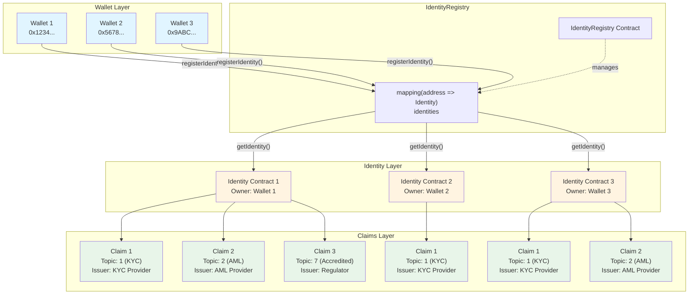

# 📚 Guía para Estudiantes - RWA Token Platform

## 🎯 Objetivos de Aprendizaje

Al estudiar este proyecto, aprenderás:

1. ✅ Implementar el estándar **ERC-3643** (T-REX) para tokens de seguridad
2. ✅ Aplicar el patrón **Clone Factory (EIP-1167)** para reducir costos de gas
3. ✅ Diseñar sistemas de **compliance modulares** y extensibles
4. ✅ Integrar **identity verification** on-chain
5. ✅ Implementar **access control** con roles
6. ✅ Escribir **tests comprehensivos** con Foundry
7. ✅ Crear **scripts de deployment** automatizados

---

## 📖 Índice de Contenidos

1. [Conceptos Fundamentales](#conceptos-fundamentales)
2. [Arquitectura del Sistema](#arquitectura-del-sistema)
3. [Contratos Principales](#contratos-principales)
4. [Patrones de Diseño](#patrones-de-diseño)
5. [Ejercicios Prácticos](#ejercicios-prácticos)
6. [Recursos Adicionales](#recursos-adicionales)

---

## 📘 Conceptos Fundamentales

### 1. ¿Qué es un RWA Token?

**RWA** = Real World Asset (Activo del Mundo Real)

Un RWA token es una representación digital de un activo físico en blockchain:
- 🏢 Bienes raíces (propiedades, terrenos)
- 🎨 Arte y coleccionables
- 💰 Commodities (oro, plata)
- 📄 Bonos y valores

**Diferencia con tokens normales:**
```
Token ERC-20 Normal:
  - Cualquiera puede transferir
  - Sin restricciones
  - Anónimo

RWA Token (ERC-3643):
  - Solo inversores verificados (KYC)
  - Reglas de compliance obligatorias
  - Identity on-chain
  - Regulado
```

### 2. ¿Qué es ERC-3643?

Estándar para **security tokens** (tokens de valores) que incluye:

```
┌─────────────────────────────────────┐
│         ERC-3643 Token              │
│                                     │
│  1. Identity Registry               │
│     └─ Solo inversores verificados  │
│                                     │
│  2. Compliance Modules              │
│     └─ Reglas de negocio            │
│                                     │
│  3. Claim Verification              │
│     └─ KYC, AML, etc.               │
│                                     │
│  4. Access Control                  │
│     └─ Roles y permisos             │
└─────────────────────────────────────┘
```

### 3. ¿Qué es Clone Factory (EIP-1167)?

Patrón para **reducir costos de gas** al crear múltiples contratos similares:

```
┌──────────────────────────────────────────────────┐
│  ANTES (Deployment Tradicional)                  │
│                                                  │
│  Token 1: Deploy completo → 3,700,000 gas       │
│  Token 2: Deploy completo → 3,700,000 gas       │
│  Token 3: Deploy completo → 3,700,000 gas       │
│  TOTAL: 11,100,000 gas                           │
└──────────────────────────────────────────────────┘

┌──────────────────────────────────────────────────┐
│  AHORA (Clone Factory)                           │
│                                                  │
│  Implementation: Deploy una vez → 5,700,000 gas  │
│  Token 1: Clone → 365,000 gas                    │
│  Token 2: Clone → 365,000 gas                    │
│  Token 3: Clone → 365,000 gas                    │
│  TOTAL: 6,795,000 gas                            │
│  AHORRO: 4,305,000 gas (39%)                     │
└──────────────────────────────────────────────────┘
```

**¿Cómo funciona?**

```
Implementation Contract (código completo)
       │
       ├──── Clone 1 (45 bytes de proxy)
       ├──── Clone 2 (45 bytes de proxy)
       └──── Clone 3 (45 bytes de proxy)

Cada clone usa delegatecall al implementation
```

### 4. ¿Qué es un Compliance Aggregator?

Contrato que **centraliza la gestión de compliance** para múltiples tokens:

```
ANTES:
Token 1 ──┬── MaxBalanceCompliance
          ├── MaxHoldersCompliance
          └── TransferLockCompliance
          
Token 2 ──┬── MaxBalanceCompliance
          ├── MaxHoldersCompliance
          └── TransferLockCompliance

= 6 contratos

AHORA:
Token 1 ──┐
Token 2 ──┼── ComplianceAggregator ──┬── MaxBalanceCompliance
Token 3 ──┘                          ├── MaxHoldersCompliance
                                     └── TransferLockCompliance

= 1 aggregator + módulos compartidos
```

---

## 🏗️ Arquitectura del Sistema

### Vista General

```
┌─────────────────────────────────────────────────────────────┐
│                    RWA TOKEN PLATFORM                       │
└─────────────────────────────────────────────────────────────┘
                           │
        ┌──────────────────┼──────────────────┐
        │                  │                  │
        ▼                  ▼                  ▼
   ┌─────────┐      ┌─────────┐       ┌─────────┐
   │ Tokens  │      │Identity │       │Compliance│
   └─────────┘      └─────────┘       └─────────┘
        │                │                  │
    ┌───┴───┐        ┌───┴───┐         ┌───┴───┐
    │       │        │       │         │       │
Token  TokenClone  Identity Identity  Modules Aggregator
.sol   Factory    .sol     Factory   (3 tipos)  .sol
```

### Flujo de una Transferencia

```
1. Usuario: token.transfer(to, amount)
   │
2. Token: _update(from, to, amount)
   │
3. Token: canTransfer(from, to, amount)?
   │
   ├──► ¿Usuario verificado? (IdentityRegistry)
   │    ├─ ¿Registrado? ✓
   │    ├─ ¿Tiene Identity? ✓
   │    └─ ¿Claims válidos? ✓
   │
   ├──► ¿Cuenta congelada? (frozen mapping)
   │
   └──► ¿Cumple compliance? (ComplianceModules)
        │
        └──► ComplianceAggregator
             │
             ├──► MaxBalanceCompliance.canTransfer() ✓
             ├──► MaxHoldersCompliance.canTransfer() ✓
             └──► TransferLockCompliance.canTransfer() ✓
                  │
                  └──► Si TODOS ✓ → Transfer permitido
```

---

## 📖 Contratos Principales

### Nivel 1: Contratos Básicos (Empieza aquí)

#### 1. Identity.sol (Identidad del Inversor)

**¿Qué hace?**
- Almacena **claims** (afirmaciones) sobre un inversor
- Ejemplo: "Este inversor pasó KYC"

**Conceptos clave:**
```solidity
// Estructura de un Claim
struct Claim {
    uint256 topic;      // Tipo de claim (1 = KYC, 2 = AML, etc.)
    uint256 scheme;     // Esquema de firma (1 = ECDSA)
    address issuer;     // Quién emitió el claim
    bytes signature;    // Firma digital
    bytes data;         // Datos del claim
    string uri;         // URI con info adicional
}

// Ejemplo de uso
identity.addClaim(
    1,              // topic: KYC
    1,              // scheme: ECDSA
    trustedIssuer,  // issuer
    signature,      // firma
    data,           // datos
    "https://..."   // uri
);
```

**Ejercicio:**
1. Lee el código de `Identity.sol`
2. Identifica las funciones principales
3. Ejecuta los tests: `forge test --match-contract IdentityCloneFactoryTest`
4. Pregúntate: ¿Por qué usamos mapping de mapping?

#### 2. IdentityRegistry.sol (Registro de Identidades)

**¿Qué hace?**
- Asocia una **dirección de wallet** con su **contrato Identity**
- Verifica que un inversor esté registrado

**Conceptos clave:**
```solidity
// Mapping: wallet address => Identity contract address
mapping(address => address) private identities;

// Registrar identidad
function registerIdentity(address wallet, address identity) external

// Verificar si está registrado
function isRegistered(address wallet) external view returns (bool)

// Obtener identity de un wallet
function getIdentity(address wallet) external view returns (address)
```

**Ejercicio:**
1. ¿Por qué separar el Identity del wallet?
**Respuesta:**
Separar el `Identity` del `wallet` es una decisión arquitectónica clave que proporciona múltiples beneficios:
**a) Separación de Responsabilidades:**
- **Wallet**: Representa la dirección Ethereum que posee tokens y realiza transacciones
- **Identity**: Representa la identidad verificable del usuario (KYC, AML, claims, etc.)
- Permite que un wallet pueda tener múltiples identidades o que una identidad pueda ser transferida/actualizada sin afectar el wallet
**b) Verificación de Propiedad:**
- El `Identity` contract tiene un `owner` que debe ser el wallet
- Esto permite verificar que el wallet realmente controla su identidad
- Previene que alguien registre una identidad falsa para otro wallet
**c) Flexibilidad y Actualización:**
- Si un wallet pierde acceso (clave privada comprometida), se puede crear un nuevo `Identity` sin cambiar el wallet
- Los claims pueden ser actualizados en el `Identity` sin afectar el wallet directamente
- Permite migrar identidades entre wallets si es necesario
**d) Modularidad:**
- El `Identity` contract puede ser reutilizado en múltiples tokens/proyectos
- Un mismo `Identity` puede servir para varios tokens RWA diferentes
- Facilita la auditoría y mantenimiento del código
**e) Seguridad:**
- Si el `IdentityRegistry` es comprometido, los `Identity` contracts individuales no se ven afectados
- Los claims están almacenados en contratos separados, aislados del registro principal
- Permite revocar identidades sin afectar el historial de transacciones del wallet
**f) Eficiencia de Gas:**
- Los claims se almacenan en contratos separados, no en el `IdentityRegistry`
- Solo se consulta el `Identity` cuando es necesario verificar claims
- Reduce el costo de almacenamiento en el registry principal
**Ejemplo Práctico:**

```solidity
// ❌ MAL: Almacenar claims directamente en el wallet
mapping(address => Claim[]) public walletClaims; // Ineficiente y acoplado

// ✅ BIEN: Separar Identity del wallet
IdentityRegistry registry;
mapping(address => Identity) private identities; // Flexible y modular

// Wallet → IdentityRegistry → Identity Contract → Claims
```

**Analogía del Mundo Real:**
- **Wallet** = Número de cuenta bancaria
- **Identity** = Documento de identidad (DNI, pasaporte)
- **Claims** = Sellos/verificaciones en el documento (visa, certificaciones)

Tu cuenta bancaria (wallet) puede existir sin documento, pero para operaciones reguladas necesitas el documento (Identity) con sus verificaciones (Claims).


2. ¿Qué pasa si un wallet no tiene Identity?
**Respuesta:**
Si un wallet **no tiene Identity** o **no está completamente verificado**, el sistema lo **rechaza automáticamente** en todas las operaciones que requieren verificación. Esto es fundamental para cumplir con regulaciones (KYC/AML) y mantener la seguridad del token.
**Escenarios de Rechazo:**
**a) Intentar Mintear Tokens a un Wallet sin Identity:**
```solidity
// ❌ FALLA: Wallet sin Identity
token.mint(unverifiedWallet, 1000);
// Revert: "Recipient not verified"
```

**b) Intentar Transferir Tokens desde un Wallet sin Identity:**
```solidity
// ❌ FALLA: Remitente sin Identity
vm.prank(unverifiedWallet);
token.transfer(verifiedWallet, 500);
// Revert: "Sender not verified"
```

**c) Intentar Recibir Tokens en un Wallet sin Identity:**
```solidity
// ❌ FALLA: Destinatario sin Identity
vm.prank(verifiedWallet);
token.transfer(unverifiedWallet, 500);
// Revert: "Recipient not verified"
```

**d) Verificación con `canTransfer()`:**
```solidity
// Retorna false si alguno de los wallets no está verificado
bool canTransfer = token.canTransfer(unverifiedWallet, verifiedWallet, 100);
// Resultado: false
```

**Flujo de Verificación en el Código:**

```solidity
function isVerified(address account) public view returns (bool) {
    // 1. ¿IdentityRegistry está configurado?
    if (address(identityRegistry) == address(0)) {
        return false; // ❌ No configurado
    }
    
    // 2. ¿Está registrado en IdentityRegistry?
    if (!identityRegistry.isRegistered(account)) {
        return false; // ❌ No registrado
    }
    
    // 3. ¿Tiene un Identity contract válido?
    address identityAddress = identityRegistry.getIdentity(account);
    if (identityAddress == address(0)) {
        return false; // ❌ Sin Identity contract
    }
    
    // 4. ¿Tiene todos los claim topics requeridos?
    uint256[] memory requiredTopics = claimTopicsRegistry.getClaimTopics();
    // ... verifica cada topic requerido ...
    
    // Si falta algún topic requerido → return false ❌
    // Si todos los topics están presentes → return true ✅
}
```

**Casos Específicos:**

| Situación                                              | Resultado    | Mensaje de Error                                     |
|--------------------------------------------------------|--------------|------------------------------------------------------|
| Wallet no registrado en IdentityRegistry               | ❌ Rechazado | `"Sender not verified"` o `"Recipient not verified"` |
| Wallet registrado pero sin Identity contract           | ❌ Rechazado | `"Sender not verified"` o `"Recipient not verified"` |
| Wallet con Identity pero sin claims requeridos         | ❌ Rechazado | `"Sender not verified"` o `"Recipient not verified"` |
| Wallet con Identity pero claims de issuer no confiable | ❌ Rechazado | `"Sender not verified"` o `"Recipient not verified"` |
| Wallet completamente verificado                        | ✅ Permitido | Operación exitosa                                    |

**Ejemplo Práctico:**

```solidity
// Escenario: Alice quiere transferir tokens a Bob

// ❌ CASO 1: Bob no tiene Identity
assertEq(identityRegistry.isRegistered(bob), false);
vm.prank(alice);
vm.expectRevert("Recipient not verified");
token.transfer(bob, 100);
// Resultado: Transferencia rechazada

// ❌ CASO 2: Alice no tiene Identity
assertEq(identityRegistry.isRegistered(alice), false);
token.mint(alice, 1000); // Falla: "Recipient not verified"
// Resultado: No puede recibir tokens

// ✅ CASO 3: Ambos verificados
setupVerifiedUser(alice);  // Registra Identity + Claims
setupVerifiedUser(bob);    // Registra Identity + Claims
token.mint(alice, 1000);
vm.prank(alice);
token.transfer(bob, 100);  // ✅ Éxito
// Resultado: Transferencia exitosa
```

**¿Por qué es tan estricto?**

1. **Cumplimiento Regulatorio**: Los security tokens (RWA) requieren KYC/AML obligatorio
2. **Prevención de Fraude**: Evita que wallets no verificados participen en el sistema
3. **Trazabilidad**: Solo usuarios verificados pueden recibir/transferir tokens
4. **Seguridad**: Protege a los inversores legítimos

**Excepciones (Funciones que BYPASSAN la verificación):**

Solo las funciones administrativas pueden bypassar la verificación:

```solidity
// ✅ forcedTransfer() - Solo AGENT_ROLE
// Bypasea pause, freeze, identity, y compliance
token.forcedTransfer(unverifiedWallet, verifiedWallet, 100);
// Funciona porque es una transferencia administrativa
```

**Resumen:**

Un wallet sin Identity es **completamente bloqueado** del sistema:
- ❌ No puede recibir tokens (mint falla)
- ❌ No puede enviar tokens (transfer falla)
- ❌ No puede recibir transferencias (transfer falla)
- ✅ Solo puede ser desbloqueado registrando su Identity y obteniendo los claims requeridos


3. Dibuja un diagrama de cómo se relacionan Wallet → Identity → Claims


**Estructura de Datos:**

```
Wallet (0x1234...)
    │
    ├─→ IdentityRegistry
    │      └─→ mapping[0x1234...] = Identity Contract Address
    │
    └─→ Identity Contract
           │
           ├─→ Owner: 0x1234... (el wallet)
           │
           └─→ Claims (mapping[topic][issuer])
                  │
                  ├─→ Claim 1: topic=1, issuer=KYC_Provider
                  │     ├─ topic: 1 (KYC)
                  │     ├─ scheme: 1 (ECDSA)
                  │     ├─ issuer: 0xKYC...
                  │     ├─ signature: 0x...
                  │     ├─ data: 0x...
                  │     └─ uri: "https://..."
                  │
                  ├─→ Claim 2: topic=2, issuer=AML_Provider
                  │     └─ ... (misma estructura)
                  │
                  └─→ Claim 3: topic=7, issuer=Regulator
                        └─ ... (misma estructura)
```

**Flujo de Verificación:**

1. **Wallet** → Se registra en `IdentityRegistry`
2. **IdentityRegistry** → Mapea `wallet address` → `Identity contract address`
3. **Identity Contract** → Almacena múltiples `Claims` en formato `mapping[topic][issuer]`
4. **Claim** → Contiene: topic, issuer, signature, data, uri

**Ejemplo Práctico:**

```solidity
// 1. Crear Identity para Wallet 1
Identity identity1 = new Identity(wallet1);

// 2. Registrar en IdentityRegistry
identityRegistry.registerIdentity(wallet1, address(identity1));

// 3. Agregar Claims al Identity
identity1.addClaim(
    1,                    // topic: KYC
    1,                    // scheme: ECDSA
    kycProvider,          // issuer
    signature,            // firma
    data,                 // datos
    "https://kyc.com/..." // uri
);

identity1.addClaim(
    2,                    // topic: AML
    1,                    // scheme: ECDSA
    amlProvider,          // issuer
    signature,            // firma
    data,                 // datos
    "https://aml.com/..." // uri
);

// 4. Verificar claim
bool hasKYC = identity1.claimExists(1, kycProvider); // true
```


#### 3. TrustedIssuersRegistry.sol (Emisores Confiables)

**¿Qué hace?**
- Mantiene lista de **emisores autorizados** a emitir claims
- Define qué **tipos de claims** puede emitir cada emisor

**Conceptos clave:**
```solidity
// Añadir emisor confiable
function addTrustedIssuer(
    address issuer,
    uint256[] memory claimTopics  // Tipos de claims que puede emitir
) external

// Verificar si un issuer puede emitir un claim topic
function hasClaimTopic(address issuer, uint256 claimTopic) 
    external view returns (bool)
```

**Ejercicio:**
1. ¿Por qué necesitamos "trusted" issuers?
**Respuesta:**
Los **"trusted issuers"** (emisores confiables) son fundamentales para la seguridad y validez del sistema de identidad. Sin ellos, el sistema sería completamente vulnerable a fraudes y claims falsos.
**Razones Principales:**
**a) Prevención de Fraude y Claims Falsos:**
```solidity
// ❌ SIN TrustedIssuersRegistry: Cualquiera puede emitir claims
// Un atacante podría crear su propio "KYC claim" y obtener acceso
attacker.addClaim(1, 1, attackerAddress, fakeSignature, fakeData, "");
// Resultado: Acceso no autorizado al token

// ✅ CON TrustedIssuersRegistry: Solo emisores autorizados
// El sistema verifica que el issuer esté en la lista de confiables
if (!trustedIssuersRegistry.hasClaimTopic(issuer, topic)) {
    return false; // Rechazado
}
```
**b) Control de Autoridad y Especialización:**
- **KYC Provider**: Solo puede emitir claims de KYC (topic 1)
- **AML Provider**: Solo puede emitir claims de AML (topic 2)
- **Regulator**: Solo puede emitir claims de acreditación (topic 7)
- Cada issuer tiene permisos específicos para ciertos tipos de claims
**c) Verificación en el Código:**
El sistema verifica explícitamente que los claims provengan de emisores confiables:
```solidity
function isVerified(address account) public view returns (bool) {
    // ... obtener topics requeridos ...
    
    for (uint256 i = 0; i < requiredTopics.length; i++) {
        bool hasValidClaim = false;
        
        // Obtener todos los issuers confiables
        address[] memory trustedIssuers = trustedIssuersRegistry.getTrustedIssuers();
        
        for (uint256 j = 0; j < trustedIssuers.length; j++) {
            // ✅ VERIFICACIÓN CRÍTICA: ¿El issuer puede emitir este topic?
            if (trustedIssuersRegistry.hasClaimTopic(trustedIssuers[j], requiredTopics[i])) {
                // ✅ VERIFICACIÓN: ¿El claim existe de este issuer confiable?
                if (identity.claimExists(requiredTopics[i], trustedIssuers[j])) {
                    hasValidClaim = true;
                    break;
                }
            }
        }
        
        // Si no se encontró un claim de un issuer confiable → FALLA
        if (!hasValidClaim) {
            return false;
        }
    }
    
    return true;
}
```
**d) Cumplimiento Regulatorio:**
- Los security tokens (RWA) requieren verificaciones de terceros autorizados
- Los reguladores exigen que las verificaciones provengan de entidades certificadas
- Sin trusted issuers, el token no cumpliría con regulaciones financieras
**e) Auditoría y Trazabilidad:**
- Permite rastrear quién emitió cada claim
- Facilita auditorías regulatorias
- Permite revocar emisores comprometidos sin afectar otros
**f) Separación de Responsabilidades:**
- Un issuer comprometido solo afecta sus propios claims
- Se pueden tener múltiples issuers para el mismo topic (redundancia)
- Permite cambiar issuers sin afectar claims existentes
**Ejemplo Práctico:**
```solidity
// Configuración de Trusted Issuers
TrustedIssuersRegistry registry;
// Agregar KYC Provider (solo puede emitir KYC claims)
registry.addTrustedIssuer(kycProvider, [1]); // topic 1 = KYC
// Agregar AML Provider (solo puede emitir AML claims)
registry.addTrustedIssuer(amlProvider, [2]); // topic 2 = AML
// Agregar Regulator (puede emitir múltiples tipos)
registry.addTrustedIssuer(regulator, [1, 2, 7]); // KYC, AML, Accredited
// Verificación
assertTrue(registry.hasClaimTopic(kycProvider, 1));  // ✅ true
assertFalse(registry.hasClaimTopic(kycProvider, 2)); // ❌ false (no puede emitir AML)
assertTrue(registry.hasClaimTopic(regulator, 1));   // ✅ true
```
**Tabla de Comparación:**

| Aspecto          | Sin Trusted Issuers               | Con Trusted Issuers           |
|------------------|-----------------------------------|-------------------------------|
| **Seguridad**    | ❌ Cualquiera puede emitir claims | ✅ Solo emisores autorizados  |
| **Fraude**       | ❌ Vulnerable a claims falsos     | ✅ Protegido contra fraudes   |  
| **Cumplimiento** | ❌ No cumple regulaciones         | ✅ Cumple con regulaciones    |
| **Auditoría**    | ❌ No rastreable                  | ✅ Completamente rastreable   |
| **Control**      | ❌ Sin control de autoridad       | ✅ Control granular por topic |

**Resumen:**

Los trusted issuers son la **base de la seguridad** del sistema. Sin ellos:
- ❌ Cualquiera podría emitir claims falsos
- ❌ No habría verificación de autoridad
- ❌ El token no cumpliría con regulaciones
- ❌ No habría forma de rastrear o revocar emisores

Con trusted issuers:
- ✅ Solo entidades autorizadas pueden emitir claims
- ✅ Cada issuer tiene permisos específicos
- ✅ El sistema cumple con regulaciones
- ✅ Completamente auditable y controlable

---

2. ¿Qué pasa si cualquiera pudiera emitir claims?
**Respuesta:*
Si **cualquiera pudiera emitir claims**, el sistema sería completamente inseguro y vulnerable a múltiples ataques:
**Escenarios de Ataque:**
**a) Auto-Verificación Fraudulenta:**
```solidity
// ❌ Atacante se auto-emite un claim de KYC
attacker.addClaim(
    1,                    // topic: KYC
    1,                    // scheme: ECDSA
    attacker,             // issuer: Él mismo
    fakeSignature,        // firma falsa
    fakeData,             // datos falsos
    "fake-kyc.com"
);
// Resultado: Atacante puede recibir/transferir tokens sin verificación real
token.mint(attacker, 1000000); // ✅ Funciona (pero no debería)
```
**b) Creación Masiva de Wallets Falsos:**
```solidity
// Atacante crea múltiples wallets y se auto-emite claims
for (uint i = 0; i < 1000; i++) {
    address fakeWallet = generateWallet(i);
    Identity fakeIdentity = new Identity(fakeWallet);
    fakeIdentity.addClaim(1, 1, attacker, ...); // Auto-emitido
    // Ahora tiene 1000 wallets "verificados" falsamente
    token.mint(fakeWallet, 10000);
}
```
**c) Bypass de Regulaciones:**
- Usuarios no verificados podrían acceder al token
- No habría cumplimiento KYC/AML real
- El token perdería su estatus de "security token"
- Podría enfrentar sanciones regulatorias
**d) Pérdida de Confianza:**
- Inversores legítimos perderían confianza
- El valor del token se depreciaría
- El proyecto podría ser cerrado por reguladores
**Consecuencias Legales y Regulatorias:**
| Consecuencia                  | Impacto                                    |
|-------------------------------|--------------------------------------------|
| **Violación de Regulaciones** | Sanciones financieras, cierre del proyecto |
| **Pérdida de Licencia**       | No puede operar como security token        |
| **Demandas Legales**          | Responsabilidad por fraudes                |
| **Pérdida de Reputación**     | Imposible recuperar confianza              |

**Protección con Trusted Issuers:**

```solidity
// ✅ CON Trusted Issuers: El ataque falla
attacker.addClaim(1, 1, attacker, ...); // Claim agregado al Identity

// Pero cuando el Token verifica:
function isVerified(address account) {
    // Busca SOLO en trusted issuers
    address[] memory trustedIssuers = trustedIssuersRegistry.getTrustedIssuers();
    // attacker NO está en la lista → hasValidClaim = false
    // Resultado: ❌ Rechazado
}
```
**Resumen:**
Sin trusted issuers, el sistema sería:
- ❌ **Completamente inseguro**
- ❌ **Vulnerable a fraudes masivos**
- ❌ **No cumpliría con regulaciones**
- ❌ **Ilegal para security tokens**
Por eso, los trusted issuers son **obligatorios** y **críticos** para la seguridad del sistema.
---
3. Diseña un sistema con 3 issuers: KYC provider, AML provider, Accreditation provider
**Diseño del Sistema:**
```solidity
// ============ CONFIGURACIÓN INICIAL ============
TrustedIssuersRegistry trustedRegistry;
ClaimTopicsRegistry topicsRegistry;
// ============ ISSUER 1: KYC Provider ============
address kycProvider = 0x1111...; // Empresa certificada de KYC
uint256[] memory kycTopics = new uint256[](1);
kycTopics[0] = 1; // Topic 1 = KYC
trustedRegistry.addTrustedIssuer(kycProvider, kycTopics);
// Verificación
assertTrue(trustedRegistry.hasClaimTopic(kycProvider, 1));  // ✅ KYC
assertFalse(trustedRegistry.hasClaimTopic(kycProvider, 2));    // ❌ No AML
assertFalse(trustedRegistry.hasClaimTopic(kycProvider, 7));   // ❌ No Accredited
// ============ ISSUER 2: AML Provider ============
address amlProvider = 0x2222...; // Empresa certificada de AML
uint256[] memory amlTopics = new uint256[](1);
amlTopics[0] = 2; // Topic 2 = AML
trustedRegistry.addTrustedIssuer(amlProvider, amlTopics);
// Verificación
assertFalse(trustedRegistry.hasClaimTopic(amlProvider, 1));   // ❌ No KYC
assertTrue(trustedRegistry.hasClaimTopic(amlProvider, 2));   // ✅ AML
assertFalse(trustedRegistry.hasClaimTopic(amlProvider, 7));  // ❌ No Accredited
// ============ ISSUER 3: Accreditation Provider ============
address accreditationProvider = 0x3333...; // Regulador o entidad certificadora
uint256[] memory accreditTopics = new uint256[](1);
accreditTopics[0] = 7; // Topic 7 = Accredited Investor
trustedRegistry.addTrustedIssuer(accreditationProvider, accreditTopics);
// Verificación
assertFalse(trustedRegistry.hasClaimTopic(accreditationProvider, 1)); // ❌ No KYC
assertFalse(trustedRegistry.hasClaimTopic(accreditationProvider, 2)); // ❌ No AML
assertTrue(trustedRegistry.hasClaimTopic(accreditationProvider, 7));   // ✅ Accredited
// ============ CONFIGURAR TOPICS REQUERIDOS ============
// El token requiere: KYC + AML + Accredited
topicsRegistry.addClaimTopic(1); // KYC requerido
topicsRegistry.addClaimTopic(2); // AML requerido
topicsRegistry.addClaimTopic(7); // Accredited requerido
// ============ FLUJO DE VERIFICACIÓN ============
// Para que un usuario esté verificado, necesita:
// 1. Claim de KYC del kycProvider (topic 1)
// 2. Claim de AML del amlProvider (topic 2)
// 3. Claim de Accredited del accreditationProvider (topic 7)
// Ejemplo: Verificar usuario
Identity userIdentity = new Identity(user);
identityRegistry.registerIdentity(user, address(userIdentity));
// Agregar claims de cada provider
userIdentity.addClaim(1, 1, kycProvider, kycSignature, kycData, "kyc-uri");
userIdentity.addClaim(2, 1, amlProvider, amlSignature, amlData, "aml-uri");
userIdentity.addClaim(7, 1, accreditationProvider, accSignature, accData, "acc-uri");
// Ahora el usuario está completamente verificado
assertTrue(token.isVerified(user)); // ✅ true
```
**Diagrama del Sistema:**
```
┌─────────────────────────────────────────────────────────┐
│           TrustedIssuersRegistry                        │
├─────────────────────────────────────────────────────────┤
│                                                         │
│  KYC Provider (0x1111...)                               │
│    └─→ Topics: [1] (KYC)                                │
│                                                         │
│  AML Provider (0x2222...)                               │
│    └─→ Topics: [2] (AML)                                │
│                                                         │
│  Accreditation Provider (0x3333...)                     │
│    └─→ Topics: [7] (Accredited Investor)                │
│                                                         │
└─────────────────────────────────────────────────────────┘

┌─────────────────────────────────────────────────────────┐
│           ClaimTopicsRegistry                           │
├─────────────────────────────────────────────────────────┤
│  Required Topics: [1, 2, 7]                             │
│  (KYC + AML + Accredited)                               │
└─────────────────────────────────────────────────────────┘

┌─────────────────────────────────────────────────────────┐
│           User Identity                                 │
├─────────────────────────────────────────────────────────┤
│  Claims:                                                │
│    • Topic 1 (KYC)      → Issuer: KYC Provider          │
│    • Topic 2 (AML)     → Issuer: AML Provider           │
│    • Topic 7 (Accred)  → Issuer: Accreditation Provider │
│                                                         │
│  Resultado: ✅ VERIFICADO                               │
└─────────────────────────────────────────────────────────┘
```
**Ventajas de este Diseño:**
1. **Separación de Responsabilidades**: Cada issuer se especializa en un tipo de verificación
2. **Redundancia**: Si un issuer falla, se puede agregar otro para el mismo topic
3. **Auditoría Clara**: Fácil rastrear qué issuer emitió cada claim
4. **Flexibilidad**: Se pueden agregar más issuers o topics según necesidades
5. **Cumplimiento**: Cada verificación proviene de una entidad certificada


#### 4. ClaimTopicsRegistry.sol (Topics Requeridos)

**¿Qué hace?**
- Define qué **claims son obligatorios** para invertir en un token
**Conceptos clave:**
```solidity
// Topics requeridos
uint256[] private claimTopics;
// Añadir topic requerido
function addClaimTopic(uint256 claimTopic) external
// Ejemplo: Requiere KYC (topic 1) y Accreditation (topic 7)
registry.addClaimTopic(1);  // KYC
registry.addClaimTopic(7);  // Accredited Investor
```
**Ejercicio:**
1. ¿Por qué algunos tokens requieren más claims que otros?
**Respuesta:**
Diferentes tokens requieren diferentes niveles de verificación según múltiples factores. El `ClaimTopicsRegistry` permite personalizar los requisitos de cada token según sus necesidades específicas.
**Factores que Determinan los Claims Requeridos:**
**a) Tipo de Activo (RWA):**
```solidity
// Token de Startup (alto riesgo)
// Requiere: KYC + AML + Accredited Investor
topicsRegistry.addClaimTopic(1); // KYC
topicsRegistry.addClaimTopic(2); // AML
topicsRegistry.addClaimTopic(7); // Accredited Investor
// Token de Real Estate (riesgo medio)
// Requiere: KYC + AML + Geographic Restriction
topicsRegistry.addClaimTopic(1); // KYC
topicsRegistry.addClaimTopic(2); // AML
topicsRegistry.addClaimTopic(5); // Geographic Compliance
// Token de Commodity (riesgo bajo)
// Requiere: Solo KYC básico
topicsRegistry.addClaimTopic(1); // KYC
```
**b) Regulaciones por Jurisdicción:**
- **EE.UU. (SEC)**: Requiere Accredited Investor para ciertos tokens
- **Europa (MiCA)**: Requiere KYC + AML obligatorio
- **Asia**: Puede requerir verificaciones adicionales de residencia
- **Países en desarrollo**: Pueden tener requisitos más flexibles
**c) Nivel de Riesgo del Inversor:**
```solidity
// Token de bajo riesgo (ej: bonos gubernamentales tokenizados)
// Requiere: Mínimo KYC
topicsRegistry.addClaimTopic(1); // KYC
// Token de alto riesgo (ej: equity de startup)
// Requiere: Múltiples verificaciones
topicsRegistry.addClaimTopic(1); // KYC
topicsRegistry.addClaimTopic(2); // AML
topicsRegistry.addClaimTopic(7); // Accredited Investor
topicsRegistry.addClaimTopic(8); // Risk Assessment
```
**d) Monto de Inversión:**
- **Inversiones pequeñas (< $10k)**: Pueden requerir solo KYC
- **Inversiones medianas ($10k - $100k)**: KYC + AML
- **Inversiones grandes (> $100k)**: KYC + AML + Accredited + Source of Funds
**e) Naturaleza del Token:**
- **Security Token**: Requiere más claims (regulado como valor)
- **Utility Token**: Puede requerir menos claims
- **Stablecoin respaldado**: Requiere verificaciones de reservas
**Ejemplo Comparativo:**
| Tipo de Token       | Claims Requeridos                        | Razón                                              |
|---------------------|------------------------------------------|----------------------------------------------------|
| **Startup Equity**  | KYC + AML + Accredited + Risk Assessment | Alto riesgo, regulación estricta                   |
| **Real Estate**     | KYC + AML + Geographic + Accredited      | Regulación inmobiliaria, restricciones geográficas |
| **Commodity (Oro)** | KYC + AML                                | Riesgo medio, regulación de commodities            |
| **Bond Tokenizado** | KYC                                      | Riesgo bajo, instrumento de deuda                  |
| **Stablecoin**      | KYC + AML + Reserve Verification         | Regulación de pagos, verificación de reservas      |
**Código de Configuración:**
```solidity
// Token A: Startup (alto riesgo)
ClaimTopicsRegistry startupRegistry;
startupRegistry.addClaimTopic(1); // KYC
startupRegistry.addClaimTopic(2); // AML
startupRegistry.addClaimTopic(7); // Accredited Investor
startupRegistry.addClaimTopic(8); // Risk Assessment
// Total: 4 claims requeridos
// Token B: Real Estate (riesgo medio)
ClaimTopicsRegistry realEstateRegistry;
realEstateRegistry.addClaimTopic(1); // KYC
realEstateRegistry.addClaimTopic(2); // AML
realEstateRegistry.addClaimTopic(5); // Geographic Compliance
// Total: 3 claims requeridos
// Token C: Commodity (riesgo bajo)
ClaimTopicsRegistry commodityRegistry;
commodityRegistry.addClaimTopic(1); // KYC
// Total: 1 claim requerido
```
**Ventajas de la Flexibilidad:**
1. **Cumplimiento Específico**: Cada token cumple con sus regulaciones específicas
2. **Optimización de Costos**: Tokens de bajo riesgo no requieren verificaciones costosas innecesarias
3. **Escalabilidad**: Se pueden agregar claims según evolucionan las regulaciones
4. **Competitividad**: Tokens pueden competir ofreciendo diferentes niveles de acceso
**Resumen:**
Los tokens requieren diferentes cantidades de claims porque:
- ✅ **Diferentes activos** tienen diferentes niveles de riesgo
- ✅ **Diferentes jurisdicciones** tienen diferentes regulaciones
- ✅ **Diferentes inversores** requieren diferentes verificaciones
- ✅ **Diferentes montos** requieren diferentes niveles de compliance

El `ClaimTopicsRegistry` permite **personalizar** los requisitos de cada token según sus necesidades específicas, optimizando entre seguridad, cumplimiento y accesibilidad.
---

2. Diseña los claim topics para: a) Token de startup, b) Token de real estate, c) Token de commodity
**Diseño de Claim Topics por Tipo de Token:**
**a) Token de Startup (Equity Token)**
**Contexto:**
- Alto riesgo de inversión
- Regulado como security token (SEC en EE.UU.)
- Requiere inversores acreditados
- Necesita verificación de capacidad de pérdida
**Claim Topics Requeridos:**
```solidity
ClaimTopicsRegistry startupRegistry;
// 1. KYC (Know Your Customer) - Obligatorio
startupRegistry.addClaimTopic(1);
// Verifica: Identidad, residencia, documentos
// 2. AML (Anti-Money Laundering) - Obligatorio
startupRegistry.addClaimTopic(2);
// Verifica: No está en listas de sanciones, origen de fondos
// 3. Accredited Investor - Requerido por SEC
startupRegistry.addClaimTopic(7);
// Verifica: Ingresos > $200k/año o patrimonio > $1M
// 4. Risk Assessment - Evaluación de riesgo
startupRegistry.addClaimTopic(8);
// Verifica: Entiende los riesgos, capacidad de pérdida
// 5. Source of Funds - Origen de fondos (opcional para montos grandes)
startupRegistry.addClaimTopic(9);
// Verifica: Origen legítimo de los fondos de inversión
// Total: 5 claims requeridos
```
**Configuración de Trusted Issuers:**
```solidity
TrustedIssuersRegistry trustedRegistry;
// KYC Provider
trustedRegistry.addTrustedIssuer(kycProvider, [1]); // Solo KYC
// AML Provider
trustedRegistry.addTrustedIssuer(amlProvider, [2]); // Solo AML
// SEC o Regulador
trustedRegistry.addTrustedIssuer(secRegulator, [7, 8]); // Accredited + Risk
// Financial Institution
trustedRegistry.addTrustedIssuer(bank, [9]); // Source of Funds
```
**b) Token de Real Estate (Propiedad Inmobiliaria)**
**Contexto:**
- Riesgo medio
- Regulación inmobiliaria específica
- Restricciones geográficas (algunos países limitan propiedad extranjera)
- Requiere verificación de capacidad de pago
**Claim Topics Requeridos:**
```solidity
ClaimTopicsRegistry realEstateRegistry;
// 1. KYC (Know Your Customer) - Obligatorio
realEstateRegistry.addClaimTopic(1);
// Verifica: Identidad, residencia
// 2. AML (Anti-Money Laundering) - Obligatorio
realEstateRegistry.addClaimTopic(2);
// Verifica: No está en listas de sanciones
// 3. Geographic Compliance - Restricciones geográficas
realEstateRegistry.addClaimTopic(5);
// Verifica: Puede poseer propiedad en la jurisdicción
// 4. Accredited Investor - Para inversiones grandes
realEstateRegistry.addClaimTopic(7);
// Verifica: Capacidad financiera para inversión inmobiliaria
// Total: 4 claims requeridos
```
**Configuración de Trusted Issuers:**
```solidity
TrustedIssuersRegistry trustedRegistry;
// KYC Provider
trustedRegistry.addTrustedIssuer(kycProvider, [1]);
// AML Provider
trustedRegistry.addTrustedIssuer(amlProvider, [2]);
// Government/Regulator (verifica restricciones geográficas)
trustedRegistry.addTrustedIssuer(government, [5]);
// Financial Institution (verifica capacidad financiera)
trustedRegistry.addTrustedIssuer(bank, [7]);
```
**c) Token de Commodity (Oro, Plata, Petróleo)**
**Contexto:**
- Riesgo relativamente bajo
- Regulación de commodities
- Menos restricciones que securities
- Puede requerir verificación de almacenamiento
**Claim Topics Requeridos:**
```solidity
ClaimTopicsRegistry commodityRegistry;
// 1. KYC (Know Your Customer) - Obligatorio
commodityRegistry.addClaimTopic(1);
// Verifica: Identidad básica
// 2. AML (Anti-Money Laundering) - Obligatorio para montos grandes
commodityRegistry.addClaimTopic(2);
// Verifica: No está en listas de sanciones
// Total: 2 claims requeridos (mínimo)
// Opcional para montos grandes:
// commodityRegistry.addClaimTopic(7); // Accredited Investor
```
**Configuración de Trusted Issuers:**
```solidity
TrustedIssuersRegistry trustedRegistry;
// KYC Provider
trustedRegistry.addTrustedIssuer(kycProvider, [1]);
// AML Provider
trustedRegistry.addTrustedIssuer(amlProvider, [2]);
// Opcional: Commodity Exchange (para verificación de almacenamiento)
trustedRegistry.addTrustedIssuer(commodityExchange, [10]); // Storage Verification
```
**Comparación Visual:**
```
┌─────────────────────────────────────────────────────────┐
│           TOKEN DE STARTUP (Alto Riesgo)                │
├─────────────────────────────────────────────────────────┤
│  Required Claims:                                       │
│    ✅ KYC (1)                                           │
│    ✅ AML (2)                                           │
│    ✅ Accredited Investor (7)                           │
│    ✅ Risk Assessment (8)                               │
│    ✅ Source of Funds (9)                               │
│                                                         │
│  Total: 5 claims                                        │
│  Razón: Regulación estricta de securities               │
└─────────────────────────────────────────────────────────┘
┌─────────────────────────────────────────────────────────┐
│        TOKEN DE REAL ESTATE (Riesgo Medio)              │
├─────────────────────────────────────────────────────────┤
│  Required Claims:                                       │
│    ✅ KYC (1)                                           │
│    ✅ AML (2)                                           │
│    ✅ Geographic Compliance (5)                         │
│    ✅ Accredited Investor (7)                           │
│                                                         │
│  Total: 4 claims                                        │
│  Razón: Regulación inmobiliaria + restricciones         │
└─────────────────────────────────────────────────────────┘
┌─────────────────────────────────────────────────────────┐
│         TOKEN DE COMMODITY (Riesgo Bajo)                │
├─────────────────────────────────────────────────────────┤
│  Required Claims:                                       │
│    ✅ KYC (1)                                           │
│    ✅ AML (2)                                           │
│                                                         │
│  Total: 2 claims                                        │
│  Razón: Regulación menos estricta de commodities        │
└─────────────────────────────────────────────────────────┘
```
**Tabla de Claim Topics Estándar:**
| Topic ID | Nombre               | Descripción                    | Uso Común                         |
|----------|----------------------|--------------------------------|-----------------------------------|
| 1        | KYC                  | Know Your Customer             | Todos los tokens                  |
| 2        | AML                  | Anti-Money Laundering          | Tokens regulados                  |
| 3        | PEP                  | Politically Exposed Person     | Verificación de PEP               |
| 4        | Sanctions            | Lista de sanciones             | Verificación de sanciones         |
| 5        | Geographic           | Restricciones geográficas      | Real Estate, algunos securities   |
| 6        | Tax Compliance       | Cumplimiento fiscal            | Tokens con implicaciones fiscales |
| 7        | Accredited           | Accredited Investor            | Securities, inversiones grandes   |
| 8        | Risk Assessment      | Evaluación de riesgo           | Tokens de alto riesgo             |
| 9        | Source of Funds      | Origen de fondos               | Inversiones grandes               |
| 10       | Storage Verification | Verificación de almacenamiento | Commodities físicos               |

**Ejemplo de Implementación Completa:**

```solidity
// ============ TOKEN DE STARTUP ============
function setupStartupToken() external {
    // Configurar Claim Topics
    startupTopicsRegistry.addClaimTopic(1); // KYC
    startupTopicsRegistry.addClaimTopic(2); // AML
    startupTopicsRegistry.addClaimTopic(7); // Accredited
    startupTopicsRegistry.addClaimTopic(8); // Risk Assessment
    startupTopicsRegistry.addClaimTopic(9); // Source of Funds
    
    // Configurar Trusted Issuers
    trustedRegistry.addTrustedIssuer(kycProvider, [1]);
    trustedRegistry.addTrustedIssuer(amlProvider, [2]);
    trustedRegistry.addTrustedIssuer(secRegulator, [7, 8]);
    trustedRegistry.addTrustedIssuer(bank, [9]);
}

// ============ TOKEN DE REAL ESTATE ============
function setupRealEstateToken() external {
    // Configurar Claim Topics
    realEstateTopicsRegistry.addClaimTopic(1); // KYC
    realEstateTopicsRegistry.addClaimTopic(2); // AML
    realEstateTopicsRegistry.addClaimTopic(5); // Geographic
    realEstateTopicsRegistry.addClaimTopic(7); // Accredited
    
    // Configurar Trusted Issuers
    trustedRegistry.addTrustedIssuer(kycProvider, [1]);
    trustedRegistry.addTrustedIssuer(amlProvider, [2]);
    trustedRegistry.addTrustedIssuer(government, [5]);
    trustedRegistry.addTrustedIssuer(bank, [7]);
}

// ============ TOKEN DE COMMODITY ============
function setupCommodityToken() external {
    // Configurar Claim Topics
    commodityTopicsRegistry.addClaimTopic(1); // KYC
    commodityTopicsRegistry.addClaimTopic(2); // AML
    
    // Configurar Trusted Issuers
    trustedRegistry.addTrustedIssuer(kycProvider, [1]);
    trustedRegistry.addTrustedIssuer(amlProvider, [2]);
}
```

**Ventajas de este Diseño:**

1. **Flexibilidad**: Cada token tiene requisitos específicos según su tipo
2. **Cumplimiento**: Cada token cumple con sus regulaciones específicas
3. **Optimización**: No se requieren verificaciones innecesarias
4. **Escalabilidad**: Se pueden agregar más topics según necesidades
5. **Modularidad**: Mismos issuers pueden servir múltiples tokens


### Nivel 2: Compliance Modules (Reglas de Negocio)

#### 5. ICompliance.sol (Interface)

**¿Qué hace?**
- Define la **interface estándar** que deben implementar todos los módulos de compliance

**Conceptos clave:**
```solidity
interface ICompliance {
    // ¿Se puede hacer esta transferencia?
    function canTransfer(address from, address to, uint256 amount) 
        external view returns (bool);
    
    // Notificación: Se hizo una transferencia
    function transferred(address from, address to, uint256 amount) external;
    
    // Notificación: Se crearon tokens (mint)
    function created(address to, uint256 amount) external;
    
    // Notificación: Se destruyeron tokens (burn)
    function destroyed(address from, uint256 amount) external;
}
```

**Ejercicio:**
1. ¿Por qué separar `canTransfer()` (view) de `transferred()` (state-changing)?
2. Diseña un módulo simple que limite transfers a días laborables (Monday-Friday)

#### 6. MaxBalanceCompliance.sol

**¿Qué hace?**
- Limita la **cantidad máxima de tokens** que puede tener un wallet

**Conceptos clave:**
```solidity
uint256 public maxBalance = 1000 ether;

function canTransfer(address, address to, uint256 amount) 
    external view returns (bool) 
{
    uint256 recipientBalance = token.balanceOf(to);
    return (recipientBalance + amount) <= maxBalance;
}
```

**¿Por qué es importante?**
- 🛡️ Previene "ballenas" (whales)
- 📊 Distribuye el token entre más inversores
- 📜 Cumple regulaciones anti-monopolio

**Ejercicio:**
1. Implementa un MaxBalanceCompliance con límites diferentes por usuario (VIP vs Regular)
2. ¿Qué pasa si alguien ya tiene maxBalance y recibe más tokens?

#### 7. MaxHoldersCompliance.sol

**¿Qué hace?**
- Limita el **número total de holders** del token

**Conceptos clave:**
```solidity
uint256 public maxHolders = 100;
uint256 public holderCount = 0;
mapping(address => bool) private isHolder;

function canTransfer(address, address to, uint256) 
    external view returns (bool) 
{
    if (isHolder[to]) return true;  // Ya es holder
    return holderCount < maxHolders; // ¿Hay espacio?
}

// Cuando se transfiere, actualiza holders
function transferred(address from, address to, uint256) external {
    if (token.balanceOf(from) == 0) removeHolder(from);
    if (!isHolder[to]) addHolder(to);
}
```

**¿Por qué es importante?**
- 📜 Algunas regulaciones limitan número de inversores
- 💼 Evita complejidad administrativa con demasiados holders
- 🎯 Define el tipo de token (retail vs accredited investors)

**Ejercicio:**
1. ¿Qué pasa si un holder vende todos sus tokens?
2. ¿Cómo manejamos el caso de transfers entre holders existentes?
3. Implementa un sistema de "waitlist" para nuevos holders cuando se alcanza el límite

#### 8. TransferLockCompliance.sol

**¿Qué hace?**
- Implementa un **período de bloqueo** después de recibir tokens

**Conceptos clave:**
```solidity
uint256 public lockPeriod = 30 days;
mapping(address => uint256) private lockEndTime;

function canTransfer(address from, address, uint256) 
    external view returns (bool) 
{
    return block.timestamp >= lockEndTime[from];
}

function created(address to, uint256) external {
    lockEndTime[to] = block.timestamp + lockPeriod;
}
```

**¿Por qué es importante?**
- 🚫 Previene "pump and dump"
- 📈 Estabiliza el precio del token
- 💎 Fomenta holding a largo plazo

**Ejercicio:**
1. Implementa diferentes lock periods según la cantidad recibida
2. ¿Cómo implementarías un "vesting schedule"? (unlock gradual)

### Nivel 3: Contratos Avanzados

#### 9. Token.sol (ERC-3643 Token)

**¿Qué hace?**
- Token compliant con ERC-3643
- Verifica identidad antes de transfers
- Ejecuta compliance checks

**Estructura:**
```solidity
contract Token is ERC20, AccessControl, Pausable {
    // Roles
    bytes32 public constant AGENT_ROLE = keccak256("AGENT_ROLE");
    bytes32 public constant COMPLIANCE_ROLE = keccak256("COMPLIANCE_ROLE");
    
    // Registries
    IdentityRegistry public identityRegistry;
    TrustedIssuersRegistry public trustedIssuersRegistry;
    ClaimTopicsRegistry public claimTopicsRegistry;
    
    // Compliance
    ICompliance[] public complianceModules;
    
    // Frozen accounts
    mapping(address => bool) private frozen;
}
```

**Funciones críticas:**
```solidity
// Verificar si un usuario está verificado
function isVerified(address account) public view returns (bool) {
    // 1. ¿Está registrado?
    if (!identityRegistry.isRegistered(account)) return false;
    
    // 2. ¿Tiene Identity?
    address identity = identityRegistry.getIdentity(account);
    if (identity == address(0)) return false;
    
    // 3. ¿Tiene todos los claims requeridos?
    uint256[] memory requiredTopics = claimTopicsRegistry.getClaimTopics();
    for (cada topic) {
        if (!hasClaim(identity, topic)) return false;
    }
    
    return true;
}

// Verificar compliance antes de transfer
function canTransfer(address from, address to, uint256 amount) 
    public view returns (bool) 
{
    if (paused()) return false;
    if (frozen[from] || frozen[to]) return false;
    if (!isVerified(from) || !isVerified(to)) return false;
    
    // Verificar TODOS los módulos de compliance
    for (uint256 i = 0; i < complianceModules.length; i++) {
        if (!complianceModules[i].canTransfer(from, to, amount)) {
            return false;
        }
    }
    
    return true;
}
```

**Ejercicio:**
1. Traza el flujo completo de una transferencia con diagrama
2. ¿En qué orden se verifican las condiciones? ¿Por qué?
3. Implementa una función `batchMint()` para mintear a múltiples addresses

#### 10. ComplianceAggregator.sol (Aggregador Modular)

**¿Qué hace?**
- Actúa como **proxy** que delega a múltiples módulos
- Mantiene array de módulos por token
- Permite gestión desde el token o desde el owner

**Conceptos clave:**
```solidity
// Array de módulos por token
mapping(address => ICompliance[]) private tokenModules;

// Delegación a todos los módulos
function canTransfer(address from, address to, uint256 amount) 
    external view returns (bool) 
{
    address token = msg.sender;
    
    // TODOS los módulos deben retornar true
    for (uint256 i = 0; i < tokenModules[token].length; i++) {
        if (!tokenModules[token][i].canTransfer(from, to, amount)) {
            return false;
        }
    }
    return true;
}

// Gestión dual: Owner O Token
modifier onlyOwnerOrToken(address token) {
    require(
        msg.sender == owner() || msg.sender == token,
        "Only owner or token can call"
    );
    _;
}
```

**Ventajas:**
1. Un solo contrato para múltiples tokens
2. Módulos compartidos o dedicados
3. Extensible (añade nuevos módulos)
4. Token puede autogestionar sus módulos

**Ejercicio:**
1. ¿Qué pasa si un módulo retorna false?
2. ¿Cómo añadirías un módulo que verifica nacionalidad del inversor?
3. Implementa un sistema de prioridad de módulos (algunos más importantes)

---

## 🎨 Patrones de Diseño Usados

### 1. Factory Pattern (Clone Factory)

**Problema:** Deployment de contratos similares cuesta mucho gas

**Solución:**
```solidity
contract TokenCloneFactory {
    address public immutable implementation;
    
    constructor() {
        implementation = address(new TokenCloneable());
    }
    
    function createToken(...) external returns (address) {
        address clone = implementation.clone(); // Usa Clones.sol de OZ
        TokenCloneable(clone).initialize(...);  // Inicializa el clone
        return clone;
    }
}
```

**Aprende:**
- EIP-1167 Minimal Proxy
- Diferencia entre `constructor` e `initialize()`
- OpenZeppelin Clones library
- Contratos Upgradeable vs Cloneable

### 2. Proxy Pattern (Compliance Aggregator)

**Problema:** Gestionar múltiples módulos de compliance por token

**Solución:**
```solidity
contract ComplianceAggregator is ICompliance {
    mapping(address => ICompliance[]) private tokenModules;
    
    function canTransfer(address from, address to, uint256 amount) 
        external view returns (bool) 
    {
        // Delega a TODOS los módulos
        for (cada módulo) {
            if (!módulo.canTransfer(from, to, amount)) return false;
        }
        return true;
    }
}
```

**Aprende:**
- Delegation pattern
- Composability
- Interface segregation
- Modular architecture

### 3. Access Control Pattern

**Problema:** Diferentes funciones para diferentes roles

**Solución:**
```solidity
contract Token is AccessControl {
    bytes32 public constant AGENT_ROLE = keccak256("AGENT_ROLE");
    bytes32 public constant COMPLIANCE_ROLE = keccak256("COMPLIANCE_ROLE");
    
    function mint(...) external onlyRole(AGENT_ROLE) { }
    function addComplianceModule(...) external onlyRole(COMPLIANCE_ROLE) { }
    function pause() external onlyRole(DEFAULT_ADMIN_ROLE) { }
}
```

**Aprende:**
- OpenZeppelin AccessControl
- Role-based permissions
- Principle of least privilege

### 4. Registry Pattern

**Problema:** Múltiples contratos necesitan acceder a la misma data

**Solución:**
```solidity
// Contratos registry centralizados
IdentityRegistry
TrustedIssuersRegistry
ClaimTopicsRegistry

// Otros contratos los referencian
Token {
    IdentityRegistry public identityRegistry;
    
    function setIdentityRegistry(address registry) external {
        identityRegistry = IdentityRegistry(registry);
    }
}
```

**Aprende:**
- Separation of concerns
- Single source of truth
- Upgradeable references

### 5. Modifier Pattern (Authorization)

**Problema:** Algunos módulos solo pueden ser llamados por el token

**Solución:**
```solidity
contract MaxHoldersCompliance {
    address public tokenContract;
    mapping(address => bool) public authorizedCallers;
    
    modifier onlyTokenOrAuthorized() {
        require(
            msg.sender == tokenContract || authorizedCallers[msg.sender],
            "Only token contract or authorized caller"
        );
        _;
    }
    
    function created(...) external onlyTokenOrAuthorized { }
}
```

**Aprende:**
- Custom modifiers
- Authorization patterns
- Flexible access control

---

## 🧪 Ejercicios Prácticos

### Ejercicio 1: Crear un Módulo de Compliance Simple

**Objetivo:** Implementar `TimeBasedCompliance.sol`

**Requisitos:**
- Solo permite transfers en días laborables (Monday-Friday)
- Solo permite transfers en horario 9am-5pm UTC

```solidity
// SPDX-License-Identifier: MIT
pragma solidity ^0.8.20;

import {ICompliance} from "../ICompliance.sol";

contract TimeBasedCompliance is ICompliance {
    function canTransfer(address, address, uint256) 
        external view returns (bool) 
    {
        // TODO: Implementar verificación de día y hora
        // Pista: usa block.timestamp y operaciones de módulo
    }
    
    function transferred(address, address, uint256) external { }
    function created(address, uint256) external { }
    function destroyed(address, uint256) external { }
}
```

**Tests a implementar:**
1. `test_AllowsTransferDuringBusinessHours()`
2. `test_BlocksTransferOutsideBusinessHours()`
3. `test_BlocksTransferOnWeekends()`

### Ejercicio 2: Crear un Token RWA

**Objetivo:** Crear un token para una propiedad inmobiliaria

**Especificaciones:**
```
Nombre: "Manhattan Apartment 301"
Symbol: "MHT301"
Decimals: 18
Max Balance: 100 tokens (1 token = 1% de la propiedad)
Max Holders: 10 (solo 10 inversores)
Lock Period: 365 días (1 año)
```

**Pasos:**
1. Deploy TokenCloneFactory
2. Create token via factory
3. Deploy ComplianceAggregator
4. Deploy y configurar módulos
5. Añadir compliance al token
6. Mintear tokens de prueba
7. Probar transfers

**Script a crear:**
```bash
#!/bin/bash
# deploy-real-estate-token.sh

# TODO: Implementar deployment completo
```

### Ejercicio 3: Módulo de Compliance Geográfico

**Objetivo:** Solo permite transfers entre ciertos países

```solidity
contract GeographicCompliance is ICompliance, Ownable {
    mapping(address => string) public userCountry;
    mapping(string => bool) public allowedCountries;
    
    function setUserCountry(address user, string memory country) 
        external onlyOwner 
    {
        userCountry[user] = country;
    }
    
    function addAllowedCountry(string memory country) 
        external onlyOwner 
    {
        allowedCountries[country] = true;
    }
    
    function canTransfer(address from, address to, uint256) 
        external view returns (bool) 
    {
        // TODO: Verificar que ambos estén en países permitidos
    }
}
```

**Tests a implementar:**
1. Transfers entre usuarios del mismo país permitido
2. Transfers a país no permitido bloqueados
3. Gestión de usuarios sin país asignado

### Ejercicio 4: Testing Avanzado

**Objetivo:** Escribir tests de integración completos

```solidity
contract MyIntegrationTest is Test {
    // TODO: Setup completo
    // - Deploy factories
    // - Deploy registries
    // - Deploy aggregator
    // - Create token
    // - Setup identities
    // - Configure compliance
    
    function test_CompleteInvestorJourney() public {
        // 1. Investor registers identity
        // 2. Issuer adds KYC claim
        // 3. Investor receives tokens
        // 4. Wait for lock period
        // 5. Investor transfers tokens
        // 6. Verify all compliance checks
    }
}
```

---

## 📚 Conceptos Avanzados

### 1. Initializable Pattern

**¿Por qué usamos `initialize()` en lugar de `constructor()`?**

```solidity
// ❌ NO funciona con clones
contract TokenCloneable {
    constructor(string memory name) {
        // Este código solo se ejecuta una vez en el implementation
        // Los clones NO ejecutan el constructor
    }
}

// ✅ SÍ funciona con clones
contract TokenCloneable is Initializable {
    constructor() {
        _disableInitializers(); // Previene inicialización del implementation
    }
    
    function initialize(string memory name) external initializer {
        // Este código se ejecuta en cada clone
        __ERC20_init(name, symbol);
    }
}
```

**Aprende:**
- OpenZeppelin Initializable
- Diferencia entre implementation y proxy
- Protección contra re-inicialización

### 2. Delegatecall

**¿Cómo funcionan los clones?**

```
Clone Contract (45 bytes):
┌─────────────────────────────────┐
│ DELEGATECALL to Implementation │
└─────────────────────────────────┘
         │
         ▼
Implementation Contract:
┌─────────────────────────────────┐
│ function transfer() { ... }     │
│ function balanceOf() { ... }    │
│ etc.                            │
└─────────────────────────────────┘

Cuando llamas: clone.transfer()
1. Clone recibe la llamada
2. Clone hace delegatecall al implementation
3. Código se ejecuta en contexto del clone (usa storage del clone)
4. Retorna resultado
```

**Ejercicio:**
1. ¿Qué pasa con el storage? ¿Dónde se guarda?
2. ¿Por qué delegatecall en lugar de call?
3. Implementa un simple proxy contract desde cero

### 3. Gas Optimization

**Técnicas usadas en este proyecto:**

```solidity
// 1. Mapping en lugar de arrays cuando sea posible
mapping(address => bool) private frozen; // O(1) lookup

// 2. Storage vs Memory
function getModules(address token) external view returns (address[] memory) {
    // Construye array en memory (no modifica storage)
}

// 3. Caching variables
uint256 length = array.length; // Cache length antes del loop
for (uint256 i = 0; i < length; i++) { }

// 4. Immutable para valores constantes
address public immutable implementation; // Ahorra gas en cada lectura
```

**Ejercicio:**
1. Mide el gas de las funciones principales con `forge test --gas-report`
2. Identifica las funciones más costosas
3. Propón optimizaciones

---

## 🔧 Herramientas y Setup

### Prerequisitos

```bash
# 1. Instalar Foundry
curl -L https://foundry.paradigm.xyz | bash
foundryup

# 2. Verificar instalación
forge --version
cast --version
anvil --version

# 3. Clonar el proyecto
cd sc
forge install  # Instala dependencias
```

### Comandos Esenciales

```bash
# Compilar
forge build

# Tests
forge test                              # Todos
forge test --match-test test_Name      # Uno específico
forge test --match-contract TestName   # Una suite
forge test -vvv                        # Muy verbose

# Gas reporting
forge test --gas-report

# Coverage
forge coverage

# Deploy local
anvil  # Terminal 1
forge script script/DeployTokenCloneFactory.s.sol --rpc-url localhost --broadcast

# Interactuar
cast call <ADDRESS> "name()" --rpc-url localhost
cast send <ADDRESS> "mint(address,uint256)" <TO> <AMOUNT> --rpc-url localhost --private-key <KEY>
```

---

## 📝 Guía de Estudio Recomendada

### Semana 1: Fundamentos

**Día 1-2: Identity System**
- [ ] Leer Identity.sol y entender Claims
- [ ] Leer IdentityRegistry.sol
- [ ] Ejecutar tests de Identity
- [ ] Ejercicio: Crear claims manualmente

**Día 3-4: Compliance Modules**
- [ ] Leer ICompliance.sol
- [ ] Estudiar MaxBalanceCompliance.sol
- [ ] Estudiar MaxHoldersCompliance.sol
- [ ] Ejercicio: Implementar TimeBasedCompliance

**Día 5-7: Token Principal**
- [ ] Leer Token.sol línea por línea
- [ ] Entender isVerified()
- [ ] Entender canTransfer()
- [ ] Ejercicio: Trazar flujo completo de transfer

### Semana 2: Patrones Avanzados

**Día 1-3: Clone Factory**
- [ ] Estudiar EIP-1167
- [ ] Leer TokenCloneable.sol
- [ ] Leer TokenCloneFactory.sol
- [ ] Comparar Token vs TokenCloneable
- [ ] Ejercicio: Medir ahorro de gas real

**Día 4-5: Compliance Aggregator**
- [ ] Leer ComplianceAggregator.sol
- [ ] Entender delegación de módulos
- [ ] Estudiar gestión dual (owner + token)
- [ ] Ejercicio: Añadir módulo personalizado

**Día 6-7: Integration**
- [ ] Estudiar métodos de Token para aggregator
- [ ] Entender authorized callers
- [ ] Ejercicio: Deploy sistema completo

### Semana 3: Proyecto Final

**Proyecto:** Crear tu propio RWA Token Platform

1. Define un asset (propiedad, arte, oro, etc.)
2. Diseña las reglas de compliance necesarias
3. Implementa módulos custom si es necesario
4. Deploy usando factories
5. Configura compliance con aggregator
6. Escribe tests completos
7. Documenta tu proyecto

---

## 📚 Recursos de Aprendizaje

### Documentación Oficial

- [ERC-3643 Standard](https://erc3643.org/)
- [EIP-1167 Minimal Proxy](https://eips.ethereum.org/EIPS/eip-1167)
- [OpenZeppelin Contracts](https://docs.openzeppelin.com/contracts/4.x/)
- [Foundry Book](https://book.getfoundry.sh/)

### Conceptos de Solidity

```solidity
// 1. Herencia múltiple
contract Token is ERC20, AccessControl, Pausable { }

// 2. Interfaces
interface ICompliance { }

// 3. Modifiers
modifier onlyRole(bytes32 role) { }

// 4. Events
event Transfer(address indexed from, address indexed to, uint256 value);

// 5. Mappings
mapping(address => uint256) balances;
mapping(address => mapping(address => uint256)) allowances;

// 6. Arrays
address[] public holders;

// 7. Structs
struct Claim { uint256 topic; address issuer; }
```

### Testing con Foundry

```solidity
import {Test} from "forge-std/Test.sol";

contract MyTest is Test {
    // Setup antes de cada test
    function setUp() public { }
    
    // Test normal
    function test_Something() public { }
    
    // Test con fuzzing
    function testFuzz_Something(uint256 amount) public { }
    
    // Helpers de testing
    vm.prank(user);              // Siguiente llamada es desde 'user'
    vm.expectRevert("Error");    // Espera que revierte
    assertEq(a, b);              // Verifica igualdad
    vm.warp(timestamp);          // Cambia block.timestamp
}
```

---

## 🎯 Checklist de Competencias

Después de estudiar este proyecto, deberías poder:

### Smart Contracts
- [ ] Implementar un token ERC-20 básico
- [ ] Añadir access control con roles
- [ ] Implementar pausability
- [ ] Crear interfaces y usarlas
- [ ] Usar mappings y arrays eficientemente
- [ ] Implementar clone factory pattern
- [ ] Crear módulos de compliance
- [ ] Integrar múltiples contratos

### Patrones de Diseño
- [ ] Factory Pattern
- [ ] Proxy Pattern
- [ ] Registry Pattern
- [ ] Modifier Pattern
- [ ] Initializable Pattern

### Testing
- [ ] Escribir tests unitarios
- [ ] Escribir tests de integración
- [ ] Usar fuzzing
- [ ] Medir gas consumption
- [ ] Test coverage

### Deployment
- [ ] Escribir scripts de deployment
- [ ] Usar Foundry para deploy
- [ ] Verificar contratos en Etherscan
- [ ] Gestionar addresses de contratos deployados

### Gas Optimization
- [ ] Identificar operaciones costosas
- [ ] Optimizar loops
- [ ] Usar immutable y constant apropiadamente
- [ ] Medir y comparar costos de gas

---

## 💡 Preguntas de Comprensión

### Básicas

1. ¿Cuál es la diferencia entre ERC-20 y ERC-3643?
2. ¿Por qué necesitamos Identity verification?
3. ¿Qué es un claim y quién puede emitirlos?
4. ¿Qué pasa si un usuario no tiene Identity?

### Intermedias

5. ¿Por qué separamos compliance en múltiples módulos?
6. ¿Cómo funciona el patrón Clone Factory?
7. ¿Cuándo usarías Token vs TokenCloneable?
8. ¿Por qué MaxHoldersCompliance necesita authorized callers pero MaxBalanceCompliance no?

### Avanzadas

9. ¿Cómo diseñarías un sistema de vesting (unlock gradual)?
10. ¿Cómo implementarías whitelisting de addresses?
11. ¿Qué mejoras de gas optimization propondrías?
12. ¿Cómo harías el sistema upgradeable?

---

## 🚀 Proyecto Final Sugerido

### Crear "Art Collection Token Platform"

**Descripción:**
Plataforma para tokenizar colecciones de arte, donde cada token representa ownership parcial de una obra de arte.

**Requisitos:**

1. **Token Properties:**
   - Nombre único por obra de arte
   - Divisible en 1000 shares
   - Max 50 holders por obra

2. **Compliance:**
   - Solo inversores verificados (KYC)
   - Accredited investors only (claim topic 7)
   - Max 100 tokens por inversor
   - Lock period de 180 días

3. **Features Adicionales:**
   - Whitelist de direcciones autorizadas
   - Sistema de royalties (5% en cada transfer)
   - Votación de holders para decisiones

4. **Testing:**
   - Mínimo 20 tests
   - Coverage >80%
   - Gas report documentado

5. **Documentación:**
   - README del proyecto
   - Guía de deployment
   - Arquitectura explicada

**Entregables:**
- [ ] Código de los contratos
- [ ] Tests completos
- [ ] Scripts de deployment
- [ ] Documentación
- [ ] Gas report
- [ ] Video demo (opcional)

---

## 📖 Glosario de Términos

| Término | Definición |
|---------|------------|
| **RWA** | Real World Asset - Activo del mundo real tokenizado |
| **Claim** | Afirmación verificable sobre un usuario (ej: "pasó KYC") |
| **Issuer** | Entidad autorizada a emitir claims |
| **Compliance** | Reglas que deben cumplirse para transferir tokens |
| **Clone** | Copia ligera de un contrato usando EIP-1167 |
| **Implementation** | Contrato con el código completo que usan los clones |
| **Aggregator** | Contrato que centraliza módulos de compliance |
| **Module** | Componente que implementa una regla de compliance |
| **Registry** | Contrato que almacena mappings centralizados |
| **Role** | Permiso para ejecutar ciertas funciones |

---

## 🎓 Evaluación de Conocimientos

### Test Teórico (Responde en markdown)

1. Explica con tus palabras qué es ERC-3643 y en qué se diferencia de ERC-20
2. Dibuja un diagrama del flujo de una transferencia de tokens
3. Explica el patrón Clone Factory y por qué ahorra gas
4. Describe las 3 reglas de compliance implementadas
5. ¿Cuándo usarías ComplianceAggregator vs módulos separados?

### Test Práctico (Código)

1. Implementa un módulo de compliance que limite el monto por transacción
2. Escribe 5 tests para tu módulo
3. Integra tu módulo con ComplianceAggregator
4. Crea un script para deployar todo

### Proyecto (Evaluación final)

Implementa un sistema completo para tokenizar un asset de tu elección con:
- Clone factory para crear tokens
- Mínimo 3 reglas de compliance
- Identity verification
- Tests completos (>80% coverage)
- Documentación

---

## 🆘 Troubleshooting Común

### Error: "Only token contract can call"

**Problema:** Módulo rechaza llamada desde aggregator

**Solución:**
```solidity
module.addAuthorizedCaller(address(aggregator));
```

### Error: "Transfer not compliant"

**Problema:** Algún módulo de compliance rechaza la transferencia

**Solución:**
1. Verifica cada módulo individualmente
2. Usa `token.canTransfer()` para ver si pasa
3. Revisa `token.getAggregatorModules()` para ver qué módulos están activos

### Error: "Recipient not verified"

**Problema:** Destinatario no tiene Identity o claims válidos

**Solución:**
```solidity
// 1. Verificar registro
bool registered = identityRegistry.isRegistered(user);

// 2. Verificar identity
address identity = identityRegistry.getIdentity(user);

// 3. Añadir claims si faltan
Identity(identity).addClaim(...);
```

---

## 🎉 Conclusión para el Estudiante

Este proyecto es un **caso de estudio completo** de:

✅ **Smart contracts profesionales** (no toy projects)  
✅ **Patrones de diseño** modernos (Clone Factory, Proxy)  
✅ **Arquitectura modular** y extensible  
✅ **Testing comprehensivo** (139 tests)  
✅ **Gas optimization** (90% ahorro)  
✅ **Security best practices** (access control, validaciones)  

**Tiempo de estudio recomendado:** 3-4 semanas full-time

**Lo que obtendrás:**
- 💼 Portfolio project de calidad profesional
- 🎓 Conocimientos profundos de Solidity avanzado
- 🔧 Experiencia con herramientas modernas (Foundry)
- 📚 Entendimiento de compliance y regulación
- 🚀 Habilidades para trabajar en DeFi/RWA

---

## 📞 Recursos de Ayuda

### Documentación del Proyecto

1. **README.md** - Overview del proyecto
2. **TOKEN_CLONE_FACTORY.md** - Clone Factory explicado
3. **COMPLIANCE_AGGREGATOR_FINAL.md** - Aggregator explicado
4. **Tests/** - Ejemplos de uso en cada test file

### Comunidad y Soporte

- [Foundry Discord](https://discord.gg/foundry)
- [OpenZeppelin Forum](https://forum.openzeppelin.com/)
- [Ethereum StackExchange](https://ethereum.stackexchange.com/)

### Libros Recomendados

- "Mastering Ethereum" by Andreas Antonopoulos
- "Smart Contract Security" by ConsenSys
- Documentación oficial de Solidity

---

**¡Buena suerte en tu aprendizaje! 🚀📚**

Si tienes preguntas, revisa primero:
1. Los tests (muestran cómo usar cada contrato)
2. La documentación (explica el "por qué")
3. El código (está bien comentado)

