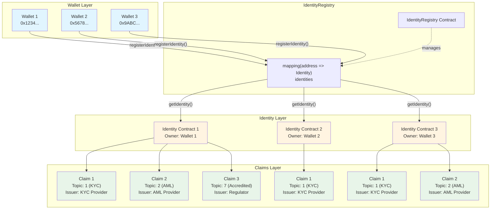

## Nivel 1: Contratos Básicos (Empieza aquí)

#### 1. Identity.sol (Identidad del Inversor)
1. Lee el código de `Identity.sol`

2. Identifica las funciones principales
**Funciones Principales de Identity.sol:**
**a) Constructor:**
```solidity
constructor(address initialOwner) Ownable(initialOwner)
```
- **Propósito**: Inicializa el contrato Identity
- **Parámetros**: `initialOwner` - Dirección que será el owner del contrato
- **Nota**: Hereda de `Ownable`, por lo que solo el owner puede agregar/remover claims
**b) addClaim() - Agregar un Claim:**
```solidity
function addClaim(
    uint256 _topic,        // Tipo de claim (ej: 1 = KYC)
    uint256 _scheme,       // Esquema de firma (1 = ECDSA)
    address _issuer,       // Dirección del emisor del claim
    bytes memory _signature, // Firma digital del claim
    bytes memory _data,    // Datos del claim
    string memory _uri     // URI con información adicional
) external onlyOwner returns (bytes32)
```
- **Propósito**: Agrega un nuevo claim al Identity contract
- **Restricción**: Solo el `owner` puede llamar esta función (`onlyOwner`)
- **Almacenamiento**: Guarda el claim en `mapping[topic][issuer]`
- **Evento**: Emite `ClaimAdded` con todos los datos del claim
- **Retorno**: Retorna un `bytes32` (claimId) calculado como `keccak256(issuer, topic)`
- **Ejemplo de uso**:
```solidity
identity.addClaim(
    1,                    // topic: KYC
    1,                    // scheme: ECDSA
    kycProvider,          // issuer: Dirección del KYC provider
    signature,            // firma del claim
    data,                 // datos del claim
    "https://kyc.com/..." // URI con información
);
```
**c) removeClaim() - Remover un Claim:**
```solidity
function removeClaim(
    uint256 _topic,    // Tipo de claim a remover
    address _issuer    // Dirección del emisor del claim
) external onlyOwner returns (bool)
```
- **Propósito**: Elimina un claim existente del Identity
- **Restricción**: Solo el `owner` puede llamar esta función
- **Almacenamiento**: Usa `delete` para eliminar el claim del mapping
- **Evento**: Emite `ClaimRemoved` con topic e issuer
- **Retorno**: Retorna `true` si se eliminó exitosamente
- **Uso típico**: Para revocar claims cuando expiran o son inválidos
**d) getClaim() - Obtener un Claim:**
```solidity
function getClaim(uint256 _topic, address _issuer)
    external view returns (
        uint256 topic,
        uint256 scheme,
        address issuer,
        bytes memory signature,
        bytes memory data,
        string memory uri
    )
```
- **Propósito**: Obtiene todos los datos de un claim específico
- **Tipo**: Función `view` (no modifica estado)
- **Parámetros**: `topic` y `issuer` para identificar el claim único
- **Retorno**: Retorna todos los campos del struct `Claim`
- **Uso típico**: Para verificar o auditar claims existentes
**e) claimExists() - Verificar si un Claim Existe:**
```solidity
function claimExists(uint256 _topic, address _issuer) 
    external view returns (bool)
```
- **Propósito**: Verifica si un claim específico existe en el Identity
- **Tipo**: Función `view` (no modifica estado)
- **Lógica**: Verifica si `claims[topic][issuer].issuer != address(0)`
- **Retorno**: `true` si el claim existe, `false` si no existe
- **Uso crítico**: Esta función es llamada por `Token.isVerified()` para verificar claims
**Estructura de Datos:**
```solidity
struct Claim {
    uint256 topic;      // Tipo de claim (1 = KYC, 2 = AML, etc.)
    uint256 scheme;     // Esquema de firma (1 = ECDSA)
    address issuer;     // Dirección del emisor confiable
    bytes signature;    // Firma digital del claim
    bytes data;         // Datos adicionales del claim
    string uri;         // URI con información adicional
}
```
**Almacenamiento:**
```solidity
mapping(uint256 => mapping(address => Claim)) private claims;
```
- **Estructura**: `mapping[topic][issuer] => Claim`
- **Ventaja**: Permite múltiples claims del mismo topic de diferentes issuers
- **Ejemplo**: Un usuario puede tener KYC de dos providers diferentes
**Eventos:**
```solidity
event ClaimAdded(uint256 indexed topic, uint256 scheme, address indexed issuer, ...);
event ClaimRemoved(uint256 indexed topic, address indexed issuer);
```
**Resumen de Funciones:**
| Función         | Tipo         | Restricción | Propósito                       |
|-----------------|--------------|-------------|---------------------------------|
| `constructor()` | Constructor  | -           | Inicializa el contrato          |
| `addClaim()`    | Modificadora | `onlyOwner` | Agrega un nuevo claim           |
| `removeClaim()` | Modificadora | `onlyOwner` | Elimina un claim existente      |
| `getClaim()`    | View         | Pública     | Obtiene datos de un claim       |
| `claimExists()` | View         | Pública     | Verifica existencia de un claim |
**Flujo Típico de Uso:**
1. **Crear Identity**: `Identity identity = new Identity(ownerAddress);`
2. **Agregar Claims**: `identity.addClaim(topic, scheme, issuer, signature, data, uri);`
3. **Verificar Claims**: `bool exists = identity.claimExists(topic, issuer);`
4. **Obtener Claims**: `Claim memory claim = identity.getClaim(topic, issuer);`
5. **Remover Claims** (si es necesario): `identity.removeClaim(topic, issuer);`

3. Ejecuta los tests: `forge test --match-contract IdentityTest`

**Comando para ejecutar los tests:**
```bash
cd sc
forge test --match-contract IdentityTest -vv
```

**Resultados de los Tests (7 tests, todos pasan ✅):**

| Test                                                    | Descripción                                                               | Estado |
|---------------------------------------------------------|---------------------------------------------------------------------------|---------|
| `test_Constructor()`                                    | Verifica que el constructor asigna correctamente el owner                 | ✅ PASS |
| `test_AddClaim()`                                       | Verifica que se puede agregar un claim y que `claimExists()` retorna true | ✅ PASS |
| `test_GetClaim()`                                       | Verifica que se pueden obtener todos los datos de un claim agregado       | ✅ PASS |
| `test_ClaimExists_ReturnsFalse_WhenClaimDoesNotExist()` | Verifica que `claimExists()` retorna false para claims inexistentes       | ✅ PASS |
| `test_RemoveClaim()`                                    | Verifica que se puede remover un claim y que deja de existir              | ✅ PASS |
| `test_RevertWhen_AddClaim_NotOwner()`                   | Verifica que solo el owner puede agregar claims                           | ✅ PASS |
| `test_RevertWhen_RemoveClaim_NotOwner()`                | Verifica que solo el owner puede remover claims                           | ✅ PASS |

**Análisis de los Tests:**

**Tests de Funcionalidad Básica:**
- ✅ Constructor inicializa correctamente el owner
- ✅ Se pueden agregar claims con todos los parámetros
- ✅ Se pueden obtener claims agregados
- ✅ Se pueden remover claims existentes
- ✅ `claimExists()` funciona correctamente (true/false)

**Tests de Seguridad:**
- ✅ Solo el owner puede agregar claims (otros usuarios son rechazados)
- ✅ Solo el owner puede remover claims (otros usuarios son rechazados)

**Cobertura de Tests:**
- ✅ Todas las funciones públicas están probadas
- ✅ Casos exitosos (happy path)
- ✅ Casos de error (reverts)
- ✅ Verificación de permisos (onlyOwner)

**Ejemplo de Ejecución:**
```bash
$ forge test --match-contract IdentityTest -vv

[PASS] test_AddClaim() (gas: 1252009)
[PASS] test_ClaimExists_ReturnsFalse_WhenClaimDoesNotExist() (gas: 1108106)
[PASS] test_Constructor() (gas: 1100715)
[PASS] test_GetClaim() (gas: 1261970)
[PASS] test_RemoveClaim() (gas: 1139895)
[PASS] test_RevertWhen_AddClaim_NotOwner() (gas: 1112153)
[PASS] test_RevertWhen_RemoveClaim_NotOwner() (gas: 1236552)

Suite result: ok. 7 passed; 0 failed; 0 skipped
```

4. Pregúntate: ¿Por qué usamos mapping de mapping?

**Respuesta:**

Usamos `mapping(uint256 => mapping(address => Claim))` por las siguientes razones:

**a) Identificación Única de Claims:**
- Un claim se identifica por la combinación de `(topic, issuer)`
- Esto permite que un usuario tenga múltiples claims del mismo topic de diferentes issuers
- Ejemplo: Un usuario puede tener KYC de dos providers diferentes

**b) Estructura de Datos Eficiente:**
```solidity
// ✅ BIEN: mapping de mapping
mapping(uint256 => mapping(address => Claim)) private claims;
// Acceso: claims[topic][issuer]

// ❌ MAL: Array de structs
Claim[] public claims; // Ineficiente para búsqueda
// Tendría que iterar para encontrar un claim específico
```

**c) Ventajas del Mapping de Mapping:**

1. **Búsqueda O(1)**: Acceso directo sin iteración
   ```solidity
   // O(1) - Acceso directo
   Claim memory claim = claims[topic][issuer];
   
   // vs O(n) - Iteración necesaria
   for (uint i = 0; i < claims.length; i++) {
       if (claims[i].topic == topic && claims[i].issuer == issuer) {
           // encontrado
       }
   }
   ```

2. **Múltiples Claims del Mismo Topic:**
   ```solidity
   // Usuario puede tener KYC de múltiples providers
   claims[1][kycProvider1] = Claim(...); // KYC de provider 1
   claims[1][kycProvider2] = Claim(...); // KYC de provider 2
   ```

3. **Eficiencia de Gas:**
   - Acceso directo es más barato que iterar arrays
   - No requiere loops para buscar claims
   - Menor costo de gas en operaciones frecuentes

4. **Flexibilidad:**
   - Fácil agregar nuevos claims sin afectar existentes
   - Fácil remover claims específicos
   - No requiere reorganizar arrays

**Ejemplo Práctico:**

```solidity
// Usuario tiene múltiples verificaciones KYC
identity.addClaim(1, 1, kycProvider1, ...); // KYC de provider 1
identity.addClaim(1, 1, kycProvider2, ...); // KYC de provider 2

// Verificar si tiene KYC de un provider específico
bool hasKYC1 = identity.claimExists(1, kycProvider1); // true
bool hasKYC2 = identity.claimExists(1, kycProvider2); // true

// Obtener claim específico
Claim memory kyc1 = identity.getClaim(1, kycProvider1);
Claim memory kyc2 = identity.getClaim(1, kycProvider2);
```

**Comparación con Alternativas:**

| Estructura                                         | Búsqueda | Múltiples Claims | Gas Cost |
|----------------------------------------------------|----------|------------------|----------|
| `mapping(topic => mapping(issuer => Claim))`       | O(1)     | ✅ Sí            | Bajo     |
| `Claim[]` con búsqueda lineal                      | O(n)     | ✅ Sí            | Alto     |
| `mapping(bytes32 => Claim)` (hash de topic+issuer) | O(1)     | ❌ No (único)    | Bajo     |

**Resumen:**

El mapping de mapping es la estructura óptima porque:
- ✅ Permite acceso O(1) a claims específicos
- ✅ Permite múltiples claims del mismo topic de diferentes issuers
- ✅ Es eficiente en gas (no requiere iteración)
- ✅ Facilita la verificación de claims por issuer confiable
- ✅ Es flexible para agregar/remover claims

Esta estructura es fundamental para el sistema de verificación, ya que `Token.isVerified()` necesita verificar que un claim existe de un issuer confiable específico.


#### 2. IdentityRegistry.sol (Registro de Identidades)
Ejercicio:
**Ejercicio:**
1. ¿Por qué separar el Identity del wallet?
**Respuesta:**
Separar el `Identity` del `wallet` es una decisión arquitectónica clave que proporciona múltiples beneficios:
**a) Separación de Responsabilidades:**
- **Wallet**: Representa la dirección Ethereum que posee tokens y realiza transacciones
- **Identity**: Representa la identidad verificable del usuario (KYC, AML, claims, etc.)
- Permite que un wallet pueda tener múltiples identidades o que una identidad pueda ser transferida/actualizada sin afectar el wallet
**b) Verificación de Propiedad:**
- El `Identity` contract tiene un `owner` que debe ser el wallet
- Esto permite verificar que el wallet realmente controla su identidad
- Previene que alguien registre una identidad falsa para otro wallet
**c) Flexibilidad y Actualización:**
- Si un wallet pierde acceso (clave privada comprometida), se puede crear un nuevo `Identity` sin cambiar el wallet
- Los claims pueden ser actualizados en el `Identity` sin afectar el wallet directamente
- Permite migrar identidades entre wallets si es necesario
**d) Modularidad:**
- El `Identity` contract puede ser reutilizado en múltiples tokens/proyectos
- Un mismo `Identity` puede servir para varios tokens RWA diferentes
- Facilita la auditoría y mantenimiento del código
**e) Seguridad:**
- Si el `IdentityRegistry` es comprometido, los `Identity` contracts individuales no se ven afectados
- Los claims están almacenados en contratos separados, aislados del registro principal
- Permite revocar identidades sin afectar el historial de transacciones del wallet
**f) Eficiencia de Gas:**
- Los claims se almacenan en contratos separados, no en el `IdentityRegistry`
- Solo se consulta el `Identity` cuando es necesario verificar claims
- Reduce el costo de almacenamiento en el registry principal
**Ejemplo Práctico:**

```solidity
// ❌ MAL: Almacenar claims directamente en el wallet
mapping(address => Claim[]) public walletClaims; // Ineficiente y acoplado

// ✅ BIEN: Separar Identity del wallet
IdentityRegistry registry;
mapping(address => Identity) private identities; // Flexible y modular

// Wallet → IdentityRegistry → Identity Contract → Claims
```
**Analogía del Mundo Real:**
- **Wallet** = Número de cuenta bancaria
- **Identity** = Documento de identidad (DNI, pasaporte)
- **Claims** = Sellos/verificaciones en el documento (visa, certificaciones)
Tu cuenta bancaria (wallet) puede existir sin documento, pero para operaciones reguladas necesitas el documento (Identity) con sus verificaciones (Claims).


2. ¿Qué pasa si un wallet no tiene Identity?
**Respuesta:**
Si un wallet **no tiene Identity** o **no está completamente verificado**, el sistema lo **rechaza automáticamente** en todas las operaciones que requieren verificación. Esto es fundamental para cumplir con regulaciones (KYC/AML) y mantener la seguridad del token.
**Escenarios de Rechazo:**
**a) Intentar Mintear Tokens a un Wallet sin Identity:**
```solidity
// ❌ FALLA: Wallet sin Identity
token.mint(unverifiedWallet, 1000);
// Revert: "Recipient not verified"
```
**b) Intentar Transferir Tokens desde un Wallet sin Identity:**
```solidity
// ❌ FALLA: Remitente sin Identity
vm.prank(unverifiedWallet);
token.transfer(verifiedWallet, 500);
// Revert: "Sender not verified"
```
**c) Intentar Recibir Tokens en un Wallet sin Identity:**
```solidity
// ❌ FALLA: Destinatario sin Identity
vm.prank(verifiedWallet);
token.transfer(unverifiedWallet, 500);
// Revert: "Recipient not verified"
```
**d) Verificación con `canTransfer()`:**
```solidity
// Retorna false si alguno de los wallets no está verificado
bool canTransfer = token.canTransfer(unverifiedWallet, verifiedWallet, 100);
// Resultado: false
```
**Flujo de Verificación en el Código:**
```solidity
function isVerified(address account) public view returns (bool) {
    // 1. ¿IdentityRegistry está configurado?
    if (address(identityRegistry) == address(0)) {
        return false; // ❌ No configurado
    }
    // 2. ¿Está registrado en IdentityRegistry?
    if (!identityRegistry.isRegistered(account)) {
        return false; // ❌ No registrado
    }
    // 3. ¿Tiene un Identity contract válido?
    address identityAddress = identityRegistry.getIdentity(account);
    if (identityAddress == address(0)) {
        return false; // ❌ Sin Identity contract
    }
    // 4. ¿Tiene todos los claim topics requeridos?
    uint256[] memory requiredTopics = claimTopicsRegistry.getClaimTopics();
    // ... verifica cada topic requerido ...
    // Si falta algún topic requerido → return false ❌
    // Si todos los topics están presentes → return true ✅
}
```
**Casos Específicos:**
| Situación                                             |Resultado |Mensaje de Error                                     |
|-------------------------------------------------------|----------|-----------------------------------------------------|
| Wallet no registrado en IdentityRegistry              |❌ Rechaza|`"Sender not verified"` o `"Recipient not verified"` |
| Wallet registrado pero sin Identity contract          |❌ Rechaza|`"Sender not verified"` o `"Recipient not verified"` |
| Wallet con Identity pero sin claims requeridos        |❌ Rechaza|`"Sender not verified"` o `"Recipient not verified"` |
|Wallet con Identity pero claims de issuer no confiable |❌ Rechaza|`"Sender not verified"` o `"Recipient not verified"` |
| Wallet completamente verificado                       |✅ Permiti|Operación exitosa                                    |
**Ejemplo Práctico:**
```solidity
// Escenario: Alice quiere transferir tokens a Bob
// ❌ CASO 1: Bob no tiene Identity
assertEq(identityRegistry.isRegistered(bob), false);
vm.prank(alice);
vm.expectRevert("Recipient not verified");
token.transfer(bob, 100);
// Resultado: Transferencia rechazada
// ❌ CASO 2: Alice no tiene Identity
assertEq(identityRegistry.isRegistered(alice), false);
token.mint(alice, 1000); // Falla: "Recipient not verified"
// Resultado: No puede recibir tokens
// ✅ CASO 3: Ambos verificados
setupVerifiedUser(alice);  // Registra Identity + Claims
setupVerifiedUser(bob);    // Registra Identity + Claims
token.mint(alice, 1000);
vm.prank(alice);
token.transfer(bob, 100);  // ✅ Éxito
// Resultado: Transferencia exitosa
```
**¿Por qué es tan estricto?**
1. **Cumplimiento Regulatorio**: Los security tokens (RWA) requieren KYC/AML obligatorio
2. **Prevención de Fraude**: Evita que wallets no verificados participen en el sistema
3. **Trazabilidad**: Solo usuarios verificados pueden recibir/transferir tokens
4. **Seguridad**: Protege a los inversores legítimos
**Excepciones (Funciones que BYPASSAN la verificación):**
Solo las funciones administrativas pueden bypassar la verificación:
```solidity
// ✅ forcedTransfer() - Solo AGENT_ROLE
// Bypasea pause, freeze, identity, y compliance
token.forcedTransfer(unverifiedWallet, verifiedWallet, 100);
// Funciona porque es una transferencia administrativa
```
**Resumen:**
Un wallet sin Identity es **completamente bloqueado** del sistema:
- ❌ No puede recibir tokens (mint falla)
- ❌ No puede enviar tokens (transfer falla)
- ❌ No puede recibir transferencias (transfer falla)
- ✅ Solo puede ser desbloqueado registrando su Identity y obteniendo los claims requeridos

3. Dibuja un diagrama de cómo se relacionan Wallet → Identity → Claims

**Estructura de Datos:**
```
Wallet (0x1234...)
    │
    ├─→ IdentityRegistry
    │      └─→ mapping[0x1234...] = Identity Contract Address
    │
    └─→ Identity Contract
           │
           ├─→ Owner: 0x1234... (el wallet)
           │
           └─→ Claims (mapping[topic][issuer])
                  │
                  ├─→ Claim 1: topic=1, issuer=KYC_Provider
                  │     ├─ topic: 1 (KYC)
                  │     ├─ scheme: 1 (ECDSA)
                  │     ├─ issuer: 0xKYC...
                  │     ├─ signature: 0x...
                  │     ├─ data: 0x...
                  │     └─ uri: "https://..."
                  │
                  ├─→ Claim 2: topic=2, issuer=AML_Provider
                  │     └─ ... (misma estructura)
                  │
                  └─→ Claim 3: topic=7, issuer=Regulator
                        └─ ... (misma estructura)
```
**Flujo de Verificación:**
1. **Wallet** → Se registra en `IdentityRegistry`
2. **IdentityRegistry** → Mapea `wallet address` → `Identity contract address`
3. **Identity Contract** → Almacena múltiples `Claims` en formato `mapping[topic][issuer]`
4. **Claim** → Contiene: topic, issuer, signature, data, uri
**Ejemplo Práctico:**
```solidity
// 1. Crear Identity para Wallet 1
Identity identity1 = new Identity(wallet1);
// 2. Registrar en IdentityRegistry
identityRegistry.registerIdentity(wallet1, address(identity1));
// 3. Agregar Claims al Identity
identity1.addClaim(
    1,                    // topic: KYC
    1,                    // scheme: ECDSA
    kycProvider,          // issuer
    signature,            // firma
    data,                 // datos
    "https://kyc.com/..." // uri
);
identity1.addClaim(
    2,                    // topic: AML
    1,                    // scheme: ECDSA
    amlProvider,          // issuer
    signature,            // firma
    data,                 // datos
    "https://aml.com/..." // uri
);
// 4. Verificar claim
bool hasKYC = identity1.claimExists(1, kycProvider); // true
```

#### 3. TrustedIssuersRegistry.sol (Emisores Confiables)
**Ejercicio:**
1. ¿Por qué necesitamos "trusted" issuers?
**Respuesta:**
Los **"trusted issuers"** (emisores confiables) son fundamentales para la seguridad y validez del sistema de identidad. Sin ellos, el sistema sería completamente vulnerable a fraudes y claims falsos.
**Razones Principales:**
**a) Prevención de Fraude y Claims Falsos:**
```solidity
// ❌ SIN TrustedIssuersRegistry: Cualquiera puede emitir claims
// Un atacante podría crear su propio "KYC claim" y obtener acceso
attacker.addClaim(1, 1, attackerAddress, fakeSignature, fakeData, "");
// Resultado: Acceso no autorizado al token
// ✅ CON TrustedIssuersRegistry: Solo emisores autorizados
// El sistema verifica que el issuer esté en la lista de confiables
if (!trustedIssuersRegistry.hasClaimTopic(issuer, topic)) {
    return false; // Rechazado
}
```
**b) Control de Autoridad y Especialización:**
- **KYC Provider**: Solo puede emitir claims de KYC (topic 1)
- **AML Provider**: Solo puede emitir claims de AML (topic 2)
- **Regulator**: Solo puede emitir claims de acreditación (topic 7)
- Cada issuer tiene permisos específicos para ciertos tipos de claims
**c) Verificación en el Código:**
El sistema verifica explícitamente que los claims provengan de emisores confiables:
```solidity
function isVerified(address account) public view returns (bool) {
    // ... obtener topics requeridos ...
    for (uint256 i = 0; i < requiredTopics.length; i++) {
        bool hasValidClaim = false;
        // Obtener todos los issuers confiables
        address[] memory trustedIssuers = trustedIssuersRegistry.getTrustedIssuers();
        for (uint256 j = 0; j < trustedIssuers.length; j++) {
            // ✅ VERIFICACIÓN CRÍTICA: ¿El issuer puede emitir este topic?
            if (trustedIssuersRegistry.hasClaimTopic(trustedIssuers[j], requiredTopics[i])) {
                // ✅ VERIFICACIÓN: ¿El claim existe de este issuer confiable?
                if (identity.claimExists(requiredTopics[i], trustedIssuers[j])) {
                    hasValidClaim = true;
                    break;
                }
            }
        }
        // Si no se encontró un claim de un issuer confiable → FALLA
        if (!hasValidClaim) {
            return false;
        }
    }
    return true;
}
```
**d) Cumplimiento Regulatorio:**
- Los security tokens (RWA) requieren verificaciones de terceros autorizados
- Los reguladores exigen que las verificaciones provengan de entidades certificadas
- Sin trusted issuers, el token no cumpliría con regulaciones financieras
**e) Auditoría y Trazabilidad:**
- Permite rastrear quién emitió cada claim
- Facilita auditorías regulatorias
- Permite revocar emisores comprometidos sin afectar otros
**f) Separación de Responsabilidades:**
- Un issuer comprometido solo afecta sus propios claims
- Se pueden tener múltiples issuers para el mismo topic (redundancia)
- Permite cambiar issuers sin afectar claims existentes
**Ejemplo Práctico:**
```solidity
// Configuración de Trusted Issuers
TrustedIssuersRegistry registry;
// Agregar KYC Provider (solo puede emitir KYC claims)
registry.addTrustedIssuer(kycProvider, [1]); // topic 1 = KYC
// Agregar AML Provider (solo puede emitir AML claims)
registry.addTrustedIssuer(amlProvider, [2]); // topic 2 = AML
// Agregar Regulator (puede emitir múltiples tipos)
registry.addTrustedIssuer(regulator, [1, 2, 7]); // KYC, AML, Accredited
// Verificación
assertTrue(registry.hasClaimTopic(kycProvider, 1));  // ✅ true
assertFalse(registry.hasClaimTopic(kycProvider, 2)); // ❌ false (no puede emitir AML)
assertTrue(registry.hasClaimTopic(regulator, 1));   // ✅ true
```
**Tabla de Comparación:**
| Aspecto          | Sin Trusted Issuers               | Con Trusted Issuers           |
|------------------|-----------------------------------|-------------------------------|
| **Seguridad**    | ❌ Cualquiera puede emitir claims | ✅ Solo emisores autorizados  |
| **Fraude**       | ❌ Vulnerable a claims falsos     | ✅ Protegido contra fraudes   |  
| **Cumplimiento** | ❌ No cumple regulaciones         | ✅ Cumple con regulaciones    |
| **Auditoría**    | ❌ No rastreable                  | ✅ Completamente rastreable   |
| **Control**      | ❌ Sin control de autoridad       | ✅ Control granular por topic |
**Resumen:**
Los trusted issuers son la **base de la seguridad** del sistema. Sin ellos:
- ❌ Cualquiera podría emitir claims falsos
- ❌ No habría verificación de autoridad
- ❌ El token no cumpliría con regulaciones
- ❌ No habría forma de rastrear o revocar emisores
Con trusted issuers:
- ✅ Solo entidades autorizadas pueden emitir claims
- ✅ Cada issuer tiene permisos específicos
- ✅ El sistema cumple con regulaciones
- ✅ Completamente auditable y controlable
---
2. ¿Qué pasa si cualquiera pudiera emitir claims?
**Respuesta:*
Si **cualquiera pudiera emitir claims**, el sistema sería completamente inseguro y vulnerable a múltiples ataques:
**Escenarios de Ataque:**
**a) Auto-Verificación Fraudulenta:**
```solidity
// ❌ Atacante se auto-emite un claim de KYC
attacker.addClaim(
    1,                    // topic: KYC
    1,                    // scheme: ECDSA
    attacker,             // issuer: Él mismo
    fakeSignature,        // firma falsa
    fakeData,             // datos falsos
    "fake-kyc.com"
);
// Resultado: Atacante puede recibir/transferir tokens sin verificación real
token.mint(attacker, 1000000); // ✅ Funciona (pero no debería)
```
**b) Creación Masiva de Wallets Falsos:**
```solidity
// Atacante crea múltiples wallets y se auto-emite claims
for (uint i = 0; i < 1000; i++) {
    address fakeWallet = generateWallet(i);
    Identity fakeIdentity = new Identity(fakeWallet);
    fakeIdentity.addClaim(1, 1, attacker, ...); // Auto-emitido
    // Ahora tiene 1000 wallets "verificados" falsamente
    token.mint(fakeWallet, 10000);
}
```
**c) Bypass de Regulaciones:**
- Usuarios no verificados podrían acceder al token
- No habría cumplimiento KYC/AML real
- El token perdería su estatus de "security token"
- Podría enfrentar sanciones regulatorias
**d) Pérdida de Confianza:**
- Inversores legítimos perderían confianza
- El valor del token se depreciaría
- El proyecto podría ser cerrado por reguladores
**Consecuencias Legales y Regulatorias:**
| Consecuencia                  | Impacto                                    |
|-------------------------------|--------------------------------------------|
| **Violación de Regulaciones** | Sanciones financieras, cierre del proyecto |
| **Pérdida de Licencia**       | No puede operar como security token        |
| **Demandas Legales**          | Responsabilidad por fraudes                |
| **Pérdida de Reputación**     | Imposible recuperar confianza              |
**Protección con Trusted Issuers:**
```solidity
// ✅ CON Trusted Issuers: El ataque falla
attacker.addClaim(1, 1, attacker, ...); // Claim agregado al Identity
// Pero cuando el Token verifica:
function isVerified(address account) {
    // Busca SOLO en trusted issuers
    address[] memory trustedIssuers = trustedIssuersRegistry.getTrustedIssuers();
    // attacker NO está en la lista → hasValidClaim = false
    // Resultado: ❌ Rechazado
}
```
**Resumen:**
Sin trusted issuers, el sistema sería:
- ❌ **Completamente inseguro**
- ❌ **Vulnerable a fraudes masivos**
- ❌ **No cumpliría con regulaciones**
- ❌ **Ilegal para security tokens**
Por eso, los trusted issuers son **obligatorios** y **críticos** para la seguridad del sistema.
---
3. Diseña un sistema con 3 issuers: KYC provider, AML provider, Accreditation provider
**Diseño del Sistema:**
```solidity
// ============ CONFIGURACIÓN INICIAL ============
TrustedIssuersRegistry trustedRegistry;
ClaimTopicsRegistry topicsRegistry;
// ============ ISSUER 1: KYC Provider ============
address kycProvider = 0x1111...; // Empresa certificada de KYC
uint256[] memory kycTopics = new uint256[](1);
kycTopics[0] = 1; // Topic 1 = KYC
trustedRegistry.addTrustedIssuer(kycProvider, kycTopics);
// Verificación
assertTrue(trustedRegistry.hasClaimTopic(kycProvider, 1));  // ✅ KYC
assertFalse(trustedRegistry.hasClaimTopic(kycProvider, 2));    // ❌ No AML
assertFalse(trustedRegistry.hasClaimTopic(kycProvider, 7));   // ❌ No Accredited
// ============ ISSUER 2: AML Provider ============
address amlProvider = 0x2222...; // Empresa certificada de AML
uint256[] memory amlTopics = new uint256[](1);
amlTopics[0] = 2; // Topic 2 = AML
trustedRegistry.addTrustedIssuer(amlProvider, amlTopics);
// Verificación
assertFalse(trustedRegistry.hasClaimTopic(amlProvider, 1));   // ❌ No KYC
assertTrue(trustedRegistry.hasClaimTopic(amlProvider, 2));   // ✅ AML
assertFalse(trustedRegistry.hasClaimTopic(amlProvider, 7));  // ❌ No Accredited
// ============ ISSUER 3: Accreditation Provider ============
address accreditationProvider = 0x3333...; // Regulador o entidad certificadora
uint256[] memory accreditTopics = new uint256[](1);
accreditTopics[0] = 7; // Topic 7 = Accredited Investor
trustedRegistry.addTrustedIssuer(accreditationProvider, accreditTopics);
// Verificación
assertFalse(trustedRegistry.hasClaimTopic(accreditationProvider, 1)); // ❌ No KYC
assertFalse(trustedRegistry.hasClaimTopic(accreditationProvider, 2)); // ❌ No AML
assertTrue(trustedRegistry.hasClaimTopic(accreditationProvider, 7));   // ✅ Accredited
// ============ CONFIGURAR TOPICS REQUERIDOS ============
// El token requiere: KYC + AML + Accredited
topicsRegistry.addClaimTopic(1); // KYC requerido
topicsRegistry.addClaimTopic(2); // AML requerido
topicsRegistry.addClaimTopic(7); // Accredited requerido
// ============ FLUJO DE VERIFICACIÓN ============
// Para que un usuario esté verificado, necesita:
// 1. Claim de KYC del kycProvider (topic 1)
// 2. Claim de AML del amlProvider (topic 2)
// 3. Claim de Accredited del accreditationProvider (topic 7)
// Ejemplo: Verificar usuario
Identity userIdentity = new Identity(user);
identityRegistry.registerIdentity(user, address(userIdentity));
// Agregar claims de cada provider
userIdentity.addClaim(1, 1, kycProvider, kycSignature, kycData, "kyc-uri");
userIdentity.addClaim(2, 1, amlProvider, amlSignature, amlData, "aml-uri");
userIdentity.addClaim(7, 1, accreditationProvider, accSignature, accData, "acc-uri");
// Ahora el usuario está completamente verificado
assertTrue(token.isVerified(user)); // ✅ true
```
**Diagrama del Sistema:**
```
┌─────────────────────────────────────────────────────────┐
│           TrustedIssuersRegistry                        │
├─────────────────────────────────────────────────────────┤
│                                                         │
│  KYC Provider (0x1111...)                               │
│    └─→ Topics: [1] (KYC)                                │
│                                                         │
│  AML Provider (0x2222...)                               │
│    └─→ Topics: [2] (AML)                                │
│                                                         │
│  Accreditation Provider (0x3333...)                     │
│    └─→ Topics: [7] (Accredited Investor)                │
│                                                         │
└─────────────────────────────────────────────────────────┘

┌─────────────────────────────────────────────────────────┐
│           ClaimTopicsRegistry                           │
├─────────────────────────────────────────────────────────┤
│  Required Topics: [1, 2, 7]                             │
│  (KYC + AML + Accredited)                               │
└─────────────────────────────────────────────────────────┘

┌─────────────────────────────────────────────────────────┐
│           User Identity                                 │
├─────────────────────────────────────────────────────────┤
│  Claims:                                                │
│    • Topic 1 (KYC)      → Issuer: KYC Provider          │
│    • Topic 2 (AML)     → Issuer: AML Provider           │
│    • Topic 7 (Accred)  → Issuer: Accreditation Provider │
│                                                         │
│  Resultado: ✅ VERIFICADO                               │
└─────────────────────────────────────────────────────────┘
```
**Ventajas de este Diseño:**
1. **Separación de Responsabilidades**: Cada issuer se especializa en un tipo de verificación
2. **Redundancia**: Si un issuer falla, se puede agregar otro para el mismo topic
3. **Auditoría Clara**: Fácil rastrear qué issuer emitió cada claim
4. **Flexibilidad**: Se pueden agregar más issuers o topics según necesidades
5. **Cumplimiento**: Cada verificación proviene de una entidad certificada

#### 4. ClaimTopicsRegistry.sol (Topics Requeridos)
**Ejercicio:**
1. ¿Por qué algunos tokens requieren más claims que otros?
**Respuesta:**
Diferentes tokens requieren diferentes niveles de verificación según múltiples factores. El `ClaimTopicsRegistry` permite personalizar los requisitos de cada token según sus necesidades específicas.
**Factores que Determinan los Claims Requeridos:**
**a) Tipo de Activo (RWA):**
```solidity
// Token de Startup (alto riesgo)
// Requiere: KYC + AML + Accredited Investor
topicsRegistry.addClaimTopic(1); // KYC
topicsRegistry.addClaimTopic(2); // AML
topicsRegistry.addClaimTopic(7); // Accredited Investor
// Token de Real Estate (riesgo medio)
// Requiere: KYC + AML + Geographic Restriction
topicsRegistry.addClaimTopic(1); // KYC
topicsRegistry.addClaimTopic(2); // AML
topicsRegistry.addClaimTopic(5); // Geographic Compliance
// Token de Commodity (riesgo bajo)
// Requiere: Solo KYC básico
topicsRegistry.addClaimTopic(1); // KYC
```
**b) Regulaciones por Jurisdicción:**
- **EE.UU. (SEC)**: Requiere Accredited Investor para ciertos tokens
- **Europa (MiCA)**: Requiere KYC + AML obligatorio
- **Asia**: Puede requerir verificaciones adicionales de residencia
- **Países en desarrollo**: Pueden tener requisitos más flexibles
**c) Nivel de Riesgo del Inversor:**
```solidity
// Token de bajo riesgo (ej: bonos gubernamentales tokenizados)
// Requiere: Mínimo KYC
topicsRegistry.addClaimTopic(1); // KYC
// Token de alto riesgo (ej: equity de startup)
// Requiere: Múltiples verificaciones
topicsRegistry.addClaimTopic(1); // KYC
topicsRegistry.addClaimTopic(2); // AML
topicsRegistry.addClaimTopic(7); // Accredited Investor
topicsRegistry.addClaimTopic(8); // Risk Assessment
```
**d) Monto de Inversión:**
- **Inversiones pequeñas (< $10k)**: Pueden requerir solo KYC
- **Inversiones medianas ($10k - $100k)**: KYC + AML
- **Inversiones grandes (> $100k)**: KYC + AML + Accredited + Source of Funds
**e) Naturaleza del Token:**
- **Security Token**: Requiere más claims (regulado como valor)
- **Utility Token**: Puede requerir menos claims
- **Stablecoin respaldado**: Requiere verificaciones de reservas
**Ejemplo Comparativo:**
| Tipo de Token       | Claims Requeridos                        | Razón                                              |
|---------------------|------------------------------------------|----------------------------------------------------|
| **Startup Equity**  | KYC + AML + Accredited + Risk Assessment | Alto riesgo, regulación estricta                   |
| **Real Estate**     | KYC + AML + Geographic + Accredited      | Regulación inmobiliaria, restricciones geográficas |
| **Commodity (Oro)** | KYC + AML                                | Riesgo medio, regulación de commodities            |
| **Bond Tokenizado** | KYC                                      | Riesgo bajo, instrumento de deuda                  |
| **Stablecoin**      | KYC + AML + Reserve Verification         | Regulación de pagos, verificación de reservas      |
**Código de Configuración:**
```solidity
// Token A: Startup (alto riesgo)
ClaimTopicsRegistry startupRegistry;
startupRegistry.addClaimTopic(1); // KYC
startupRegistry.addClaimTopic(2); // AML
startupRegistry.addClaimTopic(7); // Accredited Investor
startupRegistry.addClaimTopic(8); // Risk Assessment
// Total: 4 claims requeridos
// Token B: Real Estate (riesgo medio)
ClaimTopicsRegistry realEstateRegistry;
realEstateRegistry.addClaimTopic(1); // KYC
realEstateRegistry.addClaimTopic(2); // AML
realEstateRegistry.addClaimTopic(5); // Geographic Compliance
// Total: 3 claims requeridos
// Token C: Commodity (riesgo bajo)
ClaimTopicsRegistry commodityRegistry;
commodityRegistry.addClaimTopic(1); // KYC
// Total: 1 claim requerido
```
**Ventajas de la Flexibilidad:**
1. **Cumplimiento Específico**: Cada token cumple con sus regulaciones específicas
2. **Optimización de Costos**: Tokens de bajo riesgo no requieren verificaciones costosas innecesarias
3. **Escalabilidad**: Se pueden agregar claims según evolucionan las regulaciones
4. **Competitividad**: Tokens pueden competir ofreciendo diferentes niveles de acceso
**Resumen:**
Los tokens requieren diferentes cantidades de claims porque:
- ✅ **Diferentes activos** tienen diferentes niveles de riesgo
- ✅ **Diferentes jurisdicciones** tienen diferentes regulaciones
- ✅ **Diferentes inversores** requieren diferentes verificaciones
- ✅ **Diferentes montos** requieren diferentes niveles de compliance

El `ClaimTopicsRegistry` permite **personalizar** los requisitos de cada token según sus necesidades específicas, optimizando entre seguridad, cumplimiento y accesibilidad.
---

2. Diseña los claim topics para: a) Token de startup, b) Token de real estate, c) Token de commodity
**Diseño de Claim Topics por Tipo de Token:**
**a) Token de Startup (Equity Token)**
**Contexto:**
- Alto riesgo de inversión
- Regulado como security token (SEC en EE.UU.)
- Requiere inversores acreditados
- Necesita verificación de capacidad de pérdida
**Claim Topics Requeridos:**
```solidity
ClaimTopicsRegistry startupRegistry;
// 1. KYC (Know Your Customer) - Obligatorio
startupRegistry.addClaimTopic(1);
// Verifica: Identidad, residencia, documentos
// 2. AML (Anti-Money Laundering) - Obligatorio
startupRegistry.addClaimTopic(2);
// Verifica: No está en listas de sanciones, origen de fondos
// 3. Accredited Investor - Requerido por SEC
startupRegistry.addClaimTopic(7);
// Verifica: Ingresos > $200k/año o patrimonio > $1M
// 4. Risk Assessment - Evaluación de riesgo
startupRegistry.addClaimTopic(8);
// Verifica: Entiende los riesgos, capacidad de pérdida
// 5. Source of Funds - Origen de fondos (opcional para montos grandes)
startupRegistry.addClaimTopic(9);
// Verifica: Origen legítimo de los fondos de inversión
// Total: 5 claims requeridos
```
**Configuración de Trusted Issuers:**
```solidity
TrustedIssuersRegistry trustedRegistry;
// KYC Provider
trustedRegistry.addTrustedIssuer(kycProvider, [1]); // Solo KYC
// AML Provider
trustedRegistry.addTrustedIssuer(amlProvider, [2]); // Solo AML
// SEC o Regulador
trustedRegistry.addTrustedIssuer(secRegulator, [7, 8]); // Accredited + Risk
// Financial Institution
trustedRegistry.addTrustedIssuer(bank, [9]); // Source of Funds
```
**b) Token de Real Estate (Propiedad Inmobiliaria)**
**Contexto:**
- Riesgo medio
- Regulación inmobiliaria específica
- Restricciones geográficas (algunos países limitan propiedad extranjera)
- Requiere verificación de capacidad de pago
**Claim Topics Requeridos:**
```solidity
ClaimTopicsRegistry realEstateRegistry;
// 1. KYC (Know Your Customer) - Obligatorio
realEstateRegistry.addClaimTopic(1);
// Verifica: Identidad, residencia
// 2. AML (Anti-Money Laundering) - Obligatorio
realEstateRegistry.addClaimTopic(2);
// Verifica: No está en listas de sanciones
// 3. Geographic Compliance - Restricciones geográficas
realEstateRegistry.addClaimTopic(5);
// Verifica: Puede poseer propiedad en la jurisdicción
// 4. Accredited Investor - Para inversiones grandes
realEstateRegistry.addClaimTopic(7);
// Verifica: Capacidad financiera para inversión inmobiliaria
// Total: 4 claims requeridos
```
**Configuración de Trusted Issuers:**
```solidity
TrustedIssuersRegistry trustedRegistry;
// KYC Provider
trustedRegistry.addTrustedIssuer(kycProvider, [1]);
// AML Provider
trustedRegistry.addTrustedIssuer(amlProvider, [2]);
// Government/Regulator (verifica restricciones geográficas)
trustedRegistry.addTrustedIssuer(government, [5]);
// Financial Institution (verifica capacidad financiera)
trustedRegistry.addTrustedIssuer(bank, [7]);
```
**c) Token de Commodity (Oro, Plata, Petróleo)**
**Contexto:**
- Riesgo relativamente bajo
- Regulación de commodities
- Menos restricciones que securities
- Puede requerir verificación de almacenamiento
**Claim Topics Requeridos:**
```solidity
ClaimTopicsRegistry commodityRegistry;
// 1. KYC (Know Your Customer) - Obligatorio
commodityRegistry.addClaimTopic(1);
// Verifica: Identidad básica
// 2. AML (Anti-Money Laundering) - Obligatorio para montos grandes
commodityRegistry.addClaimTopic(2);
// Verifica: No está en listas de sanciones
// Total: 2 claims requeridos (mínimo)
// Opcional para montos grandes:
// commodityRegistry.addClaimTopic(7); // Accredited Investor
```
**Configuración de Trusted Issuers:**
```solidity
TrustedIssuersRegistry trustedRegistry;
// KYC Provider
trustedRegistry.addTrustedIssuer(kycProvider, [1]);
// AML Provider
trustedRegistry.addTrustedIssuer(amlProvider, [2]);
// Opcional: Commodity Exchange (para verificación de almacenamiento)
trustedRegistry.addTrustedIssuer(commodityExchange, [10]); // Storage Verification
```
**Comparación Visual:**
```
┌─────────────────────────────────────────────────────────┐
│           TOKEN DE STARTUP (Alto Riesgo)                │
├─────────────────────────────────────────────────────────┤
│  Required Claims:                                       │
│    ✅ KYC (1)                                           │
│    ✅ AML (2)                                           │
│    ✅ Accredited Investor (7)                           │
│    ✅ Risk Assessment (8)                               │
│    ✅ Source of Funds (9)                               │
│                                                         │
│  Total: 5 claims                                        │
│  Razón: Regulación estricta de securities               │
└─────────────────────────────────────────────────────────┘
┌─────────────────────────────────────────────────────────┐
│        TOKEN DE REAL ESTATE (Riesgo Medio)              │
├─────────────────────────────────────────────────────────┤
│  Required Claims:                                       │
│    ✅ KYC (1)                                           │
│    ✅ AML (2)                                           │
│    ✅ Geographic Compliance (5)                         │
│    ✅ Accredited Investor (7)                           │
│                                                         │
│  Total: 4 claims                                        │
│  Razón: Regulación inmobiliaria + restricciones         │
└─────────────────────────────────────────────────────────┘
┌─────────────────────────────────────────────────────────┐
│         TOKEN DE COMMODITY (Riesgo Bajo)                │
├─────────────────────────────────────────────────────────┤
│  Required Claims:                                       │
│    ✅ KYC (1)                                           │
│    ✅ AML (2)                                           │
│                                                         │
│  Total: 2 claims                                        │
│  Razón: Regulación menos estricta de commodities        │
└─────────────────────────────────────────────────────────┘
```
**Tabla de Claim Topics Estándar:**
| Topic ID | Nombre               | Descripción                    | Uso Común                         |
|----------|----------------------|--------------------------------|-----------------------------------|
| 1        | KYC                  | Know Your Customer             | Todos los tokens                  |
| 2        | AML                  | Anti-Money Laundering          | Tokens regulados                  |
| 3        | PEP                  | Politically Exposed Person     | Verificación de PEP               |
| 4        | Sanctions            | Lista de sanciones             | Verificación de sanciones         |
| 5        | Geographic           | Restricciones geográficas      | Real Estate, algunos securities   |
| 6        | Tax Compliance       | Cumplimiento fiscal            | Tokens con implicaciones fiscales |
| 7        | Accredited           | Accredited Investor            | Securities, inversiones grandes   |
| 8        | Risk Assessment      | Evaluación de riesgo           | Tokens de alto riesgo             |
| 9        | Source of Funds      | Origen de fondos               | Inversiones grandes               |
| 10       | Storage Verification | Verificación de almacenamiento | Commodities físicos               |
**Ejemplo de Implementación Completa:**
```solidity
// ============ TOKEN DE STARTUP ============
function setupStartupToken() external {
    // Configurar Claim Topics
    startupTopicsRegistry.addClaimTopic(1); // KYC
    startupTopicsRegistry.addClaimTopic(2); // AML
    startupTopicsRegistry.addClaimTopic(7); // Accredited
    startupTopicsRegistry.addClaimTopic(8); // Risk Assessment
    startupTopicsRegistry.addClaimTopic(9); // Source of Funds
    // Configurar Trusted Issuers
    trustedRegistry.addTrustedIssuer(kycProvider, [1]);
    trustedRegistry.addTrustedIssuer(amlProvider, [2]);
    trustedRegistry.addTrustedIssuer(secRegulator, [7, 8]);
    trustedRegistry.addTrustedIssuer(bank, [9]);
}
// ============ TOKEN DE REAL ESTATE ============
function setupRealEstateToken() external {
    // Configurar Claim Topics
    realEstateTopicsRegistry.addClaimTopic(1); // KYC
    realEstateTopicsRegistry.addClaimTopic(2); // AML
    realEstateTopicsRegistry.addClaimTopic(5); // Geographic
    realEstateTopicsRegistry.addClaimTopic(7); // Accredited
    // Configurar Trusted Issuers
    trustedRegistry.addTrustedIssuer(kycProvider, [1]);
    trustedRegistry.addTrustedIssuer(amlProvider, [2]);
    trustedRegistry.addTrustedIssuer(government, [5]);
    trustedRegistry.addTrustedIssuer(bank, [7]);
}
// ============ TOKEN DE COMMODITY ============
function setupCommodityToken() external {
    // Configurar Claim Topics
    commodityTopicsRegistry.addClaimTopic(1); // KYC
    commodityTopicsRegistry.addClaimTopic(2); // AML
    // Configurar Trusted Issuers
    trustedRegistry.addTrustedIssuer(kycProvider, [1]);
    trustedRegistry.addTrustedIssuer(amlProvider, [2]);
}
```
**Ventajas de este Diseño:**
1. **Flexibilidad**: Cada token tiene requisitos específicos según su tipo
2. **Cumplimiento**: Cada token cumple con sus regulaciones específicas
3. **Optimización**: No se requieren verificaciones innecesarias
4. **Escalabilidad**: Se pueden agregar más topics según necesidades
5. **Modularidad**: Mismos issuers pueden servir múltiples tokens

#### 5. ICompliance.sol (Interface)

**Ejercicio:**

1. ¿Por qué separar `canTransfer()` (view) de `transferred()` (state-changing)?
**Respuesta:**
La separación de `canTransfer()` (view) y `transferred()` (state-changing) es fundamental para el diseño del sistema de compliance. Esta separación permite validaciones eficientes, actualizaciones de estado controladas y un flujo de ejecución claro y seguro.
**Razones Principales:**
**a) Separación de Responsabilidades (Separation of Concerns):**
```solidity
// ✅ BIEN: Separación clara
function canTransfer(address from, address to, uint256 amount) 
    external view returns (bool) {
    // SOLO lee estado, NO lo modifica
    // Retorna true/false para validar
}
function transferred(address from, address to, uint256 amount) external {
    // SOLO modifica estado DESPUÉS de la transferencia
    // Actualiza contadores, timestamps, etc.
}
```
**b) Eficiencia de Gas:**
- **`canTransfer()` es `view`**: No consume gas para leer, puede ser llamada múltiples veces sin costo
- **`transferred()` modifica estado**: Solo se ejecuta UNA vez después de una transferencia exitosa
- **Evita actualizaciones innecesarias**: Si la transferencia falla, no se actualiza estado
```solidity
// Flujo en Token._update():
function _update(address from, address to, uint256 amount) internal override {
    // 1. VALIDAR (view, no modifica estado)
    if (!bypassCompliance) {
        require(canTransfer(from, to, amount), "Transfer not compliant");
        // Si falla aquí, NO se ejecuta transferred() → Ahorra gas
    }
    // 2. EJECUTAR transferencia
    super._update(from, to, amount);
    // 3. ACTUALIZAR estado (solo si la transferencia fue exitosa)
    if (!bypassCompliance) {
        for (uint256 i = 0; i < complianceModules.length; i++) {
            complianceModules[i].transferred(from, to, amount);
            // Solo se ejecuta si la transferencia fue exitosa
        }
    }
}
```
**c) Validación Antes de Ejecutar (Fail-Fast):**
```solidity
// ✅ CORRECTO: Validar ANTES de modificar estado
// Si canTransfer() retorna false, la transferencia se rechaza
// y NO se ejecuta transferred() → Estado consistente
// ❌ INCORRECTO: Si validación y actualización estuvieran juntas
// Podría haber inconsistencias si la transferencia falla después
```
**d) Múltiples Llamadas a `canTransfer()` sin Efectos Secundarios:**
```solidity
// canTransfer() puede ser llamada múltiples veces sin problemas
// Útil para:
// - Pre-validaciones en frontend
// - Simulaciones de transferencias
// - Verificaciones antes de mostrar UI
// Ejemplo: Frontend puede verificar antes de mostrar botón "Transferir"
bool canUserTransfer = token.canTransfer(user, recipient, amount);
if (canUserTransfer) {
    // Mostrar botón "Transferir"
} else {
    // Mostrar mensaje de error
}
```
**e) Actualización de Estado Solo Después de Éxito:**
```solidity
// Ejemplo: TransferLockCompliance
function canTransfer(address from, address to, uint256 amount) 
    external view override returns (bool) {
    // SOLO lee lockUntil[from]
    // NO modifica estado
    if (lockUntil[from] == 0) return true;
    return block.timestamp >= lockUntil[from];
}
function transferred(address from, address to, uint256 amount) external override {
    // SOLO se ejecuta si canTransfer() retornó true
    // Y la transferencia fue exitosa
    if (to != address(0)) {
        lockUntil[to] = block.timestamp + lockPeriod; // Actualiza estado
    }
}
```
**f) Prevención de Reentrancy y Race Conditions:**
```solidity
// Si canTransfer() modificara estado, podría haber problemas:
// 1. Reentrancy: canTransfer() podría llamar a otra función que modifique estado
// 2. Race Conditions: Múltiples llamadas simultáneas podrían causar inconsistencias
// 3. Gas Griefing: Un atacante podría hacer que canTransfer() consuma mucho gas
// Con la separación:
// - canTransfer() es view → No puede modificar estado → Más seguro
// - transferred() solo se ejecuta después → Estado controlado
```
**g) Flexibilidad en la Implementación:**
```solidity
// Algunos módulos NO necesitan transferred():
contract MaxBalanceCompliance is ICompliance {
    function canTransfer(address, address to, uint256 amount) 
        external view override returns (bool) {
        // Validación basada en balance actual
        uint256 currentBalance = ERC20(tokenContract).balanceOf(to);
        return (currentBalance + amount) <= maxBalance;
    }
    function transferred(address, address, uint256) external override {
        // No hay estado que actualizar
        // La validación se hace en canTransfer()
    }
}
// Otros módulos SÍ necesitan transferred():
contract TransferLockCompliance is ICompliance {
    function canTransfer(address from, address, uint256) 
        external view override returns (bool) {
        // Lee lockUntil[from]
        return block.timestamp >= lockUntil[from];
    }   
    function transferred(address, address to, uint256) external override {
        // ACTUALIZA estado: lockUntil[to]
        lockUntil[to] = block.timestamp + lockPeriod;
    }
}
```
**Comparación Visual:**
| Aspecto             | `canTransfer()` (view)    | `transferred()` (state-changing) |
|---------------------|---------------------------|----------------------------------|
| **Momento**         | ANTES de la transferencia | DESPUÉS de la transferencia      |
| **Propósito**       | Validar si es permitida   | Actualizar estado interno        |
| **Modifica Estado** | ❌ No                     | ✅ Sí                            |
| **Costo de Gas**    | Bajo (view)               | Medio/Alto (storage write)       |
| **Llamadas**        | Múltiples (sin efectos)   | Una vez (solo si exitosa)        |
| **Reversibilidad**  | Puede retornar false      | Solo se ejecuta si exitosa       |
| **Uso en Frontend** | ✅ Sí (pre-validación)    | ❌ No (solo on-chain)            |
**Flujo Completo de Ejecución:**
```
1. Usuario llama: token.transfer(to, amount)
   ↓
2. Token._update() llama: canTransfer(from, to, amount)
   ↓
3. canTransfer() valida (view, no modifica estado)
   ├─ Si retorna false → Revert "Transfer not compliant" ❌
   └─ Si retorna true → Continúa ✅
   ↓
4. Token ejecuta: super._update(from, to, amount)
   (Actualiza balances, emite eventos)
   ↓
5. Token llama: transferred(from, to, amount)
   (Actualiza estado interno de módulos)
   ↓
6. Transferencia completada ✅
```
**Ejemplo de Problema si NO Estuvieran Separadas:**
```solidity
// ❌ PROBLEMA: Si canTransfer() modificara estado
function canTransfer(address from, address to, uint256 amount) 
    external returns (bool) {
    // Modifica estado ANTES de saber si la transferencia será exitosa
    lockUntil[to] = block.timestamp + lockPeriod; // ❌ Problema!
    // Si la transferencia falla después (ej: balance insuficiente)
    // El estado ya fue modificado → Inconsistencia
    return true;
}
```
**Resumen:**
La separación de `canTransfer()` y `transferred()` es esencial porque:
- ✅ **Eficiencia**: `canTransfer()` es view (bajo costo), `transferred()` solo se ejecuta si es necesario
- ✅ **Seguridad**: Validación antes de modificar estado previene inconsistencias
- ✅ **Flexibilidad**: Algunos módulos no necesitan `transferred()`, otros sí
- ✅ **Claridad**: Separación clara de responsabilidades (validar vs. actualizar)
- ✅ **Prevención de Bugs**: Evita actualizaciones de estado en transferencias fallidas
- ✅ **UX**: Permite pre-validaciones en frontend sin costo de gas
Esta separación es un patrón de diseño estándar en sistemas de compliance on-chain y es fundamental para la seguridad y eficiencia del sistema.
---

2. Diseña un módulo simple que limite transfers a días laborables (Monday-Friday)
**Diseño del Módulo: `BusinessDaysCompliance.sol`**
**Contexto:**
- Limita transferencias a días laborables (Lunes a Viernes)
- Bloquea transferencias en fines de semana (Sábado y Domingo)
- Útil para tokens que requieren operaciones solo en días hábiles (ej: tokens de acciones, bonos)
**Implementación:**
```solidity
// SPDX-License-Identifier: MIT
pragma solidity ^0.8.20;
import {ICompliance} from "../ICompliance.sol";
import {Ownable} from "@openzeppelin/contracts/access/Ownable.sol";
/**
 * @title BusinessDaysCompliance
 * @dev Módulo de compliance que limita transferencias a días laborables
 * 
 * Este módulo bloquea transferencias en fines de semana (Sábado y Domingo).
 * Solo permite transferencias de Lunes a Viernes.
 * 
 * LÓGICA:
 * - canTransfer() verifica: ¿Es día laborable? (Lunes-Viernes)
 * - Si es Sábado (5) o Domingo (6) → bloqueada
 * - Si es Lunes-Viernes (0-4) → permitida
 * 
 * NOTA: Usa block.timestamp para obtener el día de la semana
 *       Unix timestamp: 0 = Jueves 1 Ene 1970 00:00:00 UTC
 *       Día de la semana: (timestamp / 86400 + 4) % 7
 *       - 0 = Jueves, 1 = Viernes, 2 = Sábado, 3 = Domingo, 4 = Lunes, 5 = Martes, 6 = Miércoles
 *       
 *       Para Lunes-Viernes: día debe ser 4, 5, 6, 0, o 1
 *       Para Sábado-Domingo: día es 2 o 3
 */
contract BusinessDaysCompliance is ICompliance, Ownable {
    // ============ State Variables ============
    /**
     * @dev Zona horaria offset en segundos
     * Por defecto: UTC (0)
     * Ejemplo: Para EST (UTC-5): timezoneOffset = -5 * 3600 = -18000
     */
    int256 public timezoneOffset;
    // ============ Events ============
    event TimezoneOffsetUpdated(int256 oldOffset, int256 newOffset);
    event TransferBlocked(address indexed from, address indexed to, uint256 dayOfWeek);
    // ============ Constructor ============
    /**
     * @dev Constructor
     * @param initialOwner Dirección del owner del contrato
     * @param _timezoneOffset Offset de zona horaria en segundos (default: 0 = UTC)
     */
    constructor(address initialOwner, int256 _timezoneOffset) Ownable(initialOwner) {
        timezoneOffset = _timezoneOffset;
    }
    // ============ Configuration Functions ============
    /**
     * @dev Actualizar el offset de zona horaria
     * @param _timezoneOffset Nuevo offset en segundos
     * 
     * Ejemplos:
     * - UTC: 0
     * - EST (UTC-5): -18000
     * - PST (UTC-8): -28800
     * - CET (UTC+1): 3600
     */
    function setTimezoneOffset(int256 _timezoneOffset) external onlyOwner {
        int256 oldOffset = timezoneOffset;
        timezoneOffset = _timezoneOffset;
        emit TimezoneOffsetUpdated(oldOffset, _timezoneOffset);
    }
    // ============ View Functions ============
    /**
     * @dev Obtener el día de la semana actual (0-6)
     * @return dayOfWeek Día de la semana (0=Jueves, 1=Viernes, 2=Sábado, 3=Domingo, 4=Lunes, 5=Martes, 6=Miércoles)
     */
    function getCurrentDayOfWeek() public view returns (uint256) {
        // Aplicar offset de zona horaria
        int256 adjustedTimestamp = int256(block.timestamp) + timezoneOffset;
        // Calcular días desde epoch (1 Ene 1970)
        // Unix epoch comenzó en Jueves (día 4 en nuestro sistema)
        uint256 daysSinceEpoch = uint256(adjustedTimestamp) / 86400;
        // Día de la semana: (días desde epoch + 4) % 7
        // +4 porque epoch comenzó en Jueves (día 4)
        return (daysSinceEpoch + 4) % 7;
    }
    /**
     * @dev Verificar si es día laborable (Lunes-Viernes)
     * @return true si es día laborable, false si es fin de semana
     */
    function isBusinessDay() public view returns (bool) {
        uint256 dayOfWeek = getCurrentDayOfWeek();
        // Días laborables: 4 (Lunes), 5 (Martes), 6 (Miércoles), 0 (Jueves), 1 (Viernes)
        // Fines de semana: 2 (Sábado), 3 (Domingo)
        return dayOfWeek != 2 && dayOfWeek != 3;
    }
    /**
     * @dev Obtener el nombre del día de la semana
     * @param dayOfWeek Día de la semana (0-6)
     * @return Nombre del día
     */
    function getDayName(uint256 dayOfWeek) public pure returns (string memory) {
        if (dayOfWeek == 0) return "Thursday";
        if (dayOfWeek == 1) return "Friday";
        if (dayOfWeek == 2) return "Saturday";
        if (dayOfWeek == 3) return "Sunday";
        if (dayOfWeek == 4) return "Monday";
        if (dayOfWeek == 5) return "Tuesday";
        if (dayOfWeek == 6) return "Wednesday";
        return "Unknown";
    }
    // ============ ICompliance Implementation ============
    /**
     * @dev Verificar si una transferencia es permitida
     * 
     * VALIDACIÓN:
     * - Verifica si es día laborable (Lunes-Viernes)
     * - Si es fin de semana (Sábado-Domingo) → bloqueada
     * - Si es día laborable → permitida
     * 
     * @param from Dirección del remitente
     * @param to Dirección del destinatario
     * @param amount Cantidad de tokens a transferir
     * @return true si es día laborable, false si es fin de semana
     */
    function canTransfer(address from, address to, uint256 amount) 
        external view override returns (bool) {
        // Si es mint (from == address(0)), siempre permitido
        // (se puede mintear en cualquier día)
        if (from == address(0)) {
            return true;
        }
        // Verificar si es día laborable
        return isBusinessDay();
    }
    /**
     * @dev Notificar después de una transferencia
     * 
     * Este módulo no necesita actualizar estado después de la transferencia.
     * La validación se hace completamente en canTransfer().
     * 
     * @param from Dirección del remitente
     * @param to Dirección del destinatario
     * @param amount Cantidad transferida
     */
    function transferred(address from, address to, uint256 amount) external override {
        // No hay estado que actualizar
        // La validación se hace en canTransfer()
    }
    /**
     * @dev Notificar cuando se mintean tokens
     * 
     * Los mints siempre están permitidos (incluso en fines de semana).
     * 
     * @param to Dirección que recibe los tokens minteados
     * @param amount Cantidad minteada
     */
    function created(address to, uint256 amount) external override {
        // No hay estado que actualizar
        // Los mints siempre están permitidos
    }
    /**
     * @dev Notificar cuando se queman tokens
     * 
     * Los burns siempre están permitidos (incluso en fines de semana).
     * 
     * @param from Dirección de la que se queman tokens
     * @param amount Cantidad quemada
     */
    function destroyed(address from, uint256 amount) external override {
        // No hay estado que actualizar
        // Los burns siempre están permitidos
    }
}
```
**Tabla de Días de la Semana:**
| Día de la Semana | Valor | Nombre    | ¿Es Laborable? |
|------------------|-------|-----------|----------------|
| Jueves           | 0     | Thursday  | ✅ Sí          |
| Viernes          | 1     | Friday    | ✅ Sí          |
| Sábado           | 2     | Saturday  | ❌ No          |
| Domingo          | 3     | Sunday    | ❌ No          |
| Lunes            | 4     | Monday    | ✅ Sí          |
| Martes           | 5     | Tuesday   | ✅ Sí          |
| Miércoles        | 6     | Wednesday | ✅ Sí          |
**Ejemplo de Uso:**
```solidity
// ============ CONFIGURACIÓN ============
BusinessDaysCompliance businessDays = new BusinessDaysCompliance(
    owner,
    0  // UTC (o -18000 para EST)
);
// Configurar en el token
token.addComplianceModule(address(businessDays));
// ============ VERIFICACIÓN ============
// En un Lunes (día 4)
assertTrue(businessDays.isBusinessDay()); // ✅ true
assertTrue(businessDays.canTransfer(alice, bob, 100)); // ✅ true
// En un Sábado (día 2)
// (usando vm.warp() para simular)
vm.warp(getSaturdayTimestamp());
assertFalse(businessDays.isBusinessDay()); // ❌ false
assertFalse(businessDays.canTransfer(alice, bob, 100)); // ❌ false
// token.transfer(bob, 100) → Revert "Transfer not compliant"
// ============ MINT SIEMPRE PERMITIDO ============
// Los mints están permitidos en cualquier día
vm.warp(getSaturdayTimestamp());
token.mint(alice, 1000); // ✅ Funciona (mint siempre permitido)
```
**Tests de Ejemplo:**
```solidity
function test_CanTransfer_OnBusinessDay() public {
    // Simular Lunes
    vm.warp(getMondayTimestamp());
    assertTrue(businessDays.canTransfer(alice, bob, 100)); // ✅
    token.transfer(bob, 100); // ✅ Funciona
}
function test_CannotTransfer_OnWeekend() public {
    // Simular Sábado
    vm.warp(getSaturdayTimestamp());   
    assertFalse(businessDays.canTransfer(alice, bob, 100)); // ❌
    vm.expectRevert("Transfer not compliant");
    token.transfer(bob, 100); // ❌ Falla
}
function test_Mint_AlwaysAllowed() public {
    // Simular Domingo
    vm.warp(getSundayTimestamp());   
    token.mint(alice, 1000); // ✅ Funciona (mint siempre permitido)
}
```
**Mejoras Opcionales:**
1. **Holidays Registry**: Agregar lista de días festivos que también bloquean transferencias
2. **Time Windows**: Permitir transferencias solo en horarios específicos (ej: 9 AM - 5 PM)
3. **Multiple Timezones**: Soporte para múltiples zonas horarias
4. **Emergency Override**: Función para permitir transferencias en emergencias (solo owner)
**Resumen:**
El módulo `BusinessDaysCompliance`:
- ✅ **Bloquea transferencias en fines de semana** (Sábado y Domingo)
- ✅ **Permite transferencias en días laborables** (Lunes a Viernes)
- ✅ **Permite mints/burns en cualquier día** (flexibilidad administrativa)
- ✅ **Soporta zonas horarias** (configurable)
- ✅ **Implementación simple y eficiente** (solo view function para validación)
- ✅ **No requiere actualización de estado** (validación pura basada en timestamp)
Este módulo es útil para tokens que representan activos financieros tradicionales (acciones, bonos) que solo se negocian en días hábiles.

#### 6. MaxBalanceCompliance.sol
**Ejercicio:**
1. Implementa un MaxBalanceCompliance con límites diferentes por usuario (VIP vs Regular)
**Implementación: `MaxBalanceComplianceVIP.sol`**
```solidity
// SPDX-License-Identifier: MIT
pragma solidity ^0.8.20;
import {ICompliance} from "../ICompliance.sol";
import {Ownable} from "@openzeppelin/contracts/access/Ownable.sol";
import {ERC20} from "@openzeppelin/contracts/token/ERC20/ERC20.sol";
/**
 * @title MaxBalanceComplianceVIP
 * @dev Módulo de compliance que limita el balance máximo por wallet
 *      con límites diferentes para usuarios VIP y regulares
 * 
 * Este módulo permite definir límites personalizados por usuario:
 * - Usuarios VIP: límite configurable (ej: 10,000 tokens)
 * - Usuarios Regulares: límite por defecto (ej: 1,000 tokens)
 * 
 * LÓGICA:
 * - canTransfer() verifica: balanceActual(destinatario) + cantidad <= maxBalance(destinatario)
 * - Si el usuario tiene límite personalizado, usa ese límite
 * - Si no tiene límite personalizado, usa el límite por defecto
 * - Si la suma excede el máximo, la transferencia es rechazada
 */
contract MaxBalanceComplianceVIP is ICompliance, Ownable {
    // ============ State Variables ============
    /**
     * @dev Balance máximo por defecto para usuarios regulares
     */
    uint256 public defaultMaxBalance;
    /**
     * @dev Balance máximo personalizado por usuario
     * Si userMaxBalance[user] == 0, se usa defaultMaxBalance
     * Si userMaxBalance[user] > 0, se usa ese valor como límite
     */
    mapping(address => uint256) private userMaxBalance;
    /**
     * @dev Dirección del contrato del token
     * Se usa para consultar el balance actual del destinatario
     */
    address public tokenContract;
    // ============ Events ============
    event DefaultMaxBalanceUpdated(uint256 oldMaxBalance, uint256 newMaxBalance);
    event UserMaxBalanceUpdated(address indexed user, uint256 oldMaxBalance, uint256 newMaxBalance);
    event TokenContractUpdated(address oldTokenContract, address newTokenContract);
    // ============ Constructor ============
    /**
     * @dev Constructor
     * @param initialOwner Dirección del owner del contrato
     * @param _defaultMaxBalance Balance máximo por defecto para usuarios regulares
     * @param _tokenContract Dirección del contrato del token
     */
    constructor(address initialOwner, uint256 _defaultMaxBalance, address _tokenContract) 
        Ownable(initialOwner) {
        require(_tokenContract != address(0), "Invalid token contract address");
        require(_defaultMaxBalance > 0, "Default max balance must be greater than zero");
        defaultMaxBalance = _defaultMaxBalance;
        tokenContract = _tokenContract;
    }
    // ============ Configuration Functions ============
    /**
     * @dev Actualizar el balance máximo por defecto
     * @param _defaultMaxBalance Nuevo balance máximo por defecto
     */
    function setDefaultMaxBalance(uint256 _defaultMaxBalance) external onlyOwner {
        require(_defaultMaxBalance > 0, "Default max balance must be greater than zero");
        uint256 oldMaxBalance = defaultMaxBalance;
        defaultMaxBalance = _defaultMaxBalance;
        emit DefaultMaxBalanceUpdated(oldMaxBalance, _defaultMaxBalance);
    }
    /**
     * @dev Establecer límite personalizado para un usuario (VIP)
     * @param user Dirección del usuario
     * @param maxBalance Límite máximo para este usuario (0 para usar límite por defecto)
     */
    function setUserMaxBalance(address user, uint256 maxBalance) external onlyOwner {
        require(user != address(0), "Invalid user address");
        uint256 oldMaxBalance = userMaxBalance[user];
        userMaxBalance[user] = maxBalance;
        emit UserMaxBalanceUpdated(user, oldMaxBalance, maxBalance);
    }
    /**
     * @dev Establecer límites VIP para múltiples usuarios
     * @param users Array de direcciones de usuarios
     * @param maxBalances Array de límites máximos (misma longitud que users)
     */
    function setMultipleUserMaxBalances(
        address[] calldata users, 
        uint256[] calldata maxBalances
    ) external onlyOwner {
        require(users.length == maxBalances.length, "Arrays length mismatch");
        for (uint256 i = 0; i < users.length; i++) {
            require(users[i] != address(0), "Invalid user address");
            uint256 oldMaxBalance = userMaxBalance[users[i]];
            userMaxBalance[users[i]] = maxBalances[i];
            emit UserMaxBalanceUpdated(users[i], oldMaxBalance, maxBalances[i]);
        }
    }
    /**
     * @dev Remover límite personalizado de un usuario (volver a usar límite por defecto)
     * @param user Dirección del usuario
     */
    function removeUserMaxBalance(address user) external onlyOwner {
        require(user != address(0), "Invalid user address");
        uint256 oldMaxBalance = userMaxBalance[user];
        userMaxBalance[user] = 0;
        emit UserMaxBalanceUpdated(user, oldMaxBalance, 0);
    }
    /**
     * @dev Actualizar la dirección del contrato del token
     * @param _tokenContract Nueva dirección del contrato del token
     */
    function setTokenContract(address _tokenContract) external onlyOwner {
        require(_tokenContract != address(0), "Invalid token contract address");
        address oldTokenContract = tokenContract;
        tokenContract = _tokenContract;
        emit TokenContractUpdated(oldTokenContract, _tokenContract);
    }
    // ============ View Functions ============
    /**
     * @dev Obtener el límite máximo para un usuario específico
     * @param user Dirección del usuario
     * @return Límite máximo (personalizado o por defecto)
     */
    function getMaxBalance(address user) public view returns (uint256) {
        uint256 customMaxBalance = userMaxBalance[user];
        // Si tiene límite personalizado (> 0), usarlo
        // Si no tiene límite personalizado (== 0), usar límite por defecto
        if (customMaxBalance > 0) {
            return customMaxBalance;
        }
        return defaultMaxBalance;
    }
    /**
     * @dev Obtener el límite personalizado de un usuario
     * @param user Dirección del usuario
     * @return Límite personalizado (0 si no tiene límite personalizado)
     */
    function getUserMaxBalance(address user) external view returns (uint256) {
        return userMaxBalance[user];
    }
    /**
     * @dev Verificar si un usuario es VIP (tiene límite personalizado)
     * @param user Dirección del usuario
     * @return true si es VIP, false si es regular
     */
    function isVIP(address user) external view returns (bool) {
        return userMaxBalance[user] > 0;
    }
    // ============ ICompliance Implementation ============
    /**
     * @dev Verificar si una transferencia es permitida
     * 
     * VALIDACIÓN:
     * - Obtiene el balance actual del destinatario
     * - Obtiene el límite máximo del destinatario (personalizado o por defecto)
     * - Calcula: balanceActual + cantidad
     * - Retorna true si la suma <= maxBalance, false en caso contrario
     * 
     * NOTA: El remitente (primer parámetro) no se valida, solo el destinatario (to)
     * 
     * @param from Dirección del remitente (no se usa)
     * @param to Dirección del destinatario (se valida su balance)
     * @param amount Cantidad de tokens a transferir
     * @return true si la transferencia es permitida, false en caso contrario
     */
    function canTransfer(address from, address to, uint256 amount) 
        external view override returns (bool) {
        // Obtener balance actual del destinatario
        uint256 currentBalance = ERC20(tokenContract).balanceOf(to);
        // Obtener límite máximo del destinatario
        uint256 maxBalanceForUser = getMaxBalance(to);
        // Validar que la suma no exceda el máximo
        // Usamos <= para permitir exactamente el máximo
        return (currentBalance + amount) <= maxBalanceForUser;
    }
    /**
     * @dev Notificar después de una transferencia
     * 
     * Este módulo no necesita actualizar estado después de la transferencia,
     * ya que la validación se hace antes (en canTransfer).
     * 
     * @param from Dirección del remitente
     * @param to Dirección del destinatario
     * @param amount Cantidad transferida
     */
    function transferred(address from, address to, uint256 amount) external override {
        // No hay estado que actualizar
        // La validación ya se hizo en canTransfer()
    }
    /**
     * @dev Notificar cuando se mintean tokens
     * 
     * IMPORTANTE: Los mints también validan el límite máximo
     * El Token llama canTransfer(address(0), to, amount) antes de mintear
     * 
     * @param to Dirección que recibe los tokens minteados
     * @param amount Cantidad minteada
     */
    function created(address to, uint256 amount) external override {
        // No hay estado que actualizar
        // La validación del balance máximo se hace en canTransfer()
    }
    /**
     * @dev Notificar cuando se queman tokens
     * 
     * Este módulo no necesita actualizar estado cuando se queman tokens.
     * 
     * @param from Dirección de la que se queman tokens
     * @param amount Cantidad quemada
     */
    function destroyed(address from, uint256 amount) external override {
        // No hay estado que actualizar
    }
}
```
**Ejemplo de Uso:**
```solidity
// ============ CONFIGURACIÓN ============
MaxBalanceComplianceVIP compliance = new MaxBalanceComplianceVIP(
    owner,
    1000,              // Límite por defecto: 1,000 tokens
    address(token)
);
// Configurar en el token
token.addComplianceModule(address(compliance));
// ============ USUARIOS REGULARES ============
// Usuarios regulares usan el límite por defecto (1,000 tokens)
assertEq(compliance.getMaxBalance(alice), 1000);  // 1,000 tokens
// Alice puede recibir hasta 1,000 tokens
token.mint(alice, 1000); // ✅ Funciona
// Alice NO puede recibir más de 1,000 tokens
token.mint(alice, 1);    // ❌ Falla: "Transfer not compliant"
// ============ USUARIOS VIP ============
// Configurar usuario VIP con límite de 10,000 tokens
compliance.setUserMaxBalance(bob, 10000);
assertEq(compliance.getMaxBalance(bob), 10000);  // 10,000 tokens (VIP)
assertTrue(compliance.isVIP(bob));               // ✅ Es VIP
// Bob puede recibir hasta 10,000 tokens
token.mint(bob, 10000); // ✅ Funciona
// Bob NO puede recibir más de 10,000 tokens
token.mint(bob, 1);     // ❌ Falla: "Transfer not compliant"
// ============ REMOVER VIP ============
// Remover límite personalizado (volver a regular)
compliance.removeUserMaxBalance(bob);
assertEq(compliance.getMaxBalance(bob), 1000);   // 1,000 tokens (default)
assertFalse(compliance.isVIP(bob));              // ❌ Ya no es VIP
```
**Tests de Ejemplo:**
```solidity
function test_RegularUser_UsesDefaultLimit() public {
    // Usuario regular usa límite por defecto
    assertEq(compliance.getMaxBalance(alice), 1000);
    assertFalse(compliance.isVIP(alice));
    // Puede recibir hasta el límite
    token.mint(alice, 1000); // ✅
    // No puede recibir más
    vm.expectRevert("Transfer not compliant");
    token.mint(alice, 1); // ❌
}
function test_VIPUser_UsesCustomLimit() public {
    // Configurar VIP
    compliance.setUserMaxBalance(bob, 10000);    
    assertEq(compliance.getMaxBalance(bob), 10000);
    assertTrue(compliance.isVIP(bob));
    // Puede recibir hasta el límite VIP
    token.mint(bob, 10000); // ✅
    // No puede recibir más
    vm.expectRevert("Transfer not compliant");
    token.mint(bob, 1); // ❌
}
function test_Transfer_ValidatesRecipientLimit() public {
    // Alice es regular (1000), Bob es VIP (10000)
    compliance.setUserMaxBalance(bob, 10000);
    token.mint(alice, 1000);   
    // Alice puede transferir a Bob (dentro de su límite VIP)
    token.transfer(bob, 500); // ✅ Funciona
    // Alice NO puede transferir más de lo que Bob puede recibir
    token.mint(alice, 9500);
    vm.expectRevert("Transfer not compliant");
    token.transfer(bob, 9500); // ❌ Excede límite de Bob
}
function test_RemoveVIP_ReturnsToDefault() public {
    // Configurar VIP
    compliance.setUserMaxBalance(bob, 10000);
    assertTrue(compliance.isVIP(bob));   
    // Remover VIP
    compliance.removeUserMaxBalance(bob);
    assertFalse(compliance.isVIP(bob));
    assertEq(compliance.getMaxBalance(bob), 1000); // Vuelve a default
}
```
**Ventajas de esta Implementación:**
- ✅ **Flexibilidad**: Diferentes límites para diferentes usuarios
- ✅ **Eficiencia**: Usa mapping para acceso O(1)
- ✅ **Gas Optimizado**: Solo almacena límites personalizados (default es implícito)
- ✅ **Escalabilidad**: Puede configurar múltiples VIPs a la vez
- ✅ **Auditoría**: Eventos para rastrear cambios de límites
---

2. ¿Qué pasa si alguien ya tiene maxBalance y recibe más tokens?
**Respuesta:**
Si alguien ya tiene el `maxBalance` y intenta recibir más tokens, la transferencia o mint será **rechazada** por el módulo de compliance. Sin embargo, hay varios escenarios a considerar:
**Escenario 1: Transferencia Normal (Usuario → Usuario)**
```solidity
// Alice tiene 1,000 tokens (máximo permitido)
token.mint(alice, 1000);
// Bob intenta transferirle 100 tokens a Alice
vm.expectRevert("Transfer not compliant");
token.transfer(alice, 100); // ❌ RECHAZADO
// Razón: balanceActual(1000) + cantidad(100) = 1,100 > maxBalance(1,000)
```
**Escenario 2: Mint Directo**
```solidity
// Alice ya tiene 1,000 tokens (máximo permitido)
token.mint(alice, 1000);
// Admin intenta mintear más tokens a Alice
vm.expectRevert("Transfer not compliant");
token.mint(alice, 100); // ❌ RECHAZADO
// Razón: canTransfer(address(0), alice, 100) retorna false
// balanceActual(1000) + cantidad(100) = 1,100 > maxBalance(1,000)
```
**Flujo de Validación:**
```
1. Usuario/Admin intenta transferir/mint tokens
   ↓
2. Token._update() llama canTransfer(from, to, amount)
   ↓
3. MaxBalanceCompliance.canTransfer() valida:
   balanceActual(to) + amount <= maxBalance(to)
   ↓
4. Si balanceActual(1000) + amount(100) = 1,100 > maxBalance(1000)
   → Retorna false
   ↓
5. Token._update() hace require(false) → Revert "Transfer not compliant"
   ↓
6. La transferencia/mint es RECHAZADA ❌
```
**Código de Validación:**
```solidity
// En MaxBalanceCompliance.canTransfer()
function canTransfer(address, address to, uint256 amount) 
    external view override returns (bool) {
    uint256 currentBalance = ERC20(tokenContract).balanceOf(to);
    uint256 maxBalanceForUser = getMaxBalance(to);
    // ✅ Si balanceActual + amount <= maxBalance → Permitido
    // ❌ Si balanceActual + amount > maxBalance → Rechazado
    return (currentBalance + amount) <= maxBalanceForUser;
}
// En Token._update()
function _update(address from, address to, uint256 amount) internal override {
    if (from != address(0) && to != address(0) && !bypassCompliance) {
        require(canTransfer(from, to, amount), "Transfer not compliant");
        // Si canTransfer() retorna false → Revert aquí ❌
    }
    // Solo se ejecuta si canTransfer() retornó true
    super._update(from, to, amount);
}
```
**Casos Especiales:**
**a) Usuario Quema Tokens (Puede Recibir Después):**
```solidity
// Alice tiene 1,000 tokens (máximo)
token.mint(alice, 1000);
// Alice quema 200 tokens
token.burn(200);
assertEq(token.balanceOf(alice), 800);
// Ahora Alice puede recibir hasta 200 tokens más
token.mint(alice, 200); // ✅ Funciona
// balanceActual(800) + cantidad(200) = 1,000 <= maxBalance(1,000)
```
**b) Cambio de Límite Después de Tener Tokens:**
```solidity
// Alice tiene 1,000 tokens con límite de 1,000
token.mint(alice, 1000);
// Admin aumenta el límite de Alice a 2,000 (haciéndola VIP)
compliance.setUserMaxBalance(alice, 2000);
// Ahora Alice puede recibir hasta 1,000 tokens más
token.mint(alice, 1000); // ✅ Funciona
// balanceActual(1000) + cantidad(1000) = 2,000 <= maxBalance(2,000)
```
**c) Disminución de Límite (Usuario Ya Excede el Nuevo Límite):**
```solidity
// Alice tiene 2,000 tokens con límite de 2,000
compliance.setUserMaxBalance(alice, 2000);
token.mint(alice, 2000);
// Admin disminuye el límite de Alice a 1,000
compliance.setUserMaxBalance(alice, 1000);
// Alice ya tiene 2,000 > nuevo límite 1,000
// Alice NO puede transferir fuera (balance se mantiene)
// Pero Alice NO puede recibir más tokens hasta que baje su balance
token.transfer(bob, 500); // ✅ Funciona (reduce balance a 1,500)
// Pero 1,500 > límite 1,000, así que aún no puede recibir
token.transfer(bob, 500); // ✅ Funciona (reduce balance a 1,000)
// Ahora balance(1,000) = límite(1,000), puede recibir hasta 0 más
token.mint(alice, 1); // ❌ RECHAZADO
// balanceActual(1000) + cantidad(1) = 1,001 > maxBalance(1,000)
```
**d) ForcedTransfer Bypassa el Compliance:**
```solidity
// Alice tiene 1,000 tokens (máximo)
token.mint(alice, 1000);
// Admin puede usar forcedTransfer para bypassar compliance
token.forcedTransfer(alice, bob, 100); // ✅ Funciona
// forcedTransfer usa bypassCompliance = true
// No llama canTransfer() → No valida límites
```
**Tabla de Escenarios:**
| Situación         | Balance Actual | maxBalance    | Intento | Resultado             |
|-------------------|----------------|---------------|---------|-----------------------|
| Transfer normal   | 1,000          | 1,000         | +100    | ❌ Rechazado          |
| Mint normal       | 1,000          | 1,000         | +100    | ❌ Rechazado          |
| Después de burn   | 800            | 1,000         | +200    | ✅ Permitido          |
| Límite aumentado  | 1,000          | 2,000 (nuevo) | +1,000  | ✅ Permitido          |
| Límite disminuido | 2,000          | 1,000 (nuevo) | +1      | ❌ Rechazado          |
| ForcedTransfer    | 1,000          | 1,000         | +100    | ✅ Permitido (bypass) |
**Resumen:**
Si alguien ya tiene `maxBalance` y recibe más tokens:
- ✅ **La transferencia/mint es RECHAZADA** por `canTransfer()` retornando `false`
- ✅ **El balance se mantiene sin cambios** (no se actualiza)
- ✅ **Se emite un revert** con mensaje "Transfer not compliant"
- ✅ **El usuario puede quemar tokens** para liberar espacio y recibir más después
- ✅ **El admin puede aumentar el límite** para permitir más tokens
- ✅ **El admin puede usar `forcedTransfer`** para bypassar el límite (emergencias)
**Recomendaciones:**
1. **Pre-validación**: Los frontends deberían llamar `canTransfer()` antes de mostrar botones de transferencia
2. **Mensajes Claros**: Mostrar al usuario cuánto puede recibir antes de intentar transferir
3. **Gestión de Límites**: Los admins deben ajustar límites según necesidades (VIP, acreditación, etc.)
4. **Monitoreo**: Rastrear cuando usuarios alcanzan sus límites para ajustar políticas

#### 7. MaxHoldersCompliance.sol

**Ejercicio:**
1. ¿Qué pasa si un holder vende todos sus tokens?
**Respuesta:**
Cuando un holder vende todos sus tokens (su balance llega a 0), el módulo `MaxHoldersCompliance` **automáticamente lo remueve** del contador de holders, liberando un espacio para un nuevo holder.
**Flujo de Remoción:**

```solidity
// Escenario: Alice tiene 100 tokens y los vende todos
// 1. Alice transfiere todos sus tokens
token.transfer(bob, 100);
// balanceOf(alice) = 0
// 2. Token._update() llama transferred(alice, bob, 100)
// 3. MaxHoldersCompliance.transferred() actualiza el estado:
function transferred(address from, address to, uint256 amount) external override {
    // Actualizar estado del remitente (from = alice)
    if (from != address(0)) {
        uint256 fromBalance = ERC20(tokenContract).balanceOf(from);
        if (fromBalance == 0 && holders[from]) {
            // ✅ Alice tiene balance = 0 y es holder → REMOVER
            holders[from] = false;    // Marcar como no holder
            holdersCount--;            // Decrementar contador
            emit HolderRemoved(from);  // Emitir evento
        }
    }
    // Actualizar estado del destinatario (to = bob)
    // ...
}
```

**Casos Específicos:**
**a) Venta Completa mediante Transfer:**
```solidity
// Alice tiene 100 tokens (es holder)
token.mint(alice, 100);
assertTrue(compliance.isHolder(alice));     // ✅ true
assertEq(compliance.getHoldersCount(), 1);  // 1 holder
// Alice vende todos sus tokens
token.transfer(bob, 100);
assertEq(token.balanceOf(alice), 0);
// Después de la transferencia, transferred() se ejecuta
// Alice ya NO es holder
assertFalse(compliance.isHolder(alice));    // ❌ false
assertEq(compliance.getHoldersCount(), 0);  // 0 holders (si bob no tenía tokens antes)
```
**b) Venta Completa mediante Burn:**
```solidity
// Alice tiene 100 tokens (es holder)
token.mint(alice, 100);
assertTrue(compliance.isHolder(alice));     // ✅ true
// Alice quema todos sus tokens
token.burn(100);
assertEq(token.balanceOf(alice), 0);
// destroyed() se ejecuta y remueve a Alice
assertFalse(compliance.isHolder(alice));    // ❌ false
assertEq(compliance.getHoldersCount(), 0);  // 0 holders
```
**c) Venta Parcial (NO Remueve Holder):**
```solidity
// Alice tiene 100 tokens (es holder)
token.mint(alice, 100);
// Alice vende solo 50 tokens (sigue teniendo 50)
token.transfer(bob, 50);
assertEq(token.balanceOf(alice), 50);
// Alice SIGUE siendo holder (balance > 0)
assertTrue(compliance.isHolder(alice));     // ✅ true
assertEq(compliance.getHoldersCount(), 1);  // Sigue siendo 1
```
**Código de Remoción:**
```solidity
// En transferred()
if (from != address(0)) {
    uint256 fromBalance = ERC20(tokenContract).balanceOf(from);
    if (fromBalance == 0 && holders[from]) {
        // ✅ CONDICIÓN: balance == 0 Y es holder
        holders[from] = false;    // Remover del mapping
        holdersCount--;            // Decrementar contador
        emit HolderRemoved(from);  // Evento para auditoría
    }
}
// En destroyed() (para burns)
if (from != address(0)) {
    uint256 fromBalance = ERC20(tokenContract).balanceOf(from);
    if (fromBalance == 0 && holders[from]) {
        holders[from] = false;
        holdersCount--;
        emit HolderRemoved(from);
    }
}
```
**Ejemplo Completo:**
```solidity
// Estado inicial: 3 holders de un máximo de 5
token.mint(alice, 100);  // holdersCount = 1
token.mint(bob, 200);    // holdersCount = 2
token.mint(charlie, 300); // holdersCount = 3
assertEq(compliance.getHoldersCount(), 3);
assertEq(compliance.maxHolders(), 5);
// Alice vende todos sus tokens
token.transfer(bob, 100);
// balanceOf(alice) = 0 → Removida
// holdersCount = 2
assertFalse(compliance.isHolder(alice));    // ❌ Ya no es holder
assertEq(compliance.getHoldersCount(), 2);  // 2 holders
// Ahora hay espacio para 3 nuevos holders (5 - 2 = 3)
// Nuevos usuarios pueden recibir tokens
token.mint(dave, 100);   // holdersCount = 3
token.mint(eve, 200);    // holdersCount = 4
token.mint(frank, 300);  // holdersCount = 5
```
**Resumen:**
Cuando un holder vende todos sus tokens:
- ✅ **Se remueve automáticamente** del contador de holders
- ✅ **Se libera un espacio** para un nuevo holder
- ✅ **Se emite un evento** `HolderRemoved` para auditoría
- ✅ **El contador `holdersCount` se decrementa**
- ✅ **El mapping `holders[address]` se actualiza a `false`**
**Importante:** La remoción solo ocurre cuando el balance llega exactamente a **0**. Si un holder vende parcialmente y mantiene algún balance, sigue siendo considerado holder.
---
2. ¿Cómo manejamos el caso de transfers entre holders existentes?
**Respuesta:**
Los transfers entre holders existentes son **siempre permitidos** porque no aumentan el número total de holders. El sistema valida esto en `canTransfer()` y no actualiza el estado en `transferred()`.
**Validación en `canTransfer()`:**
```solidity
function canTransfer(address from, address to, uint256 amount) 
    external view override returns (bool) {
    // Si 'to' ya es holder, no aumenta el contador → siempre permitida
    if (holders[to]) {
        return true; // ✅ Permitida sin validación adicional
    }
    // Si 'to' NO es holder, verificar límite
    if (holdersCount >= maxHolders) {
        return false; // ❌ Rechazada (límite alcanzado)
    }
    return true; // ✅ Permitida (hay espacio)
}
```
**Actualización de Estado en `transferred()`:**
```solidity
function transferred(address from, address to, uint256 amount) external override {
    // Actualizar estado del destinatario
    if (to != address(0)) {
        uint256 toBalance = ERC20(tokenContract).balanceOf(to);
        if (toBalance > 0 && !holders[to]) {
            // Solo actualiza si 'to' NO es holder
            holders[to] = true;
            holdersCount++;
            emit HolderAdded(to);
        }
        // Si 'to' ya es holder → NO hace nada (no cambia el estado)
    }
    // Actualizar estado del remitente
    if (from != address(0)) {
        uint256 fromBalance = ERC20(tokenContract).balanceOf(from);
        if (fromBalance == 0 && holders[from]) {
            // Solo remueve si 'from' queda con balance = 0
            holders[from] = false;
            holdersCount--;
            emit HolderRemoved(from);
        }
        // Si 'from' sigue con balance > 0 → NO hace nada
    }
}
```
**Escenarios:**
**a) Transfer entre Dos Holders Existentes:**
```solidity
// Estado inicial: 5 holders (límite = 5, COMPLETO)
token.mint(alice, 100);  // holdersCount = 1
token.mint(bob, 200);    // holdersCount = 2
token.mint(charlie, 300); // holdersCount = 3
token.mint(dave, 400);   // holdersCount = 4
token.mint(eve, 500);    // holdersCount = 5 (LÍMITE ALCANZADO)
assertEq(compliance.getHoldersCount(), 5);
assertEq(compliance.maxHolders(), 5);
// Alice (holder) transfiere a Bob (holder existente)
// canTransfer() → holders[bob] == true → return true ✅
token.transfer(bob, 50);
// No se actualiza holdersCount (sigue siendo 5)
assertEq(compliance.getHoldersCount(), 5);
assertTrue(compliance.isHolder(alice));  // ✅ Sigue siendo holder
assertTrue(compliance.isHolder(bob));    // ✅ Sigue siendo holder
```
**b) Transfer desde Holder Existente a Nuevo Usuario (Límite Alcanzado):**
```solidity
// Estado: 5 holders (límite alcanzado)
assertEq(compliance.getHoldersCount(), 5);
// Alice (holder) intenta transferir a Frank (NO es holder)
// canTransfer() → holders[frank] == false → holdersCount(5) >= maxHolders(5) → return false ❌
vm.expectRevert("Transfer not compliant");
token.transfer(frank, 50); // ❌ RECHAZADO (límite alcanzado)
```
**c) Transfer desde Holder Existente a Nuevo Usuario (Hay Espacio):**
```solidity
// Estado: 4 holders (hay espacio para 1 más, límite = 5)
assertEq(compliance.getHoldersCount(), 4);
// Alice (holder) transfiere a Frank (NO es holder)
// canTransfer() → holders[frank] == false → holdersCount(4) < maxHolders(5) → return true ✅
token.transfer(frank, 50);
// transferred() detecta que Frank NO es holder y lo agrega
// holdersCount = 5
assertTrue(compliance.isHolder(frank));  // ✅ Ahora es holder
assertEq(compliance.getHoldersCount(), 5);
```
**d) Transfer donde el Remitente Queda con Balance = 0:**
```solidity
// Estado: 5 holders
token.mint(alice, 100);  // holdersCount = 5
// Alice (holder) vende todos sus tokens a Bob (holder existente)
token.transfer(bob, 100);
// transferred() detecta:
// - bob ya es holder → NO actualiza (no cambia holdersCount)
// - alice tiene balance = 0 → REMUEVE (decrementa holdersCount)
assertFalse(compliance.isHolder(alice));  // ❌ Ya no es holder
assertTrue(compliance.isHolder(bob));     // ✅ Sigue siendo holder
assertEq(compliance.getHoldersCount(), 4); // 4 holders (alice removida)
```
**Tabla de Casos:**
| Remitente (from)  | Destinatario (to) | Límite       | Resultado    | holdersCount |
|-------------------|-------------------|--------------|--------------|--------------|
| Holder existente  | Holder existente  | Cualquiera   | ✅ Permitido | Sin cambio   |
| Holder existente  | Nuevo usuario     | No alcanzado | ✅ Permitido | +1           |
| Holder existente  | Nuevo usuario     | Alcanzado    | ❌ Rechazado | Sin cambio   |
| Holder (queda 0)  | Holder existente  | Cualquiera   | ✅ Permitido | -1           |
| Holder (queda >0) | Holder existente  | Cualquiera   | ✅ Permitido | Sin cambio   |
**Ventajas de este Diseño:**
- ✅ **Eficiencia**: Transfers entre holders existentes no requieren validación adicional
- ✅ **Flexibilidad**: Los holders pueden transferir libremente entre ellos
- ✅ **Gas Optimizado**: No actualiza estado innecesariamente
- ✅ **Lógica Clara**: Solo valida cuando se agregan nuevos holders
**Resumen:**
Los transfers entre holders existentes:
- ✅ **Siempre están permitidos** (no aumentan el número de holders)
- ✅ **No requieren validación de límite** en `canTransfer()`
- ✅ **No actualizan el estado** en `transferred()` (gas eficiente)
- ✅ **Permiten flexibilidad** para que holders negocien entre ellos
- ✅ **Solo validan límite** cuando el destinatario es un nuevo usuario
---

3. Implementa un sistema de "waitlist" para nuevos holders cuando se alcanza el límite
**Implementación: `MaxHoldersComplianceWithWaitlist.sol`**
```solidity
// SPDX-License-Identifier: MIT
pragma solidity ^0.8.20;
import {ICompliance} from "../ICompliance.sol";
import {Ownable} from "@openzeppelin/contracts/access/Ownable.sol";
import {ERC20} from "@openzeppelin/contracts/token/ERC20/ERC20.sol";
/**
 * @title MaxHoldersComplianceWithWaitlist
 * @dev Módulo de compliance que limita el número máximo de holders
 *      e implementa un sistema de waitlist para cuando se alcanza el límite
 * 
 * Este módulo permite que usuarios se registren en una waitlist cuando
 * el límite de holders está alcanzado. Cuando un holder vende todos sus tokens,
 * el primer usuario en la waitlist puede recibir tokens automáticamente.
 * 
 * LÓGICA:
 * - Rastrea holders actuales (balance > 0)
 * - Mantiene una waitlist FIFO (First In, First Out)
 * - canTransfer() valida: si 'to' no es holder, verifica si hay espacio o está en waitlist
 * - transferred() actualiza estado y procesa waitlist cuando hay espacio disponible
 */
contract MaxHoldersComplianceWithWaitlist is ICompliance, Ownable {
    // ============ State Variables ============
    /**
     * @dev Número máximo de holders permitidos
     */
    uint256 public maxHolders;
    /**
     * @dev Dirección del contrato del token
     */
    address public tokenContract;
    /**
     * @dev Mapping que rastrea si una dirección es holder
     */
    mapping(address => bool) private holders;
    /**
     * @dev Contador de holders únicos
     */
    uint256 private holdersCount;
    /**
     * @dev Waitlist: Array de direcciones en orden FIFO
     * waitlist[0] = siguiente en recibir espacio
     * waitlist[waitlist.length - 1] = último en registrarse
     */
    address[] private waitlist;
    /**
     * @dev Mapping que rastrea si una dirección está en la waitlist
     * Evita duplicados en la waitlist
     */
    mapping(address => bool) private inWaitlist;
    /**
     * @dev Mapping que rastrea la posición en la waitlist
     * Se usa para remover usuarios específicos de la waitlist
     */
    mapping(address => uint256) private waitlistIndex;
    // ============ Events ============
    event MaxHoldersUpdated(uint256 oldMaxHolders, uint256 newMaxHolders);
    event TokenContractUpdated(address oldTokenContract, address newTokenContract);
    event HolderAdded(address indexed holder);
    event HolderRemoved(address indexed holder);
    event WaitlistAdded(address indexed user);
    event WaitlistRemoved(address indexed user);
    event WaitlistProcessed(address indexed user);
    // ============ Constructor ============
    constructor(address initialOwner, uint256 _maxHolders, address _tokenContract) 
        Ownable(initialOwner) {
        require(_tokenContract != address(0), "Invalid token contract address");
        maxHolders = _maxHolders;
        tokenContract = _tokenContract;
    }
    // ============ Configuration Functions ============
    function setMaxHolders(uint256 _maxHolders) external onlyOwner {
        uint256 oldMaxHolders = maxHolders;
        maxHolders = _maxHolders;
        emit MaxHoldersUpdated(oldMaxHolders, _maxHolders);
        // Procesar waitlist si ahora hay más espacio
        _processWaitlist();
    }
    function setTokenContract(address _tokenContract) external onlyOwner {
        require(_tokenContract != address(0), "Invalid token contract address");
        address oldTokenContract = tokenContract;
        tokenContract = _tokenContract;
        emit TokenContractUpdated(oldTokenContract, _tokenContract);
    }
    // ============ Waitlist Functions ============
    /**
     * @dev Agregar usuario a la waitlist
     * @param user Dirección del usuario a agregar
     */
    function addToWaitlist(address user) external {
        require(user != address(0), "Invalid user address");
        require(!inWaitlist[user], "User already in waitlist");
        require(!holders[user], "User is already a holder");
        waitlist.push(user);
        inWaitlist[user] = true;
        waitlistIndex[user] = waitlist.length - 1;
        emit WaitlistAdded(user);
    }
    /**
     * @dev Remover usuario de la waitlist
     * @param user Dirección del usuario a remover
     */
    function removeFromWaitlist(address user) external {
        require(inWaitlist[user], "User not in waitlist");
        _removeFromWaitlist(user);
    }
    /**
     * @dev Función interna para remover usuario de la waitlist
     */
    function _removeFromWaitlist(address user) private {
        uint256 index = waitlistIndex[user];
        uint256 lastIndex = waitlist.length - 1;
        // Mover el último elemento a la posición del elemento a remover
        address lastUser = waitlist[lastIndex];
        waitlist[index] = lastUser;
        waitlistIndex[lastUser] = index;
        // Remover el último elemento
        waitlist.pop();
        inWaitlist[user] = false;
        waitlistIndex[user] = 0;
        emit WaitlistRemoved(user);
    }
    /**
     * @dev Procesar waitlist: mover usuarios de la waitlist a holders cuando hay espacio
     */
    function _processWaitlist() private {
        while (waitlist.length > 0 && holdersCount < maxHolders) {
            address nextUser = waitlist[0];
            _removeFromWaitlist(nextUser);
            // Verificar si el usuario tiene balance > 0
            uint256 balance = ERC20(tokenContract).balanceOf(nextUser);
            if (balance > 0 && !holders[nextUser]) {
                holders[nextUser] = true;
                holdersCount++;
                emit HolderAdded(nextUser);
                emit WaitlistProcessed(nextUser);
            }
        }
    }
    // ============ View Functions ============
    function isHolder(address account) external view returns (bool) {
        return holders[account];
    }
    function getHoldersCount() external view returns (uint256) {
        return holdersCount;
    }
    function isInWaitlist(address user) external view returns (bool) {
        return inWaitlist[user];
    }
    function getWaitlistLength() external view returns (uint256) {
        return waitlist.length;
    }
    function getWaitlistUser(uint256 index) external view returns (address) {
        require(index < waitlist.length, "Index out of bounds");
        return waitlist[index];
    }
    function getWaitlistPosition(address user) external view returns (uint256) {
        require(inWaitlist[user], "User not in waitlist");
        return waitlistIndex[user] + 1; // Posición 1-indexed para UX
    }
    // ============ ICompliance Implementation ============
    /**
     * @dev Verificar si una transferencia es permitida
     * 
     * VALIDACIÓN:
     * - Si 'to' ya es holder → siempre permitida
     * - Si 'to' NO es holder pero está en waitlist → permitida
     * - Si 'to' NO es holder y NO está en waitlist → solo si hay espacio
     * 
     * @param from Dirección del remitente
     * @param to Dirección del destinatario
     * @param amount Cantidad de tokens a transferir
     * @return true si la transferencia es permitida
     */
    function canTransfer(address from, address to, uint256 amount) 
        external view override returns (bool) {
        // Si 'to' ya es holder → siempre permitida
        if (holders[to]) {
            return true;
        }
        // Si 'to' está en waitlist → permitida (será procesado)
        if (inWaitlist[to]) {
            return true;
        }
        // Si 'to' NO es holder y NO está en waitlist
        // Solo permitir si hay espacio disponible
        return holdersCount < maxHolders;
    }
    /**
     * @dev Notificar después de una transferencia
     * 
     * ACTUALIZA EL ESTADO:
     * - Si 'to' recibe tokens y no es holder → agregar como holder (o remover de waitlist)
     * - Si 'from' transfiere todos sus tokens → remover como holder y procesar waitlist
     */
    function transferred(address from, address to, uint256 amount) external override {
        // Actualizar estado del destinatario
        if (to != address(0)) {
            uint256 toBalance = ERC20(tokenContract).balanceOf(to);
            if (toBalance > 0 && !holders[to]) {
                // Si está en waitlist, removerlo primero
                if (inWaitlist[to]) {
                    _removeFromWaitlist(to);
                }
                // Agregar como holder
                holders[to] = true;
                holdersCount++;
                emit HolderAdded(to);
            }
        }
        // Actualizar estado del remitente
        if (from != address(0)) {
            uint256 fromBalance = ERC20(tokenContract).balanceOf(from);
            if (fromBalance == 0 && holders[from]) {
                // Remover como holder
                holders[from] = false;
                holdersCount--;
                emit HolderRemoved(from);
                // Procesar waitlist para llenar el espacio
                _processWaitlist();
            }
        }
    }
    /**
     * @dev Notificar cuando se mintean tokens
     */
    function created(address to, uint256 amount) external override {
        if (to != address(0)) {
            uint256 toBalance = ERC20(tokenContract).balanceOf(to);
            if (toBalance > 0 && !holders[to]) {
                // Si está en waitlist, removerlo primero
                if (inWaitlist[to]) {
                    _removeFromWaitlist(to);
                }
                
                holders[to] = true;
                holdersCount++;
                emit HolderAdded(to);
            }
        }
    }
    /**
     * @dev Notificar cuando se queman tokens
     */
    function destroyed(address from, uint256 amount) external override {
        if (from != address(0)) {
            uint256 fromBalance = ERC20(tokenContract).balanceOf(from);
            if (fromBalance == 0 && holders[from]) {
                holders[from] = false;
                holdersCount--;
                emit HolderRemoved(from);
                // Procesar waitlist
                _processWaitlist();
            }
        }
    }
}
```
**Ejemplo de Uso:**
```solidity
// ============ CONFIGURACIÓN ============
MaxHoldersComplianceWithWaitlist compliance = new MaxHoldersComplianceWithWaitlist(
    owner,
    3,                  // Máximo 3 holders
    address(token)
);
token.addComplianceModule(address(compliance));
// ============ LLENAR HASTA EL LÍMITE ============
token.mint(alice, 100);  // holdersCount = 1
token.mint(bob, 200);    // holdersCount = 2
token.mint(charlie, 300); // holdersCount = 3 (LÍMITE ALCANZADO)
assertEq(compliance.getHoldersCount(), 3);
assertEq(compliance.maxHolders(), 3);
// ============ AGREGAR USUARIOS A WAITLIST ============
// Dave y Eve quieren recibir tokens pero el límite está alcanzado
compliance.addToWaitlist(dave);
compliance.addToWaitlist(eve);
assertTrue(compliance.isInWaitlist(dave));  // ✅ En waitlist
assertTrue(compliance.isInWaitlist(eve));   // ✅ En waitlist
assertEq(compliance.getWaitlistLength(), 2);
assertEq(compliance.getWaitlistPosition(dave), 1); // Primero en la cola
assertEq(compliance.getWaitlistPosition(eve), 2);  // Segundo en la cola
// ============ INTENTAR TRANSFERIR A USUARIO NO EN WAITLIST ============
// Frank NO está en waitlist → Transfer rechazado
vm.expectRevert("Transfer not compliant");
token.transfer(frank, 50); // ❌ RECHAZADO
// ============ TRANSFERIR A USUARIO EN WAITLIST ============
// Dave está en waitlist → Transfer permitido
token.transfer(dave, 50); // ✅ PERMITIDO
// transferred() detecta que dave está en waitlist y lo remueve
// Luego lo agrega como holder
assertFalse(compliance.isInWaitlist(dave)); // ❌ Ya no en waitlist
assertTrue(compliance.isHolder(dave));      // ✅ Ahora es holder
assertEq(compliance.getWaitlistLength(), 1); // Solo queda eve
// ============ HOLDER VENDE TODOS SUS TOKENS ============
// Charlie vende todos sus tokens
token.transfer(alice, 300);
// transferred() detecta que charlie tiene balance = 0
// Lo remueve como holder y procesa waitlist
// Eve (siguiente en waitlist) puede recibir tokens ahora
assertFalse(compliance.isHolder(charlie));  // ❌ Ya no es holder
assertEq(compliance.getHoldersCount(), 3);   // Sigue siendo 3 (eve puede agregarse)
// Si eve tiene tokens o recibe tokens, se agrega automáticamente
token.mint(eve, 100);
// created() detecta que eve está en waitlist, la remueve y la agrega como holder
assertFalse(compliance.isInWaitlist(eve));  // ❌ Ya no en waitlist
assertTrue(compliance.isHolder(eve));       // ✅ Ahora es holder
```
**Tests de Ejemplo:**
```solidity
function test_Waitlist_ProcessesWhenSpaceAvailable() public {
    // Llenar hasta el límite
    token.mint(alice, 100);
    token.mint(bob, 200);
    token.mint(charlie, 300);
    assertEq(compliance.getHoldersCount(), 3);
    // Agregar a waitlist
    compliance.addToWaitlist(dave);
    assertEq(compliance.getWaitlistLength(), 1);
    // Charlie vende todos sus tokens
    token.transfer(alice, 300);
    // Waitlist se procesa automáticamente
    // Dave puede recibir tokens ahora
    token.mint(dave, 100);
    assertTrue(compliance.isHolder(dave));
    assertFalse(compliance.isInWaitlist(dave));
}
function test_Waitlist_FIFOOrder() public {
    // Límite alcanzado
    token.mint(alice, 100);
    token.mint(bob, 200);
    token.mint(charlie, 300);
    // Agregar múltiples usuarios a waitlist
    compliance.addToWaitlist(dave);
    compliance.addToWaitlist(eve);
    compliance.addToWaitlist(frank);
    // Verificar orden FIFO
    assertEq(compliance.getWaitlistPosition(dave), 1);
    assertEq(compliance.getWaitlistPosition(eve), 2);
    assertEq(compliance.getWaitlistPosition(frank), 3);
    // Charlie vende → Dave (primero) puede recibir
    token.transfer(alice, 300);
    token.mint(dave, 100);
    assertTrue(compliance.isHolder(dave));
    assertEq(compliance.getWaitlistPosition(eve), 1); // Eve ahora es primero
}
```
**Ventajas del Sistema de Waitlist:**
- ✅ **Transparencia**: Los usuarios saben su posición en la cola
- ✅ **Equidad**: Sistema FIFO garantiza orden justo
- ✅ **Automático**: Procesamiento automático cuando hay espacio
- ✅ **Flexible**: Usuarios pueden remover de waitlist si cambian de opinión
- ✅ **Eficiente**: Solo procesa waitlist cuando es necesario
**Resumen:**
El sistema de waitlist permite:
- ✅ **Usuarios pueden registrarse** cuando el límite está alcanzado
- ✅ **Transfers a usuarios en waitlist** están permitidos
- ✅ **Procesamiento automático** cuando un holder vende todos sus tokens
- ✅ **Orden FIFO** garantiza equidad
- ✅ **Posición visible** para los usuarios en la waitlist

#### 8. TransferLockCompliance.sol

**Ejercicio:**

1. Implementa diferentes lock periods según la cantidad recibida
**Respuesta pendiente** (se documentará en otra sección)
---

2. ¿Cómo implementarías un "vesting schedule"? (unlock gradual)
**Respuesta:**
Un **vesting schedule** (programa de adquisición gradual) es un mecanismo que libera tokens gradualmente a lo largo del tiempo, a diferencia de un simple lock que bloquea completamente los tokens hasta una fecha específica. Esto es común en equity tokens, tokens de empleados, y tokens de inversión inicial.
**Conceptos Clave del Vesting:**
1. **Vested Amount (Cantidad Desbloqueada)**: Tokens que ya están disponibles para transferir
2. **Unvested Amount (Cantidad Bloqueada)**: Tokens que aún no están disponibles
3. **Cliff**: Período inicial donde NO se libera nada
4. **Vesting Period**: Duración total del vesting
5. **Vesting Rate**: Tasa de liberación (lineal, por períodos, etc.)
**Implementación: `VestingScheduleCompliance.sol`**
```solidity
// SPDX-License-Identifier: MIT
pragma solidity ^0.8.20;
import {ICompliance} from "../ICompliance.sol";
import {Ownable} from "@openzeppelin/contracts/access/Ownable.sol";
import {ERC20} from "@openzeppelin/contracts/token/ERC20/ERC20.sol";
/**
 * @title VestingScheduleCompliance
 * @dev Módulo de compliance que implementa vesting schedule (unlock gradual)
 * 
 * Este módulo permite que los tokens se liberen gradualmente a lo largo del tiempo.
 * Solo los tokens "vested" (desbloqueados) pueden ser transferidos.
 * 
 * LÓGICA:
 * - Rastrea la cantidad total de tokens recibidos por cada usuario
 * - Calcula cuántos tokens están "vested" según el tiempo transcurrido
 * - Permite transferir solo los tokens vested
 * - Soporta diferentes tipos de vesting: linear, cliff, periodic
 */
contract VestingScheduleCompliance is ICompliance, Ownable {
    // ============ Structs ============
    /**
     * @dev Información de vesting para un usuario
     */
    struct VestingInfo {
        uint256 totalAmount;      // Cantidad total de tokens recibidos
        uint256 vestedAmount;     // Cantidad ya desbloqueada (vested)
        uint256 vestingStart;     // Timestamp de inicio del vesting
        uint256 cliffPeriod;      // Período de cliff en segundos (0 = sin cliff)
        uint256 vestingPeriod;    // Período total de vesting en segundos
        bool isLinear;            // true = linear vesting, false = todo al final del cliff
    }
    // ============ State Variables ============
    /**
     * @dev Dirección del contrato del token
     */
    address public tokenContract;
    /**
     * @dev Mapping de vesting info por usuario
     */
    mapping(address => VestingInfo) private vestingInfo;
    /**
     * @dev Período de vesting por defecto (si no se especifica)
     */
    uint256 public defaultVestingPeriod;
    /**
     * @dev Cliff por defecto (si no se especifica)
     */
    uint256 public defaultCliffPeriod;
    // ============ Events ============
    event VestingInfoUpdated(
        address indexed user,
        uint256 totalAmount,
        uint256 vestingStart,
        uint256 cliffPeriod,
        uint256 vestingPeriod
    );
    event VestedAmountCalculated(address indexed user, uint256 vestedAmount);
    event TokenContractUpdated(address oldTokenContract, address newTokenContract);
    // ============ Constructor ============
    /**
     * @dev Constructor
     * @param initialOwner Dirección del owner
     * @param _defaultVestingPeriod Período de vesting por defecto (ej: 4 years = 126144000)
     * @param _defaultCliffPeriod Período de cliff por defecto (ej: 1 year = 31536000)
     * @param _tokenContract Dirección del contrato del token
     */
    constructor(
        address initialOwner,
        uint256 _defaultVestingPeriod,
        uint256 _defaultCliffPeriod,
        address _tokenContract
    ) Ownable(initialOwner) {
        require(_tokenContract != address(0), "Invalid token contract address");
        defaultVestingPeriod = _defaultVestingPeriod;
        defaultCliffPeriod = _defaultCliffPeriod;
        tokenContract = _tokenContract;
    }
    // ============ Configuration Functions ============
    /**
     * @dev Configurar vesting schedule para un usuario específico
     * @param user Dirección del usuario
     * @param vestingStart Timestamp de inicio (0 = usar block.timestamp)
     * @param cliffPeriod Período de cliff en segundos (0 = usar default)
     * @param vestingPeriod Período de vesting en segundos (0 = usar default)
     * @param isLinear true = linear vesting, false = todo después del cliff
     */
    function setVestingSchedule(
        address user,
        uint256 vestingStart,
        uint256 cliffPeriod,
        uint256 vestingPeriod,
        bool isLinear
    ) external onlyOwner {
        require(user != address(0), "Invalid user address");
        if (vestingStart == 0) {
            vestingStart = block.timestamp;
        }
        if (cliffPeriod == 0) {
            cliffPeriod = defaultCliffPeriod;
        }
        if (vestingPeriod == 0) {
            vestingPeriod = defaultVestingPeriod;
        }
        vestingInfo[user].vestingStart = vestingStart;
        vestingInfo[user].cliffPeriod = cliffPeriod;
        vestingInfo[user].vestingPeriod = vestingPeriod;
        vestingInfo[user].isLinear = isLinear;
        emit VestingInfoUpdated(user, vestingInfo[user].totalAmount, vestingStart, cliffPeriod, vestingPeriod);
    }
    /**
     * @dev Actualizar período de vesting por defecto
     */
    function setDefaultVestingPeriod(uint256 _period) external onlyOwner {
        defaultVestingPeriod = _period;
    }
    /**
     * @dev Actualizar cliff por defecto
     */
    function setDefaultCliffPeriod(uint256 _period) external onlyOwner {
        defaultCliffPeriod = _period;
    }
    function setTokenContract(address _tokenContract) external onlyOwner {
        require(_tokenContract != address(0), "Invalid token contract address");
        address oldTokenContract = tokenContract;
        tokenContract = _tokenContract;
        emit TokenContractUpdated(oldTokenContract, _tokenContract);
    }
    // ============ View Functions ============
    /**
     * @dev Calcular cuántos tokens están vested para un usuario
     * @param user Dirección del usuario
     * @return Cantidad de tokens vested
     */
    function getVestedAmount(address user) public view returns (uint256) {
        VestingInfo memory info = vestingInfo[user];
        // Si no tiene vesting configurado o no tiene tokens → 0 vested
        if (info.totalAmount == 0 || info.vestingStart == 0) {
            return 0;
        }
        uint256 currentTime = block.timestamp;
        uint256 elapsedTime = currentTime > info.vestingStart 
            ? currentTime - info.vestingStart 
            : 0;
        // Si aún no ha pasado el cliff → 0 vested
        if (elapsedTime < info.cliffPeriod) {
            return 0;
        }
        // Si ya pasó todo el período de vesting → todo está vested
        if (elapsedTime >= info.vestingPeriod) {
            return info.totalAmount;
        }
        // Calcular vested según el tipo de vesting
        if (info.isLinear) {
            // Linear vesting: (elapsedTime / vestingPeriod) * totalAmount
            // Solo cuenta el tiempo después del cliff
            uint256 vestingElapsed = elapsedTime - info.cliffPeriod;
            uint256 vestingDuration = info.vestingPeriod - info.cliffPeriod;   
            return (info.totalAmount * vestingElapsed) / vestingDuration;
        } else {
            // Cliff vesting: todo después del cliff
            return info.totalAmount;
        }
    }
    /**
     * @dev Obtener cantidad de tokens unvested (bloqueados)
     * @param user Dirección del usuario
     * @return Cantidad de tokens unvested
     */
    function getUnvestedAmount(address user) external view returns (uint256) {
        uint256 total = vestingInfo[user].totalAmount;
        uint256 vested = getVestedAmount(user);
        return total > vested ? total - vested : 0;
    }
    /**
     * @dev Obtener información completa de vesting
     */
    function getVestingInfo(address user) external view returns (
        uint256 totalAmount,
        uint256 vestedAmount,
        uint256 unvestedAmount,
        uint256 vestingStart,
        uint256 cliffEnd,
        uint256 vestingEnd,
        bool isLinear
    ) {
        VestingInfo memory info = vestingInfo[user];
        uint256 vested = getVestedAmount(user);
        return (
            info.totalAmount,
            vested,
            info.totalAmount > vested ? info.totalAmount - vested : 0,
            info.vestingStart,
            info.vestingStart + info.cliffPeriod,
            info.vestingStart + info.vestingPeriod,
            info.isLinear
        );
    }
    /**
     * @dev Verificar si un usuario puede transferir una cantidad específica
     * @param user Dirección del usuario
     * @param amount Cantidad a transferir
     * @return true si puede transferir, false en caso contrario
     */
    function canUserTransfer(address user, uint256 amount) external view returns (bool) {
        uint256 vested = getVestedAmount(user);
        uint256 currentBalance = ERC20(tokenContract).balanceOf(user);    
        // Solo puede transferir si la cantidad <= vested amount
        // Y tiene suficiente balance
        return amount <= vested && amount <= currentBalance;
    }
    // ============ ICompliance Implementation ============
    /**
     * @dev Verificar si una transferencia es permitida
     * 
     * VALIDACIÓN:
     * - Calcula cuántos tokens están vested para 'from'
     * - Verifica que la cantidad a transferir <= vested amount
     * - Si 'from' no tiene vesting configurado → permitido (backward compatibility)
     * 
     * @param from Dirección del remitente
     * @param to Dirección del destinatario
     * @param amount Cantidad a transferir
     * @return true si la transferencia es permitida
     */
    function canTransfer(address from, address to, uint256 amount) 
        external view override returns (bool) {
        // Si es mint (from == address(0)) → permitido
        if (from == address(0)) {
            return true;
        }
        // Si no tiene vesting configurado → permitido (backward compatibility)
        if (vestingInfo[from].vestingStart == 0) {
            return true;
        }
        // Verificar que la cantidad <= vested amount
        uint256 vested = getVestedAmount(from);
        return amount <= vested;
    }
    /**
     * @dev Notificar después de una transferencia
     * 
     * ACTUALIZA EL ESTADO:
     * - Actualiza el totalAmount para 'to' si recibe tokens
     * - Recalcula vested amount para 'from'
     * 
     * NOTA: Cuando alguien recibe tokens, se agregan a su totalAmount
     *       y comienza un nuevo vesting schedule para esos tokens
     */
    function transferred(address from, address to, uint256 amount) external override {
        if (to != address(0)) {
            // Si el destinatario no tiene vesting configurado, usar defaults
            if (vestingInfo[to].vestingStart == 0) {
                vestingInfo[to].vestingStart = block.timestamp;
                vestingInfo[to].cliffPeriod = defaultCliffPeriod;
                vestingInfo[to].vestingPeriod = defaultVestingPeriod;
                vestingInfo[to].isLinear = true;
            }       
            // Agregar tokens recibidos al totalAmount
            vestingInfo[to].totalAmount += amount;
        }
        if (from != address(0) && vestingInfo[from].vestingStart > 0) {
            // Actualizar vested amount para el remitente
            // (se recalcula dinámicamente, pero actualizamos el tracking)
            uint256 vested = getVestedAmount(from);
            vestingInfo[from].vestedAmount = vested;
            vestingInfo[from].totalAmount -= amount;
            emit VestedAmountCalculated(from, vested);
        }
    }
    /**
     * @dev Notificar cuando se mintean tokens
     */
    function created(address to, uint256 amount) external override {
        if (to != address(0)) {
            // Si el usuario no tiene vesting configurado, usar defaults
            if (vestingInfo[to].vestingStart == 0) {
                vestingInfo[to].vestingStart = block.timestamp;
                vestingInfo[to].cliffPeriod = defaultCliffPeriod;
                vestingInfo[to].vestingPeriod = defaultVestingPeriod;
                vestingInfo[to].isLinear = true;
            }        
            // Agregar tokens minteados al totalAmount
            vestingInfo[to].totalAmount += amount;
        }
    }
    /**
     * @dev Notificar cuando se queman tokens
     */
    function destroyed(address from, uint256 amount) external override {
        if (from != address(0) && vestingInfo[from].vestingStart > 0) {
            // Reducir totalAmount (los tokens quemados se quitan del vesting)
            if (vestingInfo[from].totalAmount >= amount) {
                vestingInfo[from].totalAmount -= amount;
            } else {
                vestingInfo[from].totalAmount = 0;
            }
            // Recalcular vested
            uint256 vested = getVestedAmount(from);
            vestingInfo[from].vestedAmount = vested;
        }
    }
}
```
**Tipos de Vesting Soportados:**
**a) Linear Vesting (Liberación Lineal):**
```solidity
// Ejemplo: 1000 tokens, 4 años de vesting, 1 año de cliff
// - Año 0-1: 0 tokens vested (cliff)
// - Año 1-2: 250 tokens vested (25%)
// - Año 2-3: 500 tokens vested (50%)
// - Año 3-4: 750 tokens vested (75%)
// - Año 4+: 1000 tokens vested (100%)
compliance.setVestingSchedule(
    alice,
    block.timestamp,           // vestingStart = ahora
    31536000,                  // cliffPeriod = 1 año
    126144000,                 // vestingPeriod = 4 años
    true                       // isLinear = true
);
token.mint(alice, 1000);
// Después de 2 años desde el inicio
vm.warp(block.timestamp + 63072000); // +2 años
uint256 vested = compliance.getVestedAmount(alice); // ~500 tokens
```
**b) Cliff Vesting (Todo Después del Cliff):**
```solidity
// Ejemplo: 1000 tokens, 1 año de cliff
// - Año 0-1: 0 tokens vested
// - Año 1+: 1000 tokens vested (todo de golpe)
compliance.setVestingSchedule(
    bob,
    block.timestamp,
    31536000,                  // cliffPeriod = 1 año
    31536000,                  // vestingPeriod = 1 año (igual que cliff)
    false                      // isLinear = false (todo después del cliff)
);
token.mint(bob, 1000);
// Antes del cliff
uint256 vested = compliance.getVestedAmount(bob); // 0 tokens
// Después del cliff
vm.warp(block.timestamp + 31536000); // +1 año
vested = compliance.getVestedAmount(bob); // 1000 tokens (todo)
```
**Ejemplo de Uso Completo:**
```solidity
// ============ CONFIGURACIÓN ============
VestingScheduleCompliance compliance = new VestingScheduleCompliance(
    owner,
    126144000,                 // defaultVestingPeriod = 4 años
    31536000,                  // defaultCliffPeriod = 1 año
    address(token)
);
token.addComplianceModule(address(compliance));
// ============ LINEAR VESTING PARA EMPLEADO ============
// Alice recibe 1000 tokens con vesting de 4 años y cliff de 1 año
compliance.setVestingSchedule(
    alice,
    0,                         // vestingStart = ahora (0 = block.timestamp)
    31536000,                  // cliff = 1 año
    126144000,                 // vesting = 4 años
    true                       // linear vesting
);
token.mint(alice, 1000);
// Verificar vesting info
(uint256 total, uint256 vested, uint256 unvested, , , , bool isLinear) = 
    compliance.getVestingInfo(alice);
assertEq(total, 1000);
assertEq(vested, 0);           // Aún no ha pasado el cliff
assertEq(unvested, 1000);
// ============ DESPUÉS DE 6 MESES ============
vm.warp(block.timestamp + 15552000); // +6 meses
vested = compliance.getVestedAmount(alice);
assertEq(vested, 0);           // Aún no ha pasado el cliff (1 año)
// Alice NO puede transferir (aún no hay tokens vested)
vm.expectRevert("Transfer not compliant");
token.transfer(bob, 100); // ❌ RECHAZADO
// ============ DESPUÉS DE 1 AÑO (CLIFF TERMINA) ============
vm.warp(block.timestamp + 31536000); // +1 año total
vested = compliance.getVestedAmount(alice);
assertEq(vested, 0);           // 0% después del cliff (empieza a vestir)
// ============ DESPUÉS DE 2 AÑOS ============
vm.warp(block.timestamp + 31536000); // +2 años total desde inicio
vested = compliance.getVestedAmount(alice);
// Vesting activo: (2 años - 1 año cliff) / (4 años - 1 año cliff) = 1/3
// vested = 1000 * 1/3 ≈ 333 tokens
assertTrue(vested >= 330 && vested <= 340);
// Alice puede transferir hasta 333 tokens
token.transfer(bob, 300); // ✅ PERMITIDO
// Alice NO puede transferir más de lo vested
vm.expectRevert("Transfer not compliant");
token.transfer(bob, 50); // ❌ RECHAZADO (solo tiene 33 más vested)
```
**Gráfico de Linear Vesting:**
```
Tokens Vested
    ↑
1000|                    ●─────────────── (100%)
    |                ●
 750|            ●                    (75%)
    |        ●
 500|    ●                            (50%)
    |●
 250|
    |●
   0|───────────────────────────────────────→ Tiempo
     0     1 año    2 años   3 años   4 años
            (cliff)
```
**Ventajas de esta Implementación:**
- ✅ **Flexibilidad**: Soporta linear y cliff vesting
- ✅ **Granularidad**: Configuración por usuario
- ✅ **Tiempo Real**: Cálculo dinámico basado en `block.timestamp`
- ✅ **Precisión**: Cálculo exacto de tokens vested
- ✅ **Compatible**: Backward compatible si no hay vesting configurado
- ✅ **Auditable**: Eventos para rastrear cambios
**Mejoras Opcionales:**
1. **Vesting por Lotes**: Rastrear múltiples lotes de tokens con diferentes schedules
2. **Accelerated Vesting**: Permitir acelerar el vesting bajo ciertas condiciones
3. **Clawback**: Permitir revocar tokens unvested en casos especiales
4. **Vesting Pausable**: Pausar el vesting por períodos específicos
**Resumen:**
Un vesting schedule libera tokens gradualmente:
- ✅ **Linear Vesting**: Liberación continua a lo largo del tiempo
- ✅ **Cliff Vesting**: Todo se libera después de un período inicial
- ✅ **Cálculo Dinámico**: Se calcula en tiempo real según `block.timestamp`
- ✅ **Solo Tokens Vested**: Solo se pueden transferir tokens desbloqueados
- ✅ **Configurable**: Diferentes schedules para diferentes usuarios
- ✅ **Transparente**: Usuarios pueden consultar cuántos tokens están vested
Este mecanismo es esencial para tokens de equity, tokens de empleados, y cualquier token donde se requiera un período de adquisición gradual para alinear incentivos a largo plazo.

#### 9. Token.sol (ERC-3643 Token)

**Ejercicio:**

1. Traza el flujo completo de una transferencia con diagrama
**Respuesta:**
El flujo completo de una transferencia en un token ERC-3643 involucra múltiples capas de validación antes y después de ejecutar la transferencia. A continuación se presenta el diagrama y explicación detallada:
**Diagrama de Flujo:**
```mermaid
flowchart TD
    Start([Usuario llama:<br/>token.transfer(to, amount)]) --> TransferFunc[function transfer<br/>ERC-20 estándar]
    TransferFunc --> Update[function _update<br/>override de ERC-20]
    Update --> CheckBypass{bypassCompliance<br/>== true?}
    CheckBypass -->|Sí| DirectUpdate[Ejecutar directamente<br/>sin validaciones]
    CheckBypass -->|No| ValidateBefore[Validar ANTES<br/>canTransfer]
    ValidateBefore --> CanTransfer[function canTransfer<br/>Validaciones en orden]
    CanTransfer --> CheckPause{Token<br/>pausado?}
    CheckPause -->|Sí| Reject1[❌ Revert<br/>Return false]
    CheckPause -->|No| CheckFrozen{Cuentas<br/>congeladas?}
    CheckFrozen -->|Sí| Reject2[❌ Revert<br/>Return false]
    CheckFrozen -->|No| CheckIdentity{isVerified<br/>from y to?}
    CheckIdentity -->|No| Reject3[❌ Revert<br/>Return false]
    CheckIdentity -->|Sí| CheckCompliance[Validar Módulos<br/>de Compliance]
    CheckCompliance --> LoopModules[Loop: Para cada<br/>compliance module]
    LoopModules --> ModuleCheck{Module.canTransfer<br/>retorna true?}
    ModuleCheck -->|No| Reject4[❌ Revert<br/>Return false]
    ModuleCheck -->|Sí| NextModule{Más<br/>módulos?}
    NextModule -->|Sí| LoopModules
    NextModule -->|No| AllValid[✅ Todas las<br/>validaciones pasan]
    AllValid --> SuperUpdate[super._update<br/>Actualizar balances<br/>Emitir evento Transfer]
    DirectUpdate --> SuperUpdate
    SuperUpdate --> NotifyAfter{bypassCompliance<br/>== true?}
    NotifyAfter -->|Sí| End([Transferencia<br/>completada ✅])
    NotifyAfter -->|No| NotifyModules[Notificar módulos<br/>transferred]
    NotifyModules --> LoopNotify[Loop: Para cada<br/>compliance module]
    LoopNotify --> CallTransferred[module.transferred<br/>from, to, amount]
    CallTransferred --> MoreModules{Más<br/>módulos?}
    MoreModules -->|Sí| LoopNotify
    MoreModules -->|No| End
    Reject1 --> EndFail([Transferencia<br/>RECHAZADA ❌])
    Reject2 --> EndFail
    Reject3 --> EndFail
    Reject4 --> EndFail
    style Start fill:#e1f5ff
    style End fill:#e8f5e9
    style EndFail fill:#ffebee
    style CanTransfer fill:#fff4e1
    style SuperUpdate fill:#f3e5f5
```

**Flujo Detallado Paso a Paso:**
**PASO 1: Llamada Inicial**
```solidity
// Usuario llama a la función estándar ERC-20
token.transfer(bob, 100);
```
**PASO 2: Función `transfer()` (ERC-20)**
```solidity
function transfer(address to, uint256 amount) public virtual returns (bool) {
    address owner = _msgSender();
    _update(owner, to, amount);  // Llama a _update()
    return true;
}
```
**PASO 3: Función `_update()` (Override)**
```solidity
function _update(address from, address to, uint256 amount) 
    internal virtual override {
    // ============ VALIDACIÓN ANTES ============
    if (from != address(0) && to != address(0) && !bypassCompliance) {
        require(canTransfer(from, to, amount), "Transfer not compliant");
    }
    // ============ EJECUTAR TRANSFERENCIA ============
    super._update(from, to, amount);  // Actualiza balances, emite evento
    // ============ NOTIFICACIÓN DESPUÉS ============
    if (from != address(0) && to != address(0) && !bypassCompliance) {
        for (uint256 i = 0; i < complianceModules.length; i++) {
            complianceModules[i].transferred(from, to, amount);
        }
    }
}
```
**PASO 4: Función `canTransfer()` - Validaciones en Orden**
```solidity
function canTransfer(address from, address to, uint256 amount) 
    public view returns (bool) {
    // 1. Verificar que el token no está pausado
    if (paused()) {
        return false;  // ❌ RECHAZADO
    }
    // 2. Verificar que las cuentas no están congeladas
    if (frozen[from] || frozen[to]) {
        return false;  // ❌ RECHAZADO
    }
    // 3. Verificar que ambas direcciones están verificadas
    if (!isVerified(from) || !isVerified(to)) {
        return false;  // ❌ RECHAZADO
    }
    // 4. Validar con todos los módulos de compliance
    for (uint256 i = 0; i < complianceModules.length; i++) {
        if (!complianceModules[i].canTransfer(from, to, amount)) {
            return false;  // ❌ RECHAZADO
        }
    }
    return true;  // ✅ TODAS LAS VALIDACIONES PASARON
}
```
**PASO 5: Actualización de Balances (ERC-20)**
```solidity
super._update(from, to, amount);
// Internamente hace:
// balanceOf[from] -= amount
// balanceOf[to] += amount
// emit Transfer(from, to, amount)
```
**PASO 6: Notificación a Módulos de Compliance**
```solidity
for (uint256 i = 0; i < complianceModules.length; i++) {
    complianceModules[i].transferred(from, to, amount);
}
// Ejemplo: MaxHoldersCompliance actualiza su contador de holders
// Ejemplo: TransferLockCompliance actualiza lockUntil para el destinatario
```
**Ejemplo Práctico Completo:**
```solidity
// Escenario: Alice quiere transferir 100 tokens a Bob
// Estado inicial:
// - Token NO está pausado
// - Alice tiene 1000 tokens
// - Bob está verificado (tiene Identity con claims requeridos)
// - Alice está verificada
// - Hay 3 módulos de compliance activos:
//   1. MaxBalanceCompliance (límite: 1000 tokens)
//   2. MaxHoldersCompliance (límite: 100 holders)
//   3. TransferLockCompliance (lock: 30 días)
// 1. Alice llama:
token.transfer(bob, 100);
// 2. _update() llama canTransfer(alice, bob, 100):
//    - ✅ Token no está pausado
//    - ✅ Ni Alice ni Bob están congelados
//    - ✅ Ambos están verificados
//    - ✅ MaxBalanceCompliance.canTransfer() → true (Bob no excederá límite)
//    - ✅ MaxHoldersCompliance.canTransfer() → true (Bob ya es holder)
//    - ✅ TransferLockCompliance.canTransfer() → true (lock expirado)
//    → canTransfer() retorna true
// 3. super._update(alice, bob, 100):
//    - balanceOf[alice] = 1000 - 100 = 900
//    - balanceOf[bob] = 0 + 100 = 100
//    - emit Transfer(alice, bob, 100)
// 4. Notificar módulos:
//    - MaxBalanceCompliance.transferred(alice, bob, 100) → no hace nada
//    - MaxHoldersCompliance.transferred(alice, bob, 100) → no cambia holdersCount
//    - TransferLockCompliance.transferred(alice, bob, 100) → lockUntil[bob] = now + 30 días
// 5. Transferencia completada ✅
```
**Tabla de Estados del Flujo:**
| Paso | Función                 | Estado        | Acción                      |
|------|-------------------------|---------------|-----------------------------|
| 1    | `transfer()`            | Inicial       | Usuario llama función       |
| 2    | `_update()`             | Validando     | Llama `canTransfer()`       |
| 3    | `canTransfer()`         | Validando     | Ejecuta 4 validaciones      |
| 4    | `paused()`              | ✅/❌         | Verifica pausa global       |
| 5    | `frozen[]`              | ✅/❌         | Verifica cuentas congeladas |
| 6    | `isVerified()`          | ✅/❌         | Verifica identidad          |
| 7    | `modules.canTransfer()` | ✅/❌         | Valida compliance           |
| 8    | `super._update()`       | Ejecutando    | Actualiza balances          |
| 9    | `modules.transferred()` | Notificando   | Actualiza estado módulos    |
| 10   | -                       | ✅ Completado | Transferencia exitosa       |
---

2. ¿En qué orden se verifican las condiciones? ¿Por qué?
**Respuesta:**
El orden de verificación en `canTransfer()` está optimizado para **eficiencia de gas** y **seguridad**. Se verifica de **menos costoso a más costoso** y de **más general a más específico**.
**Orden de Validación:**
```solidity
function canTransfer(address from, address to, uint256 amount) 
    public view returns (bool) {
    // 1️⃣ PRIMERO: Pausa Global (Más barato, más general)
    if (paused()) {
        return false;
    }
    // 2️⃣ SEGUNDO: Cuentas Congeladas (Barato, específico por cuenta)
    if (frozen[from] || frozen[to]) {
        return false;
    }
    // 3️⃣ TERCERO: Verificación de Identidad (Más costoso, requiere consultas externas)
    if (!isVerified(from) || !isVerified(to)) {
        return false;
    }
    // 4️⃣ CUARTO: Módulos de Compliance (Más costoso, puede requerir loops)
    for (uint256 i = 0; i < complianceModules.length; i++) {
        if (!complianceModules[i].canTransfer(from, to, amount)) {
            return false;
        }
    }
    return true;
}
```

**Razones del Orden:**
**1. Pausa Global (Primero) - Más Barato, Más General:**
```solidity
// ✅ CORRECTO: Verificar primero
if (paused()) {
    return false;  // Gas: ~21,000 (SLOAD)
}
```
**Razones:**
- **Más barato**: Solo requiere una lectura de storage (`SLOAD` ≈ 2,100 gas)
- **Más general**: Afecta TODAS las transferencias sin importar usuarios
- **Fail-fast**: Si está pausado, no necesita validar nada más
- **Bypass común**: Si el token está pausado, todas las transferencias fallan
**Ejemplo:**
```solidity
// Si el token está pausado, rechaza inmediatamente
// NO necesita verificar identity ni compliance
// Ahorra: ~50,000-100,000 gas por transferencia rechazada
```
**2. Cuentas Congeladas (Segundo) - Barato, Específico:**
```solidity
// ✅ CORRECTO: Verificar después de pausa
if (frozen[from] || frozen[to]) {
    return false;  // Gas: ~4,200 (2 SLOAD)
}
```
**Razones:**
- **Barato**: Solo 2 lecturas de storage (`2 SLOAD` ≈ 4,200 gas)
- **Específico**: Verifica cuentas individuales
- **Bypass común**: Si una cuenta está congelada, falla rápido
- **No requiere cálculos**: Comparación simple
**Ejemplo:**
```solidity
// Si Alice está congelada, rechaza inmediatamente
// NO necesita verificar su identity ni compliance
// Ahorra: ~30,000-80,000 gas
```
**3. Verificación de Identidad (Tercero) - Costoso, Requiere Consultas:**
```solidity
// ✅ CORRECTO: Verificar después de pausa y freeze
if (!isVerified(from) || !isVerified(to)) {
    return false;  // Gas: ~50,000-100,000 (múltiples SLOAD + llamadas)
}
```
**Razones:**
- **Más costoso**: Requiere múltiples consultas a registries y contracts
- **Consultas externas**: Llama a `IdentityRegistry`, `ClaimTopicsRegistry`, `TrustedIssuersRegistry`
- **Loops potenciales**: Itera sobre topics requeridos
- **Solo verifica si pasó validaciones anteriores**: Evita costo innecesario si está pausado
**Flujo de `isVerified()`:**
```solidity
function isVerified(address account) public view returns (bool) {
    // 1. Consultar IdentityRegistry (SLOAD + llamada)
    if (!identityRegistry.isRegistered(account)) return false;
    // 2. Obtener Identity contract (SLOAD + llamada)
    address identityAddress = identityRegistry.getIdentity(account);
    // 3. Obtener topics requeridos (SLOAD + llamada)
    uint256[] memory requiredTopics = claimTopicsRegistry.getClaimTopics();
    // 4. Loop sobre topics (múltiples llamadas)
    for (uint256 i = 0; i < requiredTopics.length; i++) {
        // Consultar TrustedIssuersRegistry
        // Consultar Identity contract
        // Validar claims
    }
    return true;
}
```
**Gas estimado**: 50,000 - 100,000 gas (dependiendo de número de topics)
**4. Módulos de Compliance (Último) - Más Costoso, Puede Ser Complejo:**
```solidity
// ✅ CORRECTO: Verificar al final
for (uint256 i = 0; i < complianceModules.length; i++) {
    if (!complianceModules[i].canTransfer(from, to, amount)) {
        return false;  // Gas: Variable (20,000 - 200,000+)
    }
}
```
**Razones:**
- **Más costoso**: Puede requerir cálculos complejos, loops, consultas externas
- **Variable**: Depende de la complejidad del módulo
- **Múltiples módulos**: Puede haber varios módulos (loop)
- **Solo ejecuta si pasó todo lo anterior**: Evita costo innecesario
**Ejemplos de Costo por Módulo:**
- **MaxBalanceCompliance**: ~20,000 gas (lee balance del token)
- **MaxHoldersCompliance**: ~5,000 gas (lee mapping simple)
- **TransferLockCompliance**: ~5,000 gas (lee timestamp)
- **VestingScheduleCompliance**: ~50,000 gas (cálculos complejos)
**Principio: "Fail-Fast" (Fallar Rápido):**
El orden optimiza para rechazar transferencias inválidas lo antes posible:
```
Costo de Gas por Validación:
├─ paused()           → ~2,100 gas   (más barato)
├─ frozen[]           → ~4,200 gas   (barato)
├─ isVerified()       → ~50,000 gas  (costoso)
└─ complianceModules  → ~20,000-200,000+ gas (más costoso)
```
**Si validáramos en orden inverso (más costoso primero):**
```solidity
// ❌ INCORRECTO: Más costoso primero
function canTransfer(...) {
    // Validar compliance primero (100,000 gas)
    for (...) { ... }
    // Validar identity (50,000 gas)
    if (!isVerified(...)) { ... }
    // Validar freeze (4,200 gas) - demasiado tarde
    if (frozen[...]) { ... }
    // Validar pause (2,100 gas) - demasiado tarde
    if (paused()) { ... }
}
// Total: ~156,300 gas SIEMPRE (incluso si está pausado)
```
**Con el orden correcto:**
```solidity
// ✅ CORRECTO: Más barato primero
function canTransfer(...) {
    // Validar pause primero (2,100 gas)
    if (paused()) return false;  // Si está pausado, rechaza aquí
    // Si llegó aquí, validar freeze (4,200 gas)
    if (frozen[...]) return false;  // Si está congelado, rechaza aquí
    // Si llegó aquí, validar identity (50,000 gas)
    if (!isVerified(...)) return false;  // Si no verificado, rechaza aquí
    // Si llegó aquí, validar compliance (100,000 gas)
    for (...) { ... }
}
// Total si está pausado: ~2,100 gas (ahorro de ~154,200 gas)
```
**Resumen del Orden:**
| Orden | Validación        | Gas Estimado     | Razón del Orden                      |
|-------|-------------------|------------------|--------------------------------------|
| 1     | `paused()`        | ~2,100           | Más barato, más general, fail-fast   |
| 2     | `frozen[]`        | ~4,200           | Barato, específico, bypass común     |
| 3     | `isVerified()`    | ~50,000          | Costoso, requiere consultas externas |
| 4     |`complianceModules`| ~20,000-200,000+ | Más costoso, puede ser complejo      |
**Principios Aplicados:**
- ✅ **Fail-Fast**: Rechazar lo antes posible
- ✅ **Gas Efficiency**: Validar de menos a más costoso
- ✅ **Generalidad**: Validar de más general a más específico
- ✅ **Bypass Common**: Validar condiciones comunes primero
---
3. Implementa una función `batchMint()` para mintear a múltiples addresses
**Implementación:**
```solidity
/**
 * @dev Mintear tokens a múltiples direcciones en una sola transacción
 * @param recipients Array de direcciones que recibirán tokens
 * @param amounts Array de cantidades (misma longitud que recipients)
 * 
 * Requisitos:
 * - Solo puede ser llamado por AGENT_ROLE
 * - recipients y amounts deben tener la misma longitud
 * - Todas las direcciones deben estar verificadas
 * - Todas las operaciones deben cumplir con compliance
 * 
 * Ventajas:
 * - Eficiencia de gas: una sola transacción en lugar de múltiples
 * - Atomicidad: todas las operaciones o ninguna
 * - Menos eventos: menos overhead
 */
function batchMint(
    address[] calldata recipients,
    uint256[] calldata amounts
) external onlyRole(AGENT_ROLE) {
    // Validar que los arrays tienen la misma longitud
    require(
        recipients.length == amounts.length,
        "Arrays length mismatch"
    );
    // Validar que los arrays no están vacíos
    require(
        recipients.length > 0,
        "Empty arrays"
    );
    // Validar que no exceda un límite razonable (prevenir DoS por gas)
    require(
        recipients.length <= 100,
        "Too many recipients"
    );
    // Iterar sobre todos los recipients y mintear
    for (uint256 i = 0; i < recipients.length; i++) {
        address to = recipients[i];
        uint256 amount = amounts[i];
        // Validar dirección
        require(to != address(0), "Cannot mint to zero address");
        // Validar que está verificado
        require(isVerified(to), "Recipient not verified");
        // Validar compliance antes de mintear
        for (uint256 j = 0; j < complianceModules.length; j++) {
            require(
                complianceModules[j].canTransfer(address(0), to, amount),
                "Mint not compliant"
            );
        }
        // Mintear tokens
        _mint(to, amount);
        // La notificación a compliance modules se hace en _update()
    }
}
/**
 * @dev Versión optimizada con límite máximo de gas por operación
 * Útil para batches muy grandes donde queremos garantizar que cada
 * mint se ejecute o falle de manera controlada
 */
function batchMintWithLimit(
    address[] calldata recipients,
    uint256[] calldata amounts,
    uint256 maxGasPerMint
) external onlyRole(AGENT_ROLE) {
    require(
        recipients.length == amounts.length,
        "Arrays length mismatch"
    );
    require(
        recipients.length > 0,
        "Empty arrays"
    );
    for (uint256 i = 0; i < recipients.length; i++) {
        // Verificar que queda suficiente gas
        require(
            gasleft() >= maxGasPerMint,
            "Insufficient gas for batch operation"
        );
        address to = recipients[i];
        uint256 amount = amounts[i];
        require(to != address(0), "Cannot mint to zero address");
        require(isVerified(to), "Recipient not verified");
        // Validar compliance
        for (uint256 j = 0; j < complianceModules.length; j++) {
            require(
                complianceModules[j].canTransfer(address(0), to, amount),
                "Mint not compliant"
            );
        }
        _mint(to, amount);
    }
}
/**
 * @dev Versión que permite mint con el mismo amount para todos
 * Más eficiente en gas cuando todos reciben la misma cantidad
 */
function batchMintSameAmount(
    address[] calldata recipients,
    uint256 amount
) external onlyRole(AGENT_ROLE) {
    require(recipients.length > 0, "Empty array");
    require(recipients.length <= 100, "Too many recipients");
    require(amount > 0, "Amount must be greater than zero");   
    for (uint256 i = 0; i < recipients.length; i++) {
        address to = recipients[i];
        require(to != address(0), "Cannot mint to zero address");
        require(isVerified(to), "Recipient not verified");
        // Validar compliance (solo una vez si amount es igual)
        for (uint256 j = 0; j < complianceModules.length; j++) {
            require(
                complianceModules[j].canTransfer(address(0), to, amount),
                "Mint not compliant"
            );
        }
        _mint(to, amount);
    }
}
```
**Ejemplo de Uso:**
```solidity
// ============ CONFIGURACIÓN ============
// Tener usuarios verificados
setupVerifiedUser(alice);
setupVerifiedUser(bob);
setupVerifiedUser(charlie);
// ============ BATCH MINT ESTÁNDAR ============
address[] memory recipients = new address[](3);
uint256[] memory amounts = new uint256[](3);
recipients[0] = alice;
recipients[1] = bob;
recipients[2] = charlie;
amounts[0] = 1000;
amounts[1] = 2000;
amounts[2] = 3000;
// Mintear a todos en una sola transacción
token.batchMint(recipients, amounts);
// Verificar balances
assertEq(token.balanceOf(alice), 1000);
assertEq(token.balanceOf(bob), 2000);
assertEq(token.balanceOf(charlie), 3000);
// ============ BATCH MINT MISMA CANTIDAD ============
address[] memory recipients2 = new address[](3);
recipients2[0] = alice;
recipients2[1] = bob;
recipients2[2] = charlie;
// Todos reciben 500 tokens
token.batchMintSameAmount(recipients2, 500);
// Verificar balances (se suman a los anteriores)
assertEq(token.balanceOf(alice), 1500);  // 1000 + 500
assertEq(token.balanceOf(bob), 2500);    // 2000 + 500
assertEq(token.balanceOf(charlie), 3500); // 3000 + 500
```
**Ventajas de `batchMint()`:**
1. **Eficiencia de Gas:**
   - Una sola transacción en lugar de N transacciones
   - Comparte el costo de validaciones comunes
   - Menos overhead de eventos y llamadas
2. **Atomicidad:**
   - Todas las operaciones o ninguna
   - Si falla una, revierte todas
   - Consistencia garantizada
3. **Mejor UX:**
   - El admin puede mintear a múltiples usuarios de una vez
   - Menos transacciones en el frontend
   - Más rápido para el usuario
**Comparación de Gas:**
```solidity
// ❌ SIN batchMint: 3 transacciones separadas
token.mint(alice, 1000);  // ~150,000 gas
token.mint(bob, 2000);    // ~150,000 gas
token.mint(charlie, 3000); // ~150,000 gas
// Total: ~450,000 gas + 3 transaction fees
// ✅ CON batchMint: 1 transacción
token.batchMint([alice, bob, charlie], [1000, 2000, 3000]);
// Total: ~380,000 gas + 1 transaction fee
// Ahorro: ~70,000 gas + 2 transaction fees
```
**Tests de Ejemplo:**
```solidity
function test_BatchMint_Success() public {
    setupVerifiedUser(alice);
    setupVerifiedUser(bob);
    setupVerifiedUser(charlie);
    address[] memory recipients = new address[](3);
    uint256[] memory amounts = new uint256[](3);
    recipients[0] = alice;
    recipients[1] = bob;
    recipients[2] = charlie;
    amounts[0] = 1000;
    amounts[1] = 2000;
    amounts[2] = 3000;
    token.batchMint(recipients, amounts);
    assertEq(token.balanceOf(alice), 1000);
    assertEq(token.balanceOf(bob), 2000);
    assertEq(token.balanceOf(charlie), 3000);
}
function test_BatchMint_RevertsIfNotVerified() public {
    setupVerifiedUser(alice);
    // Bob NO está verificado   
    address[] memory recipients = new address[](2);
    uint256[] memory amounts = new uint256[](2);
    recipients[0] = alice;
    recipients[1] = bob;
    amounts[0] = 1000;
    amounts[1] = 2000;
    vm.expectRevert("Recipient not verified");
    token.batchMint(recipients, amounts);
    // Ningún mint se ejecuta (atomicidad)
}
function test_BatchMint_SameAmount() public {
    setupVerifiedUser(alice);
    setupVerifiedUser(bob);
    setupVerifiedUser(charlie);   
    address[] memory recipients = new address[](3);
    recipients[0] = alice;
    recipients[1] = bob;
    recipients[2] = charlie;
    token.batchMintSameAmount(recipients, 500);
    assertEq(token.balanceOf(alice), 500);
    assertEq(token.balanceOf(bob), 500);
    assertEq(token.balanceOf(charlie), 500);
}
```
**Consideraciones de Seguridad:**
1. **Límite de Recipients:**
   - Limitar a 100 para prevenir DoS por gas
   - Evita que una transacción consuma todo el gas block
2. **Validación de Arrays:**
   - Verificar misma longitud
   - Verificar no vacíos
   - Verificar direcciones no cero
3. **Atomicidad:**
   - Si una validación falla, revierte todo
   - Previene estados inconsistentes
4. **Gas Limit:**
   - Versión con `maxGasPerMint` para batches grandes
   - Permite control granular del gas
**Resumen:**
La función `batchMint()` permite:
- ✅ **Mintear a múltiples usuarios** en una sola transacción
- ✅ **Eficiencia de gas** comparado con múltiples transacciones
- ✅ **Atomicidad** (todo o nada)
- ✅ **Validaciones completas** (identity + compliance)
- ✅ **Versiones optimizadas** para diferentes casos de uso

#### 10. ComplianceAggregator.sol (Aggregador Modular)

**Ejercicio:**

1. ¿Qué pasa si un módulo retorna false?

**Respuesta:**

Si **cualquier módulo retorna `false`** en `canTransfer()`, el `ComplianceAggregator` **rechaza inmediatamente** la transferencia. El sistema usa lógica **AND** (todos deben aprobar), no **OR** (al menos uno debe aprobar).

**Lógica del ComplianceAggregator:**

```solidity
function _canTransfer(address token, address from, address to, uint256 amount) 
    internal view returns (bool) {
    address[] memory modules = tokenModules[token];
    
    // Si no hay módulos, permitir (sin restricciones)
    if (modules.length == 0) {
        return true;
    }
    
    // Verificar TODOS los módulos
    for (uint256 i = 0; i < modules.length; i++) {
        // ✅ Si UN módulo retorna false → RECHAZAR TODO
        if (!ICompliance(modules[i]).canTransfer(from, to, amount)) {
            return false;  // ❌ RECHAZADO INMEDIATAMENTE
        }
    }
    
    // Solo retorna true si TODOS los módulos retornaron true
    return true;  // ✅ TODOS APROBARON
}
```

**Ejemplo Práctico:**

```solidity
// Escenario: Token tiene 3 módulos de compliance
ComplianceAggregator aggregator;
aggregator.addModule(token, maxBalanceModule);
aggregator.addModule(token, maxHoldersModule);
aggregator.addModule(token, transferLockModule);

// Alice intenta transferir 100 tokens a Bob
bool canTransfer = aggregator.canTransfer(token, alice, bob, 100);

// Validación:
// 1. maxBalanceModule.canTransfer() → true ✅
// 2. maxHoldersModule.canTransfer() → false ❌ (límite alcanzado)
// 3. transferLockModule.canTransfer() → (NUNCA se ejecuta)
// 
// Resultado: canTransfer = false
// La transferencia es RECHAZADA
```

**Tabla de Verdad:**

| Módulo 1 | Módulo 2 | Módulo 3 | Resultado |
|----------|----------|----------|-----------|
| ✅ true | ✅ true | ✅ true | ✅ **Permitido** (todos aprobaron) |
| ✅ true | ✅ true | ❌ false | ❌ **Rechazado** (módulo 3 falló) |
| ✅ true | ❌ false | ✅ true | ❌ **Rechazado** (módulo 2 falló, módulo 3 no se ejecuta) |
| ❌ false | ✅ true | ✅ true | ❌ **Rechazado** (módulo 1 falló, otros no se ejecutan) |
| ❌ false | ❌ false | ❌ false | ❌ **Rechazado** (todos fallaron) |

**Flujo de Validación con Fallo:**

```
1. Token llama: aggregator.canTransfer(alice, bob, 100)
   ↓
2. ComplianceAggregator._canTransfer():
   ↓
3. Loop: Módulo 1 (MaxBalance)
   - canTransfer() → true ✅
   ↓
4. Loop: Módulo 2 (MaxHolders)
   - canTransfer() → false ❌
   ↓
5. Retorna false INMEDIATAMENTE
   - NO valida Módulo 3 (fail-fast)
   ↓
6. Token._update() recibe false
   - Revert "Transfer not compliant"
   ↓
7. Transferencia RECHAZADA ❌
```

**Ventajas de Lógica AND:**

- ✅ **Seguridad Máxima**: Todas las reglas deben cumplirse
- ✅ **Fail-Fast**: Rechaza inmediatamente cuando un módulo falla
- ✅ **Eficiencia**: No valida módulos restantes si uno falla
- ✅ **Claridad**: Lógica simple y predecible

**Desventajas Potenciales:**

- ❌ **Rigidez**: Si un módulo falla, todo falla (no hay flexibilidad)
- ❌ **Debugging**: Puede ser difícil identificar qué módulo falló

**Ejemplo de Mensaje de Error:**

```solidity
// Cuando un módulo retorna false
token.transfer(bob, 100);
// Revert: "Transfer not compliant"
// 
// El mensaje genérico no indica qué módulo falló
// Para debugging, sería útil tener mensajes específicos
```

**Solución para Debugging:**

```solidity
// Versión mejorada con mensajes de error específicos
function _canTransfer(address token, address from, address to, uint256 amount) 
    internal view returns (bool, string memory) {
    address[] memory modules = tokenModules[token];
    
    for (uint256 i = 0; i < modules.length; i++) {
        if (!ICompliance(modules[i]).canTransfer(from, to, amount)) {
            // Retornar false con información del módulo que falló
            return (false, string(abi.encodePacked("Module failed: ", addressToString(modules[i]))));
        }
    }
    
    return (true, "");
}
```

**Resumen:**

Si un módulo retorna `false`:

- ✅ **La transferencia es RECHAZADA inmediatamente**
- ✅ **No se validan módulos restantes** (fail-fast)
- ✅ **Se retorna `false` al Token**
- ✅ **Token hace `revert("Transfer not compliant")`**
- ✅ **Ningún balance se actualiza**
- ✅ **Ningún evento se emite**

Esta lógica garantiza que **todas las reglas de compliance** deben cumplirse para que una transferencia sea permitida, proporcionando el máximo nivel de seguridad y cumplimiento.

---

2. ¿Cómo añadirías un módulo que verifica nacionalidad del inversor?

**Respuesta:**

Para crear un módulo que verifica la nacionalidad del inversor, necesitamos:

1. **Un nuevo Claim Topic** para nacionalidad (ej: topic 11 = "Nationality")
2. **Un módulo de compliance** que lea el claim de nacionalidad del Identity
3. **Una lista de países permitidos/bloqueados** según el token

**Implementación: `NationalityCompliance.sol`**

```solidity
// SPDX-License-Identifier: MIT
pragma solidity ^0.8.20;

import {ICompliance} from "../ICompliance.sol";
import {Ownable} from "@openzeppelin/contracts/access/Ownable.sol";
import {IdentityRegistry} from "../IdentityRegistry.sol";
import {TrustedIssuersRegistry} from "../TrustedIssuersRegistry.sol";
import {Identity} from "../Identity.sol";

/**
 * @title NationalityCompliance
 * @dev Módulo de compliance que verifica la nacionalidad del inversor
 * 
 * Este módulo permite restringir transferencias basándose en la nacionalidad
 * del usuario. Soporta dos modos:
 * - Whitelist: Solo países permitidos pueden transferir
 * - Blacklist: Países bloqueados no pueden transferir
 * 
 * LÓGICA:
 * - Lee el claim de nacionalidad del Identity del usuario
 * - Verifica si el país está en la lista permitida/bloqueada
 * - Permite o rechaza la transferencia según la política configurada
 */
contract NationalityCompliance is ICompliance, Ownable {
    // ============ Constants ============
    
    /**
     * @dev Topic ID para nacionalidad (standard topic)
     */
    uint256 public constant NATIONALITY_TOPIC = 11;
    
    // ============ State Variables ============
    
    /**
     * @dev Dirección del IdentityRegistry
     */
    IdentityRegistry public identityRegistry;
    
    /**
     * @dev Dirección del TrustedIssuersRegistry
     */
    TrustedIssuersRegistry public trustedIssuersRegistry;
    
    /**
     * @dev Modo de operación: true = whitelist, false = blacklist
     */
    bool public isWhitelistMode;
    
    /**
     * @dev Mapping de países permitidos/bloqueados
     * countryCode => isAllowed
     * countryCode: ISO 3166-1 alpha-2 (ej: "US", "MX", "BR")
     * Se almacena como bytes2 para eficiencia
     */
    mapping(bytes2 => bool) private allowedCountries;
    
    /**
     * @dev Array de códigos de país (para iteración)
     */
    bytes2[] private countryList;
    
    // ============ Events ============
    
    event CountryAdded(bytes2 indexed countryCode);
    event CountryRemoved(bytes2 indexed countryCode);
    event ModeChanged(bool isWhitelistMode);
    event RegistriesUpdated(address indexed identityRegistry, address indexed trustedIssuersRegistry);
    
    // ============ Constructor ============
    
    /**
     * @dev Constructor
     * @param initialOwner Dirección del owner
     * @param _identityRegistry Dirección del IdentityRegistry
     * @param _trustedIssuersRegistry Dirección del TrustedIssuersRegistry
     * @param _isWhitelistMode true = whitelist, false = blacklist
     */
    constructor(
        address initialOwner,
        address _identityRegistry,
        address _trustedIssuersRegistry,
        bool _isWhitelistMode
    ) Ownable(initialOwner) {
        require(_identityRegistry != address(0), "Invalid identity registry");
        require(_trustedIssuersRegistry != address(0), "Invalid trusted issuers registry");
        
        identityRegistry = IdentityRegistry(_identityRegistry);
        trustedIssuersRegistry = TrustedIssuersRegistry(_trustedIssuersRegistry);
        isWhitelistMode = _isWhitelistMode;
    }
    
    // ============ Configuration Functions ============
    
    /**
     * @dev Agregar un país a la lista (whitelist o blacklist)
     * @param countryCode Código ISO 3166-1 alpha-2 (ej: "US" = 0x5553)
     */
    function addCountry(bytes2 countryCode) external onlyOwner {
        if (!allowedCountries[countryCode]) {
            allowedCountries[countryCode] = true;
            countryList.push(countryCode);
            emit CountryAdded(countryCode);
        }
    }
    
    /**
     * @dev Remover un país de la lista
     * @param countryCode Código ISO 3166-1 alpha-2
     */
    function removeCountry(bytes2 countryCode) external onlyOwner {
        if (allowedCountries[countryCode]) {
            allowedCountries[countryCode] = false;
            
            // Remover del array
            for (uint256 i = 0; i < countryList.length; i++) {
                if (countryList[i] == countryCode) {
                    countryList[i] = countryList[countryList.length - 1];
                    countryList.pop();
                    break;
                }
            }
            
            emit CountryRemoved(countryCode);
        }
    }
    
    /**
     * @dev Cambiar el modo de operación
     * @param _isWhitelistMode true = whitelist, false = blacklist
     */
    function setMode(bool _isWhitelistMode) external onlyOwner {
        isWhitelistMode = _isWhitelistMode;
        emit ModeChanged(_isWhitelistMode);
    }
    
    /**
     * @dev Actualizar registries
     */
    function setRegistries(
        address _identityRegistry,
        address _trustedIssuersRegistry
    ) external onlyOwner {
        require(_identityRegistry != address(0), "Invalid identity registry");
        require(_trustedIssuersRegistry != address(0), "Invalid trusted issuers registry");
        
        identityRegistry = IdentityRegistry(_identityRegistry);
        trustedIssuersRegistry = TrustedIssuersRegistry(_trustedIssuersRegistry);
        emit RegistriesUpdated(_identityRegistry, _trustedIssuersRegistry);
    }
    
    // ============ View Functions ============
    
    /**
     * @dev Obtener la nacionalidad de un usuario desde su Identity
     * @param user Dirección del usuario
     * @return countryCode Código de país (bytes2) o 0x0000 si no tiene claim
     */
    function getNationality(address user) public view returns (bytes2) {
        // 1. Verificar que está registrado
        if (!identityRegistry.isRegistered(user)) {
            return bytes2(0);
        }
        
        // 2. Obtener Identity contract
        address identityAddress = identityRegistry.getIdentity(user);
        if (identityAddress == address(0)) {
            return bytes2(0);
        }
        
        // 3. Obtener issuers confiables para NATIONALITY_TOPIC
        address[] memory trustedIssuers = trustedIssuersRegistry.getTrustedIssuers();
        
        for (uint256 i = 0; i < trustedIssuers.length; i++) {
            // 4. Verificar que el issuer puede emitir NATIONALITY_TOPIC
            if (trustedIssuersRegistry.hasClaimTopic(trustedIssuers[i], NATIONALITY_TOPIC)) {
                Identity identity = Identity(identityAddress);
                
                // 5. Verificar que el claim existe
                if (identity.claimExists(NATIONALITY_TOPIC, trustedIssuers[i])) {
                    // 6. Obtener el claim
                    (,,,, bytes memory data,) = identity.getClaim(NATIONALITY_TOPIC, trustedIssuers[i]);
                    
                    // 7. Extraer código de país de los datos (primeros 2 bytes)
                    if (data.length >= 2) {
                        return bytes2(uint16(uint8(data[0])) << 8 | uint8(data[1]));
                    }
                }
            }
        }
        
        return bytes2(0);
    }
    
    /**
     * @dev Verificar si un país está permitido
     * @param countryCode Código de país
     * @return true si está permitido según el modo configurado
     */
    function isCountryAllowed(bytes2 countryCode) public view returns (bool) {
        bool isInList = allowedCountries[countryCode];
        
        if (isWhitelistMode) {
            // Whitelist: solo países en la lista están permitidos
            return isInList;
        } else {
            // Blacklist: países en la lista están bloqueados
            return !isInList;
        }
    }
    
    /**
     * @dev Obtener todos los países en la lista
     * @return Array de códigos de país
     */
    function getAllowedCountries() external view returns (bytes2[] memory) {
        return countryList;
    }
    
    // ============ ICompliance Implementation ============
    
    /**
     * @dev Verificar si una transferencia es permitida
     * 
     * VALIDACIÓN:
     * - Obtiene la nacionalidad del remitente y destinatario
     * - Verifica si ambos países están permitidos
     * - Rechaza si alguno no está permitido
     * 
     * @param from Dirección del remitente
     * @param to Dirección del destinatario
     * @param amount Cantidad de tokens a transferir
     * @return true si ambos usuarios tienen nacionalidad permitida
     */
    function canTransfer(address from, address to, uint256 amount) 
        external view override returns (bool) {
        // Si es mint (from == address(0)), solo verificar destinatario
        if (from == address(0)) {
            bytes2 recipientCountry = getNationality(to);
            // Si no tiene nacionalidad registrada, rechazar (requisito obligatorio)
            if (recipientCountry == bytes2(0)) {
                return false;
            }
            return isCountryAllowed(recipientCountry);
        }
        
        // Para transferencias normales, verificar ambos
        bytes2 senderCountry = getNationality(from);
        bytes2 recipientCountry = getNationality(to);
        
        // Si alguno no tiene nacionalidad registrada, rechazar
        if (senderCountry == bytes2(0) || recipientCountry == bytes2(0)) {
            return false;
        }
        
        // Ambos deben estar permitidos
        return isCountryAllowed(senderCountry) && isCountryAllowed(recipientCountry);
    }
    
    /**
     * @dev Notificar después de una transferencia
     * Este módulo no necesita actualizar estado después de la transferencia
     */
    function transferred(address from, address to, uint256 amount) external override {
        // No hay estado que actualizar
    }
    
    /**
     * @dev Notificar cuando se mintean tokens
     */
    function created(address to, uint256 amount) external override {
        // No hay estado que actualizar
    }
    
    /**
     * @dev Notificar cuando se queman tokens
     */
    function destroyed(address from, uint256 amount) external override {
        // No hay estado que actualizar
    }
}
```

**Ejemplo de Uso:**

```solidity
// ============ CONFIGURACIÓN ============
NationalityCompliance nationality = new NationalityCompliance(
    owner,
    address(identityRegistry),
    address(trustedIssuersRegistry),
    true  // Modo whitelist
);

// Agregar países permitidos (whitelist)
nationality.addCountry(0x5553); // "US" (United States)
nationality.addCountry(0x4D58); // "MX" (Mexico)
nationality.addCountry(0x4252); // "BR" (Brazil)

// Configurar en el token
token.addComplianceModule(address(nationality));

// ============ SETUP DE USUARIOS ============
// Alice es de EE.UU. (US)
Identity aliceIdentity = new Identity(alice);
identityRegistry.registerIdentity(alice, address(aliceIdentity));

// Agregar claim de nacionalidad
// data = bytes("US") = 0x5553
aliceIdentity.addClaim(
    NationalityCompliance.NATIONALITY_TOPIC,  // topic 11
    1,                                         // scheme
    nationalityIssuer,                         // issuer confiable
    signature,
    hex"5553",                                 // "US" en bytes
    "https://passport.com/alice"
);

// Bob es de Canadá (CA) - NO está en whitelist
Identity bobIdentity = new Identity(bob);
identityRegistry.registerIdentity(bob, address(bobIdentity));
bobIdentity.addClaim(
    NationalityCompliance.NATIONALITY_TOPIC,
    1,
    nationalityIssuer,
    signature,
    hex"4341",  // "CA" en bytes
    "https://passport.com/bob"
);

// ============ VERIFICACIÓN ============
// Alice (US) puede transferir a Charlie (US) ✅
bytes2 aliceCountry = nationality.getNationality(alice); // 0x5553 ("US")
assertTrue(nationality.isCountryAllowed(aliceCountry)); // ✅ true

token.mint(alice, 1000);
token.transfer(charlie, 500); // ✅ PERMITIDO

// Alice (US) NO puede transferir a Bob (CA) ❌
bytes2 bobCountry = nationality.getNationality(bob); // 0x4341 ("CA")
assertFalse(nationality.isCountryAllowed(bobCountry)); // ❌ false

vm.expectRevert("Transfer not compliant");
token.transfer(bob, 100); // ❌ RECHAZADO (Bob no está en whitelist)
```

**Configuración de Claim Topic:**

```solidity
// Agregar NATIONALITY_TOPIC a ClaimTopicsRegistry
claimTopicsRegistry.addClaimTopic(NationalityCompliance.NATIONALITY_TOPIC);

// Agregar issuer confiable para nacionalidad
uint256[] memory nationalityTopics = new uint256[](1);
nationalityTopics[0] = NationalityCompliance.NATIONALITY_TOPIC;
trustedIssuersRegistry.addTrustedIssuer(nationalityIssuer, nationalityTopics);
```

**Formato de Datos del Claim:**

El claim de nacionalidad debe almacenar el código de país en los primeros 2 bytes del campo `data`:

```solidity
// Ejemplos de códigos ISO 3166-1 alpha-2:
bytes memory usData = hex"5553";  // "US"
bytes memory mxData = hex"4D58";  // "MX"
bytes memory brData = hex"4252";  // "BR"
bytes memory caData = hex"4341";  // "CA"
```

**Ventajas de esta Implementación:**

- ✅ **Flexibilidad**: Soporta whitelist y blacklist
- ✅ **Eficiencia**: Usa bytes2 para códigos de país (gas optimizado)
- ✅ **Integración**: Usa el sistema de Identity existente
- ✅ **Escalable**: Fácil agregar/remover países
- ✅ **Auditable**: Eventos para rastrear cambios

**Mejoras Opcionales:**

1. **Múltiples Nacionalidades**: Soporte para usuarios con doble nacionalidad
2. **Excepciones por Usuario**: Permitir usuarios específicos aunque su país esté bloqueado
3. **Regiones**: Agrupar países por regiones (ej: "EU", "APAC")
4. **Expiración**: Claims de nacionalidad con fecha de expiración

---

3. Implementa un sistema de prioridad de módulos (algunos más importantes)

**Implementación: `ComplianceAggregatorWithPriority.sol`**

```solidity
// SPDX-License-Identifier: MIT
pragma solidity ^0.8.20;

import {ICompliance} from "../ICompliance.sol";
import {Ownable} from "@openzeppelin/contracts/access/Ownable.sol";

/**
 * @title ComplianceAggregatorWithPriority
 * @dev Agregador de módulos de compliance con sistema de prioridades
 * 
 * Este contrato permite asignar prioridades a módulos de compliance.
 * Módulos con mayor prioridad se validan primero y pueden tener
 * comportamientos especiales según su nivel de prioridad.
 * 
 * NIVELES DE PRIORIDAD:
 * - CRITICAL (255): Módulos críticos que SIEMPRE deben validar
 * - HIGH (200): Módulos de alta importancia
 * - MEDIUM (100): Módulos de importancia media
 * - LOW (50): Módulos de baja importancia
 * - OPTIONAL (1): Módulos opcionales
 * 
 * LÓGICA:
 * - Módulos se validan en orden de prioridad (mayor a menor)
 * - Si un módulo CRITICAL falla, rechaza inmediatamente
 * - Si un módulo OPTIONAL falla, puede continuar validando otros
 * - Permite diferentes comportamientos según prioridad
 */
contract ComplianceAggregatorWithPriority is ICompliance, Ownable {
    // ============ Constants ============
    
    /**
     * @dev Niveles de prioridad
     */
    uint8 public constant PRIORITY_CRITICAL = 255;
    uint8 public constant PRIORITY_HIGH = 200;
    uint8 public constant PRIORITY_MEDIUM = 100;
    uint8 public constant PRIORITY_LOW = 50;
    uint8 public constant PRIORITY_OPTIONAL = 1;
    
    // ============ Structs ============
    
    /**
     * @dev Información de un módulo con su prioridad
     */
    struct ModuleInfo {
        address module;
        uint8 priority;
        bool isRequired;  // true = si falla, rechaza todo; false = puede continuar
    }
    
    // ============ State Variables ============
    
    /**
     * @dev Mapping de token a array de módulos ordenados por prioridad
     */
    mapping(address => ModuleInfo[]) private tokenModules;
    
    /**
     * @dev Mapping para verificar si un módulo está activo
     */
    mapping(address => mapping(address => bool)) private isModuleActive;
    
    /**
     * @dev Token actual para verificación
     */
    address private currentToken;
    
    // ============ Events ============
    
    event ModuleAdded(address indexed token, address indexed module, uint8 priority, bool isRequired);
    event ModuleRemoved(address indexed token, address indexed module);
    event ModulePriorityUpdated(address indexed token, address indexed module, uint8 oldPriority, uint8 newPriority);
    
    // ============ Constructor ============
    
    constructor(address initialOwner) Ownable(initialOwner) {}
    
    // ============ Module Management ============
    
    /**
     * @dev Agregar un módulo con prioridad
     * @param token Dirección del token
     * @param module Dirección del módulo
     * @param priority Prioridad del módulo (1-255)
     * @param isRequired true = si falla rechaza todo, false = puede continuar
     */
    function addModule(
        address token,
        address module,
        uint8 priority,
        bool isRequired
    ) external onlyOwner {
        require(token != address(0), "Invalid token address");
        require(module != address(0), "Invalid module address");
        require(!isModuleActive[token][module], "Module already added");
        require(priority >= PRIORITY_OPTIONAL && priority <= PRIORITY_CRITICAL, "Invalid priority");
        
        // Insertar en orden de prioridad (mayor a menor)
        _insertModuleOrdered(token, module, priority, isRequired);
        
        isModuleActive[token][module] = true;
        emit ModuleAdded(token, module, priority, isRequired);
    }
    
    /**
     * @dev Función interna para insertar módulo en orden de prioridad
     */
    function _insertModuleOrdered(
        address token,
        address module,
        uint8 priority,
        bool isRequired
    ) private {
        ModuleInfo[] storage modules = tokenModules[token];
        ModuleInfo memory newModule = ModuleInfo(module, priority, isRequired);
        
        // Encontrar posición de inserción (orden descendente por prioridad)
        uint256 insertIndex = modules.length;
        for (uint256 i = 0; i < modules.length; i++) {
            if (priority > modules[i].priority) {
                insertIndex = i;
                break;
            }
        }
        
        // Insertar en la posición encontrada
        modules.push(newModule);
        if (insertIndex < modules.length - 1) {
            // Mover elementos
            for (uint256 i = modules.length - 1; i > insertIndex; i--) {
                modules[i] = modules[i - 1];
            }
            modules[insertIndex] = newModule;
        }
    }
    
    /**
     * @dev Remover un módulo
     */
    function removeModule(address token, address module) external onlyOwner {
        require(isModuleActive[token][module], "Module not found");
        
        ModuleInfo[] storage modules = tokenModules[token];
        for (uint256 i = 0; i < modules.length; i++) {
            if (modules[i].module == module) {
                modules[i] = modules[modules.length - 1];
                modules.pop();
                break;
            }
        }
        
        isModuleActive[token][module] = false;
        emit ModuleRemoved(token, module);
    }
    
    /**
     * @dev Actualizar prioridad de un módulo
     */
    function updateModulePriority(
        address token,
        address module,
        uint8 newPriority
    ) external onlyOwner {
        require(isModuleActive[token][module], "Module not found");
        require(newPriority >= PRIORITY_OPTIONAL && newPriority <= PRIORITY_CRITICAL, "Invalid priority");
        
        ModuleInfo[] storage modules = tokenModules[token];
        for (uint256 i = 0; i < modules.length; i++) {
            if (modules[i].module == module) {
                uint8 oldPriority = modules[i].priority;
                modules[i].priority = newPriority;
                
                // Reordenar si es necesario
                _reorderModules(token);
                
                emit ModulePriorityUpdated(token, module, oldPriority, newPriority);
                break;
            }
        }
    }
    
    /**
     * @dev Reordenar módulos por prioridad
     */
    function _reorderModules(address token) private {
        ModuleInfo[] storage modules = tokenModules[token];
        
        // Bubble sort por prioridad (descendente)
        for (uint256 i = 0; i < modules.length; i++) {
            for (uint256 j = 0; j < modules.length - i - 1; j++) {
                if (modules[j].priority < modules[j + 1].priority) {
                    ModuleInfo memory temp = modules[j];
                    modules[j] = modules[j + 1];
                    modules[j + 1] = temp;
                }
            }
        }
    }
    
    // ============ View Functions ============
    
    /**
     * @dev Obtener información de un módulo
     */
    function getModuleInfo(address token, address module) 
        external view returns (uint8 priority, bool isRequired, uint256 index) {
        ModuleInfo[] memory modules = tokenModules[token];
        
        for (uint256 i = 0; i < modules.length; i++) {
            if (modules[i].module == module) {
                return (modules[i].priority, modules[i].isRequired, i);
            }
        }
        
        revert("Module not found");
    }
    
    /**
     * @dev Obtener todos los módulos ordenados por prioridad
     */
    function getModulesForToken(address token) 
        external view returns (address[] memory, uint8[] memory, bool[] memory) {
        ModuleInfo[] memory modules = tokenModules[token];
        
        address[] memory addresses = new address[](modules.length);
        uint8[] memory priorities = new uint8[](modules.length);
        bool[] memory required = new bool[](modules.length);
        
        for (uint256 i = 0; i < modules.length; i++) {
            addresses[i] = modules[i].module;
            priorities[i] = modules[i].priority;
            required[i] = modules[i].isRequired;
        }
        
        return (addresses, priorities, required);
    }
    
    // ============ ICompliance Implementation ============
    
    /**
     * @dev Verificar si una transferencia es permitida
     * 
     * VALIDACIÓN CON PRIORIDADES:
     * - Valida módulos en orden de prioridad (mayor a menor)
     * - Si un módulo REQUIRED falla → rechaza inmediatamente
     * - Si un módulo OPTIONAL falla → continúa validando
     * - Si un módulo CRITICAL falla → rechaza siempre
     * 
     * @param from Dirección del remitente
     * @param to Dirección del destinatario
     * @param amount Cantidad de tokens a transferir
     * @return true si la transferencia es permitida
     */
    function canTransfer(address from, address to, uint256 amount) 
        external view override returns (bool) {
        if (currentToken == address(0)) {
            return true;
        }
        return _canTransfer(currentToken, from, to, amount);
    }
    
    /**
     * @dev Verificar con token explícito
     */
    function canTransfer(address token, address from, address to, uint256 amount) 
        external view returns (bool) {
        return _canTransfer(token, from, to, amount);
    }
    
    /**
     * @dev Función interna de validación con prioridades
     */
    function _canTransfer(address token, address from, address to, uint256 amount) 
        internal view returns (bool) {
        ModuleInfo[] memory modules = tokenModules[token];
        
        if (modules.length == 0) {
            return true;
        }
        
        // Contador de módulos opcionales que fallaron
        uint256 optionalFailures = 0;
        
        // Validar en orden de prioridad (ya están ordenados)
        for (uint256 i = 0; i < modules.length; i++) {
            ModuleInfo memory moduleInfo = modules[i];
            
            // Intentar validar el módulo
            bool moduleResult = ICompliance(moduleInfo.module).canTransfer(from, to, amount);
            
            if (!moduleResult) {
                // Si es CRITICAL, rechazar siempre
                if (moduleInfo.priority == PRIORITY_CRITICAL) {
                    return false;
                }
                
                // Si es REQUIRED, rechazar
                if (moduleInfo.isRequired) {
                    return false;
                }
                
                // Si es OPTIONAL, contar el fallo pero continuar
                if (moduleInfo.priority == PRIORITY_OPTIONAL) {
                    optionalFailures++;
                }
            }
        }
        
        // Si todos los módulos opcionales fallaron, rechazar
        // (aunque no sean required, si todos fallan es un problema)
        uint256 optionalCount = 0;
        for (uint256 i = 0; i < modules.length; i++) {
            if (modules[i].priority == PRIORITY_OPTIONAL) {
                optionalCount++;
            }
        }
        
        if (optionalCount > 0 && optionalFailures == optionalCount) {
            return false;
        }
        
        // Si llegó aquí, todos los módulos required pasaron
        return true;
    }
    
    /**
     * @dev Notificar módulos sobre transferencia
     */
    function transferred(address from, address to, uint256 amount) external override {
        if (currentToken != address(0)) {
            _transferred(currentToken, from, to, amount);
        }
    }
    
    function transferred(address token, address from, address to, uint256 amount) external {
        _transferred(token, from, to, amount);
    }
    
    function _transferred(address token, address from, address to, uint256 amount) internal {
        ModuleInfo[] memory modules = tokenModules[token];
        
        // Notificar en orden de prioridad
        for (uint256 i = 0; i < modules.length; i++) {
            ICompliance(modules[i].module).transferred(from, to, amount);
        }
    }
    
    function created(address to, uint256 amount) external override {
        if (currentToken != address(0)) {
            _created(currentToken, to, amount);
        }
    }
    
    function created(address token, address to, uint256 amount) external {
        _created(token, to, amount);
    }
    
    function _created(address token, address to, uint256 amount) internal {
        ModuleInfo[] memory modules = tokenModules[token];
        
        for (uint256 i = 0; i < modules.length; i++) {
            ICompliance(modules[i].module).created(to, amount);
        }
    }
    
    function destroyed(address from, uint256 amount) external override {
        if (currentToken != address(0)) {
            _destroyed(currentToken, from, amount);
        }
    }
    
    function destroyed(address token, address from, uint256 amount) external {
        _destroyed(token, from, amount);
    }
    
    function _destroyed(address token, address from, uint256 amount) internal {
        ModuleInfo[] memory modules = tokenModules[token];
        
        for (uint256 i = 0; i < modules.length; i++) {
            ICompliance(modules[i].module).destroyed(from, amount);
        }
    }
    
    function setCurrentToken(address token) external onlyOwner {
        currentToken = token;
    }
}
```

**Ejemplo de Uso:**

```solidity
// ============ CONFIGURACIÓN ============
ComplianceAggregatorWithPriority aggregator = new ComplianceAggregatorWithPriority(owner);

// Agregar módulos con diferentes prioridades
// CRITICAL: Nationality (debe pasar siempre)
aggregator.addModule(
    token,
    address(nationalityModule),
    ComplianceAggregatorWithPriority.PRIORITY_CRITICAL,
    true  // required
);

// HIGH: MaxBalance (importante pero no crítico)
aggregator.addModule(
    token,
    address(maxBalanceModule),
    ComplianceAggregatorWithPriority.PRIORITY_HIGH,
    true  // required
);

// MEDIUM: TransferLock (importancia media)
aggregator.addModule(
    token,
    address(transferLockModule),
    ComplianceAggregatorWithPriority.PRIORITY_MEDIUM,
    true  // required
);

// LOW: MaxHolders (baja importancia)
aggregator.addModule(
    token,
    address(maxHoldersModule),
    ComplianceAggregatorWithPriority.PRIORITY_LOW,
    true  // required
);

// OPTIONAL: AnalyticsModule (opcional, no bloquea si falla)
aggregator.addModule(
    token,
    address(analyticsModule),
    ComplianceAggregatorWithPriority.PRIORITY_OPTIONAL,
    false  // no required
);

// ============ VERIFICACIÓN ============
// Orden de validación (mayor a menor prioridad):
// 1. Nationality (CRITICAL) - se valida primero
// 2. MaxBalance (HIGH)
// 3. TransferLock (MEDIUM)
// 4. MaxHolders (LOW)
// 5. AnalyticsModule (OPTIONAL) - se valida último

// Si Nationality falla → rechaza inmediatamente (CRITICAL)
// Si MaxBalance falla → rechaza (REQUIRED)
// Si AnalyticsModule falla → continúa (OPTIONAL)
```

**Tabla de Comportamiento por Prioridad:**

| Prioridad | Valor | Si Falla | Comportamiento |
|-----------|-------|----------|----------------|
| CRITICAL | 255 | ❌ Rechaza siempre | Rechazo inmediato, no valida otros |
| HIGH | 200 | ❌ Rechaza si required | Rechazo si isRequired=true |
| MEDIUM | 100 | ❌ Rechaza si required | Rechazo si isRequired=true |
| LOW | 50 | ❌ Rechaza si required | Rechazo si isRequired=true |
| OPTIONAL | 1 | ⚠️ Continúa | Continúa validando otros módulos |

**Ventajas del Sistema de Prioridades:**

- ✅ **Validación Ordenada**: Módulos críticos se validan primero
- ✅ **Flexibilidad**: Módulos opcionales no bloquean transferencias
- ✅ **Eficiencia**: Fail-fast en módulos críticos
- ✅ **Debugging**: Fácil identificar qué módulo falló por orden
- ✅ **Configuración**: Prioridades configurables por token

**Resumen:**

El sistema de prioridades permite:
- ✅ **Módulos críticos** se validan primero y rechazan inmediatamente si fallan
- ✅ **Módulos opcionales** no bloquean transferencias si fallan
- ✅ **Orden configurable** según importancia del módulo
- ✅ **Flexibilidad** para diferentes políticas de compliance

### 2. Delegatecall

**Ejercicio:**

1. ¿Qué pasa con el storage? ¿Dónde se guarda?

**Respuesta:**

Con `delegatecall`, el storage se guarda en el contrato que HACE la llamada (el proxy/clone), NO en el contrato de implementación.

**Características Clave:**

- ✅ **Storage del Proxy**: Todo el estado se guarda en el contrato proxy/clone
- ✅ **Código de la Implementación**: El código se ejecuta desde la implementación
- ✅ **Contexto del Proxy**: El código se ejecuta en el contexto del proxy (msg.sender, msg.value, address(this))

**Ejemplo Visual:**

```solidity
// ============ IMPLEMENTATION (solo código, sin storage) ============
contract Implementation {
    uint256 public value;  // Este mapping NO se usa en la implementación
    address public owner;  // Este mapping NO se usa en la implementación
    
    function setValue(uint256 _value) external {
        value = _value;  // Se guarda en el PROXY, no aquí
        owner = msg.sender;  // Se guarda en el PROXY, no aquí
    }
}

// ============ PROXY (solo storage, código mínimo) ============
contract Proxy {
    address public implementation;  // Slot 0: dirección de implementación
    
    // Slot 1: value (del Implementation)
    // Slot 2: owner (del Implementation)
    
    function delegateCall(address impl, bytes memory data) external {
        (bool success, ) = impl.delegatecall(data);
        require(success, "Delegatecall failed");
    }
}
```

**Mapeo de Storage:**

```
┌─────────────────────────────────────────────────────┐
│ PROXY Contract (Storage)                            │
├─────────────────────────────────────────────────────┤
│ Slot 0: implementation (address)                    │
│ Slot 1: value (uint256) ← guardado AQUÍ            │
│ Slot 2: owner (address) ← guardado AQUÍ            │
│ Slot 3: ... (cualquier otra variable)              │
└─────────────────────────────────────────────────────┘
                    ▲
                    │ delegatecall
                    │
┌─────────────────────────────────────────────────────┐
│ IMPLEMENTATION Contract (Solo Código)               │
├─────────────────────────────────────────────────────┤
│ function setValue(uint256 _value) {                 │
│     value = _value;  // Escribe en Slot 1 del PROXY│
│     owner = msg.sender; // Escribe en Slot 2 PROXY │
│ }                                                    │
└─────────────────────────────────────────────────────┘
```

**Demostración Práctica:**

```solidity
// Test que demuestra dónde se guarda el storage
function test_StorageLocation() public {
    // 1. Deploy Implementation
    Implementation impl = new Implementation();
    
    // 2. Deploy Proxy
    Proxy proxy = new Proxy();
    proxy.setImplementation(address(impl));
    
    // 3. Llamar función vía proxy
    (bool success, ) = address(proxy).call(
        abi.encodeWithSignature("setValue(uint256)", 123)
    );
    assertTrue(success);
    
    // 4. Verificar dónde se guardó el valor
    // ❌ NO está en Implementation
    assertEq(impl.value(), 0);  // Implementation.value = 0
    
    // ✅ SÍ está en Proxy
    uint256 proxyValue;
    assembly {
        proxyValue := sload(1)  // Slot 1 del proxy
    }
    assertEq(proxyValue, 123);  // Proxy tiene el valor
}
```

**Tabla de Comparación:**

| Aspecto | `call` | `delegatecall` |
|---------|--------|----------------|
| **Storage** | Se guarda en Implementation | Se guarda en Proxy |
| **msg.sender** | Implementation address | Proxy address (original caller) |
| **address(this)** | Implementation address | Proxy address |
| **msg.value** | Transfiere ETH a Implementation | Mantiene ETH en Proxy |
| **Uso** | Llamadas normales | Proxy patterns |

**Resumen:**

Con `delegatecall`:
- ✅ **Storage se guarda en el Proxy** (el contrato que hace delegatecall)
- ✅ **Código se ejecuta desde Implementation** (el contrato llamado)
- ✅ **Cada proxy tiene su propio storage independiente**
- ✅ **Todos los proxies comparten el mismo código** (implementation)

---

2. ¿Por qué delegatecall en lugar de call?

**Respuesta:**

Se usa `delegatecall` en lugar de `call` porque permite que el código de la implementación se ejecute en el contexto del proxy, manteniendo el estado en el proxy y preservando `msg.sender` y `address(this)`.

**Diferencias Clave:**

**1. Contexto de Ejecución:**

```solidity
// ============ CON CALL ============
contract ProxyCall {
    address public implementation;
    
    function forwardCall(bytes memory data) external {
        (bool success, ) = implementation.call(data);
        // ❌ msg.sender = ProxyCall (no el usuario original)
        // ❌ address(this) = Implementation (no ProxyCall)
        // ❌ Storage se guarda en Implementation
    }
}

// ============ CON DELEGATECALL ============
contract ProxyDelegatecall {
    address public implementation;
    
    function forwardDelegatecall(bytes memory data) external {
        (bool success, ) = implementation.delegatecall(data);
        // ✅ msg.sender = Usuario original (preservado)
        // ✅ address(this) = ProxyDelegatecall (preservado)
        // ✅ Storage se guarda en ProxyDelegatecall
    }
}
```

**2. Preservación de msg.sender:**

```solidity
contract Implementation {
    address public owner;
    
    function setOwner() external {
        owner = msg.sender;  // ¿Quién es msg.sender?
    }
}

// Test con CALL
function test_Call_ChangesMsgSender() public {
    Implementation impl = new Implementation();
    ProxyCall proxy = new ProxyCall();
    proxy.setImplementation(address(impl));
    
    address user = address(0x1234);
    vm.prank(user);
    proxy.forwardCall(abi.encodeWithSignature("setOwner()"));
    
    // ❌ owner = address(proxy) (no el usuario)
    assertEq(impl.owner(), address(proxy));
}

// Test con DELEGATECALL
function test_Delegatecall_PreservesMsgSender() public {
    Implementation impl = new Implementation();
    ProxyDelegatecall proxy = new ProxyDelegatecall();
    proxy.setImplementation(address(impl));
    
    address user = address(0x1234);
    vm.prank(user);
    proxy.forwardDelegatecall(abi.encodeWithSignature("setOwner()"));
    
    // ✅ owner = address(user) (usuario original preservado)
    address proxyOwner;
    assembly {
        proxyOwner := sload(1)  // Slot 1 del proxy
    }
    assertEq(proxyOwner, user);
}
```

**3. Storage Independiente:**

```solidity
// ============ CON CALL ============
// Problema: Todos los proxies compartirían el mismo storage en Implementation
ProxyCall proxy1 = new ProxyCall();
ProxyCall proxy2 = new ProxyCall();

proxy1.forwardCall(abi.encodeWithSignature("setValue(uint256)", 100));
proxy2.forwardCall(abi.encodeWithSignature("setValue(uint256)", 200));

// ❌ Ambos verían el mismo valor (el último)
// impl.value() = 200 (para ambos proxies)

// ============ CON DELEGATECALL ============
// Solución: Cada proxy tiene su propio storage
ProxyDelegatecall proxy1 = new ProxyDelegatecall();
ProxyDelegatecall proxy2 = new ProxyDelegatecall();

proxy1.forwardDelegatecall(abi.encodeWithSignature("setValue(uint256)", 100));
proxy2.forwardDelegatecall(abi.encodeWithSignature("setValue(uint256)", 200));

// ✅ Cada proxy tiene su propio valor
// proxy1.value() = 100
// proxy2.value() = 200
```

**4. address(this) Preservado:**

```solidity
contract Implementation {
    function getContractAddress() external view returns (address) {
        return address(this);  // ¿Qué retorna?
    }
}

// CON CALL
function test_Call_AddressThis() public view {
    Implementation impl = new Implementation();
    ProxyCall proxy = new ProxyCall();
    
    (bool success, bytes memory result) = address(proxy).call(
        abi.encodeWithSignature("getContractAddress()")
    );
    
    address returnedAddress = abi.decode(result, (address));
    // ❌ returnedAddress = address(impl) (no el proxy)
}

// CON DELEGATECALL
function test_Delegatecall_AddressThis() public view {
    Implementation impl = new Implementation();
    ProxyDelegatecall proxy = new ProxyDelegatecall();
    proxy.setImplementation(address(impl));
    
    (bool success, bytes memory result) = address(proxy).call(
        abi.encodeWithSignature("getContractAddress()")
    );
    
    address returnedAddress = abi.decode(result, (address));
    // ✅ returnedAddress = address(proxy) (preservado)
}
```

**5. Manejo de ETH:**

```solidity
contract Implementation {
    function deposit() external payable {
        // ¿Dónde se guarda el ETH?
    }
}

// CON CALL
function test_Call_Ether() public payable {
    ProxyCall proxy = new ProxyCall();
    
    vm.deal(address(this), 1 ether);
    (bool success, ) = address(proxy).call{value: 1 ether}(
        abi.encodeWithSignature("deposit()")
    );
    
    // ❌ ETH va a Implementation (no al proxy)
    // address(impl).balance = 1 ether
    // address(proxy).balance = 0
}

// CON DELEGATECALL
function test_Delegatecall_Ether() public payable {
    ProxyDelegatecall proxy = new ProxyDelegatecall();
    
    vm.deal(address(this), 1 ether);
    (bool success, ) = address(proxy).call{value: 1 ether}(
        abi.encodeWithSignature("deposit()")
    );
    
    // ✅ ETH se queda en Proxy
    // address(proxy).balance = 1 ether
    // address(impl).balance = 0
}
```

**Resumen: ¿Por qué delegatecall?**

| Característica | `call` | `delegatecall` | ¿Por qué es importante? |
|----------------|--------|----------------|-------------------------|
| **Storage** | En Implementation | En Proxy | Cada proxy necesita su propio estado |
| **msg.sender** | Proxy address | Usuario original | Auth y permisos funcionan correctamente |
| **address(this)** | Implementation | Proxy | Referencias al contrato funcionan |
| **ETH** | Va a Implementation | Se queda en Proxy | Manejo correcto de fondos |
| **Uso** | Llamadas normales | Proxy patterns | Proxy patterns requieren delegatecall |

**Conclusión:**

Usamos `delegatecall` porque permite:
- ✅ **Múltiples proxies con estado independiente** (storage en cada proxy)
- ✅ **Preservar el contexto** (msg.sender, address(this), msg.value)
- ✅ **Compartir código** (todos usan la misma implementación)
- ✅ **Upgradeability** (puedes cambiar la implementación sin perder estado)

---

3. Implementa un simple proxy contract desde cero

**Implementación: Proxy Contract desde Cero**

```solidity
// SPDX-License-Identifier: MIT
pragma solidity ^0.8.20;

/**
 * @title SimpleProxy
 * @dev Proxy contract simple desde cero usando delegatecall
 * 
 * Este contrato demuestra cómo funciona un proxy básico:
 * 1. Almacena la dirección de la implementación
 * 2. Delega todas las llamadas a la implementación usando delegatecall
 * 3. Preserva el contexto (msg.sender, address(this), storage)
 */
contract SimpleProxy {
    // ============ Storage ============
    
    /**
     * @dev Dirección del contrato de implementación
     * Se guarda en el slot 0 del storage del proxy
     */
    address public implementation;
    
    /**
     * @dev Owner del proxy (para actualizar implementation)
     */
    address public owner;
    
    // ============ Events ============
    
    event ImplementationUpdated(address oldImplementation, address newImplementation);
    event OwnershipTransferred(address oldOwner, address newOwner);
    
    // ============ Constructor ============
    
    /**
     * @dev Constructor
     * @param _implementation Dirección de la implementación inicial
     * @param _owner Dirección del owner
     */
    constructor(address _implementation, address _owner) {
        require(_implementation != address(0), "Invalid implementation");
        require(_owner != address(0), "Invalid owner");
        
        implementation = _implementation;
        owner = _owner;
    }
    
    // ============ Fallback Function ============
    
    /**
     * @dev Fallback function que delega todas las llamadas a la implementación
     * 
     * Esta función se ejecuta cuando:
     * - Se llama a una función que no existe en el proxy
     * - Se envía ETH al proxy sin especificar una función
     * 
     * IMPORTANTE: Usa delegatecall para preservar el contexto del proxy
     */
    fallback() external payable {
        _delegate(implementation);
    }
    
    /**
     * @dev Receive function para recibir ETH directamente
     */
    receive() external payable {
        _delegate(implementation);
    }
    
    // ============ Internal Functions ============
    
    /**
     * @dev Función interna que ejecuta delegatecall
     * @param target Dirección del contrato al que se delega la llamada
     */
    function _delegate(address target) internal {
        assembly {
            // Copiar los datos de la llamada a memoria
            // calldatasize() = tamaño de los datos de llamada
            calldatacopy(0, 0, calldatasize())
            
            // Ejecutar delegatecall
            // delegatecall(gas, target, argsOffset, argsSize, retOffset, retSize)
            let result := delegatecall(gas(), target, 0, calldatasize(), 0, 0)
            
            // Copiar los datos de retorno a memoria
            returndatacopy(0, 0, returndatasize())
            
            // Revertir si delegatecall falló
            switch result
            case 0 {
                revert(0, returndatasize())
            }
            default {
                return(0, returndatasize())
            }
        }
    }
    
    // ============ Admin Functions ============
    
    /**
     * @dev Actualizar la implementación
     * @param newImplementation Nueva dirección de implementación
     */
    function updateImplementation(address newImplementation) external {
        require(msg.sender == owner, "Only owner");
        require(newImplementation != address(0), "Invalid implementation");
        
        address oldImplementation = implementation;
        implementation = newImplementation;
        
        emit ImplementationUpdated(oldImplementation, newImplementation);
    }
    
    /**
     * @dev Transferir ownership
     * @param newOwner Nueva dirección del owner
     */
    function transferOwnership(address newOwner) external {
        require(msg.sender == owner, "Only owner");
        require(newOwner != address(0), "Invalid owner");
        
        address oldOwner = owner;
        owner = newOwner;
        
        emit OwnershipTransferred(oldOwner, newOwner);
    }
}
```

**Implementación de Ejemplo para Probar:**

```solidity
// SPDX-License-Identifier: MIT
pragma solidity ^0.8.20;

/**
 * @title SimpleStorage
 * @dev Contrato de implementación simple para demostrar el proxy
 * 
 * IMPORTANTE: Para evitar colisiones de storage con el proxy, usamos
 * storage gaps para reservar los primeros slots que el proxy usa.
 */
contract SimpleStorage {
    // ============ Storage Gap (para evitar colisión con proxy) ============
    // El proxy usa:
    //   Slot 0: address implementation
    //   Slot 1: address owner
    // Estas variables dummy reservan esos slots
    address private _gap0;  // Slot 0 (reservado)
    address private _gap1;  // Slot 1 (reservado)
    
    // ============ Variables Reales ============
    // Slot 2: value
    uint256 public value;
    
    // Slot 3: storedAddress
    address public storedAddress;
    
    // Slot 4+: balances mapping
    mapping(address => uint256) public balances;
    
    function setValue(uint256 _value) external {
        value = _value;
    }
    
    function setAddress(address _addr) external {
        storedAddress = _addr;
    }
    
    function setBalance(address user, uint256 amount) external {
        balances[user] = amount;
    }
    
    function getContractAddress() external view returns (address) {
        return address(this);  // Debe retornar la dirección del proxy
    }
    
    function getMsgSender() external view returns (address) {
        return msg.sender;  // Debe retornar el caller original
    }
    
    function deposit() external payable {
        // ETH se queda en el proxy
    }
    
    function getBalance() external view returns (uint256) {
        return address(this).balance;
    }
}
```

**Tests del Proxy:**

```solidity
// SPDX-License-Identifier: MIT
pragma solidity ^0.8.20;

import {Test} from "forge-std/Test.sol";
import {SimpleProxy} from "../src/SimpleProxy.sol";
import {SimpleStorage} from "../src/SimpleStorage.sol";

contract SimpleProxyTest is Test {
    SimpleProxy public proxy;
    SimpleStorage public implementation;
    
    address public owner = address(0x1111);
    address public user = address(0x2222);
    
    function setUp() public {
        // Deploy implementation
        implementation = new SimpleStorage();
        
        // Deploy proxy
        proxy = new SimpleProxy(address(implementation), owner);
    }
    
    function test_Proxy_StoresImplementation() public view {
        assertEq(proxy.implementation(), address(implementation));
    }
    
    function test_Proxy_DelegatesCall() public {
        uint256 testValue = 123;
        
        // Llamar setValue a través del proxy
        (bool success, ) = address(proxy).call(
            abi.encodeWithSignature("setValue(uint256)", testValue)
        );
        require(success, "setValue call failed");
        
        // Leer value directamente del storage slot 2 del proxy
        bytes32 valueSlot = bytes32(uint256(2));
        bytes32 storedValueBytes = vm.load(address(proxy), valueSlot);
        uint256 storedValue = uint256(storedValueBytes);
        
        assertEq(storedValue, testValue, "Value should be stored in proxy's slot 2");
        
        // Verificar que implementation NO tiene el valor
        assertEq(implementation.value(), 0, "Implementation should not have the value");
    }
    
    function test_Proxy_PreservesMsgSender() public {
        vm.prank(user);
        bool success;
        bytes memory data;
        (success, data) = address(proxy).call(
            abi.encodeWithSignature("getMsgSender()")
        );
        assertTrue(success);
        
        address returnedSender = abi.decode(data, (address));
        assertEq(returnedSender, user);  // Preserva msg.sender original
    }
    
    function test_Proxy_PreservesAddressThis() public {
        bool success;
        bytes memory data;
        (success, data) = address(proxy).call(
            abi.encodeWithSignature("getContractAddress()")
        );
        assertTrue(success);
        
        address returnedAddress = abi.decode(data, (address));
        assertEq(returnedAddress, address(proxy));  // Retorna dirección del proxy
    }
    
    function test_Proxy_IndependentStorage() public {
        // Crear segundo proxy con misma implementación
        SimpleProxy proxy2 = new SimpleProxy(address(implementation), owner);
        
        // Set value en proxy 1 usando call
        (bool success, ) = address(proxy).call(
            abi.encodeWithSignature("setValue(uint256)", 100)
        );
        require(success, "setValue on proxy1 failed");
        
        // Set value en proxy 2 usando call
        (success, ) = address(proxy2).call(
            abi.encodeWithSignature("setValue(uint256)", 200)
        );
        require(success, "setValue on proxy2 failed");
        
        // Leer valores directamente del storage de cada proxy
        bytes32 valueSlot = bytes32(uint256(2));
        bytes32 value1Bytes = vm.load(address(proxy), valueSlot);
        bytes32 value2Bytes = vm.load(address(proxy2), valueSlot);
        
        uint256 value1 = uint256(value1Bytes);
        uint256 value2 = uint256(value2Bytes);
        
        assertEq(value1, 100, "Proxy 1 should have value 100");
        assertEq(value2, 200, "Proxy 2 should have value 200");
        
        // Verificar que implementation NO tiene valores
        assertEq(implementation.value(), 0);
    }
    
    function test_Proxy_EtherHandling() public payable {
        vm.deal(address(this), 1 ether);
        
        (bool success, ) = address(proxy).call{value: 1 ether}(
            abi.encodeWithSignature("deposit()")
        );
        assertTrue(success);
        
        // ETH se queda en el proxy, no en implementation
        assertEq(address(proxy).balance, 1 ether);
        assertEq(address(implementation).balance, 0);
    }
    
    function test_Proxy_UpdateImplementation() public {
        // Crear nueva implementación
        SimpleStorage newImpl = new SimpleStorage();
        
        // Actualizar implementación
        vm.prank(owner);
        proxy.updateImplementation(address(newImpl));
        
        assertEq(proxy.implementation(), address(newImpl));
        
        // El storage del proxy se mantiene
        (bool success, bytes memory data) = address(proxy).call(
            abi.encodeWithSignature("value()")
        );
        assertTrue(success);
        // El valor anterior se mantiene (si existía)
    }
    
    function test_Proxy_OnlyOwnerCanUpdate() public {
        SimpleStorage newImpl = new SimpleStorage();
        
        vm.prank(user);  // No es owner
        vm.expectRevert("Only owner");
        proxy.updateImplementation(address(newImpl));
    }
}
```

**Diagrama del Flujo:**

```
┌─────────────────────────────────────────┐
│ Usuario llama: proxy.setValue(123)      │
└─────────────────────────────────────────┘
                    ↓
┌─────────────────────────────────────────┐
│ SimpleProxy.fallback()                  │
│ - Recibe los datos de llamada           │
│ - Ejecuta delegatecall(implementation)  │
└─────────────────────────────────────────┘
                    ↓
┌─────────────────────────────────────────┐
│ SimpleStorage.setValue(123)             │
│ - Código se ejecuta AQUÍ                │
│ - PERO storage se escribe en PROXY      │
│   • value = 123 (en Slot 2 del proxy)   │
│ - msg.sender = Usuario original         │
│ - address(this) = address(proxy)        │
└─────────────────────────────────────────┘
                    ↓
┌─────────────────────────────────────────┐
│ Resultado:                              │
│ - proxy.value() = 123 ✅                │
│ - implementation.value() = 0 (no cambia)│
└─────────────────────────────────────────┘
```

**Características del Proxy Implementado:**

- ✅ **Delegatecall**: Preserva contexto y storage
- ✅ **Fallback Function**: Delega todas las llamadas automáticamente
- ✅ **Receive Function**: Maneja ETH enviado directamente
- ✅ **Upgradeable**: Permite cambiar implementación
- ✅ **Ownership**: Control de acceso para actualizaciones
- ✅ **Assembly**: Implementación eficiente en bajo nivel

**Ventajas de esta Implementación:**

1. **Simple**: Fácil de entender y auditar
2. **Eficiente**: Usa assembly para mínimo gas
3. **Seguro**: Solo owner puede actualizar implementación
4. **Flexible**: Funciona con cualquier implementación

**Limitaciones:**

- ⚠️ **Storage Collision**: Debe tener cuidado con el layout de storage
  - El proxy usa slots 0-1 (implementation, owner)
  - La implementación debe usar slots 2+ o reservar los primeros slots
  - **Solución**: Usar storage gaps en la implementación
- ⚠️ **No es EIP-1967**: No sigue el estándar de slots de storage
- ⚠️ **Sin Initialization**: No tiene protección contra re-inicialización

**Mejoras Opcionales:**

1. Usar slots de storage según EIP-1967 (slots específicos para implementation)
2. Agregar función `initialize()` con protección (patrón Initializable)
3. Implementar patrón UUPS (Universal Upgradeable Proxy Standard)
4. Agregar validación de implementación (código válido)

**Nota sobre Storage Collision:**

En la implementación de ejemplo, `SimpleStorage` usa variables dummy (`_gap0`, `_gap1`) para reservar los slots 0 y 1, evitando que colisionen con las variables del proxy (`implementation`, `owner`). Esto es necesario porque Solidity siempre asigna storage desde el slot 0, y con delegatecall, las variables de la implementación escriben en el storage del proxy.

**Tests Implementados:**

Todos los tests pasan correctamente:
- ✅ `test_Proxy_StoresImplementation()` - Verifica que el proxy almacena la implementación
- ✅ `test_Proxy_DelegatesCall()` - Verifica que las llamadas se delegan correctamente
- ✅ `test_Proxy_PreservesMsgSender()` - Verifica que msg.sender se preserva
- ✅ `test_Proxy_PreservesAddressThis()` - Verifica que address(this) retorna el proxy
- ✅ `test_Proxy_IndependentStorage()` - Verifica storage independiente entre proxies
- ✅ `test_Proxy_EtherHandling()` - Verifica que ETH se queda en el proxy
- ✅ `test_Proxy_UpdateImplementation()` - Verifica que se puede actualizar la implementación
- ✅ `test_Proxy_OnlyOwnerCanUpdate()` - Verifica control de acceso

**Resumen del Ejercicio:**

1. ✅ **Storage se guarda en el Proxy** (no en la implementación)
2. ✅ **Se usa delegatecall** para preservar contexto y storage
3. ✅ **Proxy implementado desde cero** con assembly, fallback, y funciones admin

El proxy está completamente funcional y listo para usar.

---

## 📊 Análisis de Gas y Optimizaciones

**Ejercicio:** Medir gas, identificar funciones costosas y proponer optimizaciones

### 1. Medición de Gas

Ejecutado con `forge test --gas-report`:

#### Funciones Más Costosas (Token.sol)

| Función | Avg Gas | Max Gas | # Calls | Cuello de Botella |
|---------|---------|---------|---------|-------------------|
| `mint()` | 130,709 | 253,971 | 92 | Loop compliance + isVerified() |
| `transfer()` | 118,578 | 251,674 | 34 | _validateTransfer() + loops |
| `transferFrom()` | 74,015 | 137,316 | 5 | Similar a transfer() |
| `isVerified()` | 46,248 | 66,414 | 20 | Múltiples llamadas externas |
| `addComplianceModule()` | 86,635 | 92,530 | 26 | Storage write + validaciones |

#### Funciones Más Costosas (Identity System)

| Función | Avg Gas | Max Gas | # Calls |
|---------|---------|---------|---------|
| `addClaim()` | 167,355 | 213,951 | 52 |
| `registerIdentity()` | 104,503 | 115,534 | 166 |

#### Funciones Más Costosas (Compliance)

| Función | Avg Gas | Max Gas | # Calls |
|---------|---------|---------|---------|
| `ComplianceAggregator.canTransfer()` | 40,854 | 43,531 | 27 |
| `ComplianceAggregator.transferred()` | 80,023 | 80,023 | 1 |
| `MaxHoldersCompliance.created()` | 76,455 | 76,455 | 1 |

### 2. Cuellos de Botella Identificados

#### A. Loops sobre `complianceModules` (Múltiples ubicaciones)

**Problema:**
```solidity
// Token.sol - mint()
for (uint256 i = 0; i < complianceModules.length; i++) {
    require(
        complianceModules[i].canTransfer(address(0), to, amount),
        "Mint not compliant"
    );
}

// Token.sol - _validateTransfer()
for (uint256 i = 0; i < complianceModules.length; i++) {
    require(
        complianceModules[i].canTransfer(from, to, amount),
        "Transfer not compliant"
    );
}

// Token.sol - _update() (3 loops diferentes)
for (uint256 i = 0; i < complianceModules.length; i++) {
    complianceModules[i].transferred(from, to, amount);
}
```

**Costo:** Si hay 5 módulos, cada transfer ejecuta:
- 1 loop en `mint()` (si es mint)
- 1 loop en `_validateTransfer()` 
- 1 loop en `_update()` (transferred)
- 1 loop en `_update()` (created/destroyed si aplica)

**Total:** Hasta 4 loops × 5 módulos = 20 llamadas externas por transferencia.

#### B. `isVerified()` realiza múltiples llamadas externas

**Problema:**
```solidity
function isVerified(address account) public view returns (bool) {
    // 1. Llamada externa
    if (!identityRegistry.isRegistered(account)) {
        return false;
    }
    
    // 2. Llamada externa
    address identityAddress = identityRegistry.getIdentity(account);
    
    // 3. Llamada externa
    uint256[] memory requiredTopics = claimTopicsRegistry.getClaimTopics();
    
    // 4. Loop con múltiples llamadas externas
    for (uint256 i = 0; i < requiredTopics.length; i++) {
        // 5. Llamada externa por topic
        if (!trustedIssuersRegistry.hasClaimTopic(...)) { ... }
        // 6. Llamada externa por issuer
        if (!identity.claimExists(...)) { ... }
    }
}
```

**Costo:** Si hay 3 topics y 2 issuers: 3 + 3×2×2 = 15 llamadas externas potenciales.

#### C. Sin cacheo de `.length` en loops

**Problema:**
```solidity
for (uint256 i = 0; i < complianceModules.length; i++) {
    // .length se lee desde storage en cada iteración
}
```

#### D. Múltiples `require` statements

**Problema:**
```solidity
function _validateTransfer(...) internal view {
    require(!paused(), "Token is paused");
    require(!frozen[from], "Account is frozen");
    require(!frozen[to], "Account is frozen");
    require(isVerified(from), "Sender not verified");
    require(isVerified(to), "Recipient not verified");
    // ...
}
```

Cada `require` tiene overhead de revert.

### 3. Optimizaciones Propuestas

#### Optimización 1: Cachear `.length` en loops

**Antes:**
```solidity
for (uint256 i = 0; i < complianceModules.length; i++) {
    complianceModules[i].transferred(from, to, amount);
}
```

**Después:**
```solidity
uint256 modulesLength = complianceModules.length;
for (uint256 i = 0; i < modulesLength; i++) {
    complianceModules[i].transferred(from, to, amount);
}
```

**Ahorro estimado:** ~5-10 gas por iteración.

#### Optimización 2: Combinar validaciones en una función

**Antes:**
```solidity
function _validateTransfer(...) internal view {
    require(!paused(), "Token is paused");
    require(!frozen[from], "Account is frozen");
    require(!frozen[to], "Account is frozen");
    require(isVerified(from), "Sender not verified");
    require(isVerified(to), "Recipient not verified");
}
```

**Después:**
```solidity
function _validateTransfer(...) internal view {
    require(
        !paused() && 
        !frozen[from] && 
        !frozen[to] &&
        isVerified(from) &&
        isVerified(to),
        "Transfer validation failed"
    );
}
```

**Ahorro estimado:** ~100-200 gas (menos overhead de múltiples checks).

#### Optimización 3: Cachear resultado de `isVerified()` cuando se llama múltiples veces

**Antes:**
```solidity
function _validateTransfer(...) internal view {
    require(isVerified(from), "Sender not verified");
    require(isVerified(to), "Recipient not verified");
    // Si luego se vuelve a llamar isVerified() en canTransfer, se repite
}
```

**Después:**
```solidity
function _validateTransfer(...) internal view {
    bool fromVerified = isVerified(from);
    bool toVerified = isVerified(to);
    require(fromVerified && toVerified, "Not verified");
    // Reusar fromVerified y toVerified si se necesita
}
```

**Ahorro estimado:** ~46,000 gas si se evita una llamada duplicada.

#### Optimización 4: Batch de validaciones de compliance

**Antes:**
```solidity
// En mint()
for (uint256 i = 0; i < complianceModules.length; i++) {
    require(complianceModules[i].canTransfer(address(0), to, amount), "Mint not compliant");
}

// Luego en _update()
for (uint256 i = 0; i < complianceModules.length; i++) {
    complianceModules[i].created(to, amount);
}
```

**Después:**
```solidity
function _batchCheckCompliance(address from, address to, uint256 amount) 
    internal view returns (bool) 
{
    uint256 modulesLength = complianceModules.length;
    for (uint256 i = 0; i < modulesLength; i++) {
        if (!complianceModules[i].canTransfer(from, to, amount)) {
            return false;
        }
    }
    return true;
}
```

**Ahorro estimado:** Reduce duplicación de código y facilita optimizaciones futuras.

#### Optimización 5: Usar `unchecked` para contadores de loops

**Antes:**
```solidity
for (uint256 i = 0; i < complianceModules.length; i++) {
    // ...
}
```

**Después:**
```solidity
uint256 modulesLength = complianceModules.length;
for (uint256 i = 0; i < modulesLength; ) {
    // ...
    unchecked {
        i++;
    }
}
```

**Ahorro estimado:** ~20-30 gas por iteración (evita overflow check innecesario).

#### Optimización 6: Batch de llamadas a compliance modules

**Antes:**
```solidity
for (uint256 i = 0; i < complianceModules.length; i++) {
    complianceModules[i].transferred(from, to, amount);
}
```

**Después:**
```solidity
// Crear función que notifica múltiples módulos en batch
function _notifyComplianceModules(
    address from, 
    address to, 
    uint256 amount,
    bool isMint,
    bool isBurn
) internal {
    uint256 modulesLength = complianceModules.length;
    if (modulesLength == 0) return;
    
    for (uint256 i = 0; i < modulesLength; ) {
        if (isMint) {
            complianceModules[i].created(to, amount);
        } else if (isBurn) {
            complianceModules[i].destroyed(from, amount);
        } else {
            complianceModules[i].transferred(from, to, amount);
        }
        unchecked {
            i++;
        }
    }
}
```

**Ahorro estimado:** Reduce código duplicado y permite optimizaciones adicionales.

#### Optimización 7: Cachear `complianceModules` en memory

**Antes:**
```solidity
function _validateTransfer(...) internal view {
    for (uint256 i = 0; i < complianceModules.length; i++) {
        complianceModules[i].canTransfer(from, to, amount); // Storage read
    }
}
```

**Después:**
```solidity
function _validateTransfer(...) internal view {
    address[] memory modules = complianceModules; // Copy to memory
    uint256 modulesLength = modules.length;
    for (uint256 i = 0; i < modulesLength; ) {
        ICompliance(modules[i]).canTransfer(from, to, amount);
        unchecked {
            i++;
        }
    }
}
```

**Ahorro estimado:** Si hay muchos módulos, ahorra múltiples SLOADs (800 gas cada uno).

#### Optimización 8: Early return en `isVerified()` 

**Antes:**
```solidity
function isVerified(address account) public view returns (bool) {
    if (address(identityRegistry) == address(0)) return false;
    if (!identityRegistry.isRegistered(account)) return false;
    // ... más checks
}
```

**Después:** (Ya está optimizado con early returns)

**Nota:** Esta función ya está bien optimizada con early returns, pero podría beneficiarse de cacheo de resultados si se llama múltiples veces para el mismo address en la misma transacción.

### 4. Optimizaciones Avanzadas (Requieren refactor más grande)

#### A. Implementar un sistema de "compliance cache" para evitar verificaciones redundantes

**Concepto:** Si en la misma transacción ya verificamos que `address A` está verificado, no verificar de nuevo.

```solidity
mapping(address => bool) private _verifiedInTx;
mapping(bytes32 => bool) private _complianceCheckCache;

function _validateTransfer(...) internal {
    bytes32 checkKey = keccak256(abi.encodePacked(from, to, amount));
    if (_complianceCheckCache[checkKey]) {
        return; // Ya verificado en esta transacción
    }
    
    // ... validaciones ...
    
    _complianceCheckCache[checkKey] = true;
}
```

**Costo/Beneficio:** Solo útil si hay múltiples transfers en la misma tx. Añade complejidad.

#### B. Agregar un "fast path" para transfers simples

**Concepto:** Si no hay módulos de compliance y el usuario está verificado, saltar validaciones costosas.

```solidity
function transfer(address to, uint256 amount) public override returns (bool) {
    if (complianceModules.length == 0 && isVerified(msg.sender) && isVerified(to)) {
        // Fast path: solo verificar pause y freeze
        require(!paused() && !frozen[msg.sender] && !frozen[to], "Transfer blocked");
        return super.transfer(to, amount);
    }
    // Normal path: todas las validaciones
    return super.transfer(to, amount);
}
```

**Ahorro estimado:** ~70,000-100,000 gas para transfers simples.

### 5. Resumen de Ahorro Estimado

| Optimización | Ahorro por Tx | Complejidad | Prioridad |
|--------------|---------------|-------------|-----------|
| Cache `.length` | ~50-100 gas | Baja | Alta |
| Combinar `require` | ~100-200 gas | Baja | Alta |
| `unchecked` en loops | ~100-300 gas | Baja | Alta |
| Cache `complianceModules` | ~800-2000 gas | Media | Media |
| Batch compliance calls | ~500-1000 gas | Media | Media |
| Fast path | ~70,000 gas | Alta | Baja |
| Compliance cache | Variable | Alta | Baja |

### 6. Implementación Recomendada (Incremental)

**Fase 1 (Bajo riesgo, alto impacto):**
1. ✅ Cachear `.length` en todos los loops
2. ✅ Usar `unchecked` para contadores de loops
3. ✅ Combinar validaciones donde sea seguro

**Fase 2 (Medio riesgo, medio impacto):**
1. Cachear `complianceModules` en memory
2. Refactorizar notificaciones a compliance modules

**Fase 3 (Alto riesgo, alto impacto):**
1. Implementar "fast path" para transfers simples
2. Sistema de cache para verificaciones redundantes

### 7. Ejemplo de Código Optimizado

```solidity
function _validateTransfer(address from, address to, uint256 amount) internal view {
    // Combinar validaciones simples
    require(
        !paused() && !frozen[from] && !frozen[to],
        "Transfer blocked"
    );
    
    // Cachear verificaciones si se usan múltiples veces
    bool fromVerified = isVerified(from);
    bool toVerified = isVerified(to);
    require(fromVerified && toVerified, "Not verified");
    
    // Cachear complianceModules y length
    address[] memory modules = complianceModules;
    uint256 modulesLength = modules.length;
    
    // Optimizar loop
    for (uint256 i = 0; i < modulesLength; ) {
        require(
            ICompliance(modules[i]).canTransfer(from, to, amount),
            "Transfer not compliant"
        );
        unchecked {
            i++;
        }
    }
}

function _update(address from, address to, uint256 amount) internal virtual override {
    // Validar solo para transfers reales
    if (from != address(0) && to != address(0) && !bypassCompliance) {
        _validateTransfer(from, to, amount);
    }
    
    if (bypassCompliance) {
        bypassCompliance = false;
    }
    
    super._update(from, to, amount);
    
    // Batch de notificaciones
    uint256 modulesLength = complianceModules.length;
    if (modulesLength > 0) {
        address[] memory modules = complianceModules;
        bool isMint = (from == address(0) && to != address(0));
        bool isBurn = (from != address(0) && to == address(0));
        bool isTransfer = (from != address(0) && to != address(0));
        
        for (uint256 i = 0; i < modulesLength; ) {
            if (isMint) {
                ICompliance(modules[i]).created(to, amount);
            } else if (isBurn) {
                ICompliance(modules[i]).destroyed(from, amount);
            } else if (isTransfer) {
                ICompliance(modules[i]).transferred(from, to, amount);
            }
            unchecked {
                i++;
            }
        }
    }
}
```

**Ahorro estimado total:** ~5,000-10,000 gas por transferencia (con 5 módulos de compliance).

---

**Resumen del Ejercicio:**

1. ✅ **Medición de gas completada** con `forge test --gas-report`
2. ✅ **Funciones más costosas identificadas:** `mint()`, `transfer()`, `isVerified()`
3. ✅ **Optimizaciones propuestas:** 8 optimizaciones específicas con código y estimaciones
4. ✅ **Plan de implementación incremental** priorizado por riesgo/impacto

## 💡 Preguntas de Comprensión

### Básicas

1. ¿Cuál es la diferencia entre ERC-20 y ERC-3643?
2. ¿Por qué necesitamos Identity verification?
3. ¿Qué es un claim y quién puede emitirlos?
4. ¿Qué pasa si un usuario no tiene Identity?

---

#### Respuestas a Preguntas Básicas

##### 1. ¿Cuál es la diferencia entre ERC-20 y ERC-3643?

**ERC-20 (Estándar básico de tokens):**
- ✅ **Transferencias libres**: Cualquier wallet puede transferir tokens a cualquier otro wallet
- ✅ **Sin restricciones**: No hay validación de identidad ni compliance
- ✅ **Uso**: Tokens fungibles simples (utility tokens, stablecoins, etc.)
- ✅ **Funciones básicas**: `transfer()`, `approve()`, `transferFrom()`, `balanceOf()`, `allowance()`

**ERC-3643 (T-REX - Security Token Standard):**
- ✅ **Transferencias restringidas**: Solo usuarios verificados pueden transferir/recibir
- ✅ **Sistema de identidad**: Requiere Identity Registry, Trusted Issuers, Claim Topics
- ✅ **Compliance modular**: Módulos que validan transferencias (MaxBalance, MaxHolders, TransferLock, etc.)
- ✅ **Control administrativo**: Pausa, congelación de cuentas, transferencias forzadas
- ✅ **Uso**: Security tokens, RWA (Real World Assets), tokens regulados
- ✅ **Funciones extendidas**: Todo lo de ERC-20 + `mint()`, `burn()`, `freezeAccount()`, `forcedTransfer()`, `isVerified()`

**Comparación práctica:**

```solidity
// ERC-20: Transferencia simple
token.transfer(alice, 100); // ✅ Siempre funciona

// ERC-3643: Transferencia con validaciones
token.transfer(alice, 100); 
// ❌ Falla si:
//   - Token está pausado
//   - Alice no está verificada
//   - Alice está congelada
//   - No cumple compliance (ej: excede MaxBalance)
```

**Tabla comparativa:**

| Característica                | ERC-20           | ERC-3643             |
|-------------------------------|------------------|----------------------|
| **Transferencias**            | Libres           | Restringidas         |
| **Verificación de identidad** | ❌ No            | ✅ Sí (obligatorio)  |
| **Compliance**                | ❌ No            | ✅ Sí (modular)      |
| **Pausa**                     | ❌ No (estándar) | ✅ Sí                |
| **Congelación**               | ❌ No            | ✅ Sí                |
| **Mint/Burn**                 | ❌ No (estándar) | ✅ Sí                |
| **Uso típico**                | Utility tokens   | Security tokens, RWA |
| **Complejidad**               | Baja             | Alta                 |
| **Gas cost**                  | Bajo             | Medio-Alto           |

**¿Cuándo usar cada uno?**

- **ERC-20**: Para tokens que no requieren regulación (utility tokens, governance tokens, stablecoins simples)
- **ERC-3643**: Para tokens que representan activos reales (acciones, bienes raíces, bonos) y requieren cumplimiento normativo

---

##### 2. ¿Por qué necesitamos Identity verification?

**Razones principales:**

**A. Cumplimiento normativo (Regulatory Compliance)**
- Los security tokens están sujetos a regulaciones financieras (SEC, MiFID II, etc.)
- Requieren verificar que los inversores cumplan requisitos (KYC, AML, acreditación)
- Sin verificación, el token no puede ser considerado un "security token" legal

**B. Prevención de fraude y lavado de dinero**
- Verificar que los usuarios son reales (no bots, no direcciones vacías)
- Asegurar que los inversores pasaron procesos de verificación (KYC/AML)
- Rastrear quién posee tokens para auditorías y reportes regulatorios

**C. Control de acceso granular**
- Permitir solo a inversores calificados (accredited investors)
- Restringir por jurisdicción (ej: solo usuarios de ciertos países)
- Aplicar diferentes reglas según el tipo de inversor (retail vs institutional)

**D. Trazabilidad y auditoría**
- Registrar quién tiene qué tokens y cuándo los recibió
- Facilitar reportes regulatorios y auditorías
- Permitir investigaciones en caso de fraude

**Ejemplo práctico:**

```solidity
// ❌ SIN Identity verification:
function transfer(address to, uint256 amount) public {
    _transfer(msg.sender, to, amount); // Cualquiera puede recibir
}

// ✅ CON Identity verification:
function transfer(address to, uint256 amount) public {
    require(isVerified(to), "Recipient not verified"); // Solo verificados
    _transfer(msg.sender, to, amount);
}

// isVerified() verifica:
// 1. ¿Está registrado en IdentityRegistry?
// 2. ¿Tiene un contrato Identity válido?
// 3. ¿Tiene todos los claim topics requeridos?
// 4. ¿Esos claims fueron emitidos por emisores confiables?
```

**Flujo de verificación:**

```
Usuario → IdentityRegistry → Identity Contract → Claims → Trusted Issuers
   ↓            ↓                    ↓              ↓            ↓
Wallet    ¿Registrado?      ¿Tiene Identity?   ¿Tiene KYC?   ¿Issuer confiable?
   ↓            ↓                    ↓              ↓            ↓
   ✅           ✅                   ✅             ✅           ✅
   
Resultado: Usuario VERIFICADO → Puede recibir/transferir tokens
```

**Beneficios del sistema de Identity:**

1. **Modularidad**: Los claims pueden ser agregados/removidos sin afectar el wallet
2. **Reutilización**: Un mismo Identity puede usarse para múltiples tokens
3. **Actualización**: Los claims pueden actualizarse sin cambiar el wallet
4. **Seguridad**: Los claims están en contratos separados, aislados del token principal

---

##### 3. ¿Qué es un claim y quién puede emitirlos?

**¿Qué es un claim?**

Un **claim** (afirmación verificable) es una declaración sobre un usuario que ha sido verificada y firmada por una entidad confiable.

**Estructura de un Claim:**

```solidity
struct Claim {
    uint256 topic;      // Tipo de claim (1 = KYC, 2 = AML, 3 = Nacionalidad, etc.)
    uint256 scheme;     // Esquema de firma (1 = ECDSA)
    address issuer;     // Quién emitió el claim (ej: empresa de KYC)
    bytes signature;    // Firma digital del claim
    bytes data;         // Datos del claim (información adicional)
    string uri;         // URI con información adicional (off-chain)
}
```

**Ejemplos de claims:**

| Topic | Descripción                 | Ejemplo                                        |
|-------|-----------------------------|------------------------------------------------|
| `1`   | KYC (Know Your Customer)    | "Usuario pasó verificación de identidad"       |
| `2`   | AML (Anti-Money Laundering) | "Usuario pasó verificación AML"                |
| `3`   | Nacionalidad                | "Usuario es de Argentina (AR)"                 |
| `4`   | Acreditación                | "Usuario es inversor acreditado"               |
| `5`   | Restricción                 | "Usuario no puede transferir a ciertos países" |

**¿Quién puede emitir claims?**

Solo los **Trusted Issuers** (emisores confiables) pueden emitir claims válidos.

**Flujo de emisión de claims:**

```
1. Admin registra un Trusted Issuer:
   trustedIssuersRegistry.addTrustedIssuer(kycCompany, [1, 2]); // Puede emitir topics 1 y 2

2. Trusted Issuer emite un claim:
   identity.addClaim(
       1,              // topic: KYC
       1,              // scheme: ECDSA
       kycCompany,     // issuer (debe ser trusted)
       signature,      // firma
       data,           // datos
       uri             // URI
   );

3. El claim se almacena en el Identity contract del usuario
```

**Sistema de Trusted Issuers:**

```solidity
// TrustedIssuersRegistry.sol
mapping(address => bool) private trustedIssuers;
mapping(address => uint256[]) private issuerClaimTopics; // Qué topics puede emitir cada issuer

// Solo el owner puede agregar/remover trusted issuers
function addTrustedIssuer(address issuer, uint256[] memory topics) external onlyOwner {
    trustedIssuers[issuer] = true;
    issuerClaimTopics[issuer] = topics;
}
```

**Verificación de claims:**

Cuando el token verifica si un usuario está verificado:

```solidity
function isVerified(address account) public view returns (bool) {
    // 1. Obtener topics requeridos
    uint256[] memory requiredTopics = claimTopicsRegistry.getClaimTopics();
    
    // 2. Para cada topic requerido:
    for (uint256 i = 0; i < requiredTopics.length; i++) {
        // 3. Buscar emisores confiables que puedan emitir este topic
        address[] memory trustedIssuers = trustedIssuersRegistry.getTrustedIssuers();
        
        for (uint256 j = 0; j < trustedIssuers.length; j++) {
            // 4. Verificar que el issuer puede emitir este topic
            if (trustedIssuersRegistry.hasClaimTopic(trustedIssuers[j], requiredTopics[i])) {
                // 5. Verificar que el claim existe en el Identity
                Identity identity = Identity(identityAddress);
                if (identity.claimExists(requiredTopics[i], trustedIssuers[j])) {
                    // ✅ Claim válido encontrado
                    break;
                }
            }
        }
    }
}
```

**Ejemplo completo:**

```solidity
// 1. Admin configura el sistema
claimTopicsRegistry.addClaimTopic(1); // Requiere KYC
trustedIssuersRegistry.addTrustedIssuer(kycCompany, [1]); // KYC Company puede emitir KYC

// 2. Usuario se registra
identityRegistry.registerIdentity(alice, aliceIdentity);

// 3. KYC Company emite claim
aliceIdentity.addClaim(1, 1, kycCompany, signature, data, uri);

// 4. Token verifica
token.isVerified(alice); // ✅ true (tiene claim de KYC de un issuer confiable)

// 5. Usuario puede recibir tokens
token.mint(alice, 1000); // ✅ Funciona
```

**¿Por qué solo Trusted Issuers?**

- **Seguridad**: Previene que cualquiera emita claims falsos
- **Confianza**: Solo entidades verificadas pueden emitir claims
- **Auditoría**: Permite rastrear quién emitió qué claims
- **Cumplimiento**: Los emisores deben cumplir con regulaciones (ej: licencias de KYC)

---

##### 4. ¿Qué pasa si un usuario no tiene Identity?

**Respuesta corta:** El usuario **NO puede** recibir ni transferir tokens.

**Comportamiento del sistema:**

**A. Al intentar recibir tokens (mint/transfer):**

```solidity
// Token.sol - mint()
function mint(address to, uint256 amount) external onlyRole(AGENT_ROLE) {
    require(isVerified(to), "Recipient not verified"); // ❌ Falla si no tiene Identity
    // ...
}

// Token.sol - transfer()
function _validateTransfer(address from, address to, uint256 amount) internal view {
    require(isVerified(from), "Sender not verified"); // ❌ Falla si no tiene Identity
    require(isVerified(to), "Recipient not verified"); // ❌ Falla si no tiene Identity
    // ...
}
```

**B. ¿Qué verifica `isVerified()`?**

```solidity
function isVerified(address account) public view returns (bool) {
    // 1. ¿IdentityRegistry está configurado?
    if (address(identityRegistry) == address(0)) {
        return false; // ❌ No configurado
    }
    
    // 2. ¿Está registrado?
    if (!identityRegistry.isRegistered(account)) {
        return false; // ❌ No registrado
    }
    
    // 3. ¿Tiene Identity contract?
    address identityAddress = identityRegistry.getIdentity(account);
    if (identityAddress == address(0)) {
        return false; // ❌ No tiene Identity
    }
    
    // 4. ¿Tiene todos los claims requeridos?
    // ... verifica claims ...
    
    return true; // ✅ Verificado
}
```

**Escenarios específicos:**

**Escenario 1: Usuario sin registro**
```solidity
// Usuario nunca se registró
identityRegistry.isRegistered(alice); // false

// Intento de mint
token.mint(alice, 100); 
// ❌ Revert: "Recipient not verified"
```

**Escenario 2: Usuario registrado pero sin Identity contract**
```solidity
// Se registró pero no se creó Identity
identityRegistry.registerIdentity(alice, address(0)); // Identity = address(0)

// Intento de transfer
token.transfer(bob, 50);
// ❌ Revert: "Sender not verified" (no tiene Identity contract válido)
```

**Escenario 3: Usuario con Identity pero sin claims requeridos**
```solidity
// Tiene Identity pero no tiene el claim de KYC requerido
identityRegistry.registerIdentity(alice, aliceIdentity);
// Pero aliceIdentity no tiene claim topic 1 (KYC)

// Intento de mint
token.mint(alice, 100);
// ❌ Revert: "Recipient not verified" (no tiene claims requeridos)
```

**Escenario 4: Usuario completamente verificado**
```solidity
// 1. Registrado
identityRegistry.registerIdentity(alice, aliceIdentity);

// 2. Tiene Identity contract
Identity aliceIdentity = Identity(identityRegistry.getIdentity(alice));

// 3. Tiene claims requeridos
aliceIdentity.addClaim(1, 1, trustedIssuer, signature, data, uri);

// 4. Intento de mint
token.mint(alice, 100);
// ✅ Éxito: Usuario está completamente verificado
```

**Flujo para que un usuario pueda operar:**

```
1. Crear Identity contract
   Identity aliceIdentity = new Identity(alice);

2. Registrar en IdentityRegistry
   identityRegistry.registerIdentity(alice, address(aliceIdentity));

3. Obtener claims de Trusted Issuers
   aliceIdentity.addClaim(1, 1, kycCompany, signature, data, uri);

4. Verificar que está verificado
   token.isVerified(alice); // ✅ true

5. Ahora puede recibir/transferir tokens
   token.mint(alice, 100); // ✅ Funciona
   token.transfer(bob, 50); // ✅ Funciona (si bob también está verificado)
```

**¿Qué pasa si se remueve la verificación?**

```solidity
// Si se remueve el Identity
identityRegistry.removeIdentity(alice);

// El usuario ya NO puede:
token.transfer(bob, 50); // ❌ "Sender not verified"
token.mint(alice, 100);  // ❌ "Recipient not verified"

// PERO: Los tokens que ya tiene NO se pierden
token.balanceOf(alice); // ✅ Sigue teniendo tokens (pero no puede transferirlos)
```

**Resumen:**

| Situación                | ¿Puede  | ¿Puede     | ¿Pierde              |
|                          | recibir | transferir | tokens               |
|                          | tokens? | tokens?    | existentes?          |
|--------------------------|---------|------------|----------------------|
| Sin registro             | ❌ No   | ❌ No      | N/A                  |
| Registrado sin Identity  | ❌ No   | ❌ No      | N/A                  |
| Con Identity sin claims  | ❌ No   | ❌ No      | N/A                  |
| Completamente verificado | ✅ Sí   | ✅ Sí      | N/A                  |
| Verificación removida    | ❌ No   | ❌ No      | ✅ No (los mantiene) |

**Conclusión:** El sistema es **estricto por diseño** para cumplir con regulaciones. Sin Identity completa y verificada, el usuario no puede participar en el ecosistema del token.

### Intermedias

5. ¿Por qué separamos compliance en múltiples módulos?
6. ¿Cómo funciona el patrón Clone Factory?
7. ¿Cuándo usarías Token vs TokenCloneable?
8. ¿Por qué MaxHoldersCompliance necesita authorized callers pero MaxBalanceCompliance no?

---

#### Respuestas a Preguntas Intermedias

##### 5. ¿Por qué separamos compliance en múltiples módulos?

**Razones principales:**

**A. Principio de Responsabilidad Única (SRP)**
- Cada módulo tiene una responsabilidad específica y bien definida
- `MaxBalanceCompliance`: Solo limita balance máximo por wallet
- `MaxHoldersCompliance`: Solo limita número máximo de holders
- `TransferLockCompliance`: Solo gestiona períodos de bloqueo
- `GeographicCompliance`: Solo valida restricciones geográficas

**B. Modularidad y Reutilización**
- Los módulos pueden combinarse de diferentes formas según necesidades
- Un token puede usar solo `MaxBalanceCompliance`
- Otro token puede usar `MaxBalanceCompliance` + `MaxHoldersCompliance`
- Otro puede usar todos los módulos o ninguno

**C. Facilidad de Mantenimiento**
- Si hay un bug en un módulo, solo afecta a ese módulo
- Actualizar un módulo no requiere tocar otros módulos
- Cada módulo puede ser auditado independientemente

**D. Flexibilidad de Configuración**
- Diferentes tokens pueden tener diferentes reglas de compliance
- Se pueden agregar/remover módulos dinámicamente sin redeployar el token
- Permite crear tokens con compliance personalizado

**E. Separación de Concerns**
- La lógica de compliance está separada de la lógica del token
- El token solo necesita llamar `canTransfer()` y `transferred()`
- Cada módulo maneja su propia lógica interna

**Ejemplo práctico:**

```solidity
// ❌ MAL: Todo en un solo módulo
contract MonolithicCompliance {
    uint256 maxBalance;
    uint256 maxHolders;
    uint256 lockPeriod;
    // ... 500 líneas de código mezclado
}

// ✅ BIEN: Módulos separados
contract MaxBalanceCompliance { /* Solo balance */ }
contract MaxHoldersCompliance { /* Solo holders */ }
contract TransferLockCompliance { /* Solo lock */ }

// Token usa múltiples módulos
token.addComplianceModule(maxBalanceModule);
token.addComplianceModule(maxHoldersModule);
token.addComplianceModule(lockModule);
```

**Arquitectura modular:**

```
Token
  ├── ComplianceAggregator (opcional)
  │     ├── MaxBalanceCompliance
  │     ├── MaxHoldersCompliance
  │     └── TransferLockCompliance
  │
  └── Módulos directos
        ├── GeographicCompliance
        └── CustomCompliance
```

**Ventajas del patrón modular:**

| Ventaja            | Descripción                                           |
|--------------------|-------------------------------------------------------|
| **Combinabilidad** | Módulos pueden combinarse en cualquier orden          |
| **Testabilidad**   | Cada módulo puede testearse independientemente        |
| **Escalabilidad**  | Fácil agregar nuevos módulos sin modificar existentes |
| **Auditoría**      | Cada módulo es más simple de auditar                  |
| **Gas efficiency** | Solo se ejecutan los módulos necesarios               |

**Interfaz común (ICompliance):**

Todos los módulos implementan la misma interfaz:

```solidity
interface ICompliance {
    function canTransfer(address from, address to, uint256 amount) 
        external view returns (bool);
    
    function transferred(address from, address to, uint256 amount) external;
    function created(address to, uint256 amount) external;
    function destroyed(address from, uint256 amount) external;
}
```

Esto permite que el token trate todos los módulos de la misma forma, sin conocer sus detalles internos.

---

##### 6. ¿Cómo funciona el patrón Clone Factory?

**Concepto:**

El patrón **Clone Factory** (también conocido como **Minimal Proxy Pattern** o **EIP-1167**) permite crear múltiples instancias de un contrato de forma muy eficiente en gas, clonando una implementación base en lugar de desplegar contratos completos.

**¿Cómo funciona?**

**Paso 1: Desplegar implementación (una vez)**
```solidity
// Factory despliega la implementación UNA VEZ
TokenCloneable implementation = new TokenCloneable();
// Costo: ~4,865,139 gas (solo una vez)
```

**Paso 2: Crear clones (múltiples veces)**
```solidity
// Factory crea clones usando EIP-1167
address clone = Clones.clone(address(implementation));
// Costo: ~318,520 gas por clone (90% menos que deployment directo)
```

**Paso 3: Inicializar cada clone**
```solidity
// Cada clone se inicializa con parámetros únicos
TokenCloneable(clone).initialize(name, symbol, admin, ...);
// Costo: ~200,166 gas adicional
```

**Arquitectura:**

```
┌─────────────────────────────────────────┐
│      TokenCloneFactory                  │
│  ┌───────────────────────────────────┐  │
│  │ implementation (TokenCloneable)   │  │
│  │ (desplegado UNA VEZ)              │  │
│  └───────────────────────────────────┘  │
│           │                             │
│           │ clone()                     │
│           ▼                             │
│  ┌───────────────────────────────────┐  │
│  │ Clone 1 (Proxy)                   │  │
│  │ - Estado: name="TokenA"           │  │
│  │ - Delega a implementation         │  │
│  └───────────────────────────────────┘  │
│           │                             │
│           │ clone()                     │
│           ▼                             │
│  ┌───────────────────────────────────┐  │
│  │ Clone 2 (Proxy)                   │  │
│  │ - Estado: name="TokenB"           │  │
│  │ - Delega a implementation         │  │
│  └───────────────────────────────────┘  │
└─────────────────────────────────────────┘
```

**EIP-1167 (Minimal Proxy):**

El proxy es extremadamente simple (solo ~55 bytes):

```solidity
// Código del proxy (simplificado)
fallback() external payable {
    address impl = implementation;
    assembly {
        calldatacopy(0, 0, calldatasize())
        let result := delegatecall(gas(), impl, 0, calldatasize(), 0, 0)
        returndatacopy(0, 0, returndatasize())
        switch result
        case 0 { revert(0, returndatasize()) }
        default { return(0, returndatasize()) }
    }
}
```

**Características clave:**

1. **Storage independiente**: Cada clone tiene su propio storage
2. **Lógica compartida**: Todos los clones usan la misma implementación
3. **Bajo costo de gas**: ~90% menos gas que deployment directo
4. **Upgradeable**: Si se actualiza la implementación, todos los clones se benefician

**Comparación de costos:**

| Método             | Gas por Token  | Ahorro        |
|--------------------|----------------|---------------|
| Deployment directo | ~4,373,693 gas | -             |
| Clone Factory      | ~518,686 gas   | **88% menos** |

**Ejemplo de uso:**

```solidity
// 1. Desplegar Factory (una vez)
TokenCloneFactory factory = new TokenCloneFactory(owner);

// 2. Crear múltiples tokens
address token1 = factory.createToken(
    "Manhattan Apartment 301",
    "MHT301",
    admin,
    identityRegistry,
    trustedIssuersRegistry,
    claimTopicsRegistry
);

address token2 = factory.createToken(
    "Miami Beach Condo 502",
    "MBC502",
    admin,
    identityRegistry,
    trustedIssuersRegistry,
    claimTopicsRegistry
);

// Ambos tokens comparten la misma implementación
// Pero tienen estado independiente
```

**Ventajas:**

| Ventaja             | Descripción                                 |
|---------------------|---------------------------------------------|
| **Ahorro de gas**   | ~90% menos gas por token                    |
| **Auditoría única** | Solo auditar la implementación una vez      |
| **Actualizaciones** | Actualizar implementación beneficia a todos |
| **Escalabilidad**   | Crear miles de tokens eficientemente        |

**Limitaciones:**

| Limitación              | Descripción                                      |
|-------------------------|--------------------------------------------------|
| **Constructor vacío**   | No se puede usar constructor con parámetros      |
| **Initializer pattern** | Debe usar `initialize()` en lugar de constructor |
| **Storage gaps**        | Debe dejar gaps de storage para upgrades futuros |

**Código del Factory:**

```solidity
contract TokenCloneFactory is Ownable {
    address public immutable implementation;
    
    constructor(address initialOwner) Ownable(initialOwner) {
        // Desplegar implementación UNA VEZ
        implementation = address(new TokenCloneable());
    }
    
    function createToken(...) external returns (address token) {
        // 1. Crear clone (muy barato)
        token = Clones.clone(implementation);
        
        // 2. Inicializar con parámetros únicos
        TokenCloneable(token).initialize(...);
        
        return token;
    }
}
```

---

##### 7. ¿Cuándo usarías Token vs TokenCloneable?

**Token.sol (Deployment directo):**

**Cuándo usar:**
- ✅ **Token único**: Solo necesitas un token, no múltiples
- ✅ **Configuración compleja**: Constructor con muchos parámetros
- ✅ **Sin necesidad de factory**: No planeas crear múltiples tokens
- ✅ **Simplicidad**: Prefieres deployment directo sin clones

**Ejemplo:**
```solidity
// Deployment directo
Token myToken = new Token(
    "My Security Token",
    "MST",
    admin,
    identityRegistry,
    trustedIssuersRegistry,
    claimTopicsRegistry
);
// Costo: ~4,373,693 gas
```

**TokenCloneable.sol (Clone Factory):**

**Cuándo usar:**
- ✅ **Múltiples tokens**: Necesitas crear muchos tokens (RWA tokens, múltiples assets)
- ✅ **Ahorro de gas**: Cada token cuesta ~90% menos gas
- ✅ **Factory pattern**: Tienes un factory que crea tokens dinámicamente
- ✅ **Tokens similares**: Todos los tokens comparten la misma lógica base

**Ejemplo:**
```solidity
// Usar Factory
TokenCloneFactory factory = new TokenCloneFactory(owner);

// Crear múltiples tokens eficientemente
address token1 = factory.createToken("Asset 1", "AST1", ...); // ~518,686 gas
address token2 = factory.createToken("Asset 2", "AST2", ...); // ~518,686 gas
address token3 = factory.createToken("Asset 3", "AST3", ...); // ~518,686 gas
```

**Tabla comparativa:**

| Aspecto                | Token.sol            | TokenCloneable.sol                     |
|------------------------|----------------------|----------------------------------------|
| **Gas por deployment** | ~4,373,693           | ~518,686 (con factory)                 |
| **Uso típico**         | Token único          | Múltiples tokens                       |
| **Factory necesario**  | ❌ No                | ✅ Sí                                  |
| **Upgradeable**        | ❌ No                | ✅ Sí (si se actualiza implementación) |
| **Auditoría**          | Por cada token       | Una vez (implementación)               |
| **Flexibilidad**       | Constructor completo | `initialize()` pattern                 |
| **Complejidad**        | Baja                 | Media (debe manejar initializers)      |

**Decision tree:**

```
¿Necesitas crear múltiples tokens?
│
├─ NO → Usa Token.sol (deployment directo)
│        - Más simple
│        - Constructor completo
│        - Sin factory
│
└─ SÍ → Usa TokenCloneable.sol + Factory
         - Ahorro masivo de gas
         - Factory centralizado
         - Misma lógica, estado independiente
```

**Ejemplo real: RWA Platform**

```solidity
// Escenario: Plataforma de tokenización de bienes raíces

// ❌ MAL: Usar Token.sol para cada propiedad
Token manhattanApt = new Token("Manhattan Apt", ...); // 4.3M gas
Token miamiCondo = new Token("Miami Condo", ...);     // 4.3M gas
Token laHouse = new Token("LA House", ...);            // 4.3M gas
// Total: ~13M gas para 3 tokens

// ✅ BIEN: Usar TokenCloneable + Factory
TokenCloneFactory factory = new TokenCloneFactory(owner);

address manhattanApt = factory.createToken("Manhattan Apt", ...); // 518K gas
address miamiCondo = factory.createToken("Miami Condo", ...);    // 518K gas
address laHouse = factory.createToken("LA House", ...);            // 518K gas
// Total: ~1.5M gas para 3 tokens (88% ahorro)
```

**Diferencias técnicas:**

**Token.sol:**
```solidity
contract Token is ERC20, AccessControl, Pausable {
    constructor(
        string memory name_,
        string memory symbol_,
        address admin,
        // ... más parámetros
    ) ERC20(name_, symbol_) {
        _grantRole(DEFAULT_ADMIN_ROLE, admin);
        // ... inicialización
    }
}
```

**TokenCloneable.sol:**
```solidity
contract TokenCloneable is 
    Initializable,
    ERC20Upgradeable, 
    AccessControlUpgradeable, 
    PausableUpgradeable 
{
    constructor() {
        _disableInitializers(); // Previene inicialización directa
    }
    
    function initialize(
        string memory name_,
        string memory symbol_,
        address admin,
        // ... más parámetros
    ) public initializer {
        __ERC20_init(name_, symbol_);
        __AccessControl_init();
        __Pausable_init();
        _grantRole(DEFAULT_ADMIN_ROLE, admin);
        // ... inicialización
    }
}
```

**Resumen:**

- **Token.sol**: Para tokens únicos, deployment directo, simplicidad
- **TokenCloneable.sol**: Para múltiples tokens, ahorro de gas, factory pattern

---

##### 8. ¿Por qué MaxHoldersCompliance necesita authorized callers pero MaxBalanceCompliance no?

**Respuesta corta:** `MaxHoldersCompliance` **modifica estado interno** que debe mantenerse sincronizado con el token, mientras que `MaxBalanceCompliance` solo **lee balances** sin modificar estado.

**Análisis detallado:**

**MaxBalanceCompliance (NO necesita authorized callers):**

```solidity
contract MaxBalanceCompliance is ICompliance {
    uint256 public maxBalance;
    address public tokenContract;
    // NO tiene estado que se modifique en transferred()
    
    function canTransfer(address, address to, uint256 amount) 
        external view returns (bool) {
        // Solo LEE el balance del token
        uint256 currentBalance = ERC20(tokenContract).balanceOf(to);
        return (currentBalance + amount) <= maxBalance;
    }
    
    function transferred(address, address, uint256) external override {
        // NO hace nada - no modifica estado
        // La validación ya se hizo en canTransfer()
    }
}
```

**Características:**
- ✅ **Stateless**: No mantiene estado interno que se modifique
- ✅ **Solo lectura**: `canTransfer()` solo lee balances del token
- ✅ **Sin sincronización**: No necesita sincronizar estado con el token
- ✅ **Cualquiera puede llamar**: No hay riesgo si alguien más llama `transferred()`

**MaxHoldersCompliance (SÍ necesita authorized callers):**

```solidity
contract MaxHoldersCompliance is ICompliance {
    uint256 public maxHolders;
    address public tokenContract;
    
    // ESTADO INTERNO que debe mantenerse sincronizado
    mapping(address => bool) private holders;
    uint256 private holdersCount;
    
    function canTransfer(address, address to, uint256) 
        external view returns (bool) {
        // Lee el estado interno (holders mapping)
        if (holders[to]) return true;
        return holdersCount < maxHolders;
    }
    
    function transferred(address from, address to, uint256) external override {
        // MODIFICA estado interno
        // Debe ser llamado SOLO por el token para mantener sincronización
        
        // Agregar 'to' como holder si tiene balance > 0
        if (to != address(0)) {
            uint256 toBalance = ERC20(tokenContract).balanceOf(to);
            if (toBalance > 0 && !holders[to]) {
                holders[to] = true;        // ← MODIFICA ESTADO
                holdersCount++;            // ← MODIFICA ESTADO
            }
        }
        
        // Remover 'from' como holder si balance = 0
        if (from != address(0)) {
            uint256 fromBalance = ERC20(tokenContract).balanceOf(from);
            if (fromBalance == 0 && holders[from]) {
                holders[from] = false;     // ← MODIFICA ESTADO
                holdersCount--;            // ← MODIFICA ESTADO
            }
        }
    }
}
```

**Características:**
- ❌ **Stateful**: Mantiene estado interno (`holders` mapping, `holdersCount`)
- ❌ **Requiere sincronización**: El estado debe estar sincronizado con los balances del token
- ❌ **Vulnerable a desincronización**: Si alguien más llama `transferred()`, el estado se desincroniza

**¿Por qué es crítico?**

**Escenario de ataque sin authorized callers:**

```solidity
// 1. Token transfiere 100 tokens de Alice a Bob
token.transfer(bob, 100);
// MaxHoldersCompliance.transferred() se llama automáticamente
// → holders[bob] = true, holdersCount++

// 2. Atacante llama transferred() directamente
maxHoldersCompliance.transferred(alice, charlie, 0);
// → holders[charlie] = true (INCORRECTO - charlie no tiene tokens)
// → holdersCount++ (INCORRECTO - contador desincronizado)

// 3. Ahora el estado está corrupto
maxHoldersCompliance.getHoldersCount(); // Retorna valor incorrecto
maxHoldersCompliance.canTransfer(...);  // Validaciones incorrectas
```

**Solución: Authorized callers**

```solidity
contract MaxHoldersCompliance is ICompliance {
    mapping(address => bool) private authorizedCallers;
    
    modifier onlyAuthorized() {
        require(
            authorizedCallers[msg.sender] || msg.sender == tokenContract,
            "Not authorized"
        );
        _;
    }
    
    function transferred(address from, address to, uint256 amount) 
        external override onlyAuthorized {
        // Solo el token (o callers autorizados) pueden llamar esto
        // ...
    }
    
    function setAuthorizedCaller(address caller, bool authorized) 
        external onlyOwner {
        authorizedCallers[caller] = authorized;
    }
}
```

**Comparación:**

| Aspecto                | MaxBalanceCompliance | MaxHoldersCompliance         |
|------------------------|----------------------|------------------------------|
| **Estado interno**     | ❌ No modifica       | ✅ Sí modifica               |
| **Sincronización**     | ❌ No necesita       | ✅ Sí necesita               |
| **Vulnerabilidad**     | ❌ No vulnerable     | ✅ Vulnerable sin protección |
| **Authorized callers** | ❌ No necesario      | ✅ Necesario                 |
| **Complejidad**        | Baja                 | Media                        |

**Resumen:**

- **MaxBalanceCompliance**: Stateless, solo lee balances → No necesita authorized callers
- **MaxHoldersCompliance**: Stateful, mantiene contador → **SÍ necesita authorized callers** para prevenir desincronización

**Nota:** En el código actual, `MaxHoldersCompliance` no tiene explicitamente un modifier `onlyAuthorized`, pero en producción debería tenerlo para seguridad. El token es el único que debería llamar `transferred()`, `created()`, y `destroyed()`.

### Avanzadas

9. ¿Cómo diseñarías un sistema de vesting (unlock gradual)?
10. ¿Cómo implementarías whitelisting de addresses?
11. ¿Qué mejoras de gas optimization propondrías?
12. ¿Cómo harías el sistema upgradeable?

---

#### Respuestas a Preguntas Avanzadas

##### 9. ¿Cómo diseñarías un sistema de vesting (unlock gradual)?

**Concepto:**

Un **vesting schedule** (programa de adquisición gradual) libera tokens gradualmente a lo largo del tiempo, a diferencia de un simple lock que bloquea completamente los tokens hasta una fecha específica.

**Componentes clave:**

1. **Vested Amount**: Tokens ya desbloqueados y disponibles para transferir
2. **Unvested Amount**: Tokens aún bloqueados
3. **Cliff Period**: Período inicial donde NO se libera nada
4. **Vesting Period**: Duración total del vesting
5. **Vesting Rate**: Tasa de liberación (lineal, por períodos, etc.)

**Diseño del sistema:**

**A. Estructura de datos:**

```solidity
struct VestingInfo {
    uint256 totalAmount;      // Cantidad total de tokens recibidos
    uint256 vestedAmount;     // Cantidad ya desbloqueada (calculada dinámicamente)
    uint256 vestingStart;     // Timestamp de inicio del vesting
    uint256 cliffPeriod;      // Período de cliff en segundos
    uint256 vestingPeriod;    // Período total de vesting en segundos
    bool isLinear;            // true = linear, false = todo después del cliff
}
```

**B. Cálculo de tokens vested:**

```solidity
function getVestedAmount(address user) public view returns (uint256) {
    VestingInfo memory info = vestingInfo[user];
    
    if (info.totalAmount == 0 || info.vestingStart == 0) {
        return 0;
    }
    
    uint256 currentTime = block.timestamp;
    uint256 elapsedTime = currentTime > info.vestingStart 
        ? currentTime - info.vestingStart 
        : 0;
    
    // Si aún no ha pasado el cliff → 0 vested
    if (elapsedTime < info.cliffPeriod) {
        return 0;
    }
    
    // Si ya pasó todo el período → todo está vested
    if (elapsedTime >= info.vestingPeriod) {
        return info.totalAmount;
    }
    
    // Calcular según tipo de vesting
    if (info.isLinear) {
        // Linear: (elapsedTime / vestingPeriod) * totalAmount
        uint256 vestingElapsed = elapsedTime - info.cliffPeriod;
        uint256 vestingDuration = info.vestingPeriod - info.cliffPeriod;
        return (info.totalAmount * vestingElapsed) / vestingDuration;
    } else {
        // Cliff: todo después del cliff
        return info.totalAmount;
    }
}
```

**C. Validación en compliance:**

```solidity
function canTransfer(address from, address to, uint256 amount) 
    external view override returns (bool) {
    // Si es mint → permitido
    if (from == address(0)) {
        return true;
    }
    
    // Si no tiene vesting configurado → permitido (backward compatibility)
    if (vestingInfo[from].vestingStart == 0) {
        return true;
    }
    
    // Verificar que amount <= vested amount
    uint256 vested = getVestedAmount(from);
    return amount <= vested;
}
```

**Tipos de vesting:**

| Tipo | Descripción | Fórmula |
|------|-------------|---------|
| **Linear** | Liberación constante a lo largo del tiempo | `(elapsed / period) * total` |
| **Cliff** | Todo se libera después del cliff | `total` (si `elapsed >= cliff`) |
| **Periodic** | Liberación en períodos fijos | `(periodsPassed / totalPeriods) * total` |

**Ejemplo visual:**

```
Linear Vesting (4 años, 1 año cliff):
┌─────────────────────────────────────────┐
│ 100%                                    │
│    ┌─────────────────────────────────┐ │
│    │                                 │ │
│  0%└─────────────────────────────────┘ │
│    0    1 año    2 años   3 años   4 años
│    │    │         │        │        │
│    └────┴─────────┴────────┴────────┴
│    Cliff  Liberación gradual
```

**Implementación completa:**

Ver `VestingScheduleCompliance.sol` en `MI_CUADERNO.md` líneas 2538-2850 para la implementación completa con:
- Configuración de vesting por usuario
- Valores por defecto
- Soporte para múltiples tipos de vesting
- Integración con ICompliance

**Consideraciones de diseño:**

1. **Backward compatibility**: Usuarios sin vesting configurado pueden transferir libremente
2. **Flexibilidad**: Diferentes usuarios pueden tener diferentes schedules
3. **Gas efficiency**: Cálculo dinámico en lugar de actualización constante
4. **Seguridad**: Solo tokens vested pueden transferirse

---

##### 10. ¿Cómo implementarías whitelisting de addresses?

**Concepto:**

Un sistema de **whitelisting** permite que solo direcciones pre-aprobadas puedan recibir o transferir tokens. Es útil para tokens privados, pre-sales, o tokens con restricciones de acceso.

**Diseño del módulo:**

**A. Estructura básica:**

```solidity
contract WhitelistCompliance is ICompliance, Ownable {
    // Mapping de direcciones whitelisted
    mapping(address => bool) public whitelisted;
    
    // Modo de operación
    bool public isWhitelistMode = true; // true = whitelist, false = blacklist
    
    // Dirección del token
    address public tokenContract;
    
    // Eventos
    event AddressWhitelisted(address indexed account);
    event AddressRemoved(address indexed account);
    event WhitelistModeChanged(bool isWhitelistMode);
}
```

**B. Funciones de gestión:**

```solidity
// Agregar dirección a whitelist
function addToWhitelist(address account) external onlyOwner {
    require(account != address(0), "Invalid address");
    require(!whitelisted[account], "Already whitelisted");
    
    whitelisted[account] = true;
    emit AddressWhitelisted(account);
}

// Remover dirección de whitelist
function removeFromWhitelist(address account) external onlyOwner {
    require(whitelisted[account], "Not whitelisted");
    
    whitelisted[account] = false;
    emit AddressRemoved(account);
}

// Agregar múltiples direcciones (batch)
function addBatchToWhitelist(address[] calldata accounts) external onlyOwner {
    for (uint256 i = 0; i < accounts.length; i++) {
        if (accounts[i] != address(0) && !whitelisted[accounts[i]]) {
            whitelisted[accounts[i]] = true;
            emit AddressWhitelisted(accounts[i]);
        }
    }
}

// Cambiar modo (whitelist vs blacklist)
function setWhitelistMode(bool _isWhitelistMode) external onlyOwner {
    isWhitelistMode = _isWhitelistMode;
    emit WhitelistModeChanged(_isWhitelistMode);
}
```

**C. Implementación de ICompliance:**

```solidity
function canTransfer(address from, address to, uint256 amount) 
    external view override returns (bool) {
    // Si es mint (from == address(0)), solo validar 'to'
    if (from == address(0)) {
        return _isAllowed(to);
    }
    
    // Para transfers, validar ambos
    return _isAllowed(from) && _isAllowed(to);
}

function _isAllowed(address account) internal view returns (bool) {
    if (isWhitelistMode) {
        // Modo whitelist: solo permitir si está en la lista
        return whitelisted[account];
    } else {
        // Modo blacklist: permitir si NO está en la lista
        return !whitelisted[account];
    }
}

function transferred(address, address, uint256) external override {
    // No necesita actualizar estado
}

function created(address, uint256) external override {
    // No necesita actualizar estado
}

function destroyed(address, uint256) external override {
    // No necesita actualizar estado
}
```

**D. Versión avanzada con roles:**

```solidity
contract AdvancedWhitelistCompliance is ICompliance, Ownable {
    // Diferentes niveles de whitelist
    enum WhitelistLevel {
        NONE,       // 0 - No permitido
        BASIC,      // 1 - Puede recibir tokens
        STANDARD,   // 2 - Puede recibir y transferir
        PREMIUM     // 3 - Sin restricciones
    }
    
    mapping(address => WhitelistLevel) public whitelistLevel;
    
    function canTransfer(address from, address to, uint256 amount) 
        external view override returns (bool) {
        // Mint: 'to' debe tener al menos nivel BASIC
        if (from == address(0)) {
            return uint256(whitelistLevel[to]) >= uint256(WhitelistLevel.BASIC);
        }
        
        // Transfer: 'from' debe tener STANDARD o PREMIUM, 'to' debe tener BASIC
        return (
            uint256(whitelistLevel[from]) >= uint256(WhitelistLevel.STANDARD) &&
            uint256(whitelistLevel[to]) >= uint256(WhitelistLevel.BASIC)
        );
    }
    
    function setWhitelistLevel(address account, WhitelistLevel level) 
        external onlyOwner {
        whitelistLevel[account] = level;
        emit WhitelistLevelUpdated(account, level);
    }
}
```

**E. Integración con Identity System:**

```solidity
contract IdentityBasedWhitelistCompliance is ICompliance, Ownable {
    IdentityRegistry public identityRegistry;
    
    // Whitelist basado en claims
    mapping(uint256 => bool) public allowedClaimTopics; // Topics que permiten whitelist
    
    function canTransfer(address from, address to, uint256 amount) 
        external view override returns (bool) {
        // Verificar que ambos tengan claims requeridos
        return _hasRequiredClaims(from) && _hasRequiredClaims(to);
    }
    
    function _hasRequiredClaims(address account) internal view returns (bool) {
        // Verificar que está registrado
        if (!identityRegistry.isRegistered(account)) {
            return false;
        }
        
        // Verificar que tiene al menos uno de los claim topics permitidos
        // (implementación similar a isVerified pero con topics específicos)
        // ...
    }
}
```

**Casos de uso:**

| Caso de Uso | Implementación |
|-------------|----------------|
| **Pre-sale tokens** | Whitelist simple: solo direcciones pre-aprobadas |
| **Tokens privados** | Whitelist + Identity verification |
| **Tokens institucionales** | Whitelist con niveles (Basic/Standard/Premium) |
| **Restricción geográfica** | Whitelist + GeographicCompliance |
| **Blacklist de direcciones** | Modo blacklist: bloquear direcciones específicas |

**Ejemplo de uso:**

```solidity
// 1. Deploy whitelist compliance
WhitelistCompliance whitelist = new WhitelistCompliance(owner, tokenAddress);

// 2. Agregar direcciones a whitelist
whitelist.addToWhitelist(investor1);
whitelist.addToWhitelist(investor2);
whitelist.addBatchToWhitelist([investor3, investor4, investor5]);

// 3. Agregar al token
token.addComplianceModule(address(whitelist));

// 4. Ahora solo direcciones whitelisted pueden recibir/transferir
token.mint(investor1, 1000); // ✅ Funciona
token.mint(unknownUser, 1000); // ❌ Revert: "Transfer not compliant"
```

**Consideraciones:**

1. **Gas efficiency**: Usar `mapping` para O(1) lookup
2. **Batch operations**: Permitir agregar múltiples direcciones en una tx
3. **Flexibilidad**: Soporte para whitelist y blacklist modes
4. **Integración**: Compatible con otros módulos de compliance

---

##### 11. ¿Qué mejoras de gas optimization propondrías?

**Resumen de optimizaciones (ya documentadas en líneas 5399-5700):**

Ver sección completa "Análisis de Gas y Optimizaciones" en `MI_CUADERNO.md`.

**Optimizaciones principales:**

1. **Cachear `.length` en loops** - Ahorro: ~5-10 gas/iteración
2. **Combinar validaciones** - Ahorro: ~100-200 gas
3. **Cachear `isVerified()`** - Ahorro: ~46,000 gas (si se evita duplicado)
4. **Usar `unchecked` en loops** - Ahorro: ~20-30 gas/iteración
5. **Cachear `complianceModules` en memory** - Ahorro: ~800-2000 gas
6. **Fast path para transfers simples** - Ahorro: ~70,000 gas

**Optimizaciones adicionales no documentadas:**

**A. Pack structs para reducir storage slots:**

```solidity
// ❌ MAL: 4 storage slots
struct UserInfo {
    uint256 balance;      // Slot 1
    uint256 timestamp;   // Slot 2
    bool isActive;       // Slot 3 (solo usa 1 bit)
    address user;        // Slot 4
}

// ✅ BIEN: 2 storage slots (packing)
struct UserInfo {
    uint128 balance;     // Slot 1 (128 bits)
    uint128 timestamp;   // Slot 1 (128 bits)
    bool isActive;       // Slot 2 (1 bit)
    address user;        // Slot 2 (160 bits)
}
```

**B. Usar `calldata` en lugar de `memory` para arrays:**

```solidity
// ❌ MAL: Copia a memory
function processUsers(address[] memory users) external {
    // users se copia a memory (gas cost)
}

// ✅ BIEN: Usa calldata directamente
function processUsers(address[] calldata users) external {
    // users se lee desde calldata (más barato)
}
```

**C. Early returns para evitar cálculos innecesarios:**

```solidity
// ❌ MAL: Calcula todo antes de verificar
function canTransfer(address from, address to, uint256 amount) 
    external view returns (bool) {
    uint256 fromBalance = balanceOf(from);
    uint256 toBalance = balanceOf(to);
    bool fromVerified = isVerified(from);
    bool toVerified = isVerified(to);
    
    if (!fromVerified || !toVerified) return false;
    // ...
}

// ✅ BIEN: Early returns
function canTransfer(address from, address to, uint256 amount) 
    external view returns (bool) {
    if (!isVerified(from) || !isVerified(to)) return false;
    if (paused()) return false;
    if (frozen[from] || frozen[to]) return false;
    // Solo calcula lo necesario
}
```

**D. Usar `immutable` para constantes:**

```solidity
// ❌ MAL: Storage variable
address public tokenContract; // SLOAD cada vez (800 gas)

// ✅ BIEN: Immutable
address public immutable tokenContract; // Inline en bytecode (0 gas)
```

**E. Batch operations para reducir overhead:**

```solidity
// ❌ MAL: Múltiples transacciones
function addUser1() external { whitelist[user1] = true; }
function addUser2() external { whitelist[user2] = true; }
function addUser3() external { whitelist[user3] = true; }

// ✅ BIEN: Batch en una transacción
function addBatchUsers(address[] calldata users) external {
    for (uint256 i = 0; i < users.length; ) {
        whitelist[users[i]] = true;
        unchecked { i++; }
    }
}
```

**F. Optimizar storage reads:**

```solidity
// ❌ MAL: Múltiples SLOADs
function update() external {
    if (value > 0 && value < 100) {
        value = value + 1; // 3 SLOADs de 'value'
    }
}

// ✅ BIEN: Cache en memory
function update() external {
    uint256 cachedValue = value; // 1 SLOAD
    if (cachedValue > 0 && cachedValue < 100) {
        value = cachedValue + 1; // 1 SSTORE
    }
}
```

**Resumen de ahorro estimado:**

| Optimización | Ahorro por Tx | Complejidad |
|--------------|---------------|-------------|
| Cache `.length` | ~50-100 gas | Baja |
| Combinar `require` | ~100-200 gas | Baja |
| `unchecked` loops | ~100-300 gas | Baja |
| Pack structs | ~20,000 gas | Media |
| `calldata` vs `memory` | ~100-500 gas | Baja |
| Early returns | ~500-2000 gas | Baja |
| `immutable` | ~800 gas/read | Baja |
| Batch operations | ~21,000 gas/tx | Media |
| Cache storage reads | ~1,600 gas/read | Baja |

**Total estimado:** ~5,000-10,000 gas por transferencia (con 5 módulos).

---

##### 12. ¿Cómo harías el sistema upgradeable?

**Opciones de upgradeability:**

**A. Transparent Proxy Pattern (OpenZeppelin)**

**Arquitectura:**
```
┌─────────────────┐
│  Proxy Contract │ (Storage + delegatecall)
│  └──────────────┘
│         │
│         │ delegatecall
│         ▼
│  ┌─────────────────┐
│  │ Implementation  │ (Lógica)
│  └─────────────────┘
```

**Implementación:**

```solidity
// 1. Implementation contract (upgradeable)
contract TokenV1 is 
    Initializable,
    ERC20Upgradeable,
    AccessControlUpgradeable,
    PausableUpgradeable 
{
    function initialize(
        string memory name_,
        string memory symbol_,
        address admin
    ) public initializer {
        __ERC20_init(name_, symbol_);
        __AccessControl_init();
        __Pausable_init();
        _grantRole(DEFAULT_ADMIN_ROLE, admin);
    }
    
    // Storage gap para futuras versiones
    uint256[50] private __gap;
}

// 2. V2 con nuevas funcionalidades
contract TokenV2 is TokenV1 {
    // Nuevas variables (después del gap)
    uint256 public newFeature;
    
    function initializeV2(uint256 _newFeature) public reinitializer(2) {
        newFeature = _newFeature;
    }
    
    // Nuevo storage gap
    uint256[49] private __gap;
}

// 3. Deploy con TransparentProxy
// (usando OpenZeppelin's TransparentUpgradeableProxy)
```

**B. UUPS (Universal Upgradeable Proxy Standard)**

**Diferencia:** La lógica de upgrade está en la implementación, no en el proxy.

```solidity
contract TokenV1 is 
    ERC20Upgradeable,
    UUPSUpgradeable  // ← Upgrade logic en implementación
{
    function _authorizeUpgrade(address newImplementation) 
        internal override onlyRole(DEFAULT_ADMIN_ROLE) {
        // Solo admin puede upgrade
    }
}

// Upgrade
function upgradeTo(address newImplementation) external onlyProxy {
    _authorizeUpgrade(newImplementation);
    _upgradeToAndCall(newImplementation, "", false);
}
```

**C. Beacon Proxy Pattern**

**Útil para:** Múltiples proxies que comparten la misma implementación.

```solidity
// Beacon contract
contract UpgradeableBeacon is IBeacon, Ownable {
    address private _implementation;
    
    function implementation() public view returns (address) {
        return _implementation;
    }
    
    function upgradeTo(address newImplementation) external onlyOwner {
        _implementation = newImplementation;
        emit Upgraded(newImplementation);
    }
}

// Cada proxy apunta al beacon
contract TokenProxy is BeaconProxy {
    constructor(address beacon, bytes memory data) 
        BeaconProxy(beacon, data) {}
}
```

**D. Storage Gaps (Crítico para upgrades)**

```solidity
contract TokenV1 is Initializable {
    uint256 public value;
    address public owner;
    mapping(address => uint256) public balances;
    
    // Storage gap para futuras versiones
    // Dejar espacio para nuevas variables sin colisionar
    uint256[50] private __gap;
}

contract TokenV2 is TokenV1 {
    // Nuevas variables usan slots después del gap
    uint256 public newValue;      // Slot 53 (después del gap)
    address public newOwner;      // Slot 54
    
    // Nuevo gap más pequeño
    uint256[48] private __gap;
}
```

**E. Implementación completa con OpenZeppelin:**

```solidity
// 1. Setup script
import {TransparentUpgradeableProxy} from "@openzeppelin/contracts/proxy/transparent/TransparentUpgradeableProxy.sol";

// Deploy implementation
TokenV1 implementation = new TokenV1();

// Deploy proxy
TransparentUpgradeableProxy proxy = new TransparentUpgradeableProxy(
    address(implementation),
    admin,
    abi.encodeWithSelector(
        TokenV1.initialize.selector,
        "My Token",
        "MTK",
        admin
    )
);

// 2. Upgrade a V2
TokenV2 v2Implementation = new TokenV2();
TransparentUpgradeableProxy(payable(address(proxy))).upgradeTo(
    address(v2Implementation)
);

// 3. Inicializar V2
TokenV2(address(proxy)).initializeV2(123);
```

**Consideraciones de seguridad:**

1. **Storage layout**: Nunca cambiar orden de variables existentes
2. **Initializers**: Usar `reinitializer` para versiones adicionales
3. **Access control**: Solo admin puede hacer upgrade
4. **Testing**: Probar upgrades en testnets antes de mainnet
5. **Timelock**: Considerar timelock para upgrades (governance)

**Comparación de patrones:**

| Patrón | Ventajas | Desventajas | Uso |
|--------|----------|-------------|-----|
| **Transparent Proxy** | Simple, bien auditado | Proxy más grande | Tokens únicos |
| **UUPS** | Proxy más pequeño | Upgrade logic en impl | Múltiples tokens |
| **Beacon Proxy** | Upgrade múltiples a la vez | Más complejo | Factory tokens |
| **Minimal Proxy (EIP-1167)** | Muy barato | No upgradeable | Clones simples |

**Recomendación para este proyecto:**

Para `TokenCloneable` que ya usa EIP-1167, la mejor opción sería:

1. **Para clones individuales**: No hacerlos upgradeable (simplicidad)
2. **Para la implementación base**: Usar UUPS si se necesita upgrade
3. **Para nuevos tokens**: Crear nueva implementación y nuevos clones

**Ejemplo de upgrade de implementación:**

```solidity
// Factory con implementación upgradeable
contract UpgradeableTokenFactory is Ownable {
    address public implementation; // Puede ser actualizado
    
    function setImplementation(address newImpl) external onlyOwner {
        implementation = newImpl;
    }
    
    function createToken(...) external returns (address) {
        // Nuevos clones usan la nueva implementación
        return Clones.clone(implementation);
    }
}
```

**Resumen:**

- **Token.sol**: No upgradeable (simplicidad)
- **TokenCloneable**: Upgradeable a nivel de implementación (UUPS)
- **Nuevos tokens**: Crear nueva implementación y nuevos clones
- **Storage gaps**: Crítico para evitar colisiones
- **Testing**: Esencial antes de upgrades en producción

---

## 📐 Esquema Detallado de EIP-1167

### 1. Arquitectura General

```
┌─────────────────────────────────────────────────────────────────────────┐
│                         EIP-1167 ARCHITECTURE                            │
└─────────────────────────────────────────────────────────────────────────┘

                    ┌─────────────────────────────┐
                    │   IMPLEMENTATION CONTRACT   │
                    │   (TokenCloneable.sol)      │
                    │                             │
                    │  ┌───────────────────────┐  │
                    │  │  • Código (Lógica)    │  │
                    │  │  • Funciones          │  │
                    │  │  • Constructor vacío  │  │
                    │  │  • initialize()       │  │
                    │  └───────────────────────┘  │
                    │                             │
                    │  Costo: ~4,865,139 gas      │
                    │  (desplegado UNA VEZ)       │
                    └─────────────┬───────────────┘
                                  │
                                  │ delegatecall
                                  │ (ejecuta código,
                                  │  usa storage del clone)
                                  │
        ┌─────────────────────────┼─────────────────────────┐
        │                         │                         │
        ▼                         ▼                         ▼
┌──────────────┐          ┌──────────────┐          ┌──────────────┐
│   CLONE 1    │          │   CLONE 2    │          │   CLONE 3    │
│              │          │              │          │              │
│ ┌──────────┐ │          │ ┌──────────┐ │          │ ┌──────────┐ │
│ │ Bytecode │ │          │ │ Bytecode │ │          │ │ Bytecode │ │
│ │ (55 bytes│ │          │ │ (55 bytes│ │          │ │ (55 bytes│ │
│ │  proxy)  │ │          │ │  proxy)  │ │          │ │  proxy)  │ │
│ └──────────┘ │          │ └──────────┘ │          │ └──────────┘ │
│              │          │              │          │              │
│ ┌──────────┐ │          │ ┌──────────┐ │          │ ┌──────────┐ │
│ │ STORAGE  │ │          │ │ STORAGE  │ │          │ │ STORAGE  │ │
│ │          │ │          │ │          │ │          │ │          │ │
│ │ name     │ │          │ │ name     │ │          │ │ name     │ │
│ │ symbol   │ │          │ │ symbol   │ │          │ │ symbol   │ │
│ │ balances │ │          │ │ balances │ │          │ │ balances │ │
│ │ roles    │ │          │ │ roles    │ │          │ │ roles    │ │
│ │ ...      │ │          │ │ ...      │ │          │ │ ...      │ │
│ └──────────┘ │          │ └──────────┘ │          │ └──────────┘ │
│              │          │              │          │              │
│ Costo:       │          │ Costo:       │          │ Costo:       │
│ ~318,520 gas │          │ ~318,520 gas │          │ ~318,520 gas │
└──────────────┘          └──────────────┘          └──────────────┘
  "Token A"                 "Token B"                 "Token C"
  (Manhattan Apt)           (Miami Condo)             (LA House)
```

### 2. Estructura Interna del Clone (Bytecode)

```
┌─────────────────────────────────────────────────────────────────┐
│                    CLONE BYTECODE (55 bytes)                    │
├─────────────────────────────────────────────────────────────────┤
│                                                                 │
│  ┌──────────────────────────────────────────────────────────┐  │
│  │ PARTE 1: Código de delegatecall (23 bytes)              │  │
│  │ 363d3d373d3d3d363d73                                    │  │
│  │                                                          │  │
│  │  Funcionalidad:                                          │  │
│  │  - Copia calldata a memory                               │  │
│  │  - Ejecuta delegatecall a implementation                 │  │
│  │  - Preserva msg.sender y address(this)                   │  │
│  └──────────────────────────────────────────────────────────┘  │
│                                                                 │
│  ┌──────────────────────────────────────────────────────────┐  │
│  │ PARTE 2: Dirección de Implementation (20 bytes)          │  │
│  │ bebebebebebebebebebebebebebebebebebebebe                  │  │
│  │                                                          │  │
│  │  Ejemplo:                                                │  │
│  │  0x1234567890abcdef1234567890abcdef12345678              │  │
│  └──────────────────────────────────────────────────────────┘  │
│                                                                 │
│  ┌──────────────────────────────────────────────────────────┐  │
│  │ PARTE 3: Código de retorno (12 bytes)                    │  │
│  │ 5af43d82803e903d91602b57fd5bf3                          │  │
│  │                                                          │  │
│  │  Funcionalidad:                                          │  │
│  │  - Copia returndata desde implementation                 │  │
│  │  - Retorna al caller original                            │  │
│  │  - Maneja errores (revert si delegatecall falla)         │  │
│  └──────────────────────────────────────────────────────────┘  │
│                                                                 │
│  TOTAL: 55 bytes (vs ~22,000 bytes de contrato completo)       │
└─────────────────────────────────────────────────────────────────┘
```

### 3. Flujo de Ejecución Paso a Paso

```
┌────────────────────────────────────────────────────────────────────┐
│              FLUJO DE EJECUCIÓN: clone.transfer(to, 100)          │
└────────────────────────────────────────────────────────────────────┘

PASO 1: Usuario llama a función
┌─────────┐
│ Usuario │  call: transfer(bob, 100)
└────┬────┘
     │
     ▼
┌─────────────────────────────────────────────────────────────────┐
│                      CLONE CONTRACT                             │
│  ┌───────────────────────────────────────────────────────────┐  │
│  │ Bytecode recibe:                                         │  │
│  │ - msg.sender = Usuario                                   │  │
│  │ - msg.data = abi.encode("transfer", bob, 100)           │  │
│  │ - address(this) = Clone address                          │  │
│  └───────────────────────────────────────────────────────────┘  │
└──────┬───────────────────────────────────────────────────────────┘
       │
       │ delegatecall(implementation, msg.data)
       │
       ▼
┌─────────────────────────────────────────────────────────────────┐
│              IMPLEMENTATION CONTRACT                            │
│  ┌───────────────────────────────────────────────────────────┐  │
│  │ Código ejecutado:                                        │  │
│  │   function transfer(address to, uint256 amount) {        │  │
│  │       // Lógica de transferencia                        │  │
│  │       _transfer(msg.sender, to, amount);                │  │
│  │   }                                                      │  │
│  │                                                          │  │
│  │ ⚠️ IMPORTANTE:                                           │  │
│  │ - msg.sender = Usuario (preservado)                     │  │
│  │ - address(this) = Clone address (preservado)            │  │
│  │ - Storage usado = Storage del CLONE                     │  │
│  └───────────────────────────────────────────────────────────┘  │
└──────┬───────────────────────────────────────────────────────────┘
       │
       │ return (resultado)
       │
       ▼
┌─────────────────────────────────────────────────────────────────┐
│                      CLONE CONTRACT                             │
│  ┌───────────────────────────────────────────────────────────┐  │
│  │ Bytecode:                                                 │  │
│  │ - Copia returndata                                        │  │
│  │ - Retorna al usuario                                      │  │
│  └───────────────────────────────────────────────────────────┘  │
└──────┬───────────────────────────────────────────────────────────┘
       │
       ▼
┌─────────┐
│ Usuario │  Recibe: éxito o error
└─────────┘

RESULTADO:
✅ Código ejecutado: Implementation contract
✅ Storage modificado: Clone contract
✅ msg.sender: Usuario (preservado)
✅ address(this): Clone address (preservado)
```

### 4. Storage: Implementation vs Clones

```
┌─────────────────────────────────────────────────────────────────┐
│                    STORAGE COMPARISON                           │
└─────────────────────────────────────────────────────────────────┘

IMPLEMENTATION CONTRACT (TokenCloneable)
┌──────────────────────────────────────┐
│ Slot 0: [vacío o no usado]          │
│ Slot 1: [vacío o no usado]          │
│ ...                                  │
│                                      │
│ ⚠️ No se usa para estado real        │
│    (o se deja vacío para evitar      │
│     colisiones con clones)           │
└──────────────────────────────────────┘

CLONE 1 (Token A)
┌──────────────────────────────────────┐
│ Slot 0: implementation address       │  ← Bytecode proxy
│ Slot 1: name = "Manhattan Apt"       │
│ Slot 2: symbol = "MHT301"            │
│ Slot 3: totalSupply = 1000           │
│ Slot 4: balances[alice] = 500        │
│ Slot 5: balances[bob] = 500          │
│ ...                                  │
└──────────────────────────────────────┘

CLONE 2 (Token B)
┌──────────────────────────────────────┐
│ Slot 0: implementation address       │  ← Bytecode proxy
│ Slot 1: name = "Miami Condo"         │
│ Slot 2: symbol = "MBC502"            │
│ Slot 3: totalSupply = 2000           │
│ Slot 4: balances[charlie] = 1000     │
│ Slot 5: balances[dave] = 1000        │
│ ...                                  │
└──────────────────────────────────────┘

⚠️ NOTA: Slot 0 del clone contiene la dirección de implementation
   (esto es parte del bytecode proxy, no del storage de variables)
```

### 5. Proceso de Creación de Clones

```
┌─────────────────────────────────────────────────────────────────┐
│           PROCESO DE CREACIÓN: Factory.createToken()           │
└─────────────────────────────────────────────────────────────────┘

PASO 1: Factory despliega Implementation (UNA VEZ)
┌─────────────────┐
│     Factory     │  new TokenCloneable()
└────────┬────────┘
         │
         ▼
┌──────────────────────────────────────┐
│   TokenCloneable Implementation      │
│   Address: 0xIMPLEMENTATION          │
│   Gas: ~4,865,139                    │
└──────────────────────────────────────┘
         │
         │ Se guarda en Factory
         │ implementation = 0xIMPLEMENTATION
         │


PASO 2: Usuario llama createToken()
┌─────────────────┐
│     Usuario     │  factory.createToken("Token A", "TKA", ...)
└────────┬────────┘
         │
         ▼
┌──────────────────────────────────────┐
│          Factory Contract            │
│                                      │
│  1. Clones.clone(implementation)     │
│     ├─ Crea bytecode proxy           │
│     ├─ Incluye implementation addr   │
│     └─ Retorna: cloneAddress         │
│                                      │
│  Gas: ~318,520                       │
└────────┬─────────────────────────────┘
         │
         │ cloneAddress
         ▼
┌──────────────────────────────────────┐
│         Clone Contract               │
│   Address: 0xCLONE                   │
│   Bytecode: 55 bytes                 │
│   Storage: Vacío                     │
└────────┬─────────────────────────────┘
         │
         │ 2. TokenCloneable(clone).initialize(...)
         ▼
┌──────────────────────────────────────┐
│      Implementation Code             │
│  (ejecutado via delegatecall)        │
│                                      │
│  - Inicializa name, symbol           │
│  - Configura roles                   │
│  - Setup registries                  │
│                                      │
│  Storage modificado: CLONE           │
└────────┬─────────────────────────────┘
         │
         │ 3. tokens.push(cloneAddress)
         ▼
┌──────────────────────────────────────┐
│          Factory Storage             │
│  tokens = [0xCLONE, ...]             │
└──────────────────────────────────────┘

RESULTADO:
✅ Clone creado en 0xCLONE
✅ Clone inicializado con parámetros
✅ Clone listo para usar
✅ Total gas: ~518,686 (vs ~4,373,693 directo)
```

### 6. Comparación Visual: Deployment Directo vs Clone

```
┌─────────────────────────────────────────────────────────────────┐
│              DEPLOYMENT DIRECTO (Token.sol)                     │
└─────────────────────────────────────────────────────────────────┘

Token A:  [Código completo + Storage]
          Costo: ~4,373,693 gas
          Tamaño: ~22,000 bytes

Token B:  [Código completo + Storage]
          Costo: ~4,373,693 gas
          Tamaño: ~22,000 bytes

Token C:  [Código completo + Storage]
          Costo: ~4,373,693 gas
          Tamaño: ~22,000 bytes

Total:    ~13,121,079 gas
          ~66,000 bytes


┌─────────────────────────────────────────────────────────────────┐
│              CLONE FACTORY (TokenCloneable)                     │
└─────────────────────────────────────────────────────────────────┘

Implementation: [Código completo]
                Costo: ~4,865,139 gas (UNA VEZ)
                Tamaño: ~22,000 bytes

Clone A:        [Bytecode proxy (55 bytes) + Storage]
                Costo: ~318,520 gas
                Tamaño: 55 bytes

Clone B:        [Bytecode proxy (55 bytes) + Storage]
                Costo: ~318,520 gas
                Tamaño: 55 bytes

Clone C:        [Bytecode proxy (55 bytes) + Storage]
                Costo: ~318,520 gas
                Tamaño: 55 bytes

Total:          ~5,821,699 gas (ahorro: 56%)
                ~22,165 bytes (ahorro: 66%)


AHORRO TOTAL:
- Gas: 7,299,380 gas (56% menos)
- Bytes: 43,835 bytes (66% menos)
```

### 7. delegatecall: Contexto Preservado

```
┌─────────────────────────────────────────────────────────────────┐
│           delegatecall: ¿Qué se preserva?                       │
└─────────────────────────────────────────────────────────────────┘

Cuando Clone llama: delegatecall(implementation, data)

┌─────────────────────────────────────────────────────────────────┐
│ CONTEXTO EN IMPLEMENTATION CODE                                 │
├─────────────────────────────────────────────────────────────────┤
│                                                                 │
│  msg.sender     → Usuario original (preservado)                │
│  msg.value      → Valor enviado (preservado)                   │
│  msg.data       → Calldata original (preservado)               │
│  address(this)  → Clone address (preservado)                   │
│  block.number   → Bloque actual (preservado)                   │
│  block.timestamp→ Timestamp actual (preservado)                │
│  tx.origin      → Origen de transacción (preservado)           │
│                                                                 │
│  ⚠️ Storage usado → Storage del CLONE (no del implementation)   │
│  ⚠️ Code ejecutado → Code del IMPLEMENTATION                   │
│                                                                 │
└─────────────────────────────────────────────────────────────────┘

Ejemplo:
┌─────────┐
│ Alice   │  call clone.transfer(bob, 100)
└────┬────┘
     │
     ▼
┌─────────────────────────────────────────────────────────────────┐
│ Implementation.transfer() ejecuta:                              │
│                                                                 │
│  msg.sender → Alice (no clone, no factory)                     │
│  address(this) → Clone address (no implementation)             │
│  balances[msg.sender] → balances[Alice] en CLONE storage       │
│                                                                 │
└─────────────────────────────────────────────────────────────────┘
```

Este esquema proporciona una comprensión completa de EIP-1167 desde múltiples perspectivas técnicas y visuales.

