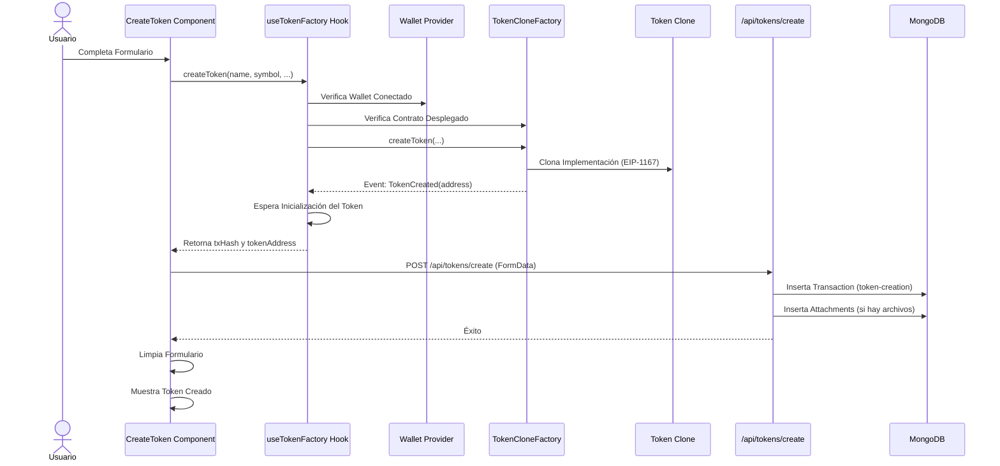
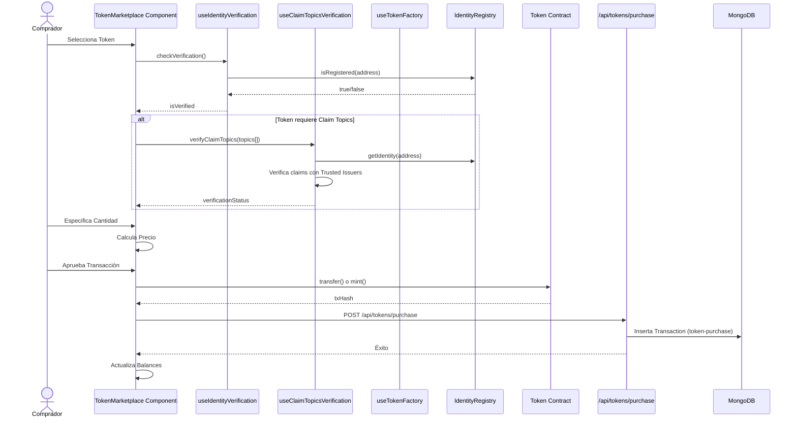
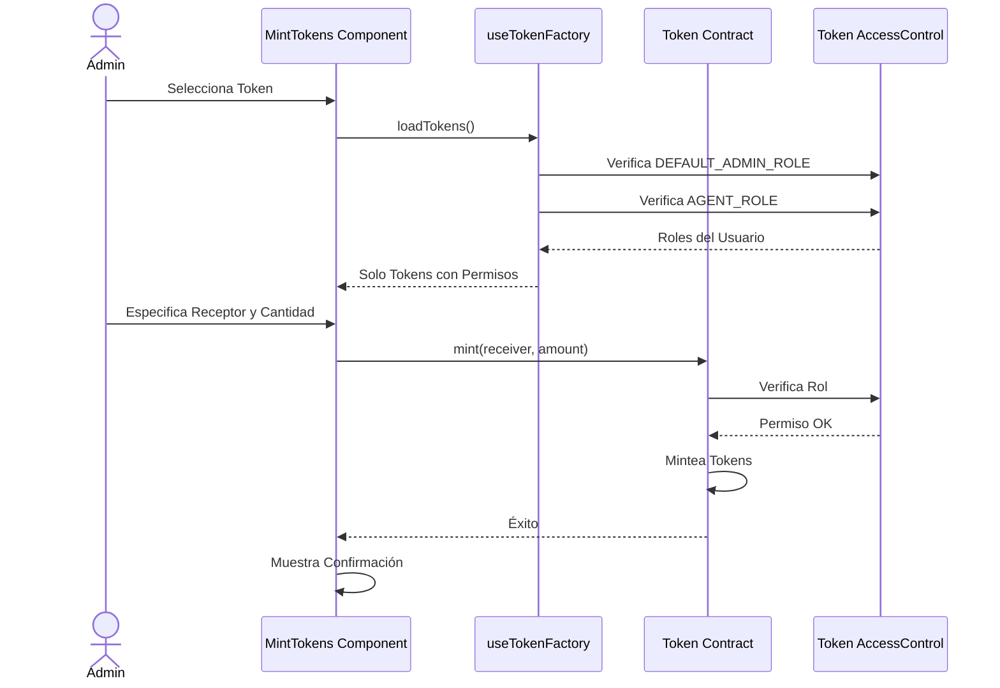
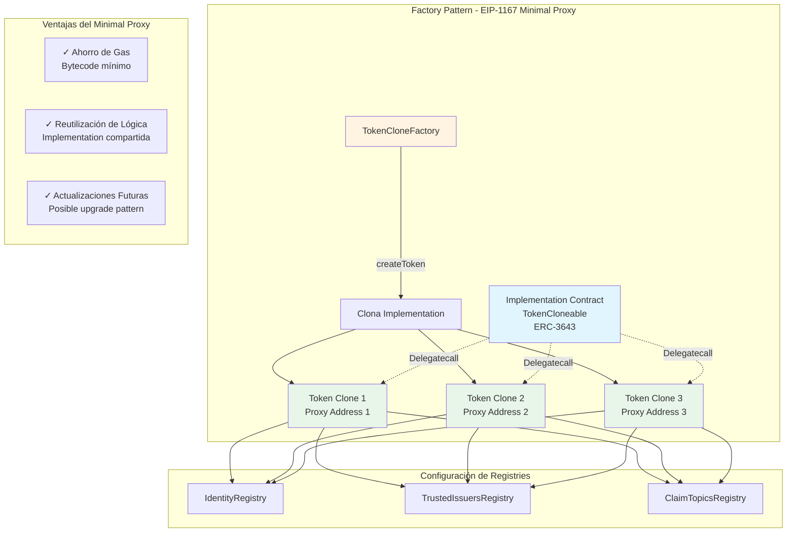
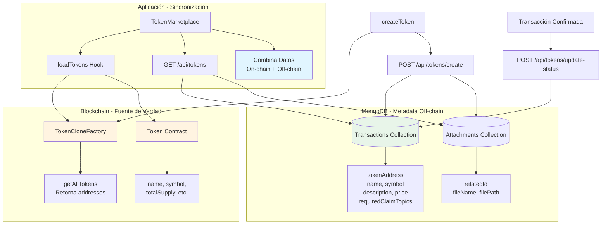
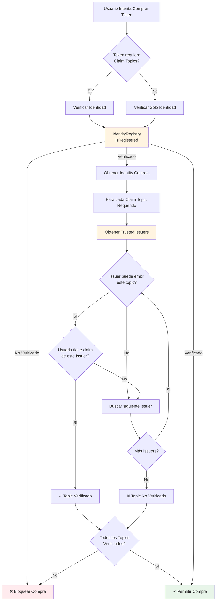

# Análisis de la Aplicación Web Token Factory

## 📋 Resumen Ejecutivo

La aplicación **Token Factory & Marketplace** es una interfaz web construida con **Next.js 16** que permite crear, gestionar y comercializar tokens ERC-3643 (T-REX) para activos del mundo real (RWA) dentro del ecosistema de tokens regulados. La aplicación facilita la creación de tokens mediante un factory pattern (clonación de contratos), el minteo de tokens, y proporciona un marketplace para la compra/venta de tokens con verificación de identidad y cumplimiento.

---

## 🏗️ Arquitectura General

### Stack Tecnológico

- **Framework**: Next.js 16.1.0 (App Router)
- **React**: 19.2.3
- **TypeScript**: 5.x
- **Estilos**: Tailwind CSS 4.x
- **Blockchain**: Ethers.js 6.16.0
- **Base de Datos**: MongoDB (Mongoose 9.0.2)
- **Puerto**: 4003

### Estructura de Directorios

```
token-factory/
├── app/
│   ├── api/                    # Rutas API (Next.js API Routes)
│   │   ├── tokens/
│   │   │   ├── create/         # Creación de tokens
│   │   │   ├── purchase/       # Compra de tokens
│   │   │   └── update-status/  # Actualización de estado
│   │   ├── health/             # Health check
│   │   └── diagnostics/        # Diagnósticos
│   ├── components/             # Componentes React
│   │   ├── tokens/             # Componentes de tokens
│   │   ├── layout/             # Layout y header
│   │   ├── theme/              # Tema (modo oscuro/claro)
│   │   ├── wallet/             # Selector de wallet
│   │   └── connections/        # Estado de conexión
│   ├── context/                # Contextos React (Estado global)
│   ├── hooks/                  # Custom hooks
│   ├── lib/                    # Utilidades y tipos
│   │   ├── contracts/          # ABIs y configuraciones
│   │   ├── types/              # Tipos TypeScript
│   │   ├── config/             # Configuraciones
│   │   └── utils/              # Utilidades (MongoDB, etc.)
│   ├── layout.tsx              # Layout principal
│   └── page.tsx                # Página principal
├── public/                     # Archivos estáticos
└── package.json
```

---

## 🎯 Funcionalidades Principales

### 1. Creación de Tokens (`CreateToken.tsx`)

#### 1.1 Propósito
Permite a los usuarios crear nuevos tokens ERC-3643 utilizando el patrón Factory (TokenCloneFactory) que clona una implementación base.

#### 1.2 Características
- **Formulario completo** para configuración de token:
  - Nombre del token
  - Símbolo
  - Suministro máximo (opcional)
  - Precio (opcional)
  - Descripción
  - Website
  - Claim topics requeridos (opcionales)
  - Archivos adjuntos (documentación)

- **Validaciones**:
  - Requiere wallet conectado
  - Verificación de contratos desplegados (factory, registries)
  - Validación de direcciones Ethereum
  - Verificación de que los registries estén desplegados

- **Proceso de creación**:
  1. Usuario completa formulario
  2. Transacción on-chain para crear el token (clonación)
  3. Registro en MongoDB con metadata
  4. Manejo de archivos adjuntos
  5. Actualización de estado de transacción

**Flujo de trabajo**:
```
Usuario → Completa Formulario → Selecciona Claim Topics (opcional) → 
Sube Archivos (opcional) → Crea Token On-chain → 
Registra en MongoDB → Token Disponible
```

#### 1.3 Integración con Blockchain
- Interactúa con `TokenCloneFactory` para crear tokens clonados (EIP-1167 minimal proxy)
- Utiliza `createToken()` que clona la implementación base
- Configura automáticamente los registries:
  - `IdentityRegistry`
  - `TrustedIssuersRegistry`
  - `ClaimTopicsRegistry`

### 2. Marketplace de Tokens (`TokenMarketplace.tsx`)

#### 2.1 Propósito
Permite a los usuarios comprar tokens disponibles en el marketplace, con verificación de identidad y cumplimiento de claim topics requeridos.

#### 2.2 Características
- **Carga de tokens**:
  - Combina tokens del factory on-chain con metadata de MongoDB
  - Maneja tokens incluso si no están completamente inicializados
  - Muestra información completa: precio, descripción, website, etc.

- **Verificaciones de compliance**:
  - Verifica identidad del usuario (IdentityRegistry)
  - Verifica claim topics requeridos por el token
  - Muestra estado de verificación en tiempo real

- **Modos de compra**:
  - **Compra por tokens**: Especificar cantidad de tokens a comprar
  - **Compra por ETH**: Especificar cantidad de ETH a gastar

- **Información del token**:
  - Muestra si el usuario es el admin/propietario del token
  - Muestra claim topics requeridos
  - Muestra metadatos completos (descripción, website, archivos)

#### 2.3 Flujo de compra
```
Usuario → Selecciona Token → Verifica Identidad → Verifica Claim Topics → 
Especifica Cantidad → Aproba Transferencia → 
Transacción On-chain → Registro en MongoDB → Tokens Recibidos
```

### 3. Gestión de Tokens Propios (`MyTokens.tsx`)

#### 3.1 Propósito
Muestra todos los tokens que el usuario posee, con balances y metadatos.

#### 3.2 Características
- Carga tokens desde factory y MongoDB
- Verifica balances on-chain para cada token
- Muestra solo tokens con balance > 0
- Formatea balances con decimales correctos
- Incluye metadatos (descripción, website) desde MongoDB
- Diseño responsive con cards

### 4. Minteo de Tokens (`MintTokens.tsx`)

#### 4.1 Propósito
Permite a administradores y agentes mintear nuevos tokens a direcciones específicas.

#### 4.2 Características
- **Control de roles**:
  - Verifica si el usuario es `DEFAULT_ADMIN_ROLE`
  - Verifica si el usuario es `AGENT_ROLE`
  - Solo muestra tokens donde el usuario tiene permisos

- **Formulario de minteo**:
  - Selección de token (solo tokens con permisos)
  - Dirección del receptor
  - Cantidad a mintear

- **Validaciones**:
  - Verifica que el token esté inicializado
  - Verifica permisos antes de permitir minteo
  - Validación de dirección del receptor
  - Validación de cantidad

### 5. Lista de Tokens (`TokenList.tsx`)

#### 5.1 Propósito
Muestra un listado completo de todos los tokens creados, con metadatos y información de administrador.

#### 5.2 Características
- Carga tokens desde factory
- Enriquece con metadatos de MongoDB
- Obtiene información del admin del token (DEFAULT_ADMIN_ROLE)
- Muestra descripción, website y archivos adjuntos
- Diseño en grid responsive

### 6. Gestión de Trusted Issuers por Token (`TokenTrustedIssuers.tsx`)

#### 6.1 Propósito
Permite visualizar y gestionar los Trusted Issuers asociados a un token específico.

#### 6.2 Características
- Carga el `TrustedIssuersRegistry` asociado al token
- Lista todos los Trusted Issuers del registry
- Muestra claim topics permitidos para cada issuer
- Verifica permisos de administrador del token

---

## 🔌 Integración con Blockchain

### Contratos Interactuados

1. **TokenCloneFactory**
   - `createToken(name, symbol, admin, identityRegistry, trustedIssuersRegistry, claimTopicsRegistry)`
   - `getAllTokens()`: Retorna lista de todos los tokens creados
   - `implementation()`: Dirección de la implementación base

2. **Token (TokenCloneable) - ERC-3643**
   - `name()`, `symbol()`, `decimals()`, `totalSupply()`: Información básica
   - `balanceOf(address)`: Balance de un usuario
   - `mint(address, amount)`: Minteo (solo admin/agent)
   - `trustedIssuersRegistry()`: Registry asociado
   - `identityRegistry()`: Registry de identidad
   - `claimTopicsRegistry()`: Registry de claim topics
   - AccessControl: `DEFAULT_ADMIN_ROLE`, `AGENT_ROLE`

3. **IdentityRegistry**
   - `isRegistered(address)`: Verifica si una dirección tiene identidad verificada

4. **TrustedIssuersRegistry**
   - `getTrustedIssuers()`: Lista de issuers
   - `getIssuerClaimTopics(address)`: Topics permitidos para un issuer

5. **ClaimTopicsRegistry**
   - `getClaimTopics()`: Lista de claim topics registrados

### Configuración de Contratos

Los contratos se configuran a través del módulo compartido `@/shared/lib/client`:
- `contracts.tokenCloneFactory`
- `contracts.identityRegistry`
- `contracts.trustedIssuersRegistry`
- `contracts.claimTopicsRegistry`

### Diagrama de Arquitectura General

```mermaid
graph TB
    subgraph "Frontend - Next.js App"
        A[Página Principal] --> B[CreateToken Component]
        A --> C[TokenMarketplace Component]
        A --> D[MyTokens Component]
        A --> E[MintTokens Component]
        A --> F[TokenList Component]
        
        B --> G[useTokenFactory Hook]
        C --> G
        C --> H[useIdentityVerification Hook]
        C --> I[useClaimTopicsVerification Hook]
        D --> G
        E --> G
        F --> G
        
        G --> J[Wallet Provider]
        H --> J
        I --> J
        J --> K[Ethers.js Provider]
    end
    
    subgraph "Backend - API Routes"
        L[/api/tokens/create] --> M[MongoDB]
        N[/api/tokens] --> M
        O[/api/tokens/purchase] --> M
        P[/api/tokens/update-status] --> M
    end
    
    subgraph "Blockchain - Ethereum"
        K --> Q[TokenCloneFactory]
        Q --> R[Token Clone<br/>ERC-3643]
        R --> S[IdentityRegistry]
        R --> T[TrustedIssuersRegistry]
        R --> U[ClaimTopicsRegistry]
    end
    
    subgraph "Base de Datos"
        M --> V[(Transactions Collection)]
        M --> W[(Attachments Collection)]
    end
    
    B --> L
    C --> N
    C --> O
    
    style A fill:#e1f5ff
    style Q fill:#fff4e1
    style R fill:#fff4e1
    style M fill:#e8f5e9
    style K fill:#f3e5f5
```

---

## 💾 Integración con MongoDB

### Modelos de Datos

#### 1. Transaction (Token Creation)
```typescript
{
  txHash: string;                      // Hash de la transacción
  fromAddress: string;                 // Dirección del creador
  contractAddress: string;             // Dirección del token creado
  type: 'token-creation' | 'token-purchase';
  status: 'pending' | 'confirmed' | 'failed';
  metadata: {
    tokenAddress: string;              // Dirección del token
    tokenName: string;                 // Nombre del token
    tokenSymbol: string;               // Símbolo
    admin: string;                     // Administrador del token
    maxSupply?: string;                // Suministro máximo
    price?: string;                    // Precio del token
    description?: string;              // Descripción
    website?: string;                  // Website
    requiredClaimTopics?: number[];    // Claim topics requeridos
  };
  createdAt: Date;
  updatedAt: Date;
}
```

#### 2. Attachment
```typescript
{
  relatedId: string;                   // Dirección del token
  relatedType: 'token';                // Tipo: 'token'
  fileName: string;                    // Nombre del archivo
  mimeType: string;                    // Tipo MIME
  size: number;                        // Tamaño en bytes
  filePath: string;                    // Ruta del archivo
  uploadedBy: string;                  // Dirección del uploader
  description?: string;                // Descripción
  createdAt: Date;
  updatedAt: Date;
}
```

#### 3. Transaction (Token Purchase)
```typescript
{
  txHash: string;                      // Hash de la transacción de compra
  fromAddress: string;                 // Comprador
  contractAddress: string;             // Dirección del token
  type: 'token-purchase';
  status: 'pending' | 'confirmed' | 'failed';
  metadata: {
    tokenAddress: string;
    tokenAmount: string;               // Cantidad de tokens comprados
    paymentAmount: string;             // Cantidad pagada
    paymentCurrency: string;           // Moneda (ETH, etc.)
  };
  createdAt: Date;
  updatedAt: Date;
}
```

### Rutas API

#### `/api/tokens`
- **GET**: Obtener todos los tokens desde MongoDB
  - Query params: `address` (filtro opcional)
  - Retorna: Lista de tokens con metadatos y archivos adjuntos

#### `/api/tokens/create`
- **POST**: Registrar nuevo token en MongoDB
  - Body: FormData con:
    - `data`: JSON con información del token
    - `files`: Archivos adjuntos (opcional)
  - Crea registro en colección `transactions` (type: 'token-creation')
  - Guarda archivos en colección `attachments`

#### `/api/tokens/purchase`
- **POST**: Registrar compra de token
  - Body: JSON con `txHash`, `fromAddress`, `tokenAddress`, `tokenAmount`, `paymentAmount`, `paymentCurrency`
  - Crea registro en colección `transactions` (type: 'token-purchase')

#### `/api/tokens/update-status`
- **POST**: Actualizar estado de transacción
  - Body: JSON con `txHash`, `status`, `blockNumber`
  - Actualiza estado de transacción de 'pending' a 'confirmed'

#### `/api/health`
- **GET**: Health check del servidor

---

## 🎨 Interfaz de Usuario

### Diseño

- **Framework CSS**: Tailwind CSS 4.x
- **Tema**: Soporte para modo oscuro/claro (ThemeContext)
- **Layout**: Grid responsivo
  - Desktop: 2 columnas (Crear Token + Marketplace)
  - Móvil: 1 columna apilada
- **Componentes**: Cards con sombras, badges, formularios consistentes

### Componentes de UI

1. **Header**: Barra superior con título, selector de wallet y toggle de tema
2. **WalletSelector**: Componente para conectar/desconectar wallets
3. **ThemeToggle**: Cambio entre modo oscuro/claro
4. **ConnectionStatus**: Indicador de estado de conexión con blockchain
5. **Cards**: Contenedores para cada sección funcional

### Estados Visuales

- **Loading**: Skeletons animados durante carga
- **Error**: Mensajes de error en rojo con bordes
- **Success**: Mensajes de éxito en verde
- **Warning**: Mensajes de advertencia en amarillo/azul
- **Info**: Mensajes informativos en azul

### Layout de la Página Principal

```
┌─────────────────────────────────────────┐
│ Header (Wallet + Theme)                 │
├─────────────────────────────────────────┤
│ Token Factory & Marketplace (Título)    │
├──────────────┬──────────────────────────┤
│ Crear Token  │ Token Marketplace        │
│              │                          │
├──────────────┤                          │
│ Mint Tokens  │                          │
├──────────────┴──────────────────────────┤
│ Mis Tokens (Tokens del usuario)         │
├─────────────────────────────────────────┤
│ Lista de Tokens (Todos los tokens)      │
└─────────────────────────────────────────┘
```

---

## 🔐 Seguridad y Permisos

### Control de Acceso

1. **Creador del Token (DEFAULT_ADMIN_ROLE)**:
   - Puede mintear tokens
   - Puede gestionar configuraciones del token
   - Es el administrador principal

2. **Agentes (AGENT_ROLE)**:
   - Pueden mintear tokens
   - Permisos delegados por el admin

3. **Usuarios Verificados**:
   - Pueden comprar tokens si tienen identidad verificada
   - Deben cumplir con claim topics requeridos por el token

4. **Usuarios No Verificados**:
   - Solo pueden crear tokens (el factory no requiere verificación)
   - No pueden comprar tokens en el marketplace

### Validaciones

- **On-chain**: 
  - Todas las operaciones críticas se validan en el contrato
  - Verificación de roles antes de minteo
  - Verificación de identidad antes de compra
  - Verificación de claim topics antes de compra

- **Off-chain**: 
  - Validaciones de formato antes de enviar transacciones
  - Verificación de contratos desplegados
  - Validación de direcciones Ethereum

---

## 🪝 Hooks Personalizados

### `useWallet.tsx`
- **Propósito**: Gestión de conexión de wallets
- **Características**:
  - Soporte EIP-6963 (múltiples wallets)
  - Detección automática de wallets disponibles
  - Manejo de eventos `accountsChanged` y `chainChanged`
  - Provider y signer gestionados automáticamente

### `useTokenFactory.tsx`
- **Propósito**: Interacción con TokenCloneFactory
- **Funciones**:
  - `loadTokens()`: Carga lista de tokens desde el factory
  - `createToken()`: Crea nuevo token (clonación)
  - `getTokenInfo()`: Obtiene información de un token específico
  - Manejo robusto de errores y validaciones

**Características especiales**:
- Verificación de inicialización de tokens
- Manejo de minimal proxies (EIP-1167)
- Validación de bytecode antes de interactuar
- Timeouts para evitar bloqueos

### `useIdentityVerification.tsx`
- **Propósito**: Verificar identidad del usuario
- **Funciones**:
  - `checkVerification(address?)`: Verifica si una dirección tiene identidad verificada
  - Retorna: `isVerified`, `checking`, `checkVerification`

### `useClaimTopicsVerification.tsx`
- **Propósito**: Verificar claim topics del usuario
- **Funciones**:
  - `verifyClaimTopics(address, topics[])`: Verifica si el usuario tiene claims válidos para los topics requeridos
  - Retorna: `verificationStatus`, `checking`, `verifyClaimTopics`

### `useTrustedIssuersRegistry.tsx`
- **Propósito**: Interacción con TrustedIssuersRegistry
- **Funciones**:
  - `loadTrustedIssuers()`: Carga lista de issuers
  - `getIssuerClaimTopics()`: Obtiene topics permitidos para un issuer

### `useConnections.tsx`
- **Propósito**: Gestionar estado de conexión con blockchain
- **Características**:
  - Detecta si hay conexión activa
  - Monitorea estado del provider

---

## 🔄 Flujos de Trabajo Principales

### Flujo 1: Crear Token



**Detalles técnicos**:
- Se usa el patrón Factory para clonar la implementación base
- El token creado es un minimal proxy (EIP-1167)
- Se configura automáticamente con los registries necesarios
- Se espera a que el token esté completamente inicializado

### Flujo 2: Comprar Token



**Validaciones**:
1. Usuario debe tener identidad verificada
2. Si el token requiere claim topics, el usuario debe tenerlos
3. Verificación de balance suficiente
4. Verificación de que el token esté disponible

### Flujo 3: Mintear Tokens



**Validaciones**:
- Verificación de roles on-chain antes de permitir acción
- Solo se muestran tokens donde el usuario tiene permisos
- Validación de dirección del receptor

### Diagrama de Componentes y Relaciones

```mermaid
graph LR
    subgraph "Componentes de UI"
        A[CreateToken]
        B[TokenMarketplace]
        C[MyTokens]
        D[MintTokens]
        E[TokenList]
        F[TokenTrustedIssuers]
    end
    
    subgraph "Hooks Personalizados"
        G[useTokenFactory]
        H[useWallet]
        I[useIdentityVerification]
        J[useClaimTopicsVerification]
        K[useTrustedIssuersRegistry]
    end
    
    subgraph "Contextos"
        L[WalletProvider]
        M[ThemeProvider]
    end
    
    subgraph "APIs"
        N[/api/tokens]
        O[/api/tokens/create]
        P[/api/tokens/purchase]
    end
    
    A --> G
    B --> G
    B --> I
    B --> J
    C --> G
    D --> G
    E --> G
    F --> K
    
    G --> H
    I --> H
    J --> H
    K --> H
    H --> L
    
    A --> O
    B --> N
    B --> P
    
    style A fill:#e1f5ff
    style B fill:#e1f5ff
    style G fill:#fff4e1
    style H fill:#fff4e1
    style L fill:#f3e5f5
```

---

## 🔧 Manejo de Errores y Validaciones

### Validaciones Pre-Transacción

1. **Verificación de Contratos**:
   - Se verifica que los contratos estén desplegados (bytecode no vacío)
   - Validación de direcciones antes de crear token

2. **Verificación de Estado**:
   - Tokens no inicializados son detectados y omitidos
   - Manejo de minimal proxies (bytecode corto pero válido)

3. **Validaciones de Permisos**:
   - Verificación de roles antes de mostrar opciones
   - Verificación de identidad antes de compra

### Manejo de Errores

- **Errores de Blockchain**: 
  - Mensajes descriptivos basados en el error
  - Manejo de transacciones revertidas
  - Timeouts para evitar bloqueos

- **Errores de MongoDB**:
  - Continuación si MongoDB falla (no crítico para operaciones on-chain)
  - Logs detallados para debugging

- **Errores de UI**:
  - Estados de error visibles
  - Mensajes informativos para el usuario

---

## 📊 Puntos Fuertes

1. **Arquitectura Sólida**: 
   - Separación clara de responsabilidades
   - Hooks reutilizables
   - Componentes modulares

2. **Type Safety**: 
   - TypeScript en todo el código
   - Tipos bien definidos para tokens y metadatos

3. **Integración Completa**: 
   - Blockchain + MongoDB para metadata
   - Verificación de identidad y compliance
   - Sistema de roles robusto

4. **UX Mejorada**: 
   - Estados de carga claros
   - Validaciones en tiempo real
   - Diseño responsive y moderno
   - Modo oscuro/claro

5. **Manejo Robusto de Errores**: 
   - Validaciones extensivas
   - Mensajes de error descriptivos
   - Manejo de casos edge (tokens no inicializados, etc.)

6. **Escalabilidad**: 
   - Factory pattern para crear tokens eficientemente
   - Estructura preparada para crecer

---

## ⚠️ Áreas de Mejora

1. **Sistema de Precios**:
   - Actualmente el precio es solo metadata
   - No hay mecanismo on-chain para compra directa
   - Considerar implementar un contrato de venta o DEX integration

2. **Manejo de Archivos**:
   - Los archivos se registran en MongoDB pero no hay sistema de almacenamiento real
   - Considerar usar IPFS o sistema de almacenamiento externo

3. **Notificaciones**:
   - No hay sistema de notificaciones para eventos importantes
   - Podría implementarse con WebSockets o polling

4. **Historial y Analytics**:
   - No hay vista de historial de transacciones del usuario
   - No hay analytics de tokens (volumen, compradores, etc.)

5. **Testing**:
   - No se observan tests unitarios o de integración
   - Sería beneficioso agregar tests para componentes críticos

6. **Optimización de Carga**:
   - Algunas consultas a blockchain podrían cachearse
   - Carga de tokens podría ser más eficiente (paralelización)

7. **Validación de Formularios**:
   - Validación más estricta de URLs y emails
   - Validación de suministro máximo vs. cantidad inicial

8. **Internacionalización**:
   - Todo el texto está en español
   - Podría beneficiarse de i18n para múltiples idiomas

9. **Gestión de Estado**:
   - Podría beneficiarse de un estado global (Context API o Zustand)
   - Evitaría múltiples llamadas a la misma API

10. **Manejo de Transacciones**:
    - Podría agregarse un sistema de cola para transacciones
    - Mejor tracking del estado de transacciones pendientes

---

## 🔧 Configuración Técnica

### Variables de Entorno Necesarias

```env
MONGODB_URI=mongodb://localhost:27017/rwa
TOKEN_CLONE_FACTORY_ADDRESS=0x...
IDENTITY_REGISTRY_ADDRESS=0x...
TRUSTED_ISSUERS_REGISTRY_ADDRESS=0x...
CLAIM_TOPICS_REGISTRY_ADDRESS=0x...
```

### Scripts Disponibles

- `npm run dev`: Desarrollo en puerto 4003
- `npm run build`: Build de producción
- `npm run start`: Servidor de producción en puerto 4003
- `npm run lint`: Linter

### Dependencias Principales

- `next`: 16.1.0
- `react`: 19.2.3
- `ethers`: 6.16.0
- `mongoose`: 9.0.2
- `tailwindcss`: 4.x
- `typescript`: 5.x

---

## 📝 Patrones de Diseño Utilizados

### 1. Factory Pattern
- El `TokenCloneFactory` utiliza el patrón Factory para crear tokens
- Usa minimal proxies (EIP-1167) para eficiencia de gas
- Clonación de una implementación base

#### Diagrama del Factory Pattern



### 2. Hook Pattern
- Hooks personalizados para encapsular lógica de blockchain
- Separación de concerns (UI vs. lógica de negocio)

### 3. Provider Pattern
- `WalletProvider` para estado global de wallet
- `ThemeProvider` para tema global

### 4. Repository Pattern (Implícito)
- Utilidades de MongoDB (`mongodb.ts`) actúan como repositorio
- Separación entre acceso a datos y lógica de negocio

---

## 🔍 Detalles de Implementación

### Manejo de Minimal Proxies

Los tokens creados son minimal proxies (EIP-1167) que tienen bytecode muy corto. El código maneja esto de varias formas:

1. **Verificación de Inicialización**: 
   - Intenta llamar a funciones del token para verificar que esté inicializado
   - Usa timeouts para evitar bloqueos

2. **Detección de Bytecode Corto**:
   - Reconoce que bytecode corto puede ser válido (proxy)
   - No falla si el bytecode es corto, pero verifica inicialización

3. **Manejo de Tokens No Inicializados**:
   - Detecta tokens que aún no están completamente inicializados
   - Los omite de las listas hasta que estén listos

### Sincronización Blockchain-MongoDB

La aplicación mantiene sincronización entre blockchain y MongoDB:

1. **Tokens del Factory**: Se cargan on-chain
2. **Metadata de MongoDB**: Se combinan con tokens on-chain
3. **Actualización de Estado**: Transacciones se actualizan de 'pending' a 'confirmed'

#### Diagrama de Sincronización



### Verificación de Compliance

El sistema implementa un sistema de compliance robusto:

1. **Verificación de Identidad**: Antes de comprar, verifica que el usuario tenga identidad
2. **Claim Topics**: Verifica que el usuario tenga los claim topics requeridos por el token
3. **Validación On-chain**: Todas las verificaciones también se hacen on-chain en el token

#### Diagrama de Verificación de Compliance



---

## 📝 Conclusiones

La aplicación **Token Factory & Marketplace** es una solución completa y bien estructurada para crear y gestionar tokens ERC-3643 en un ecosistema RWA. La arquitectura es sólida, el código es mantenible y la UX es clara e intuitiva.

**Fortalezas principales**:
- Integración robusta con blockchain usando Factory Pattern
- Sistema de compliance completo (identidad + claim topics)
- Manejo adecuado de permisos y roles
- Interfaz intuitiva y responsive con modo oscuro
- Código bien organizado y tipado con TypeScript
- Manejo robusto de casos edge (tokens no inicializados, proxies, etc.)

**Recomendaciones**:
- Agregar tests automatizados (unitarios e integración)
- Implementar sistema de almacenamiento de archivos (IPFS)
- Agregar sistema de notificaciones
- Implementar mecanismo de precios on-chain
- Agregar historial y analytics
- Optimizar carga de datos (caché, paralelización)

La aplicación está lista para uso en producción con algunas mejoras sugeridas. El código es mantenible y extensible, lo que facilita futuras mejoras y nuevas funcionalidades.

