# Análisis de la Aplicación Web Trusted Issuers

## 📋 Resumen Ejecutivo

La aplicación **Trusted Issuers Management** es una interfaz web construida con **Next.js 16** que permite gestionar el sistema de emisores confiables (Trusted Issuers) dentro del ecosistema ERC-3643 (T-REX) para tokens RWA (Real World Assets). La aplicación facilita la administración de emisores, la aprobación de solicitudes y la gestión de claim topics.

---

## 🏗️ Arquitectura General

### Diagrama de Arquitectura del Sistema

```mermaid
graph TB
    subgraph "Frontend - Next.js App"
        UI[Interfaz de Usuario<br/>React Components]
        Hooks[Custom Hooks<br/>useWallet, useTrustedIssuersRegistry]
        Context[React Context<br/>ThemeContext, TrustedIssuersContext]
    end
    
    subgraph "Backend - Next.js API Routes"
        API[API Routes<br/>/api/trusted-issuers/*<br/>/api/claims/*]
    end
    
    subgraph "Blockchain - Ethereum"
        TIR[TrustedIssuersRegistry<br/>Smart Contract]
        CTR[ClaimTopicsRegistry<br/>Smart Contract]
        ID[Identity<br/>Smart Contract]
    end
    
    subgraph "Base de Datos"
        MongoDB[(MongoDB<br/>- TrustedIssuerRequest<br/>- ClaimRequest<br/>- Transaction<br/>- Attachment)]
    end
    
    subgraph "Wallet"
        Wallet[Wallet Provider<br/>MetaMask/Trust Wallet]
    end
    
    UI --> Hooks
    Hooks --> Context
    UI --> API
    Hooks --> Wallet
    Wallet --> TIR
    Wallet --> CTR
    Wallet --> ID
    API --> MongoDB
    Hooks --> TIR
    Hooks --> CTR
    Hooks --> ID
    
    style UI fill:#3b82f6,color:#fff
    style API fill:#10b981,color:#fff
    style TIR fill:#f59e0b,color:#fff
    style CTR fill:#f59e0b,color:#fff
    style ID fill:#f59e0b,color:#fff
    style MongoDB fill:#8b5cf6,color:#fff
    style Wallet fill:#ef4444,color:#fff
```

### Stack Tecnológico

- **Framework**: Next.js 16.1.0 (App Router)
- **React**: 19.2.3
- **TypeScript**: 5.x
- **Estilos**: Tailwind CSS 4.x
- **Blockchain**: Ethers.js 6.16.0
- **Base de Datos**: MongoDB (Mongoose 9.0.2)
- **Puerto**: 4002

### Estructura de Directorios

```
trusted-issuers/
├── app/
│   ├── api/                    # Rutas API (Next.js API Routes)
│   │   ├── claims/
│   │   ├── identity/
│   │   └── trusted-issuers/
│   ├── components/             # Componentes React
│   │   ├── layout/
│   │   ├── theme/
│   │   ├── trusted-issuers/
│   │   └── wallet/
│   ├── context/                # Contextos React (Estado global)
│   ├── hooks/                  # Custom hooks
│   ├── lib/                    # Utilidades y tipos
│   │   ├── contracts/
│   │   └── types/
│   ├── layout.tsx              # Layout principal
│   └── page.tsx                # Página principal
├── public/                     # Archivos estáticos
└── package.json
```

---

## 🎯 Funcionalidades Principales

### 1. Gestión de Trusted Issuers

#### 1.1 Listado de Trusted Issuers (`TrustedIssuersList.tsx`)
- **Propósito**: Visualizar todos los Trusted Issuers registrados en el contrato
- **Características**:
  - Muestra dirección del issuer
  - Lista los claim topics permitidos para cada issuer
  - Estados de carga y error
  - Diseño responsive con modo oscuro

#### 1.2 Agregar Trusted Issuer (`AddTrustedIssuer.tsx`)
- **Propósito**: Permitir al owner del contrato agregar nuevos Trusted Issuers
- **Características**:
  - Validación de permisos (solo owner)
  - Verificación automática si el issuer ya existe
  - Actualización automática de topics si el issuer ya está registrado
  - Selección múltiple de claim topics
  - Validación de direcciones Ethereum
  - Manejo de errores detallado

**Flujo de trabajo**:
1. Usuario ingresa dirección del issuer
2. Sistema verifica si ya existe (debounce de 500ms)
3. Si existe, muestra opción de actualizar topics
4. Si no existe, permite agregarlo con topics seleccionados
5. Transacción on-chain con recarga automática de lista

#### 1.3 Solicitar ser Trusted Issuer (`RequestTrustedIssuer.tsx`)
- **Propósito**: Permitir que organizaciones soliciten ser Trusted Issuers
- **Características**:
  - Formulario completo con información de la organización
  - Selección de claim topics que pueden emitir
  - Carga de archivos adjuntos (documentación)
  - Almacenamiento en MongoDB
  - Estado de solicitud: `pending`, `approved`, `rejected`

**Datos capturados**:
- Dirección del solicitante (wallet conectado)
- Nombre de la organización
- Descripción
- Email de contacto
- Website
- Claim topics solicitados
- Archivos adjuntos

#### 1.4 Aprobar Solicitudes (`ApproveTrustedIssuerRequests.tsx`)
- **Propósito**: Permitir al owner aprobar/rechazar solicitudes
- **Características**:
  - Solo visible para el owner del contrato
  - Carga automática de solicitudes pendientes
  - Auto-refresh cada 10 segundos
  - Aprobación: agrega issuer al contrato + actualiza MongoDB
  - Rechazo: actualiza estado en MongoDB con razón
  - Registro de transacciones

**Flujo de aprobación**:
1. Owner revisa solicitud
2. Al aprobar: llama `addTrustedIssuer()` en el contrato
3. Espera confirmación de transacción
4. Actualiza estado en MongoDB con `txHash`
5. Registra transacción en colección `transactions`

#### Diagrama de Flujo: Aprobar Trusted Issuer

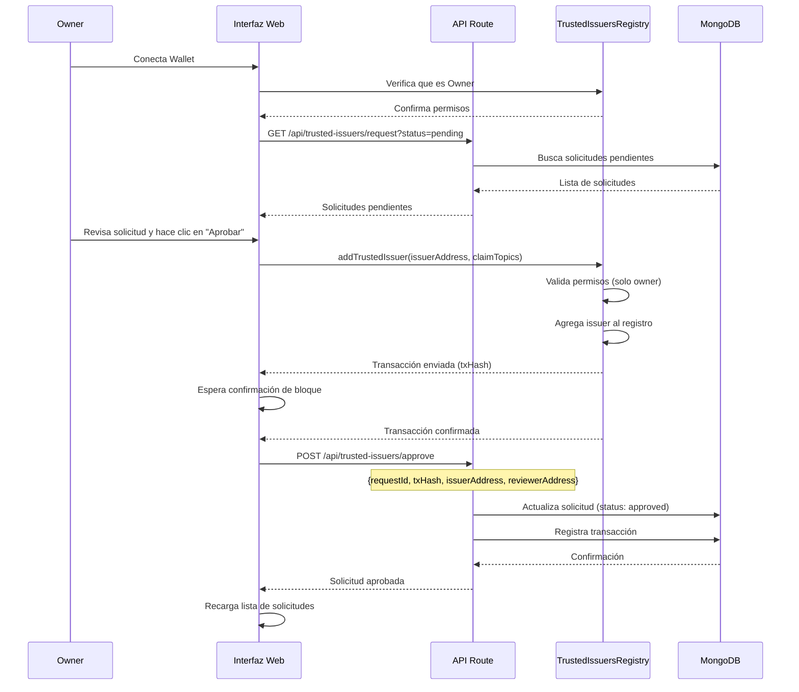

### 2. Gestión de Claim Topics

#### 2.1 Listado de Claim Topics (`ClaimTopicsList.tsx`)
- **Propósito**: Mostrar todos los claim topics disponibles según ERC-3643
- **Características**:
  - Lista de 10 claim topics predefinidos:
    1. KYC (Know Your Customer)
    2. AML (Anti-Money Laundering)
    3. PEP (Politically Exposed Person)
    4. Sanctions
    5. Geographic
    6. Tax Compliance
    7. Accredited
    8. Risk Assessment
    9. Source of Funds
    10. Storage Verification
  - Indica cuáles están registrados en el contrato
  - Muestra descripción y uso común de cada topic

#### 2.2 Hook `useClaimTopicsRegistry`
- **Funcionalidades**:
  - `loadClaimTopics()`: Carga topics desde el contrato
  - `addClaimTopic()`: Agrega nuevo topic (solo owner)
  - `topicExists()`: Verifica si un topic existe

### 3. Gestión de Claims (Solicitudes de Claims)

#### 3.1 Aprobar Solicitudes de Claims (`ApproveClaimRequests.tsx`)
- **Propósito**: Permitir a Trusted Issuers aprobar solicitudes de claims
- **Características**:
  - Solo visible para Trusted Issuers registrados
  - Carga solicitudes pendientes dirigidas al issuer
  - Validaciones complejas:
    - Verifica que el wallet sea el issuer
    - Verifica que el issuer esté registrado en TrustedIssuersRegistry
    - Verifica que el issuer tenga permiso para el topic
    - Maneja casos donde el contrato Identity tiene su propio TrustedIssuersRegistry
  - Usa `addClaimByIssuer()` o `addClaim()` según disponibilidad
  - Manejo robusto de errores con mensajes detallados

**Flujo de aprobación de claim**:
1. Verificar que el wallet es Trusted Issuer
2. Cargar solicitudes pendientes para ese issuer
3. Al aprobar:
   - Verificar permisos del issuer
   - Obtener TrustedIssuersRegistry del contrato Identity
   - Validar que el issuer está registrado y tiene permiso
   - Llamar `addClaimByIssuer()` o `addClaim()`
   - Esperar confirmación
   - Actualizar estado en MongoDB

#### Diagrama de Flujo: Aprobar Claim

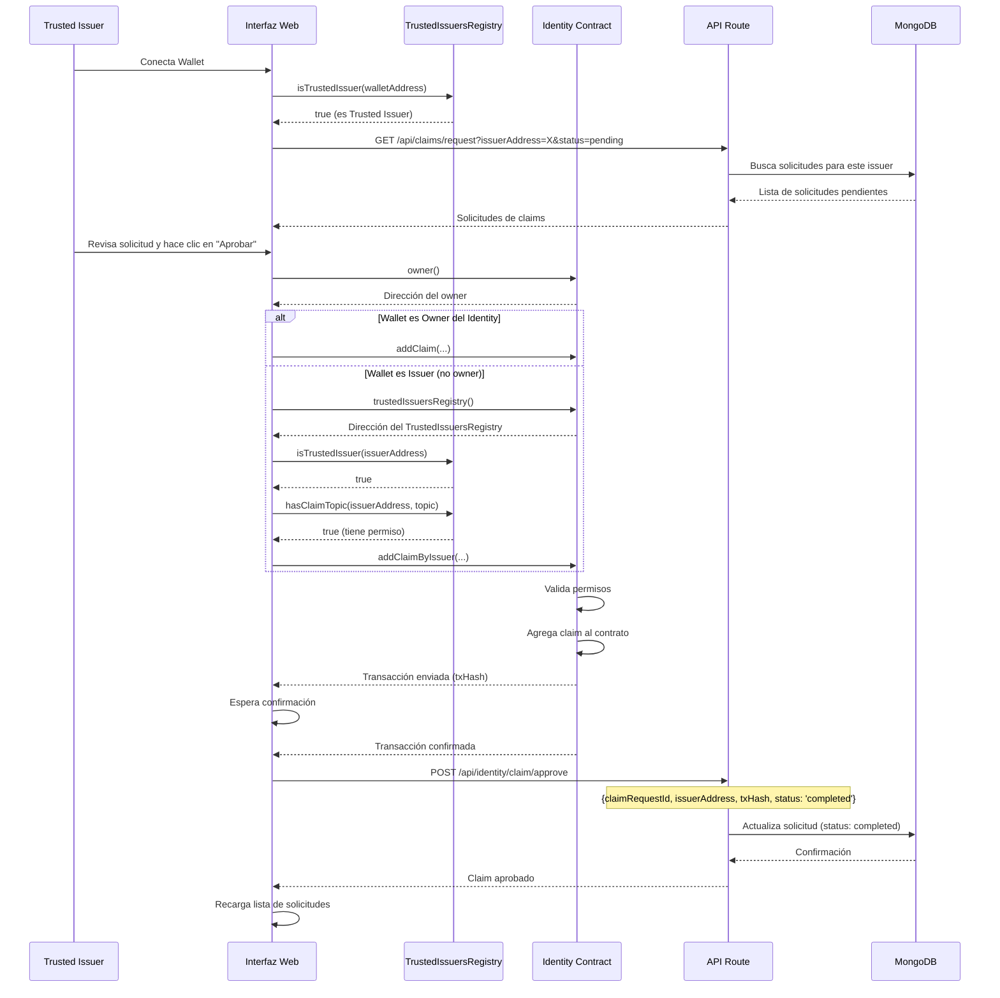

---

## 🔌 Integración con Blockchain

### Diagrama de Contratos y Relaciones

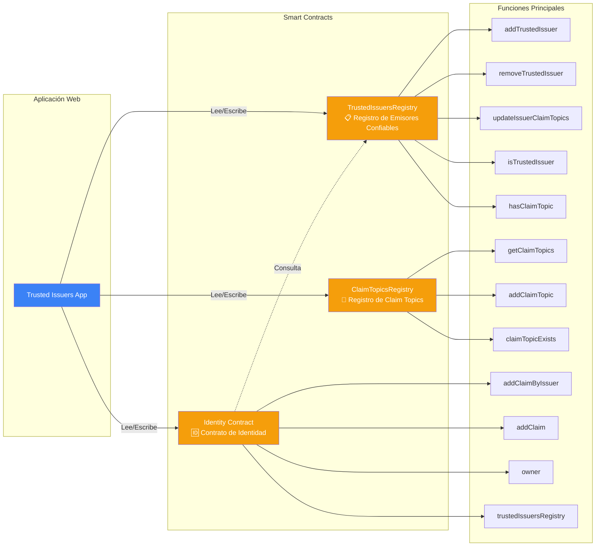

### Contratos Interactuados

1. **TrustedIssuersRegistry**
   - `addTrustedIssuer(address, uint256[])`
   - `removeTrustedIssuer(address)`
   - `updateIssuerClaimTopics(address, uint256[])`
   - `isTrustedIssuer(address)`
   - `getIssuerClaimTopics(address)`
   - `hasClaimTopic(address, uint256)`
   - `getTrustedIssuers()`

2. **ClaimTopicsRegistry**
   - `getClaimTopics()`
   - `claimTopicExists(uint256)`
   - `addClaimTopic(uint256)`

3. **Identity**
   - `addClaimByIssuer(...)`
   - `addClaim(...)`
   - `owner()`
   - `trustedIssuersRegistry()`

### Configuración de Contratos

Los contratos se configuran a través del módulo compartido `@/shared/lib/client`:
- `contracts.trustedIssuersRegistry`
- `contracts.claimTopicsRegistry`
- `contracts.identity`

---

## 💾 Integración con MongoDB

### Diagrama de Modelos de Datos

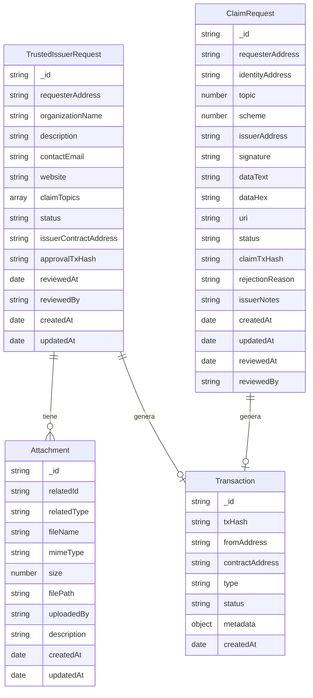

### Modelos de Datos

#### 1. TrustedIssuerRequest
```typescript
{
  requesterAddress: string;      // Dirección del solicitante
  organizationName: string;      // Nombre de la organización
  description?: string;          // Descripción opcional
  contactEmail?: string;         // Email de contacto
  website?: string;              // Website
  claimTopics: number[];         // Topics solicitados
  status: 'pending' | 'approved' | 'rejected';
  issuerContractAddress?: string;  // Dirección del issuer (si fue aprobado)
  approvalTxHash?: string;       // Hash de la transacción de aprobación
  reviewedAt?: Date;             // Fecha de revisión
  reviewedBy?: string;           // Dirección del revisor
  createdAt: Date;
  updatedAt: Date;
}
```

#### 2. ClaimRequest
```typescript
{
  requesterAddress: string;      // Dirección del solicitante
  identityAddress: string;        // Dirección del contrato Identity
  topic: number;                 // Topic del claim
  scheme: number;                // Esquema de firma
  issuerAddress: string;         // Dirección del Trusted Issuer
  signature?: string;            // Firma del claim
  dataText?: string;            // Datos en texto
  dataHex?: string;             // Datos en hexadecimal
  uri?: string;                 // URI con información adicional
  status: 'pending' | 'approved' | 'rejected' | 'completed';
  claimTxHash?: string;         // Hash de la transacción del claim
  rejectionReason?: string;      // Razón del rechazo
  issuerNotes?: string;         // Notas del issuer
  createdAt: Date;
  updatedAt: Date;
  reviewedAt?: Date;
  reviewedBy?: string;
}
```

#### 3. Transaction
```typescript
{
  txHash: string;                // Hash de la transacción
  fromAddress: string;           // Dirección que envió la transacción
  contractAddress: string;       // Dirección del contrato
  type: string;                  // Tipo de transacción
  status: 'pending' | 'confirmed' | 'failed';
  metadata: object;              // Metadatos adicionales
}
```

#### 4. Attachment
```typescript
{
  relatedId: string;            // ID del documento relacionado
  relatedType: string;          // Tipo: 'trusted-issuer-request'
  fileName: string;             // Nombre del archivo
  mimeType: string;            // Tipo MIME
  size: number;                // Tamaño en bytes
  filePath: string;            // Ruta del archivo
  uploadedBy: string;          // Dirección del uploader
  description?: string;        // Descripción
  createdAt: Date;
  updatedAt: Date;
}
```

### Rutas API

#### `/api/trusted-issuers/request`
- **POST**: Crear nueva solicitud de Trusted Issuer
- **GET**: Obtener solicitudes (filtros: `address`, `status`, `limit`)

#### `/api/trusted-issuers/approve`
- **POST**: Aprobar solicitud (requiere `requestId`, `txHash`, `issuerContractAddress`, `reviewerAddress`)

#### `/api/trusted-issuers/reject`
- **POST**: Rechazar solicitud (requiere `requestId`, `reviewerAddress`, `rejectionReason`)

#### `/api/claims/request`
- **GET**: Obtener solicitudes de claims (filtros: `issuerAddress`, `status`)

#### `/api/identity/claim/approve`
- **POST**: Aprobar solicitud de claim (requiere `claimRequestId`, `issuerAddress`, `txHash`, `status`)

---

## 🎨 Interfaz de Usuario

### Diseño

- **Framework CSS**: Tailwind CSS 4.x
- **Tema**: Soporte para modo oscuro/claro
- **Layout**: Grid responsivo (1 columna móvil, 2 columnas desktop)
- **Componentes**: Diseño consistente con cards, badges, y formularios

### Componentes de UI

1. **Header**: Barra superior con título, selector de wallet y toggle de tema
2. **WalletSelector**: Componente para conectar/desconectar wallets
3. **ThemeToggle**: Cambio entre modo oscuro/claro
4. **Cards**: Contenedores para cada sección funcional

### Estados Visuales

- **Loading**: Skeletons animados durante carga
- **Error**: Mensajes de error en rojo con bordes
- **Success**: Mensajes de éxito en verde
- **Warning**: Mensajes de advertencia en amarillo

---

## 🔐 Seguridad y Permisos

### Diagrama de Control de Acceso y Permisos

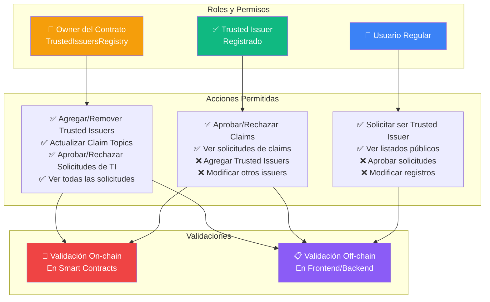

### Control de Acceso

1. **Owner del Contrato**:
   - Puede agregar/remover Trusted Issuers
   - Puede actualizar claim topics de issuers
   - Puede aprobar/rechazar solicitudes de Trusted Issuers

2. **Trusted Issuers**:
   - Pueden aprobar/rechazar solicitudes de claims dirigidas a ellos
   - Solo pueden emitir claims para los topics que tienen permiso

3. **Usuarios Regulares**:
   - Pueden solicitar ser Trusted Issuers
   - Pueden ver listados públicos

### Validaciones

- **On-chain**: Todas las operaciones críticas se validan en el contrato
- **Off-chain**: Validaciones de formato, permisos y estado antes de enviar transacciones
- **Verificación de Owner**: Se verifica dinámicamente consultando el contrato

---

## 🪝 Hooks Personalizados

### Diagrama de Hooks y Contextos

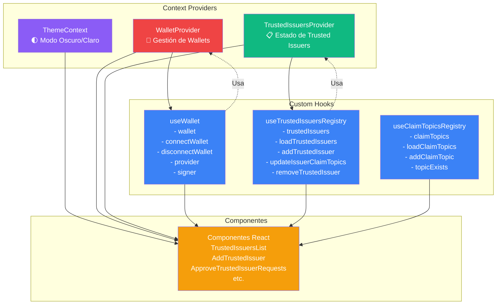

### `useWallet.tsx`
- **Propósito**: Gestión de conexión de wallets
- **Características**:
  - Soporte EIP-6963 (múltiples wallets)
  - Detección automática de wallets disponibles
  - Manejo de eventos `accountsChanged` y `chainChanged`
  - Soporte para MetaMask, Trust Wallet, Coinbase Wallet, etc.
  - Provider y signer gestionados automáticamente

### `useTrustedIssuersRegistry.tsx`
- **Propósito**: Interacción con TrustedIssuersRegistry
- **Funciones**:
  - `loadTrustedIssuers()`: Carga lista de issuers
  - `addTrustedIssuer()`: Agrega nuevo issuer
  - `updateIssuerClaimTopics()`: Actualiza topics
  - `removeTrustedIssuer()`: Remueve issuer
  - `isTrustedIssuer()`: Verifica si una dirección es issuer

### `useClaimTopicsRegistry.tsx`
- **Propósito**: Interacción con ClaimTopicsRegistry
- **Funciones**:
  - `loadClaimTopics()`: Carga topics registrados
  - `addClaimTopic()`: Agrega nuevo topic
  - `topicExists()`: Verifica existencia de topic

---

## 🔄 Flujos de Trabajo Principales

### Flujo 1: Solicitar ser Trusted Issuer

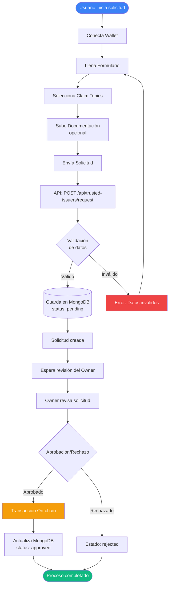

### Flujo 2: Aprobar Trusted Issuer

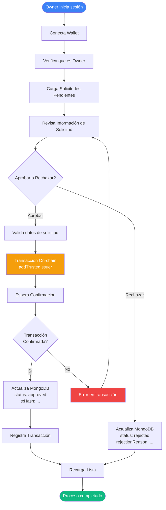

### Flujo 3: Aprobar Claim

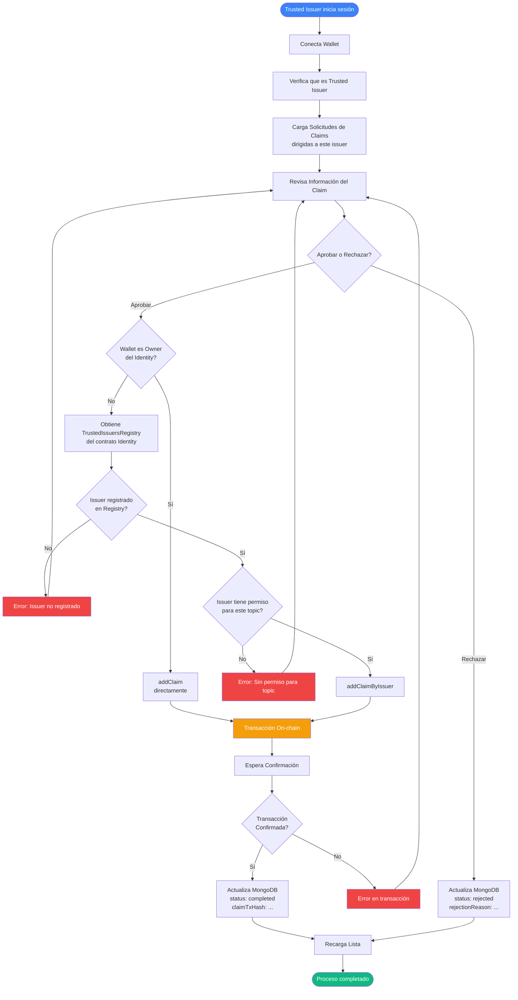

---

## 📊 Puntos Fuertes

1. **Arquitectura Modular**: Separación clara de responsabilidades
2. **Type Safety**: TypeScript en todo el código
3. **Manejo de Errores**: Mensajes de error detallados y útiles
4. **UX**: Estados de carga, validaciones en tiempo real
5. **Seguridad**: Validaciones on-chain y off-chain
6. **Escalabilidad**: Estructura preparada para crecer
7. **Documentación**: Código bien comentado

---

## ⚠️ Áreas de Mejora

1. **Manejo de Archivos**: 
   - Actualmente los archivos se guardan en MongoDB pero no hay sistema de almacenamiento de archivos
   - Considerar usar IPFS o sistema de almacenamiento externo

2. **Notificaciones**:
   - No hay sistema de notificaciones para solicitudes pendientes
   - Podría implementarse con WebSockets o polling más frecuente

3. **Historial**:
   - No hay vista de historial de transacciones
   - No hay logs de auditoría detallados

4. **Testing**:
   - No se observan tests unitarios o de integración
   - Sería beneficioso agregar tests para componentes críticos

5. **Optimización**:
   - Algunas consultas a blockchain podrían cachearse
   - El auto-refresh cada 10 segundos podría ser configurable

6. **Internacionalización**:
   - Todo el texto está en español, podría beneficiarse de i18n

7. **Validación de Formularios**:
   - Algunos formularios podrían tener validación más estricta (emails, URLs)

---

## 🔧 Configuración Técnica

### Variables de Entorno Necesarias

```env
MONGODB_URI=mongodb://localhost:27017/rwa
TRUSTED_ISSUERS_REGISTRY_ADDRESS=0x...
CLAIM_TOPICS_REGISTRY_ADDRESS=0x...
IDENTITY_ADDRESS=0x...
```

### Scripts Disponibles

- `npm run dev`: Desarrollo en puerto 4002
- `npm run build`: Build de producción
- `npm run start`: Servidor de producción en puerto 4002
- `npm run lint`: Linter

---

## 📊 Vista General del Sistema

### Diagrama Completo de Interacciones

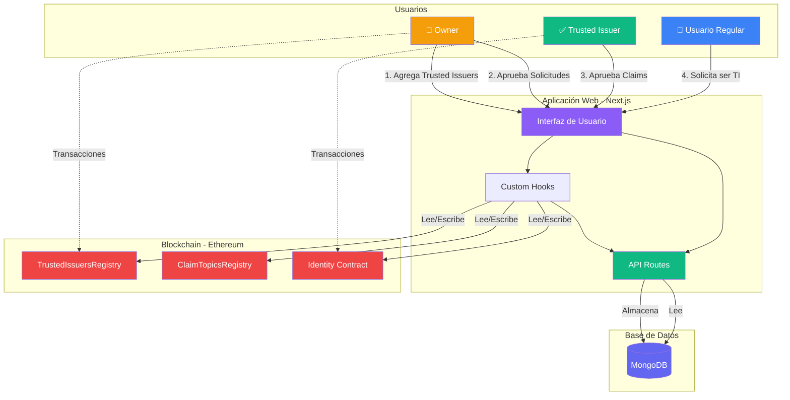

### Flujo de Datos Completo

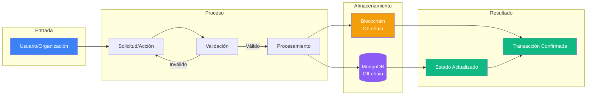

## 📝 Conclusiones

La aplicación **Trusted Issuers Management** es una solución completa y bien estructurada para gestionar el sistema de emisores confiables en un ecosistema ERC-3643. La arquitectura es sólida, el código es mantenible y la UX es clara. 

**Fortalezas principales**:
- Integración robusta con blockchain
- Manejo adecuado de permisos y seguridad
- Interfaz intuitiva y responsive
- Código bien organizado y tipado

**Recomendaciones**:
- Agregar tests automatizados
- Implementar sistema de notificaciones
- Mejorar manejo de archivos
- Agregar historial y auditoría

La aplicación está lista para uso en producción con algunas mejoras menores sugeridas.

